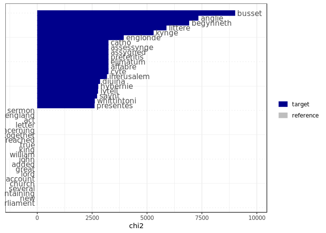

Keyness by era
================

Prepare data
============

``` r
options(stringsAsFactors = FALSE)
'%!in%' <- function(x,y)!('%in%'(x,y))

library(quanteda)
```

    ## Package version: 2.0.1

    ## Parallel computing: 2 of 6 threads used.

    ## See https://quanteda.io for tutorials and examples.

    ## 
    ## Attaching package: 'quanteda'

    ## The following object is masked from 'package:utils':
    ## 
    ##     View

``` r
library(stringr)
library(ggplot2)

#stop words
latin_stopwords <- read.csv("../../ESTC_SNA_data_creation/data/raw/latin.stopwords.clean", stringsAsFactors = FALSE)
extra_stopwords <- c("shall", "may", "one", "us", "hath", "yet", "upon", "yet", "now", "said", "unto", "thy", "doe", "first", "must",
                     "much", "made", "many", "make", "also", "without", "can", "thou", "like", "can", "though", "therefore", "without",
                     "two", "things", "might", "way", "say", "day", "let", "well", "things", "take", "owne", "doth", "i.e", "tis", "page removed",
                     #THIS IS IMPORTANT!
                     "non-latin", "alphabet", "saith", "thus", "|", "¦", "⁻", "vol", "year", "printed", "published",
                     "na", "amp", "ye", "anno", "translated", "vpon", "vnto", "yeere", "haue", "three", "second", "thereof", "yeare", "written", "mr",
                     "wherein", "written", "esq", "author", "part", "dr", "volumes", "1800", "volume", "mrs", "m.d", "d.d", "b.d")


#Get keyness per era, export png of each community

total_dfm <- readRDS("../../ESTC_SNA_data_creation/data/work/netowrking_archives/total_era_dfm.rds")
total_dfm <- dfm_select(total_dfm, pattern = c(stopwords("english"), stopwords("french"), stopwords("italian"), stopwords("spanish"), latin_stopwords$a, extra_stopwords), selection = "remove", valuetype = "fixed")
total_dfm <- dfm_select(total_dfm, pattern = c("\\d\\d\\d\\d\\d", "\\d\\d\\d\\d", "\\d\\d\\d", "\\d\\d", "\\d"), selection = "remove", valuetype = "regex")

eras <- unique(total_dfm@docvars$Era)
```

Print plots
===========

``` r
for(i_era in 1:length(eras)) {
  cat("\n", eras[i_era], "\n")
  tstat_key <- textstat_keyness(total_dfm, 
                                target = total_dfm@docvars$Era == paste0(eras[i_era]))
  print(textplot_keyness(tstat_key, n = 20))
}
```

    ## 
    ##  1501-1510


    ## 
    ##  1506-1515



    ## 
    ##  1511-1520


    ## 
    ##  1516-1525


    ## 
    ##  1521-1530


    ## 
    ##  1526-1535


    ## 
    ##  1531-1540


    ## 
    ##  1536-1545


    ## 
    ##  1541-1550


    ## 
    ##  1546-1555


    ## 
    ##  1551-1560


    ## 
    ##  1556-1565


    ## 
    ##  1561-1570


    ## 
    ##  1566-1575


    ## 
    ##  1571-1580


    ## 
    ##  1576-1585


    ## 
    ##  1581-1590


    ## 
    ##  1586-1595


    ## 
    ##  1591-1600


    ## 
    ##  1596-1605


    ## 
    ##  1601-1610


    ## 
    ##  1606-1615


    ## 
    ##  1611-1620


    ## 
    ##  1616-1625


    ## 
    ##  1621-1630


    ## 
    ##  1626-1635


    ## 
    ##  1631-1640


    ## 
    ##  1636-1645


    ## 
    ##  1641-1650


    ## 
    ##  1646-1655


    ## 
    ##  1651-1660


    ## 
    ##  1656-1665


    ## 
    ##  1661-1670


    ## 
    ##  1666-1675


    ## 
    ##  1671-1680


    ## 
    ##  1676-1685


    ## 
    ##  1681-1690


    ## 
    ##  1686-1695


    ## 
    ##  1691-1700


    ## 
    ##  1696-1705


    ## 
    ##  1701-1710


    ## 
    ##  1706-1715


    ## 
    ##  1711-1720


    ## 
    ##  1716-1725


    ## 
    ##  1721-1730


    ## 
    ##  1726-1735


    ## 
    ##  1731-1740


    ## 
    ##  1736-1745


    ## 
    ##  1741-1750


    ## 
    ##  1746-1755


    ## 
    ##  1751-1760


    ## 
    ##  1756-1765


    ## 
    ##  1761-1770


    ## 
    ##  1766-1775


    ## 
    ##  1771-1780


    ## 
    ##  1776-1785


    ## 
    ##  1781-1790


    ## 
    ##  1786-1795


    ## 
    ##  1791-1800


    ## 
    ##  1796-1805


