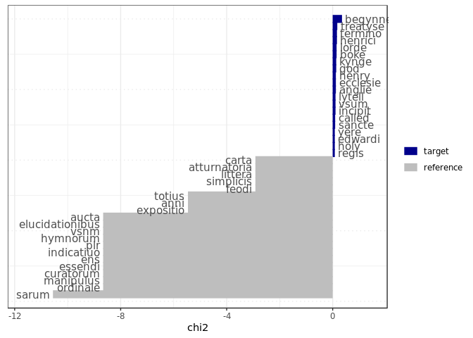

R Notebook
================

This is an [R Markdown](http://rmarkdown.rstudio.com) Notebook. When you execute code within the notebook, the results appear beneath the code.

Try executing this chunk by clicking the *Run* button within the chunk or by placing your cursor inside it and pressing *Ctrl+Shift+Enter*.

``` r
#setwd("code/work/")
options(stringsAsFactors = FALSE)
'%!in%' <- function(x,y)!('%in%'(x,y))

library(quanteda)
```

    ## Package version: 2.0.1

    ## Parallel computing: 2 of 6 threads used.

    ## See https://quanteda.io for tutorials and examples.

    ## 
    ## Attaching package: 'quanteda'

    ## The following object is masked from 'package:utils':
    ## 
    ##     View

``` r
library(stringr)
library(ggplot2)

#For 10 year chunks
#dfm_files <- list.files("../../data/work/netowrking_archives/dfm/", full.names = TRUE)
dfm_files <- list.files("../../ESTC_SNA_data_creation/data/work/netowrking_archives/com_dfm_titles/", full.names = TRUE)
#dfm_files <- dfm_files[-c(1:159)]
#dfm_files <- dfm_files[-c(267:length(dfm_files))] #update this if I can get the last few -1730

eras <- unique(str_extract(dfm_files, "\\d\\d\\d\\d-\\d\\d\\d\\d"))

#stop words
latin_stopwords <- read.csv("../../ESTC_SNA_data_creation/data/raw/latin.stopwords.clean", stringsAsFactors = FALSE)
extra_stopwords <- c("shall", "may", "one", "us", "hath", "yet", "upon", "yet", "now", "said", "unto", "thy", "doe", "first", "must",
                     "much", "made", "many", "make", "also", "without", "can", "thou", "like", "can", "though", "therefore", "without",
                     "two", "things", "might", "way", "say", "day", "let", "well", "things", "take", "owne", "doth", "i.e", "tis", "page removed",
                     #THIS IS IMPORTANT!
                     "non-latin", "alphabet", "saith", "thus", "|", "¦", "⁻", "vol", "year", "printed", "published",
                     "na", "amp", "ye", "anno", "translated", "vpon", "vnto", "yeere", "haue", "three", "second", "thereof", "yeare", "written", "mr",
                     "wherein", "written", "esq", "author", "part", "dr", "volumes", "1800", "volume", "mrs", "m.d", "d.d", "b.d")
```

``` r
#Get top features per era

#for(i_era in 1:length(eras)) {
for(i_era in 1:1) {
  cat("\n", eras[i_era], "\n")
  
  temp_files <- dfm_files[grep(eras[i_era], dfm_files)]
  temp_dfm <- readRDS(temp_files)
  temp_dfm <- dfm_select(temp_dfm, pattern = c(stopwords("english"), stopwords("french"), latin_stopwords$a, extra_stopwords), selection = "remove", valuetype = "fixed")
  print(topfeatures(temp_dfm, n = 100))
  
  com_num <- unique(temp_dfm@docvars$Community)
  
  #One era only has one community (1506-1515), so need to skip it
  if(length(com_num) == 1) { next }
  
  for (i_com_keyness in 1:length(com_num)) {
    cat("\nCommunity:", i_com_keyness, "\n")
    tstat_key <- textstat_keyness(temp_dfm, 
                                  target = temp_dfm@docvars$Community == paste0("Community_", i_com_keyness))
    print(textplot_keyness(tstat_key, n = 20))
  }
}
```

    ## 
    ##  1501-1510 
    ##       begynneth           sarum        treatyse         henrici         termino 
    ##              26              13              13              12              12 
    ##            boke           lorde             god           kynge          anglie 
    ##              11              11              10              10               9 
    ##        ecclesie           henry         incipit            vsum          lytell 
    ##               9               9               8               8               8 
    ##          sancte          called           regis            holy         edwardi 
    ##               7               7               6               6               6 
    ##            yere       souerayne          diuina          pasche      trinitatis 
    ##               6               6               5               5               5 
    ##         francie           feodi       simplicis         littera    atturnatoria 
    ##               5               5               5               5               5 
    ##           moost           carta        magistri           liber     permissione 
    ##               5               5               5               4               4 
    ##          domini         history       excellent        commento           fader 
    ##               4               4               4               4               4 
    ##         statuta        insignis          quarti            oure          whiche 
    ##               4               4               4               4               4 
    ##            usum        foloweth           saynt       margarete           moder 
    ##               4               4               4               4               4 
    ##       countesse        libellus       uniuersis           ryght           noble 
    ##               4               4               4               4               4 
    ##          necnon         breuium     inspecturis  archiepiscopus          sancti 
    ##               3               3               3               3               3 
    ##        kalender           marie           primo       folowynge           regni 
    ##               3               3               3               3               3 
    ##          oratio           moste       vniuersis       expositio           named 
    ##               3               3               3               3               3 
    ##            full        compyled          doctor       pryncesse           derby 
    ##               3               3               3               3               3 
    ##           modus         baronis         littere          thomas        henricum 
    ##               3               3               3               3               3 
    ##           regem        septimum        doctoris            anni              vi 
    ##               3               3               3               3               3 
    ##           horae           gesta       romanorum       principem        hybernie 
    ##               3               3               3               3               3 
    ##       presentes           sermo         fratris          matris       michaelis 
    ##               3               3               3               3               3 
    ##          prynce          totius           pater commaundementes         dominus 
    ##               3               3               3               3               3 
    ## 
    ## Community: 1



    ## 
    ## Community: 2


    ## 
    ## Community: 3


Add a new chunk by clicking the *Insert Chunk* button on the toolbar or by pressing *Ctrl+Alt+I*.

When you save the notebook, an HTML file containing the code and output will be saved alongside it (click the *Preview* button or press *Ctrl+Shift+K* to preview the HTML file).

The preview shows you a rendered HTML copy of the contents of the editor. Consequently, unlike *Knit*, *Preview* does not run any R code chunks. Instead, the output of the chunk when it was last run in the editor is displayed.
