Top features and community keyness
================

Loading/prepping data
=====================

``` r
#setwd("code/work/")
options(stringsAsFactors = FALSE)
'%!in%' <- function(x,y)!('%in%'(x,y))

library(quanteda)
```

    ## Package version: 2.0.1

    ## Parallel computing: 2 of 6 threads used.

    ## See https://quanteda.io for tutorials and examples.

    ## 
    ## Attaching package: 'quanteda'

    ## The following object is masked from 'package:utils':
    ## 
    ##     View

``` r
library(stringr)
library(ggplot2)

#For 10 year chunks
#dfm_files <- list.files("../../data/work/netowrking_archives/dfm/", full.names = TRUE)
dfm_files <- list.files("../../ESTC_SNA_data_creation/data/work/netowrking_archives/com_dfm_titles/", full.names = TRUE)
#dfm_files <- dfm_files[-c(1:159)]
#dfm_files <- dfm_files[-c(267:length(dfm_files))] #update this if I can get the last few -1730

eras <- unique(str_extract(dfm_files, "\\d\\d\\d\\d-\\d\\d\\d\\d"))

#stop words
latin_stopwords <- read.csv("../../ESTC_SNA_data_creation/data/raw/latin.stopwords.clean", stringsAsFactors = FALSE)
extra_stopwords <- c("shall", "may", "one", "us", "hath", "yet", "upon", "yet", "now", "said", "unto", "thy", "doe", "first", "must",
                     "much", "made", "many", "make", "also", "without", "can", "thou", "like", "can", "though", "therefore", "without",
                     "two", "things", "might", "way", "say", "day", "let", "well", "things", "take", "owne", "doth", "i.e", "tis", "page removed",
                     #THIS IS IMPORTANT!
                     "non-latin", "alphabet", "saith", "thus", "|", "¦", "⁻", "vol", "year", "printed", "published",
                     "na", "amp", "ye", "anno", "translated", "vpon", "vnto", "yeere", "haue", "three", "second", "thereof", "yeare", "written", "mr",
                     "wherein", "written", "esq", "author", "part", "dr", "volumes", "1800", "volume", "mrs", "m.d", "d.d", "b.d")
```

Basic analyses
==============

``` r
#Get top features per era

for(i_era in 1:length(eras)) {
  cat("\n", eras[i_era], "\n")
  
  temp_files <- dfm_files[grep(eras[i_era], dfm_files)]
  temp_dfm <- readRDS(temp_files)
  temp_dfm <- dfm_select(temp_dfm, pattern = c(stopwords("english"), stopwords("french"), stopwords("italian"), stopwords("spanish"), latin_stopwords$a, extra_stopwords), selection = "remove", valuetype = "fixed")
  temp_dfm <- dfm_select(temp_dfm, pattern = c("\\d\\d\\d\\d\\d", "\\d\\d\\d\\d", "\\d\\d\\d", "\\d\\d", "\\d"), selection = "remove", valuetype = "regex")
  
  com_num <- unique(temp_dfm@docvars$Community)
  
  #One era only has one community (1506-1515), so need to skip it
  if(length(com_num) == 1) { next }
  
  cat("\n25 top features/tokens\n")
  print(topfeatures(temp_dfm, groups = "Community", n = 25))
    
  for (i_com_keyness in 1:length(com_num)) {
    
    cat("\nCommunity:", i_com_keyness, "\n")
    tstat_key <- textstat_keyness(temp_dfm, 
                                  target = temp_dfm@docvars$Community == paste0("Community_", i_com_keyness))
    print(textplot_keyness(tstat_key, n = 20))
  }
}
```

    ## 
    ##  1501-1510 
    ## 
    ## 25 top features/tokens
    ## $Community_1
    ##  begynneth   treatyse    henrici    termino       boke      sarum      lorde 
    ##         26         13         12         12         11         11         11 
    ##        god      kynge     anglie   ecclesie      henry    incipit       vsum 
    ##         10         10          9          9          9          8          8 
    ##     lytell     sancte     called      regis       holy    edwardi       yere 
    ##          8          7          7          6          6          6          6 
    ##  souerayne     diuina     pasche trinitatis 
    ##          6          5          5          5 
    ## 
    ## $Community_2
    ##            sarum        expositio             anni           totius 
    ##                1                1                1                1 
    ##         hymnorum             vsnm  elucidationibus            aucta 
    ##                1                1                1                1 
    ##   diligentissime     recognitorum      intrationum excellentissimus 
    ##                1                1                0                0 
    ##            liber          perquam      necessarius            legum 
    ##                0                0                0                0 
    ##        hominibus        continens         medullam       diuersarum 
    ##                0                0                0                0 
    ##       materiarum           necnon          breuium      executionum 
    ##                0                0                0                0 
    ##            valde 
    ##                0 
    ## 
    ## $Community_3
    ##            sarum         ordinale            feodi        simplicis 
    ##                1                1                1                1 
    ##          littera     atturnatoria            carta        manipulus 
    ##                1                1                1                1 
    ##        curatorum          essendi              ens       indicatiuo 
    ##                1                1                1                1 
    ##              plr      intrationum excellentissimus            liber 
    ##                1                0                0                0 
    ##          perquam      necessarius            legum        hominibus 
    ##                0                0                0                0 
    ##        continens         medullam       diuersarum       materiarum 
    ##                0                0                0                0 
    ##           necnon 
    ##                0 
    ## 
    ## 
    ## Community: 1


    ## 
    ## Community: 2

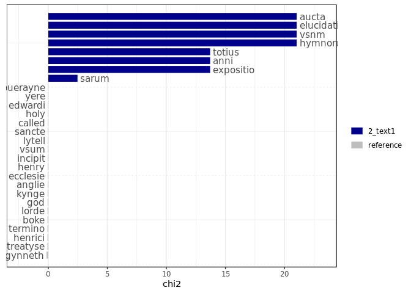

    ## 
    ## Community: 3

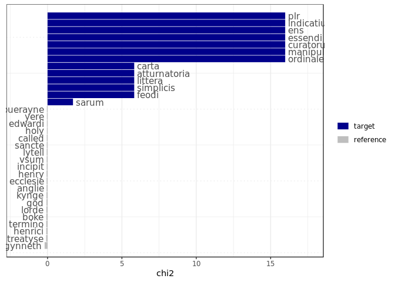

    ## 
    ##  1506-1515 
    ## 
    ##  1511-1520 
    ## 
    ## 25 top features/tokens
    ## $Community_1
    ##    interlude         mery      mayster       dyuers     straunge           yf 
    ##            2            2            2            2            2            2 
    ##       matter          wyl     conteyne         hour        parte    matrimony 
    ##            2            2            2            2            2            2 
    ## magnificence       goodly      deuysed      skelton        poete     laureate 
    ##            1            1            1            1            1            1 
    ##     deceasyd        verse         life       thomas          new    iuterlude 
    ##            1            1            1            1            1            1 
    ##       nature 
    ##            1 
    ## 
    ## $Community_2
    ## hospitalis     frater  philippus     mulart decretorum     doctor      sacri 
    ##          2          2          2          2          2          2          2 
    ## apostolici     sancti   spiritus     people     dyuers     whiche     knowen 
    ##          2          2          2          2          1          1          1 
    ##    cristen       ther     porche cathedrall    churche  hareforde  hereafter 
    ##          1          1          1          1          1          1          1 
    ##      ensue      trewe  encountre    batayle 
    ##          1          1          1          1 
    ## 
    ## $Community_3
    ##          lorde          regis          regni            god          kynge 
    ##             30             26             23             22             20 
    ##        termino      begynneth         anglie        roberti           holy 
    ##             20             19             19             17             16 
    ##          henry         sancti           yere       magistri        edwardi 
    ##             15             14             12             12             12 
    ##     conquestum     parlyament        henrici    whittintoni lichfeldiensis 
    ##             12             12             12             11             11 
    ##       laureati    grammatices       certayne  florentissima      oxoniensi 
    ##             11             10             10             10             10 
    ## 
    ## 
    ## Community: 1

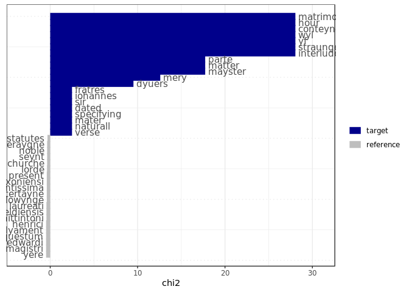

    ## 
    ## Community: 2


    ## 
    ## Community: 3


    ## 
    ##  1516-1525 
    ## 
    ## 25 top features/tokens
    ## $Community_1
    ##        legum          law         mery        euery       libris     magistri 
    ##            3            3            3            3            2            2 
    ##       nature        bokis      mayster     compyled    interlude       dyuers 
    ##            2            2            2            2            2            2 
    ##     straunge           yf       matter          wyl         hour        parte 
    ##            2            2            2            2            2            2 
    ##     iohannes    begynneth        uryne      chaucer        wydow        edyth 
    ##            2            2            2            2            2            2 
    ## exposiciones 
    ##            1 
    ## 
    ## $Community_2
    ##       mone hospitalis     frater  philippus     mulart decretorum     doctor 
    ##          3          2          2          2          2          2          2 
    ##      sacri apostolici     sancti   spiritus    chaunge    m.ccccc  begynneth 
    ##          2          2          2          2          2          2          1 
    ##        man      knowe     knowen    cristen     people       ther     porche 
    ##          1          1          1          1          1          1          1 
    ## cathedrall    churche  hareforde    romance 
    ##          1          1          1          1 
    ## 
    ## $Community_3
    ##      begynneth        termino        roberti          lorde          regis 
    ##             28             23             22             20             20 
    ##           holy        edwardi          regni            god         anglie 
    ##             19             18             16             16             13 
    ##           yere lichfeldiensis           kyng    grammatices       magistri 
    ##             12             12             11             11             10 
    ##     conquestum          henry     parlyament         sancti        henrici 
    ##             10             10              9              9              9 
    ##        fraunce       laureati       libellus    vvhitintoni          noble 
    ##              9              9              9              9              8 
    ## 
    ## $Community_4
    ##      boke     modus   tenendi    curiam    whiche      thre      holy     theyr 
    ##         5         2         2         2         2         2         2         2 
    ##  ghoostly     ymage      loue      wold   treason   trespas      vnum hundredum 
    ##         2         2         2         2         2         2         1         1 
    ##   recordo    dyuers     mater begynneth     euery    knowen    people      daye 
    ##         1         1         1         1         1         1         1         1 
    ##      true 
    ##         1 
    ## 
    ## 
    ## Community: 1

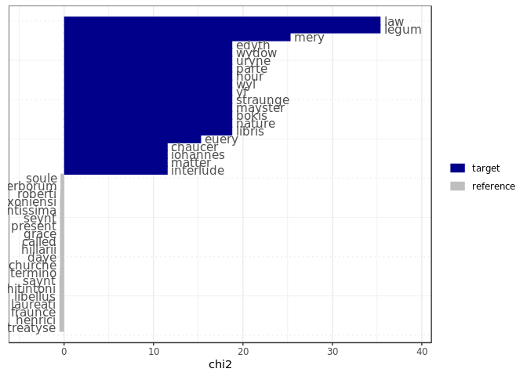

    ## 
    ## Community: 2


    ## 
    ## Community: 3

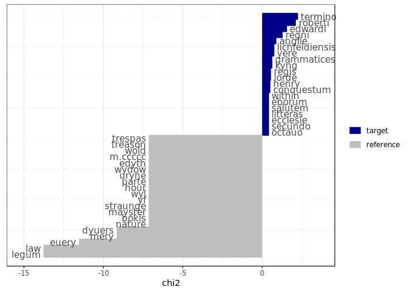

    ## 
    ## Community: 4

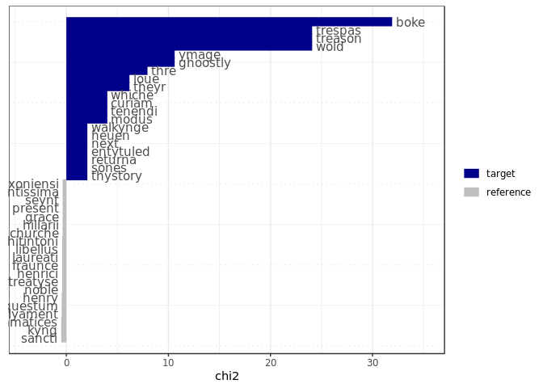

    ## 
    ##  1521-1530 
    ## 
    ## 25 top features/tokens
    ## $Community_1
    ##      termino         boke    michaelis      dyaloge       whiche        regni 
    ##           26           15           14           13           10           10 
    ##        regis      henrici     treateth          law         good       pasche 
    ##           10           10            9            7            7            7 
    ##    purgatory          god        euery       famous          new          man 
    ##            6            6            6            6            5            5 
    ##       thomas        lorde       dyuers    englysshe proclamation    honorable 
    ##            5            5            5            5            5            5 
    ##     christen 
    ##            4 
    ## 
    ## $Community_2
    ##     termino   begynneth        boke   michaelis     roberti         god 
    ##          33          30          24          17          17          16 
    ##     henrici    treatyse       lorde      whiche        kyng   englysshe 
    ##          15          15          14          12          12          12 
    ##     edwardi vvhitintoni      pasche       maner    verborum        holy 
    ##          12          12          11          11          11          10 
    ##      called       noble        body       named       sexti       moost 
    ##          10          10          10          10           9           9 
    ##       theyr 
    ##           9 
    ## 
    ## $Community_3
    ##     lerned    wysdome       boke       kyng       wyth      moche        hym 
    ##          2          2          1          1          1          1          1 
    ## translatyd  englysshe    frenche    history       name     morall       hugo 
    ##          1          1          1          1          1          1          1 
    ## reuelacyon     boccus   sydracke confoundyd      syght     dronke    stronge 
    ##          1          1          1          1          1          1          1 
    ##      venym    trinite        dyd       hurt 
    ##          1          1          1          1 
    ## 
    ## 
    ## Community: 1


    ## 
    ## Community: 2


    ## 
    ## Community: 3


    ## 
    ##  1526-1535 
    ## 
    ## 25 top features/tokens
    ## $Community_1
    ##     begynneth      treatyse        called       roberti        whiche 
    ##            13            12            11            11            11 
    ##         maner          boke     englysshe         euery          body 
    ##            10            10             8             7             7 
    ##        lately        lytell   vvhitintoni          vryn      signifye 
    ##             6             6             6             6             6 
    ##       nominum            vt      foloweth florentissima         theyr 
    ##             5             5             5             5             5 
    ##         named           god       bytwene      compyled       erasmus 
    ##             5             5             4             4             4 
    ## 
    ## $Community_2
    ##      maner     herbes       wyth   compyled     whiche profytable      theyr 
    ##          9          4          3          2          2          2          2 
    ##        man     gyueth   knowlege        god       cure   auicenna     waters 
    ##          2          2          2          2          2          2          2 
    ##        nat    profyte   apparant     mesure     lately      noble       wyse 
    ##          2          2          2          2          1          1          1 
    ##  englysshe conscyence      yeres       syon 
    ##          1          1          1          1 
    ## 
    ## $Community_3
    ##   treatise      lorde     whiche      right     called   englyshe       boke 
    ##          5          4          4          4          3          3          3 
    ##     psalme    epistle     lerned   compyled       holy       lady  englysshe 
    ##          3          3          3          2          2          2          2 
    ##      euery      newly       rede      moche       rome priuilegio        nat 
    ##          2          2          2          2          2          2          2 
    ##     dyuers  declaryng      saint    frenche 
    ##          2          2          2          2 
    ## 
    ## $Community_4
    ##   termino   henrici      boke     lorde      yere michaelis     kynge       god 
    ##        65        47        41        38        38        34        32        30 
    ##     henry     regis     regni englysshe    whiche begynneth     moste    holden 
    ##        28        26        24        22        22        21        21        20 
    ##  statutes   present      good       man      holy   dyaloge    thomas    kynges 
    ##        20        18        18        18        16        16        16        14 
    ##     theyr 
    ##        14 
    ## 
    ## 
    ## Community: 1


    ## 
    ## Community: 2


    ## 
    ## Community: 3


    ## 
    ## Community: 4


    ## 
    ##  1531-1540 
    ## 
    ## 25 top features/tokens
    ## $Community_1
    ##        yere       henry       kynge     henrici       lorde      holden 
    ##          64          58          55          54          53          41 
    ##         god      kynges       moste        boke  parlyament    statutes 
    ##          40          35          35          33          27          26 
    ##      reygne     termino      realme     session        daye       regis 
    ##          25          24          23          21          20          20 
    ##     present      reigne concernynge      honour       regni    englande 
    ##          20          19          17          17          17          17 
    ##  soueraygne 
    ##          17 
    ## 
    ## $Community_2
    ##        called     englysshe     begynneth         henry       erasmus 
    ##             5             4             4             3             3 
    ##          good         moche        erasmi      treatyse         tonge 
    ##             3             3             3             3             3 
    ##      foloweth        lytell       fabellæ      scholijs     sapientum 
    ##             3             3             3             3             3 
    ##        auctis       roberti florentissima      academia         kynge 
    ##             3             3             3             3             2 
    ##         noble        latyne        knyght         lorde           syr 
    ##             2             2             2             2             2 
    ## 
    ## $Community_3
    ##   englyshe  testament       holy       boke        god      latyn   treatise 
    ##         13         12          9          8          7          7          7 
    ##       rome     called       newe        new      lorde   christen    epistle 
    ##          7          7          7          6          5          5          5 
    ##          =       olde      byble     dyuers  englysshe       good     whiche 
    ##          5          5          5          4          4          4          4 
    ##  excellent   compyled exposition      newly 
    ##          4          4          4          4 
    ## 
    ## $Community_4
    ##  tauerner      good     forth   richard      tyll    drawen   prestes    namely 
    ##         4         4         4         4         3         3         3         3 
    ## gospelles     brief    aduent  singuler   curates     smyth     moste   diuerse 
    ##         3         3         3         3         3         3         2         2 
    ##  gathered      holy  christen    newely       set    master    lettre       fro 
    ##         2         2         2         2         2         2         2         2 
    ##     ghost 
    ##         2 
    ## 
    ## $Community_5
    ##      lorde priuilegio       olde      henry       yere       holy       newe 
    ##          9          9          8          7          7          7          7 
    ##  englysshe        syr      ryght      forth        new        god      kynge 
    ##          6          6          6          6          6          5          5 
    ##      moste    betwene       mery      latyn    erasmus      iohan        set 
    ##          5          5          5          5          5          5          5 
    ##     called    mayster    englysh       play 
    ##          5          5          5          5 
    ## 
    ## 
    ## Community: 1

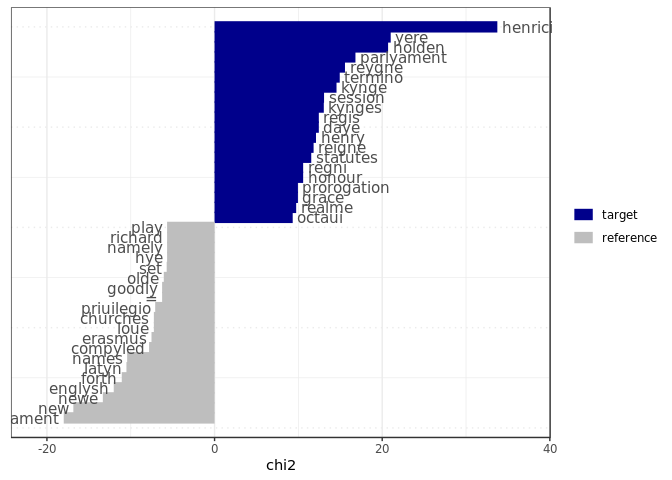

    ## 
    ## Community: 2


    ## 
    ## Community: 3

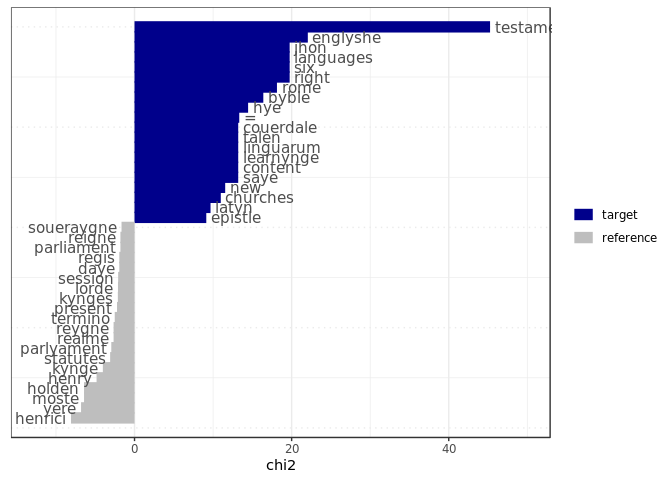

    ## 
    ## Community: 4

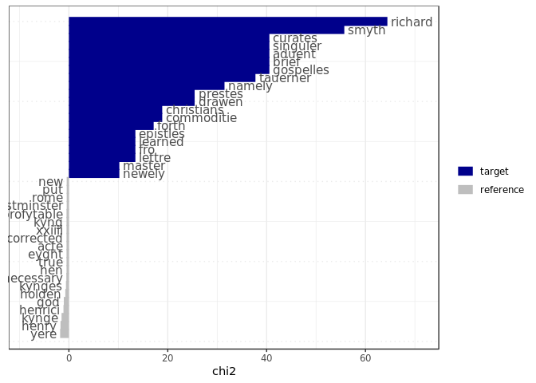

    ## 
    ## Community: 5

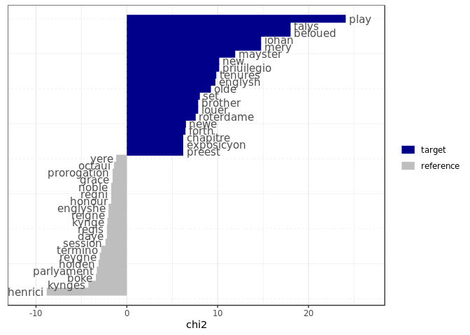

    ## 
    ##  1536-1545 
    ## 
    ## 25 top features/tokens
    ## $Community_1
    ##     termino       brief        tyll      aduent        good   michaelis 
    ##          13          11           9           9           9           9 
    ##     henrici   gospelles    singuler      namely     prestes     curates 
    ##           9           8           8           8           8           8 
    ##       sexti    epistles       forth  priuilegio imprimendum       regis 
    ##           8           7           7           7           7           7 
    ##       parte    christen      drawen       newly     learned  commoditie 
    ##           6           6           6           6           5           5 
    ##    tauerner 
    ##           5 
    ## 
    ## $Community_2
    ##   englyshe       boke      byble       holy     kynges        god        set 
    ##         16         14         13         12         12         12         11 
    ##      newly       newe    churche  testament      euery      forth   englande 
    ##         11         11         11         11         10          9          9 
    ##     wherin priuilegio      lorde   gathered        new      great     realme 
    ##          9          8          8          8          8          8          8 
    ##      latyn    basille      maner  corrected 
    ##          8          8          7          7 
    ## 
    ## $Community_3
    ##        yere       henry     henrici      kynges       lorde         god 
    ##          84          65          54          53          51          48 
    ##    englande      reygne       kynge        boke       moste      holden 
    ##          44          44          41          38          38          36 
    ##  parlyament    statutes     termino      realme       actes        daye 
    ##          34          31          27          26          26          26 
    ##        kyng         man      octaui       grace westminster       euery 
    ##          25          23          22          21          21          20 
    ##     session 
    ##          20 
    ## 
    ## $Community_4
    ##     ioanne    lelando antiquario     autore          =    ioannis   candidos 
    ##          6          5          5          5          2          2          2 
    ##   lectores        tou    iōannou    bononia       noui        set      forth 
    ##          2          2          2          2          2          1          1 
    ##       yere     robert      lorde     kynges     dyuers      table       newe 
    ##          1          1          1          1          1          1          1 
    ##      ryght       erle  necessary      regis 
    ##          1          1          1          1 
    ## 
    ## $Community_5
    ##   basille  theodore  christen       new     newly     great    lately       set 
    ##        11         9         8         5         4         4         4         3 
    ##      newe pleasaunt       god       man     noble      true       hye     godly 
    ##         3         3         3         3         3         3         3         2 
    ##      yere    newely  compyled     maner    wherin   englysh necessary     moost 
    ##         2         2         2         2         2         2         2         2 
    ##   ioyfull 
    ##         2 
    ## 
    ## $Community_6
    ##     letters       kynge       johan       lowys     persons       newly 
    ##           3           2           2           2           1           1 
    ##    compyled     agaynst      kynges   excellent       maner       yeres 
    ##           1           1           1           1           1           1 
    ##  testamente   chartuary     english   necessary        wyll       lerne 
    ##           1           1           1           1           1           1 
    ##       wryte       forme     makynge  indentures obligacions  quitaunces 
    ##           1           1           1           1           1           1 
    ##      bylles 
    ##           1 
    ## 
    ## 
    ## Community: 1

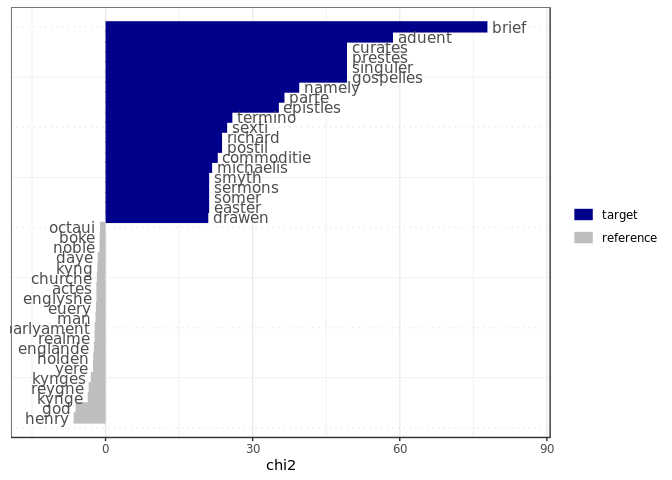

    ## 
    ## Community: 2


    ## 
    ## Community: 3


    ## 
    ## Community: 4


    ## 
    ## Community: 5

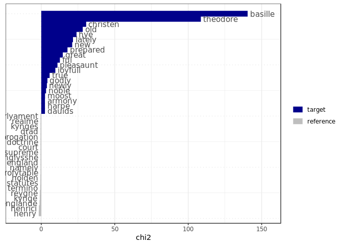

    ## 
    ## Community: 6

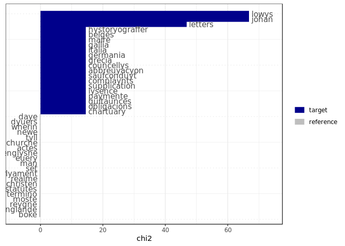

    ## 
    ##  1541-1550 
    ## 
    ## 25 top features/tokens
    ## $Community_1
    ##    kynges   churche  maiestie     moste       set      yere     euery  churches 
    ##        53        34        27        27        26        25        21        21 
    ##     lorde  englande       god    reigne maiesties  gathered     byble    realme 
    ##        19        19        18        17        16        15        15        15 
    ##  certayne appoynted  declared   england      tyme      boke  persones   curates 
    ##        14        14        14        14        14        14        13        13 
    ##     booke 
    ##        13 
    ## 
    ## $Community_2
    ##     basille    theodore    christen         new       great       newly 
    ##          11           9           7           5           4           4 
    ##      lately         set       noble         god       moost        true 
    ##           4           3           3           3           3           3 
    ##   pleasaunt        yere       godly       maner      wherin   necessary 
    ##           3           2           2           2           2           2 
    ##         man        newe     ioyfull      newely         ful norwicensis 
    ##           2           2           2           2           2           2 
    ##       blank 
    ##           2 
    ## 
    ## $Community_3
    ##      yere       god     lorde    kynges  englande   henrici     henry     moste 
    ##        62        55        47        45        44        42        42        38 
    ##      boke       set   termino       man    reygne  christen      kyng      daye 
    ##        37        32        32        30        28        24        24        23 
    ##     maner necessary     newly    wherin   churche     actes  statutes     kynge 
    ##        23        23        23        22        21        21        20        20 
    ##     grace 
    ##        20 
    ## 
    ## $Community_4
    ## proclamacion         yere      crowley       rentes          set       called 
    ##            5            4            4            4            3            3 
    ##         maye          god         oure        lorde       robert    imprinted 
    ##            3            3            3            3            3            3 
    ##     holburne         shal          aug       kynges     gathered        forth 
    ##            3            3            3            2            2            2 
    ##        yeres         wyth         boke        added           yr         tong 
    ##            2            2            2            2            2            2 
    ##       partes 
    ##            2 
    ## 
    ## $Community_5
    ##      boke       god    kynges   termino      wyth      iohn     godly     euery 
    ##        19        18        16        16        15        14        14        13 
    ##       man   churche     maner necessary   henrici     lorde     henry       set 
    ##        13        11        11        11        11        11        11        10 
    ##     added     kynge  christen michaelis     forth      holy     sexti   letters 
    ##        10        10        10        10         9         9         9         9 
    ##  certayne 
    ##         8 
    ## 
    ## $Community_6
    ##   certayne    psalter    psalmes      added    sermons     kynges        set 
    ##          2          2          2          2          1          1          1 
    ##      forth      booke       wyth      byble   gracious     deuout       boke 
    ##          1          1          1          1          1          1          1 
    ##       uery    praiers    prayers    lycence   englishe       true necessarye 
    ##          1          1          1          1          1          1          1 
    ## christians     godlye  frutefull      taken 
    ##          1          1          1          1 
    ## 
    ## $Community_7
    ##      boke       god      iohn    thomas       man     godly      holy       hys 
    ##        29        22        12        12        12        11        11         9 
    ##     added   agaynst     newly    sermon  gathered       set    whiche     lorde 
    ##         9         9         9         8         8         8         8         8 
    ##  christen  compiled      howe     whych christian    kynges     forth     byble 
    ##         8         8         8         8         8         7         7         7 
    ##    called 
    ##         7 
    ## 
    ## 
    ## Community: 1

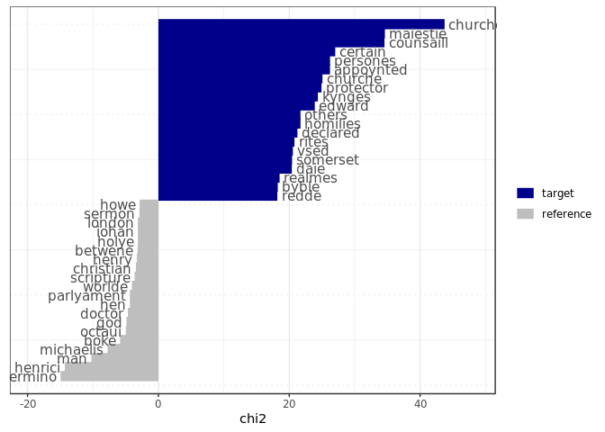

    ## 
    ## Community: 2


    ## 
    ## Community: 3


    ## 
    ## Community: 4


    ## 
    ## Community: 5

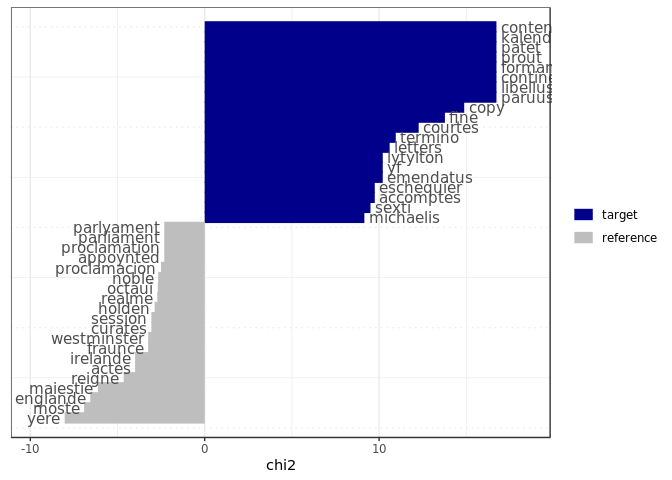

    ## 
    ## Community: 6

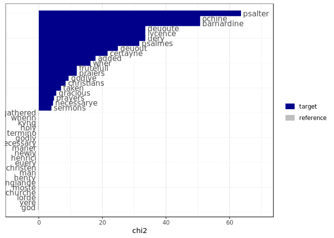

    ## 
    ## Community: 7

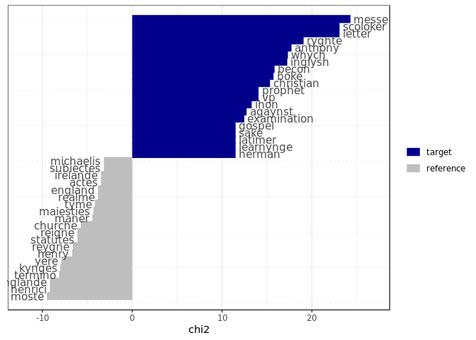

    ## 
    ##  1546-1555 
    ## 
    ## 25 top features/tokens
    ## $Community_1
    ##         yere       kynges       reigne          set      churche        moste 
    ##           55           49           41           39           39           38 
    ##     englande     maiestie        lorde         daie          god     irelande 
    ##           33           33           33           30           26           26 
    ##      highnes proclamacion    honorable     churches        actes        grace 
    ##           25           23           20           19           19           19 
    ##      england        furth      fraunce      supreme    maiesties      psalmes 
    ##           19           18           18           18           18           17 
    ##         kyng 
    ##           17 
    ## 
    ## $Community_2
    ##   termino     maner  treatise    quenes       set       god     moste   henrici 
    ##        11        10        10        10         9         8         8         8 
    ##     reade      tyme      boke   english michaelis     regis     newly      nowe 
    ##         7         7         7         7         7         7         6         6 
    ##    called   notable    thomas     furth excellent sacrament     regni     booke 
    ##         6         6         6         6         6         6         6         5 
    ## necessary 
    ##         5 
    ## 
    ## $Community_3
    ##       god      boke     lorde      yere     moste   henrici      wyth       hys 
    ##        81        51        44        42        39        35        33        32 
    ##     godly       man       set      holy   churche    thomas     henry     added 
    ##        31        30        26        26        26        26        26        26 
    ##   termino    kynges     maner  gathered     newly     kynge  englande     booke 
    ##        25        24        23        23        22        22        21        20 
    ## necessary 
    ##        20 
    ## 
    ## $Community_4
    ##         god       quene       grace     fraunce  parliament       actes 
    ##          27          24          19          19          19          18 
    ##   continued       mariæ    foloweth      london      holden westminster 
    ##          18          18          17          17          17          17 
    ##        daye     england       fayth     ireland       primo        mary 
    ##          17          15          15          14          13          13 
    ## dissolution    englande      reigne        next  soueraygne       ladye 
    ##          13          11          11          11          11          11 
    ##    irelande 
    ##          10 
    ## 
    ## $Community_5
    ##      boke       god      wyth     maner    kynges    whiche     euery     lorde 
    ##        33        25        24        22        21        21        20        19 
    ##     godly       man    herbes       set  gathered     kynge    called     theyr 
    ##        18        18        17        16        16        16        15        15 
    ##    doctor     newly      holy scripture  englyshe     forth     added begynneth 
    ##        15        14        14        14        14        14        14        14 
    ## necessary 
    ##        13 
    ## 
    ## $Community_6
    ##    psalter    psalmes   certayne      added      booke       wyth        set 
    ##          2          2          2          2          1          1          1 
    ##     kynges    sermons      forth   englishe       boke      byble   gracious 
    ##          1          1          1          1          1          1          1 
    ##       true     deuout       uery    praiers    prayers     letany    lycence 
    ##          1          1          1          1          1          1          1 
    ## necessarye     godlye christians      taken 
    ##          1          1          1          1 
    ## 
    ## 
    ## Community: 1

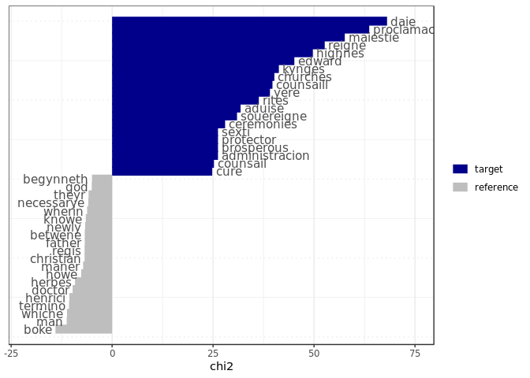

    ## 
    ## Community: 2

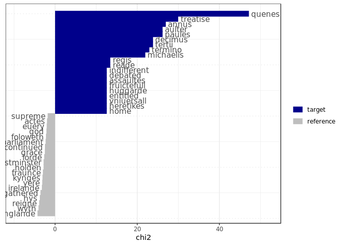

    ## 
    ## Community: 3

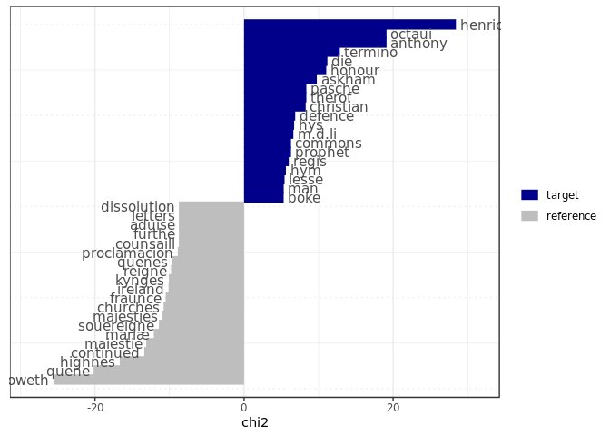

    ## 
    ## Community: 4

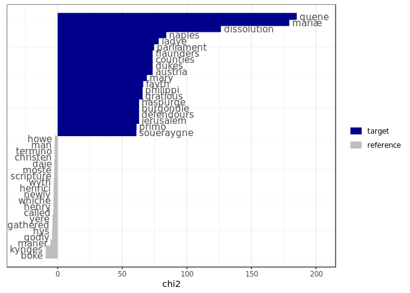

    ## 
    ## Community: 5

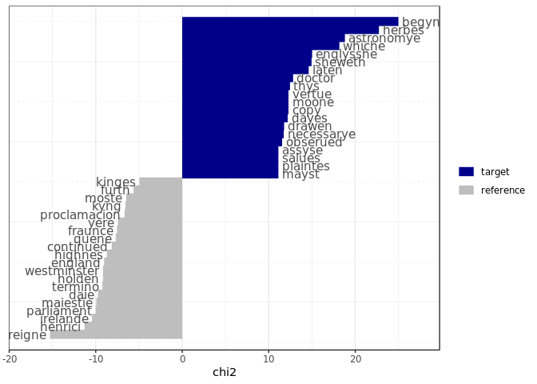

    ## 
    ## Community: 6

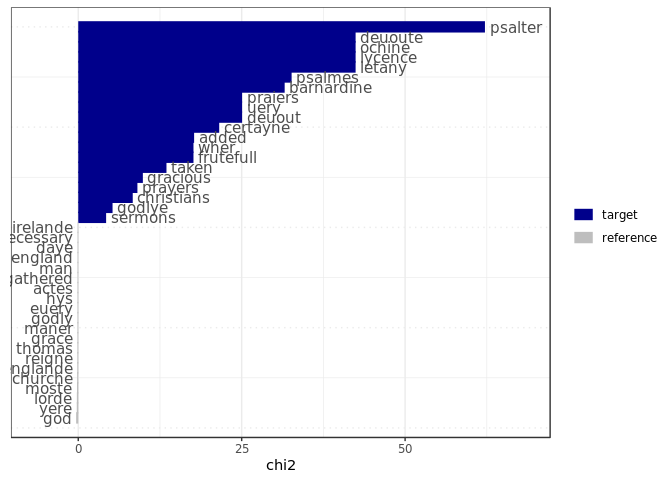

    ## 
    ##  1551-1560 
    ## 
    ## 25 top features/tokens
    ## $Community_1
    ##      god      set   quenes   called treatise gathered    moste  notable 
    ##       16       13       13       12       11       10       10       10 
    ##   thomas    maner  churche   christ    reade      man englishe     boke 
    ##        9        9        9        9        9        8        8        8 
    ##   london    newly    booke   herbes  maister    lorde  english     yere 
    ##        8        8        8        8        7        7        7        7 
    ##  doctour 
    ##        7 
    ## 
    ## $Community_2
    ##         god       quene       grace      reigne     fraunce       actes 
    ##          69          56          50          48          47          44 
    ##   continued    foloweth       lorde        yere    englande      holden 
    ##          43          43          42          42          41          41 
    ##    maiestie westminster      quenes    irelande     england       moste 
    ##          38          38          37          37          34          34 
    ##  parliament         set     ireland        daye      london     highnes 
    ##          34          29          29          28          26          25 
    ##     churche 
    ##          24 
    ## 
    ## $Community_3
    ##   termino     lorde       god   henrici      yere     regis     regni      boke 
    ##        62        50        49        49        44        43        36        32 
    ## michaelis     maner     added   edwardi     booke     moste  englande    whiche 
    ##        31        29        26        26        25        23        23        23 
    ##  statutes     henry corrected      wyth     newly    pasche    quarti     euery 
    ##        23        22        22        21        21        21        21        20 
    ##    herbes 
    ##        20 
    ## 
    ## 
    ## Community: 1


    ## 
    ## Community: 2


    ## 
    ## Community: 3


    ## 
    ##  1556-1565 
    ## 
    ## 25 top features/tokens
    ## $Community_1
    ##           god         newly        quenes          iohn         veron 
    ##             6             5             5             5             5 
    ##      treatise     maiesties   iniunctions           set         order 
    ##             4             4             4             4             4 
    ##       dialoge        workes         googe        thomas         quene 
    ##             4             4             3             3             3 
    ##     appoynted iustification          good          poet     marcellus 
    ##             3             3             3             2             2 
    ##     pleasaunt          lyfe         verse       barnabe        called 
    ##             2             2             2             2             2 
    ## 
    ## $Community_2
    ##        quene     maiestie       quenes          god       realme     certayne 
    ##           73           71           69           33           28           26 
    ##      fraunce         good   soueraigne   parliament       holden        grace 
    ##           24           22           22           21           21           20 
    ##    maiesties    elizabeth      england     foloweth          set       queene 
    ##           19           19           18           18           17           17 
    ##         yere proclamation         lady  westminster    continued       raigne 
    ##           17           17           16           16           15           15 
    ##       london 
    ##           14 
    ## 
    ## $Community_3
    ##         god         set    englishe     learned        iohn   according 
    ##          16          15          13           9           8           8 
    ##       newly   maiesties iniunctions        ihon       lorde       moste 
    ##           7           7           7           7           7           7 
    ##      christ        yere    gathered        tyme   corrected     maister 
    ##           7           7           6           6           6           6 
    ##      famous      diuers         man       table       godly      called 
    ##           6           6           6           6           5           5 
    ##    englyshe 
    ##           5 
    ## 
    ## $Community_4
    ##     termino     henrici         god       lorde       regis        yere 
    ##          73          58          56          54          54          50 
    ##       regni     edwardi         set   michaelis       booke      quarti 
    ##          43          41          35          34          28          28 
    ##       newly     england       moste       henry      called      church 
    ##          27          26          25          24          23          23 
    ##        iohn      london       added      pasche    statutes       actes 
    ##          22          22          22          22          21          21 
    ## westminster 
    ##          21 
    ## 
    ## $Community_5
    ##           end       psalmen           het     tghesangk         marie 
    ##             3             2             2             2             1 
    ##      gheloofs        dauids       hondert     mitgaders      ghesangk 
    ##             1             1             1             1             1 
    ##      zacharie       simeons         thien      gheboden      artikels 
    ##             1             1             1             1             1 
    ##       tghebed        heeren   ouerghesett nederlanschen        dichte 
    ##             1             1             1             1             1 
    ##          door           ian      wtenhoue         woord       christi 
    ##             1             1             1             1             1 
    ## 
    ## 
    ## Community: 1

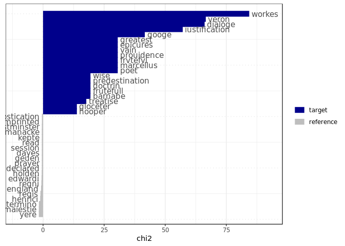

    ## 
    ## Community: 2


    ## 
    ## Community: 3


    ## 
    ## Community: 4


    ## 
    ## Community: 5


    ## 
    ##  1561-1570 
    ## 
    ## 25 top features/tokens
    ## $Community_1
    ##     maiestie       queene      queenes        quene       quenes       realme 
    ##           76           50           47           43           41           40 
    ##          god         yere proclamation    subiectes          set     certayne 
    ##           32           27           26           25           22           22 
    ##         good   soueraigne       raigne    maiesties         lady    elizabeth 
    ##           22           21           21           18           17           17 
    ##        euery   parliament         kyng      fraunce     certaine       london 
    ##           17           17           16           15           15           15 
    ##        grace 
    ##           14 
    ## 
    ## $Community_2
    ##         set       forth     allowed      london     english        ende 
    ##          12          11           9           9           8           8 
    ##      sermon    certaine    englishe   maiesties iniunctions      thomas 
    ##           8           7           7           7           7           7 
    ##     perused         hys     psalmes        holy      quenes   appointed 
    ##           7           7           6           6           6           6 
    ##        iohn      church        lord        tyme     matters        read 
    ##           6           6           6           6           6           6 
    ##      places 
    ##           6 
    ## 
    ## $Community_3
    ##    termino      regis    henrici      regni  michaelis    edwardi      sexti 
    ##         75         53         49         43         37         30         23 
    ##     quarti     pasche     tertii        god      lorde     octaui    england 
    ##         21         16         14         13         13         13         11 
    ##   statutes       iohn       yere   gathered       lord    decimus   hillarii 
    ##         11         10         10          9          9          9          9 
    ## trinitatis        set      booke     church 
    ##          9          8          8          8 
    ## 
    ## $Community_4
    ##         god        yere       lorde         set     henrici       moste 
    ##          30          27          24          23          18          18 
    ##    englande      common  soueraigne westminster       newly        iohn 
    ##          16          13          13          13          12          12 
    ##  parliament      holden      reigne    religion       booke      realme 
    ##          12          12          12          12          11          11 
    ##        holy       grace     england    englishe     churche       table 
    ##          11          11          11          11          11          11 
    ##       order 
    ##          10 
    ## 
    ## $Community_5
    ##      iohn   english     newly       new      true       god  englishe       man 
    ##        15        12        10        10         9         8         8         8 
    ##       set      boke    called     death     whole     booke     names      wyth 
    ##         7         7         7         7         6         6         6         6 
    ##      holy   learned    london      yere enterlude    drawen begynneth  certaine 
    ##         6         6         6         6         6         6         6         5 
    ##   maister 
    ##         5 
    ## 
    ## $Community_6
    ##         set     allowed   according    englishe         god     english 
    ##          36          29          26          25          24          24 
    ##       seene       order        iohn     queenes iniunctions       forth 
    ##          24          23          22          21          21          20 
    ##     learned   maiesties      french      thomas      called      london 
    ##          20          16          16          15          13          13 
    ##       great      christ   appointed   pleasaunt  profitable      church 
    ##          12          11          11          11          11          11 
    ##        yere 
    ##          11 
    ## 
    ## 
    ## Community: 1

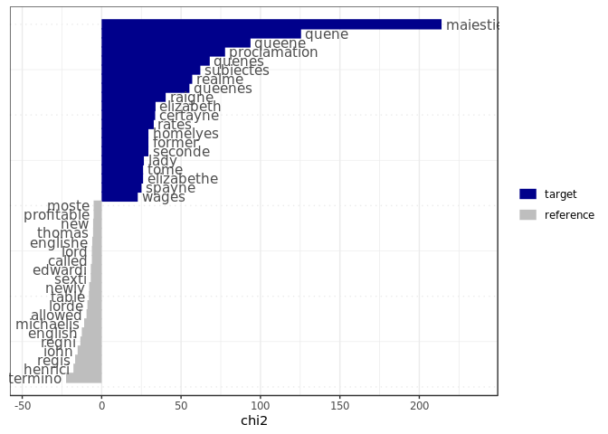

    ## 
    ## Community: 2


    ## 
    ## Community: 3


    ## 
    ## Community: 4


    ## 
    ## Community: 5

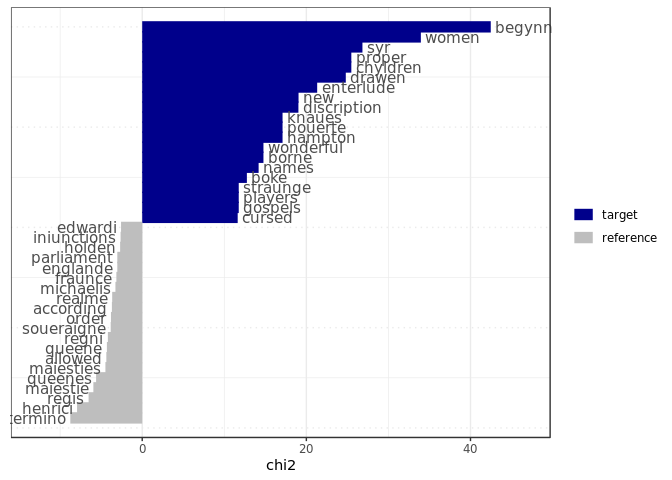

    ## 
    ## Community: 6

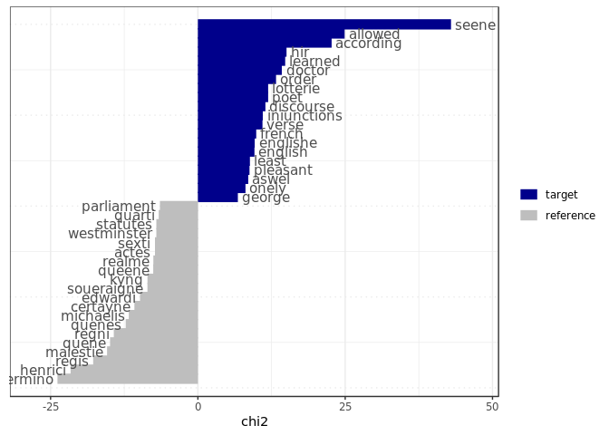

    ## 
    ##  1566-1575 
    ## 
    ## 25 top features/tokens
    ## $Community_1
    ##       queene          god      queenes     maiestie   soueraigne   parliament 
    ##           79           57           48           39           37           34 
    ##         yere       raigne         lady        grace      fraunce       realme 
    ##           34           33           33           32           31           30 
    ##       holden     englande  westminster    continued      enacted     foloweth 
    ##           30           28           27           27           27           27 
    ##    elizabeth       reginæ        fayth    subiectes     publique proclamation 
    ##           26           23           23           20           20           19 
    ##   elizabethe 
    ##           19 
    ## 
    ## $Community_2
    ##   certaine    england    allowed        set   englishe       ende       lord 
    ##         14         12         11          8          8          8          8 
    ##     sermon      booke    english      forth       iohn     london      whole 
    ##          8          7          7          7          7          7          7 
    ## concernyng      newly  christian   preached  collected        god    agaynst 
    ##          7          7          7          7          6          6          6 
    ##     thomas     called    sermons     french 
    ##          6          6          6          5 
    ## 
    ## $Community_3
    ##     termino     henrici       regis       regni   michaelis         god 
    ##          88          54          54          49          47          37 
    ##         set      quarti       sexti   according     edwardi      pasche 
    ##          35          33          33          32          29          28 
    ##      thomas       seene     english       order     allowed      church 
    ##          27          26          25          23          20          19 
    ##      called        iohn     queenes iniunctions     learned       booke 
    ##          19          18          18          18          18          17 
    ##       forth 
    ##          17 
    ## 
    ## $Community_4
    ##        god        set       iohn    english      order   englishe    allowed 
    ##         80         52         45         44         36         35         32 
    ##      lorde     thomas  according      seene       yere      moste     french 
    ##         31         31         31         29         28         28         27 
    ##      forth       true    queenes profitable        new   gathered     realme 
    ##         27         27         27         26         26         25         25 
    ##     diuers     common  christian      booke 
    ##         24         24         23         22 
    ## 
    ## $Community_5
    ##      guilielmum          artium           lucem         bonarum     studiosorum 
    ##               2               1               1               1               1 
    ##           iones    ouranomachia    astrologorum           ludus      astrologiæ 
    ##               1               1               1               1               1 
    ##          primis    relaxationem      comparatus     illustratus          æditus 
    ##               1               1               1               1               1 
    ##        fulconem cantabrigiensem          abacus         calculi         væneunt 
    ##               1               1               1               1               1 
    ##           longa        officina    occidentalem         paulini          templi 
    ##               1               1               1               1               1 
    ## 
    ## 
    ## Community: 1

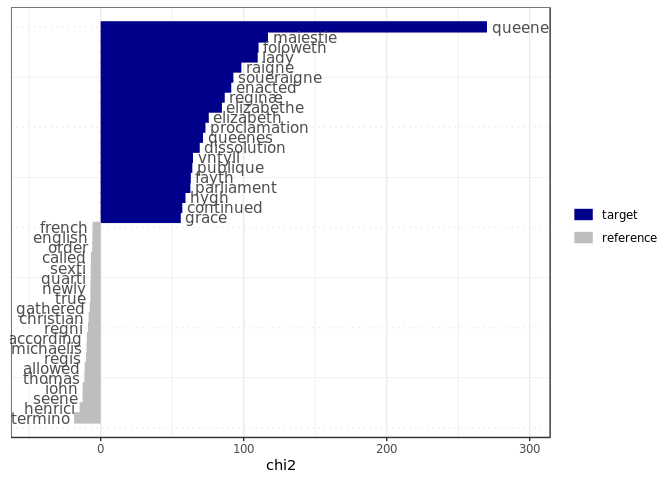

    ## 
    ## Community: 2


    ## 
    ## Community: 3


    ## 
    ## Community: 4


    ## 
    ## Community: 5


    ## 
    ##  1571-1580 
    ## 
    ## 25 top features/tokens
    ## $Community_1
    ##      queene         god      holden     queenes     fraunce  parliament 
    ##          82          69          38          37          37          37 
    ##  soueraigne        lady       grace westminster     enacted      realme 
    ##          37          37          34          31          30          30 
    ##   elizabeth       fayth    maiestie    englande    foloweth      raigne 
    ##          30          30          29          29          28          28 
    ##   continued      reginæ       booke    publique     ireland    pleasure 
    ##          26          25          24          23          22          22 
    ##       weale 
    ##          22 
    ## 
    ## $Community_10
    ##   termino       god     regis     booke       set     regni according necessary 
    ##        44        32        32        29        26        26        25        24 
    ##   henrici michaelis    quarti   edwardi   english    thomas      iohn     great 
    ##        24        22        22        20        18        18        17        17 
    ##     forth     right   england    pasche     sexti   queenes   allowed     seene 
    ##        17        15        15        15        15        14        14        14 
    ##    called 
    ##        14 
    ## 
    ## $Community_11
    ##       iohn    english        god  discourse     church  necessary  christian 
    ##         22         18         16         12         10         10          9 
    ##     french   treatise     sermon    learned       true    sermons    maister 
    ##          9          8          8          8          8          8          8 
    ##  maiesties     christ profitable   gathered    allowed      seene      godly 
    ##          7          7          7          7          7          7          7 
    ##   englishe       holy  questions necessarie 
    ##          7          6          6          6 
    ## 
    ## $Community_12
    ## necessarie        god        set  christian profitable  excellent   englishe 
    ##         17         16         15         14         14         11         11 
    ##      right   gathered      vvith       iohn      moste      lorde     christ 
    ##         10         10         10         10          9          8          8 
    ##     london     briefe   englande      forth    queenes    annexed        vse 
    ##          8          8          8          8          7          7          7 
    ##      newly    allowed  according  discourse 
    ##          7          7          7          7 
    ## 
    ## $Community_2
    ##     sundry        gen        god     french    english    learned   englishe 
    ##          3          3          2          2          2          2          2 
    ## inuentions    deuises  preceptes     langue     tongue     yeares      noble 
    ##          2          2          2          2          2          2          1 
    ##  maiesties      lorde      right profitable contayning       good       loue 
    ##          1          1          1          1          1          1          1 
    ## conteyning      force      newly   speciall 
    ##          1          1          1          1 
    ## 
    ## $Community_3
    ##   pleasant  discourse      right profitable        bee     prince        new 
    ##         11         10          9          9          7          6          6 
    ##   gathered  excellent      death     worthy       gent     knight  honorable 
    ##          6          6          6          6          6          6          6 
    ##    english     diuers      newly  according  gentlemen    learned       read 
    ##          5          5          5          5          5          5          5 
    ##       true       lyfe   vertuous      dutch 
    ##          5          5          5          5 
    ## 
    ## $Community_4
    ##     plantes      french     english      diuers         set       names 
    ##           2           1           1           1           1           1 
    ##   contayned     vertues      sundry   discourse       onely       henry 
    ##           1           1           1           1           1           1 
    ##     learned description        vsed      others    englande        nowe 
    ##           1           1           1           1           1           1 
    ##      foorth     figures     perfect      whiche    historie      sortes 
    ##           1           1           1           1           1           1 
    ##      vvhole 
    ##           1 
    ## 
    ## $Community_5
    ##        god profitable       iohn     knight     within   englishe      forth 
    ##          5          4          4          4          3          3          3 
    ##   minister     french    william        set   together       loue        man 
    ##          3          2          2          2          2          2          2 
    ##  condition      vvith  diuinitie    learned       body      state   articles 
    ##          2          2          2          2          2          2          2 
    ##   religion    gospell       vsed      copie 
    ##          2          2          2          2 
    ## 
    ## $Community_6
    ##    french      king    thyrde    daryus  stipator     taken  treatise     booke 
    ##         2         2         2         2         2         1         1         1 
    ##       new     names following     words      good   vertues     vices       man 
    ##         1         1         1         1         1         1         1         1 
    ##  certayne diuinitie  auncient   persons      body    bishop  englishe  richarde 
    ##         1         1         1         1         1         1         1         1 
    ## otherwyse 
    ##         1 
    ## 
    ## $Community_7
    ##      guilielmum           lucem          artium    ouranomachia    astrologorum 
    ##               2               1               1               1               1 
    ##           ludus         bonarum      astrologiæ          primis     studiosorum 
    ##               1               1               1               1               1 
    ##    relaxationem      comparatus     illustratus          æditus        fulconem 
    ##               1               1               1               1               1 
    ## cantabrigiensem          abacus         calculi         væneunt           iones 
    ##               1               1               1               1               1 
    ##           longa        officina    occidentalem         paulini          templi 
    ##               1               1               1               1               1 
    ## 
    ## $Community_8
    ##        god    english       iohn        set  christian    learned     french 
    ##         69         58         56         45         43         37         35 
    ##  discourse      moste profitable      seene     thomas      order     diuers 
    ##         33         32         32         32         32         31         30 
    ##   gathered    england   englishe       true     common     church       time 
    ##         30         30         30         30         29         27         27 
    ##  according       king    allowed      forth 
    ##         26         25         25         25 
    ## 
    ## $Community_9
    ##       iohn    english     french    learned     tongue        set profitable 
    ##         17         14          8          7          7          6          6 
    ##    epistle      order     master   compiled  christian        god     church 
    ##          6          5          5          5          4          4          4 
    ##       next       loue  necessary  excellent      vvith    england  discourse 
    ##          4          4          4          4          4          4          4 
    ##   religion      peter       arte     called 
    ##          4          4          4          4 
    ## 
    ## 
    ## Community: 1

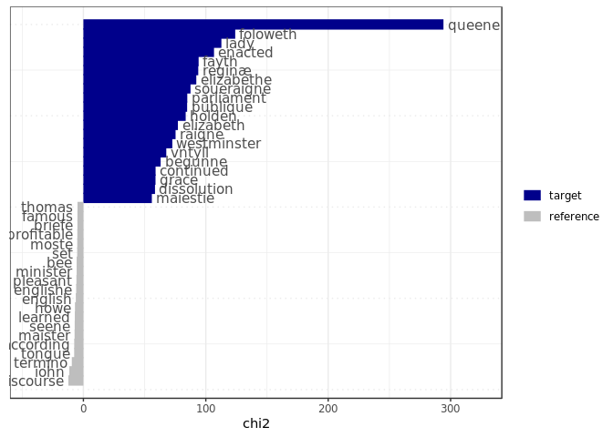

    ## 
    ## Community: 2


    ## 
    ## Community: 3

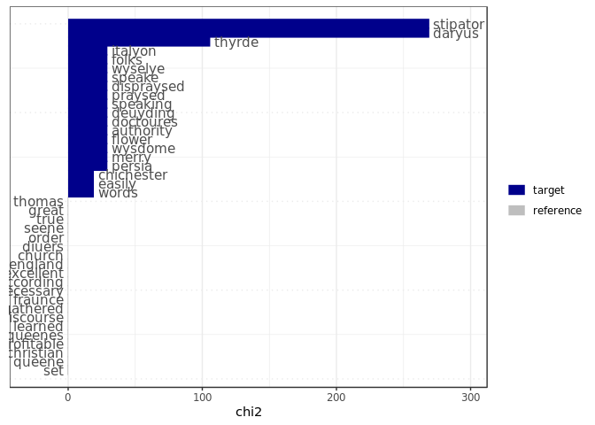

    ## 
    ## Community: 4


    ## 
    ## Community: 5


    ## 
    ## Community: 6

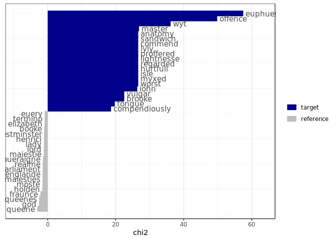

    ## 
    ## Community: 7

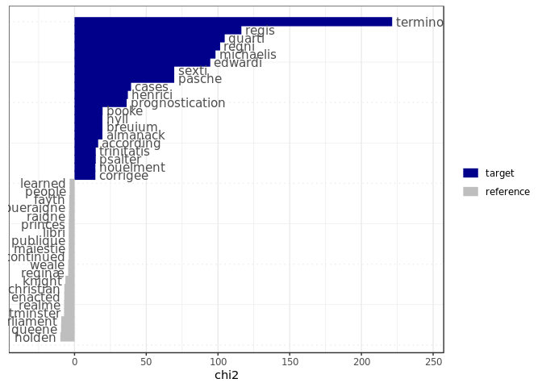

    ## 
    ## Community: 8

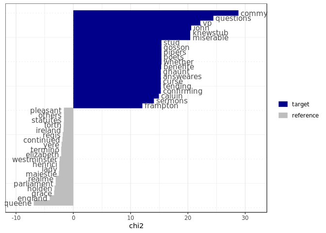

    ## 
    ## Community: 9

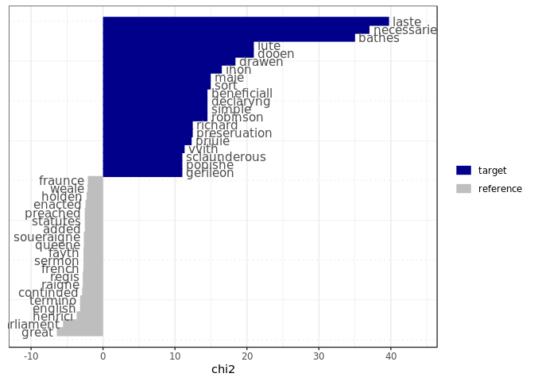

    ## 
    ## Community: 10

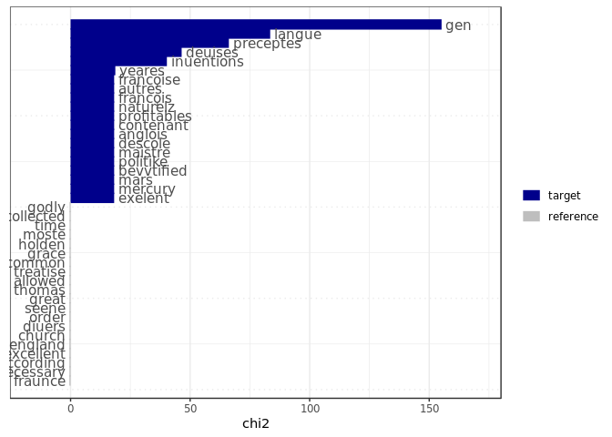

    ## 
    ## Community: 11

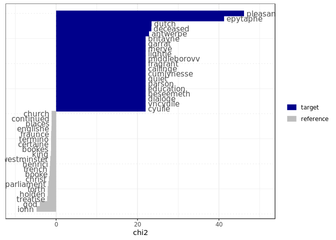

    ## 
    ## Community: 12


    ## 
    ##  1576-1585 
    ## 
    ## 25 top features/tokens
    ## $Community_1
    ##        god     queene    english       iohn    queenes   maiestie        set 
    ##         92         72         57         47         46         44         43 
    ##       true profitable      booke  excellent     diuers     church     french 
    ##         42         41         40         39         39         38         38 
    ##      godly  christian     christ      great  maiesties   treatise concerning 
    ##         37         37         36         35         35         33         33 
    ##     london  discourse        vse      right 
    ##         32         31         30         30 
    ## 
    ## $Community_10
    ##   termino     regis       god   edwardi     regni     booke   henrici    quarti 
    ##        51        43        35        32        28        22        22        22 
    ##      iohn   english excellent     right      true     godly michaelis     great 
    ##        21        20        19        18        18        17        17        16 
    ##   allowed necessary according       set   learned   present     moste   fraunce 
    ##        16        16        16        15        15        15        14        13 
    ##    church 
    ##        13 
    ## 
    ## $Community_2
    ##     plantes     vertues    historie      wherin         set     english 
    ##           2           1           1           1           1           1 
    ##   discourse       henry      others      sundry      french     learned 
    ##           1           1           1           1           1           1 
    ##    commonly        nowe      diuers       names    englande      tongue 
    ##           1           1           1           1           1           1 
    ##   contayned description      foorth    straunge       onely    physicke 
    ##           1           1           1           1           1           1 
    ##     figures 
    ##           1 
    ## 
    ## $Community_3
    ##         god     sermons       worde      bishop    preacher    treatise 
    ##           6           4           4           4           3           3 
    ##  conteining      called       dayes    reuerend      father       godly 
    ##           3           3           3           3           3           2 
    ##    preached        iohn       vdall      verses     chapter     request 
    ##           2           2           2           2           2           2 
    ##        true      french chyrurgerie    gathered    certaine      effect 
    ##           2           2           2           2           2           2 
    ##      thames 
    ##           2 
    ## 
    ## $Community_4
    ##        god       lord      right       true     london       gent      order 
    ##         14         14         12         12         12         12         11 
    ##     worthy   pleasant      seene  according      godly    english  discourse 
    ##         11         10         10         10          9          9          9 
    ##  christian       life    learned profitable       last      death       gods 
    ##          9          9          9          9          9          9          8 
    ##     george  excellent      moste      kings 
    ##          8          8          8          8 
    ## 
    ## $Community_5
    ## prognostication       almanacke             god            lord        phisicke 
    ##              19              10               9               8               7 
    ##        meridian            gods             set           vvith            iohn 
    ##               7               6               6               6               5 
    ##           great           citie        almanack             vse           rules 
    ##               5               5               5               4               4 
    ##          thomas          tables          london      conteyning       necessary 
    ##               4               4               4               4               4 
    ##        referred    conuersation       eleuation           leape         maister 
    ##               4               4               4               4               3 
    ## 
    ## $Community_6
    ##       iohn    english        set profitable necessarie     knight      booke 
    ##         21         16         12         12         10          9          8 
    ##       arte      right     french    learned    annexed     diuers  gentleman 
    ##          8          8          8          8          8          8          8 
    ##      verie       loue containing    sundrie       holy     tongue       read 
    ##          8          8          7          7          7          7          7 
    ##    maister        god    england     thomas 
    ##          6          6          6          6 
    ## 
    ## $Community_7
    ##      iohn   english     booke    christ       god      true collected       set 
    ##        18        15        15        11        11        11        11         9 
    ##  certaine   psalmes     godly    church    french     whole    london     right 
    ##         9         9         8         8         8         8         8         7 
    ##    sermon christian  gathered   learned     forth     citie     notes   persons 
    ##         7         7         7         7         7         7         7         6 
    ##  religion 
    ##         6 
    ## 
    ## $Community_8
    ##        iohn     english       libri   christian     learned      french 
    ##          37          36          34          23          23          22 
    ##         set   diuinitie  profitable   francisco        true      church 
    ##          21          21          21          21          20          20 
    ##    treatise   discourse         god   tremellio    gathered     annexed 
    ##          19          18          17          17          16          16 
    ##  testamenti      christ     william accesserunt    preached      sermon 
    ##          16          15          15          15          14          14 
    ##      bookes 
    ##          14 
    ## 
    ## $Community_9
    ##       iohn    english        god       true  christian  discourse     church 
    ##         49         47         45         39         38         35         34 
    ##        set     sermon   treatise      godly      booke profitable   preached 
    ##         32         30         29         28         28         24         23 
    ##     christ    allowed     french       gods necessarie   englishe   religion 
    ##         23         23         23         22         22         22         21 
    ##      seene    learned  maiesties        bee 
    ##         20         20         20         20 
    ## 
    ## 
    ## Community: 1

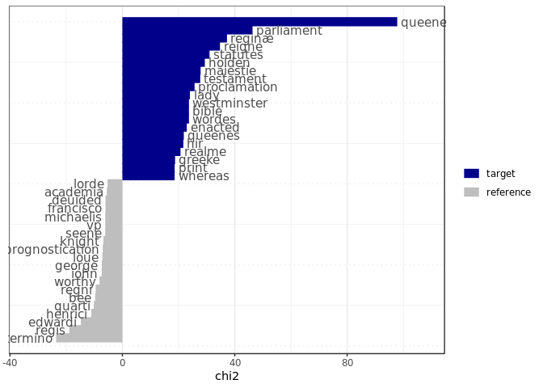

    ## 
    ## Community: 2


    ## 
    ## Community: 3


    ## 
    ## Community: 4

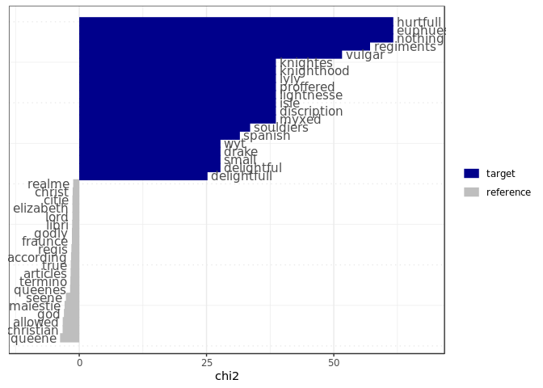

    ## 
    ## Community: 5

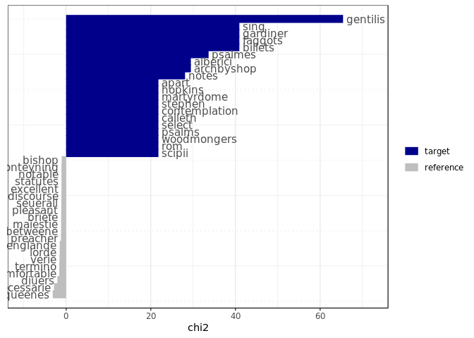

    ## 
    ## Community: 6


    ## 
    ## Community: 7

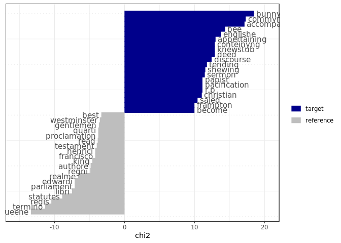

    ## 
    ## Community: 8


    ## 
    ## Community: 9


    ## 
    ## Community: 10


    ## 
    ##  1581-1590 
    ## 
    ## 25 top features/tokens
    ## $Community_1
    ##    gentilis    alberici professoris       liber       thoma       prima 
    ##           8           6           3           3           3           2 
    ##     watsono      scipii         i.c       rerij        ivre       belli 
    ##           2           2           1           1           1           1 
    ## commentatio    legalium  comitiorum oxoniensium       actio   francisco 
    ##           1           1           1           1           1           1 
    ##     bevanno     docturæ  dignitatem suscipiente     luranie        muse 
    ##           1           1           1           1           1           1 
    ##     celeste 
    ##           1 
    ## 
    ## $Community_2
    ##       queene          god    maiesties      termino      english         iohn 
    ##           73           65           51           51           49           48 
    ##      queenes       church         true          set        regis     maiestie 
    ##           42           41           40           37           37           36 
    ##        booke      england proclamation       realme     certaine    christian 
    ##           32           31           31           30           29           29 
    ##      edwardi        regni     treatise   profitable       christ        great 
    ##           29           29           28           28           27           27 
    ##        order 
    ##           26 
    ## 
    ## $Community_3
    ##      french     english        iohn        king         god        true 
    ##          31          30          21          20          17          17 
    ##       booke         set    certaine       great      briefe   gentleman 
    ##          15          15          14          13          12          12 
    ##    together      sermon   maiesties      france     allowed     england 
    ##          12          12          11          11          11          11 
    ## declaration     psalmes        duke   discourse       godly      church 
    ##          11          11          11          10          10          10 
    ##    preached 
    ##          10 
    ## 
    ## $Community_4
    ##      booke    english        set       iohn   treatise     thomas   exercise 
    ##         16         14         12         10          9          8          8 
    ##        r.p  gentleman      verie  christian    sundrie       read     knight 
    ##          8          7          7          7          7          7          7 
    ##     diuers necessarie     french  excellent christians    worthie  souldiers 
    ##          7          6          6          6          6          6          6 
    ##    perused      bunny     foorth      parts 
    ##          6          6          6          6 
    ## 
    ## $Community_5
    ##        god    english       true       iohn      great      right  christian 
    ##         74         59         54         45         44         37         37 
    ##      godly     london     french      booke profitable   preached        set 
    ##         36         34         34         33         31         31         30 
    ##     sermon  discourse    learned     church    allowed       time      seene 
    ##         28         27         27         27         27         27         27 
    ##   maiestie  maiesties  necessary concerning 
    ##         26         26         26         25 
    ## 
    ## $Community_6
    ##             god         english            iohn             set          sermon 
    ##              38              34              33              31              27 
    ##       discourse       christian            lord        treatise            true 
    ##              25              25              25              24              24 
    ## prognostication          church           booke        preached           godly 
    ##              24              21              20              20              19 
    ##          diuers          briefe           order       almanacke          christ 
    ##              19              18              18              18              17 
    ##          french           right       excellent            word          thomas 
    ##              17              17              17              17              17 
    ## 
    ## $Community_7
    ##     english        iohn      church        gods  lamentable       losse 
    ##           2           2           2           2           2           2 
    ##      latter   discourse      either      london   intituled       godly 
    ##           1           1           1           1           1           1 
    ##     learned    minister consolation  conscience      doctor furtherance 
    ##           1           1           1           1           1           1 
    ##  conuenient         new   excellent       names  exposition      psalme 
    ##           1           1           1           1           1           1 
    ##        true 
    ##           1 
    ## 
    ## $Community_8
    ##        god       true     french    english  discourse      right       king 
    ##         61         54         53         46         35         35         34 
    ##       iohn     london       lord     christ  christian     briefe   vvherein 
    ##         31         26         25         23         23         22         22 
    ##   maiestie        set     church    sundrie    england   together       time 
    ##         22         22         22         22         22         21         21 
    ##      great   treatise concerning       last 
    ##         21         20         20         20 
    ## 
    ## 
    ## Community: 1


    ## 
    ## Community: 2


    ## 
    ## Community: 3

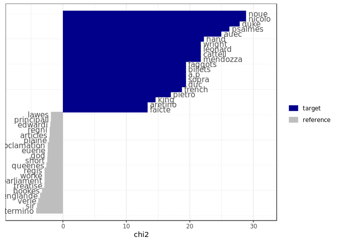

    ## 
    ## Community: 4


    ## 
    ## Community: 5


    ## 
    ## Community: 6


    ## 
    ## Community: 7

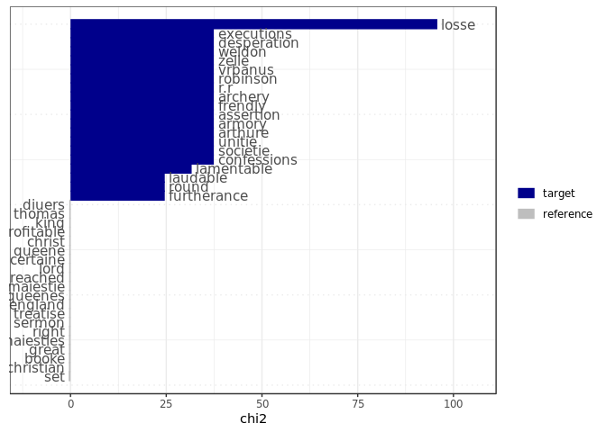

    ## 
    ## Community: 8


    ## 
    ##  1586-1595 
    ## 
    ## 25 top features/tokens
    ## $Community_1
    ##       queene      queenes proclamation    maiesties     maiestie          god 
    ##           80           42           40           40           34           30 
    ##       reigne       realme        great       diuers   parliament     statutes 
    ##           26           26           22           22           21           21 
    ##       places      england       holden       greeke    elizabeth       within 
    ##           20           19           18           17           17           17 
    ##     certaine          set        bible   profitable     iustices    according 
    ##           17           15           15           15           14           14 
    ## translations 
    ##           14 
    ## 
    ## $Community_2
    ##             god         english         england            lord           great 
    ##              49              45              34              33              31 
    ##            true            iohn        pleasant           right          london 
    ##              31              30              30              29              29 
    ##       gentleman       christian       honorable             sir          french 
    ##              29              27              26              25              25 
    ## prognostication            last            life             set            good 
    ##              25              24              24              23              23 
    ##           vvith      profitable            king           death       almanacke 
    ##              23              22              22              22              22 
    ## 
    ## $Community_3
    ##     french     christ    english     diuers    william       king  gentlemen 
    ##         10          9          6          6          6          6          6 
    ##     thomas     bookes      kings      since   gathered        hir    annexed 
    ##          5          5          5          5          5          5          4 
    ##       last       lord      copie   certaine conteining      booke    maister 
    ##          4          4          4          4          4          4          4 
    ##      soule      death     henrie      smith 
    ##          4          4          4          4 
    ## 
    ## $Community_4
    ##       globe       gores terrestrial    designed    molyneux        engr 
    ##           1           1           1           1           1           1 
    ##     hondius    seuerall       rates   taxations      vvages         set 
    ##           1           0           0           0           0           0 
    ##      foorth    iustices       peace       towne      higham     ferrers 
    ##           0           0           0           0           0           0 
    ##     countie northampton       privy     council     several       wages 
    ##           0           0           0           0           0           0 
    ##      riding 
    ##           0 
    ## 
    ## $Community_5
    ##    english        god     french       true       king        set      great 
    ##         83         78         78         76         69         51         51 
    ##      right    england      death       lord       last       iohn     diuers 
    ##         49         48         47         46         45         43         39 
    ##  christian  honorable     church   treatise    sundrie  discourse   maiestie 
    ##         39         39         37         37         37         37         35 
    ##       good concerning        sir   certaine 
    ##         34         34         34         34 
    ## 
    ## $Community_6
    ##        termino        henrici      michaelis          sexti             vn 
    ##              9              8              7              7              6 
    ##          regis           west          whole          cases          regni 
    ##              6              6              5              5              5 
    ##    instruments         temple        collect            set        william 
    ##              5              5              5              4              4 
    ##          court           true      corrected         report          table 
    ##              4              4              4              4              4 
    ##    description      gentleman          inner         termed symbolæography 
    ##              4              4              4              4              4 
    ## 
    ## $Community_7
    ##    english        god     french   treatise       time       iohn        vse 
    ##         44         32         28         22         19         18         18 
    ##      booke        set       lord containing   preached     sermon       true 
    ##         18         17         17         17         17         16         16 
    ##  discourse    england  diuinitie  christian profitable  excellent   religion 
    ##         16         15         15         15         14         14         14 
    ##      great    annexed    learned       good 
    ##         13         13         13         12 
    ## 
    ## $Community_8
    ## professoris    alberici    gentilis       prima       iuris        lege 
    ##           3           3           3           2           2           2 
    ##      angliæ        vnde     authore  christiana       libri     christi 
    ##           1           1           1           1           1           1 
    ##    ecclesiæ       notis       liber           =     saluste    seigneur 
    ##           1           1           1           1           1           1 
    ##      bartas     virorum    authorum demonstrata    baptista   apostolis 
    ##           1           1           1           1           1           1 
    ##       thoma 
    ##           1 
    ## 
    ## $Community_9
    ##    french   english      true      last       god     booke      king maiesties 
    ##        65        44        35        29        28        28        27        26 
    ##  certaine    france      iohn    sermon discourse   england    church       set 
    ##        26        25        25        24        23        22        22        21 
    ##  together    thomas     great      good  preached gentleman      duke christian 
    ##        21        20        20        20        20        20        20        19 
    ##    diuers 
    ##        18 
    ## 
    ## 
    ## Community: 1


    ## 
    ## Community: 2


    ## 
    ## Community: 3

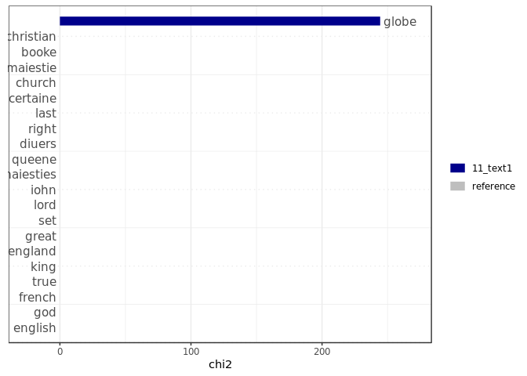

    ## 
    ## Community: 4


    ## 
    ## Community: 5


    ## 
    ## Community: 6


    ## 
    ## Community: 7


    ## 
    ## Community: 8

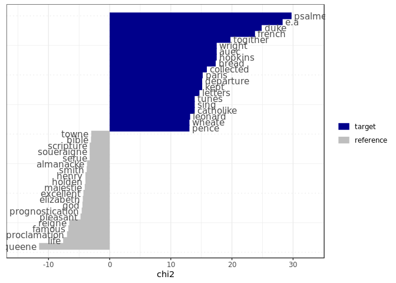

    ## 
    ## Community: 9


    ## 
    ##  1591-1600 
    ## 
    ## 25 top features/tokens
    ## $Community_1
    ##    english     french        god       true       king        set       iohn 
    ##         87         63         61         60         57         52         49 
    ##      booke     diuers       lord  christian      death   certaine containing 
    ##         46         43         43         42         42         42         42 
    ##       last      great    sermons      right     thomas     christ   preached 
    ##         41         40         40         38         38         36         36 
    ##  honorable   treatise      newly     bookes 
    ##         35         33         33         33 
    ## 
    ## $Community_2
    ##    england       holy     taking   question        doo  christian     christ 
    ##          3          3          3          3          3          2          2 
    ##       high      great      earle   certaine christians  honorable       lord 
    ##          2          2          2          2          2          2          2 
    ##     church       true    learned     master      copie      henry      euery 
    ##          2          2          2          2          2          2          2 
    ##       duke       rome     venice     father 
    ##          2          2          2          2 
    ## 
    ## $Community_3
    ##   englands      poets    flowers    moderne  parnassus   choysest   merchant 
    ##          3          2          2          2          2          2          2 
    ##     riuers profitable      times      acted   seruants     diuers  excellent 
    ##          1          1          1          1          1          1          1 
    ##       lord  whereunto   historie    annexed    william  poeticall discourses 
    ##          1          1          1          1          1          1          1 
    ##    towards      vvith       hope     venice 
    ##          1          1          1          1 
    ## 
    ## $Community_4
    ##    english       true     french       king       lord        god       last 
    ##         88         80         78         76         75         65         61 
    ##       iohn      great        set containing    england   certaine  discourse 
    ##         52         50         50         50         46         46         46 
    ##   pleasant      vvith      death  gentleman      right     diuers  christian 
    ##         46         46         45         44         43         43         42 
    ##      booke       life   gathered profitable 
    ##         42         38         38         37 
    ## 
    ## $Community_5
    ##    statutes       booke       newly         set instruments       table 
    ##          16          11           9           9           9           9 
    ##       added      titles       cases      christ     english         new 
    ##           8           8           8           7           7           7 
    ##      thomas   beginning       order description      holden          vn 
    ##           7           7           7           7           7           7 
    ##         god   gentleman        iohn   corrected     william      common 
    ##           6           6           6           6           6           6 
    ##       force 
    ##           6 
    ## 
    ## $Community_6
    ##       queene    maiesties proclamation      queenes       realme        lords 
    ##           66           43           40           29           26           24 
    ##     maiestie       reigne          god     officers      england       places 
    ##           23           23           22           19           18           18 
    ##        peace     iustices    liberties         lord        great       london 
    ##           18           18           18           17           16           16 
    ##       diuers      persons         next        order     statutes    elizabeth 
    ##           16           16           16           15           15           14 
    ##       orders 
    ##           14 
    ## 
    ## $Community_7
    ##     booke   english     newly    thomas       god   psalmes maiesties       set 
    ##        27        25        19        18        17        16        16        16 
    ##     whole      good    others   sundrie    london      iohn   sermons      true 
    ##        16        14        14        13        13        13        13        12 
    ##  together collected discourse      kept    rather      king   allowed    realme 
    ##        12        12        12        12        12        11        11        11 
    ##     bread 
    ##        11 
    ## 
    ## $Community_8
    ##        globe        gores  terrestrial     designed     molyneux         engr 
    ##            1            1            1            1            1            1 
    ##      hondius     treatise   threefolde        state          man      handled 
    ##            1            0            0            0            0            0 
    ##      created    holinesse   innocencie  sinfulnesse        since         fall 
    ##            0            0            0            0            0            0 
    ##         adam      renewed regeneration      psalter      psalmes        dauid 
    ##            0            0            0            0            0            0 
    ##      morning 
    ##            0 
    ## 
    ## 
    ## Community: 1

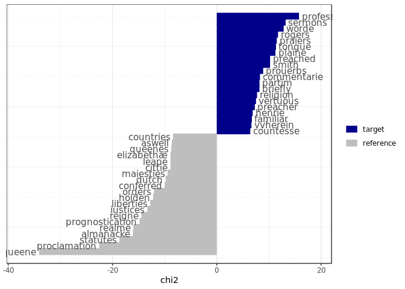

    ## 
    ## Community: 2

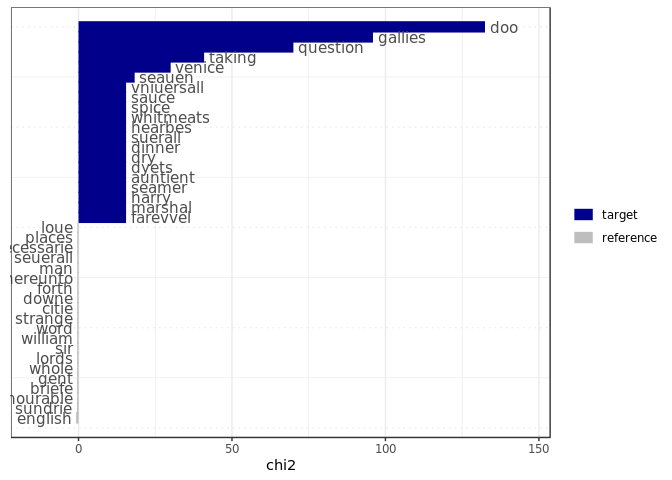

    ## 
    ## Community: 3


    ## 
    ## Community: 4


    ## 
    ## Community: 5


    ## 
    ## Community: 6

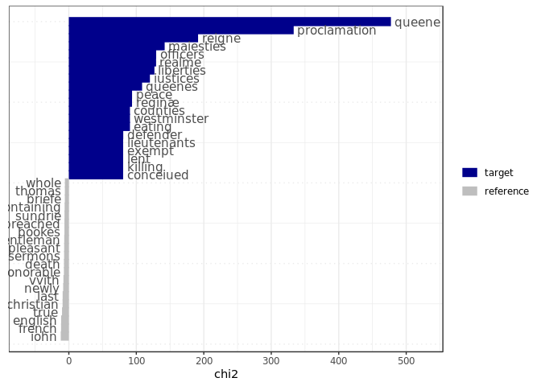

    ## 
    ## Community: 7


    ## 
    ## Community: 8


    ## 
    ##  1596-1605 
    ## 
    ## 25 top features/tokens
    ## $Community_1
    ##       set      true    thomas   english     booke     newly       god    london 
    ##        33        32        31        31        29        26        25        24 
    ##      lord      king maiesties      lute    diuers  together     great discourse 
    ##        22        20        19        18        17        17        16        16 
    ##     parts      iohn excellent   william    rather  composed gentleman     forth 
    ##        16        15        14        14        14        14        14        14 
    ##    church 
    ##        14 
    ## 
    ## $Community_2
    ##    english       true       king        god       iohn     french   preached 
    ##         85         70         62         53         52         49         49 
    ##       lord    sermons   certaine        set     church    england  christian 
    ##         46         45         45         41         41         40         39 
    ## containing        man     sermon      great   treatise       word     christ 
    ##         38         34         34         32         31         31         31 
    ##      right   together   preacher      booke 
    ##         30         30         29         29 
    ## 
    ## $Community_3
    ##       king       true    english        god    england        set       iohn 
    ##         87         79         64         59         53         52         52 
    ##       lord      great     thomas   maiestie     london  maiesties      booke 
    ##         50         48         47         47         43         41         40 
    ## containing     french       last      right      kings      death       time 
    ##         40         39         39         38         36         36         35 
    ##      iames      times   certaine   preached 
    ##         35         34         34         33 
    ## 
    ## $Community_4
    ##            lord         english         england             god       almanacke 
    ##              39              33              32              31              27 
    ##            true        certaine prognostication          french            king 
    ##              25              25              24              23              23 
    ##          london          thomas          diuers       honorable           leape 
    ##              22              21              18              18              17 
    ##           right         present         seruing           vvith          sundry 
    ##              16              16              16              15              14 
    ##           booke         maister       discourse        meridian             set 
    ##              14              14              14              14              13 
    ## 
    ## $Community_5
    ##   englands    flowers    moderne   merchant      poets  parnassus   choysest 
    ##          3          3          2          2          2          2          2 
    ## profitable  excellent    english    william     doctor     diuers      vvith 
    ##          1          1          1          1          1          1          1 
    ##   historie    annexed       lord   phisicke  whereunto      beene      times 
    ##          1          1          1          1          1          1          1 
    ##      acted   seruants    handled  poeticall 
    ##          1          1          1          1 
    ## 
    ## $Community_6
    ##         king      england proclamation       realme    maiesties       queene 
    ##           98           55           51           51           49           49 
    ##          god         lord     maiestie         next      ireland       london 
    ##           47           31           28           28           28           27 
    ##        lords       diuers        great       france      whereas        grace 
    ##           27           25           25           24           23           23 
    ##     officers       places   parliament       reigne         high    liberties 
    ##           23           22           21           21           20           20 
    ##   soueraigne 
    ##           20 
    ## 
    ## $Community_7
    ##    english   statutes     french     diuers        new      added       true 
    ##         23         19         15         15         14         13         12 
    ## necessarie profitable       iohn      booke   certaine       king     master 
    ##         12         11         11         11         11         11         10 
    ## containing      order      euery    shewing     london   generall      table 
    ##         10         10         10         10          9          9          9 
    ##     church    england     titles   gathered 
    ##          9          9          9          9 
    ## 
    ## 
    ## Community: 1

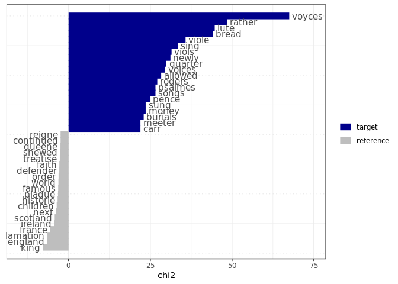

    ## 
    ## Community: 2

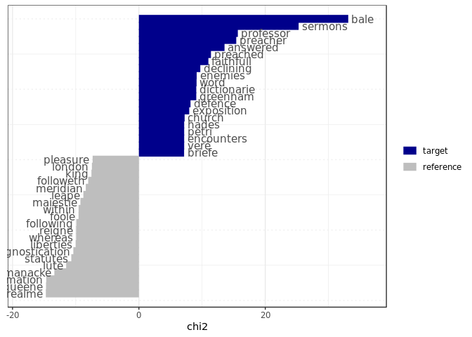

    ## 
    ## Community: 3

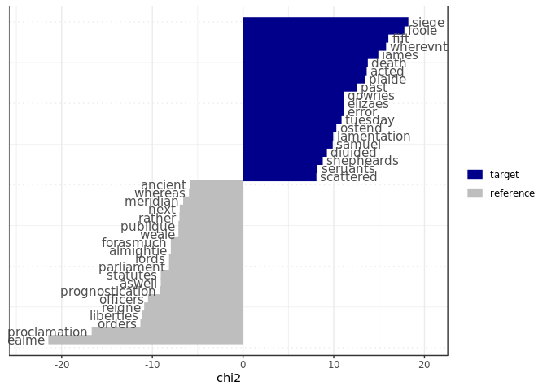

    ## 
    ## Community: 4

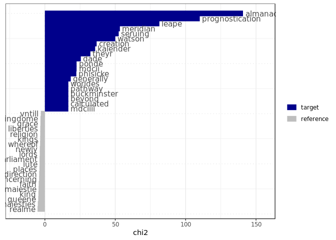

    ## 
    ## Community: 5

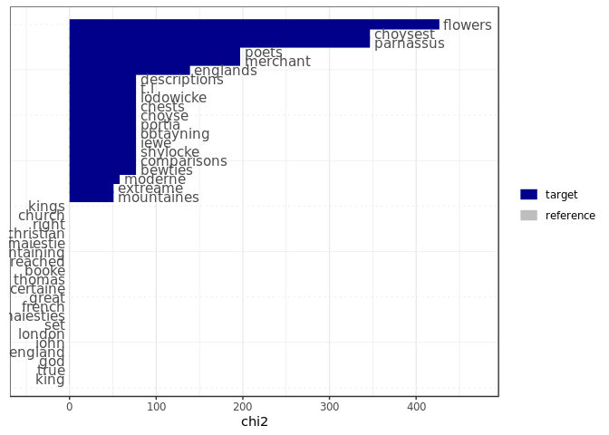

    ## 
    ## Community: 6

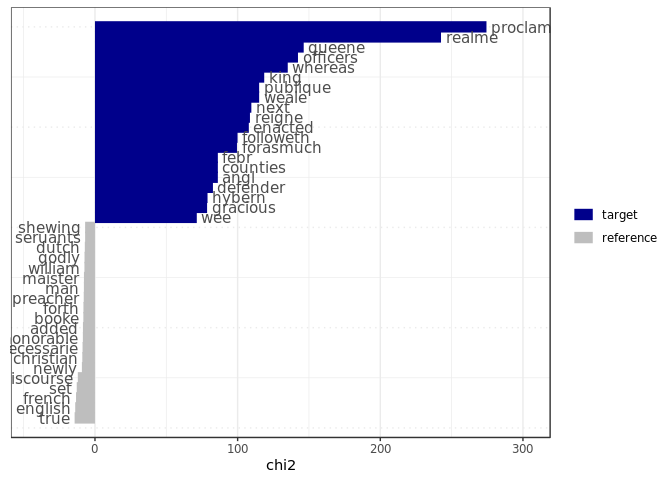

    ## 
    ## Community: 7


    ## 
    ##  1601-1610 
    ## 
    ## 25 top features/tokens
    ## $Community_1
    ##            lord             god           great prognostication          london 
    ##              62              61              47              43              42 
    ##             new             set         england        meridian            true 
    ##              42              41              41              40              38 
    ##       almanacke           leape           booke          thomas            king 
    ##              38              38              35              35              34 
    ##            iohn         english          church        preached        seuerall 
    ##              33              32              31              30              29 
    ##         william          christ       generally            word           whole 
    ##              25              25              25              24              24 
    ## 
    ## $Community_2
    ##         king      england proclamation          god       realme    maiesties 
    ##          167           64           57           53           49           46 
    ##   parliament        kings     maiestie        great         next         lord 
    ##           40           37           36           35           30           29 
    ##        grace      ireland      whereas       london       diuers       france 
    ##           29           29           29           28           28           28 
    ##     scotland     subiects        iames        faith   soueraigne         high 
    ##           25           25           24           24           23           23 
    ##        lords 
    ##           23 
    ## 
    ## $Community_3
    ##   preached        god     sermon       true       king     church       lord 
    ##         70         63         55         53         48         45         42 
    ##  christian       word  diuinitie    english    william    sermons       gods 
    ##         42         41         41         38         35         32         32 
    ##   maiestie   religion       iohn        set     thomas      kings      great 
    ##         30         30         29         29         29         29         29 
    ## concerning   preacher     doctor     crosse 
    ##         29         28         27         27 
    ## 
    ## $Community_4
    ##      king      true   england      iohn     great    church    thomas       god 
    ##        53        47        44        42        41        35        35        34 
    ##   english      last     death       set      life    french    london     kings 
    ##        33        32        32        31        29        28        28        28 
    ##  certaine      lord maiesties  preached christian  maiestie       new     whole 
    ##        25        24        23        23        23        22        22        21 
    ## diuinitie 
    ##        21 
    ## 
    ## $Community_5
    ##        god       true   preached    england       iohn       king    english 
    ##        121        107         97         97         93         86         84 
    ##       lord     church       word     sermon      kings  christian containing 
    ##         82         75         74         72         70         69         66 
    ##    william  maiesties       last     french      great   maiestie        set 
    ##         65         65         65         64         64         61         60 
    ##     thomas     london    sermons   preacher 
    ##         57         56         55         54 
    ## 
    ## $Community_6
    ##   statutes    english      table    england      lawes         vn        law 
    ##         19         11         11         10          9          8          8 
    ##   generall   seuerall        new        sir    matters      cases      added 
    ##          7          7          7          7          7          7          7 
    ##     doctor        vse     tongue      touts  elizabeth principall      order 
    ##          7          6          6          6          6          6          6 
    ##      regis   treatise     church  diuinitie 
    ##          6          5          5          5 
    ## 
    ## 
    ## Community: 1

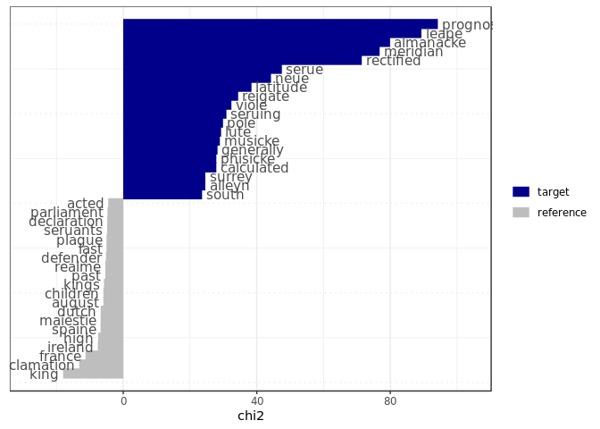

    ## 
    ## Community: 2

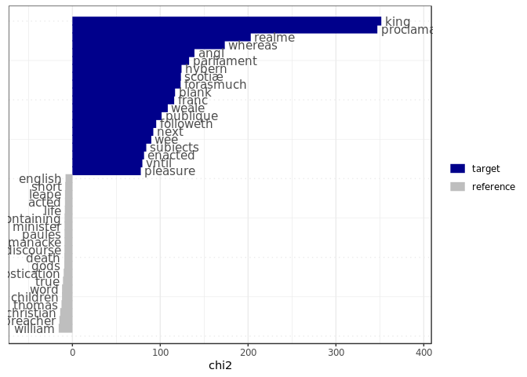

    ## 
    ## Community: 3

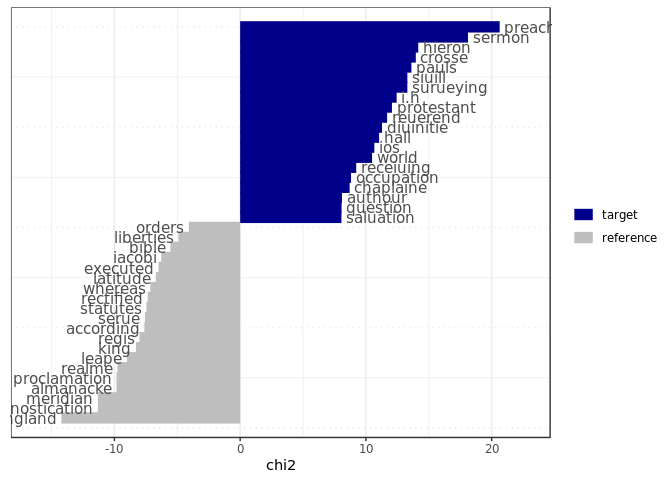

    ## 
    ## Community: 4

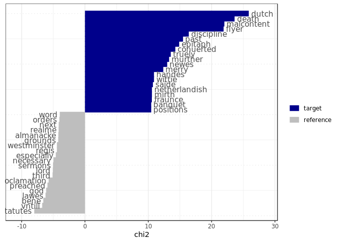

    ## 
    ## Community: 5

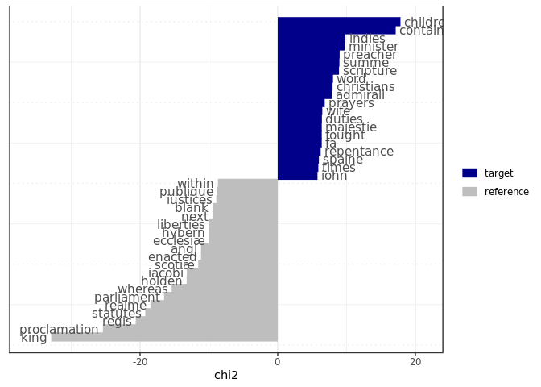

    ## 
    ## Community: 6


    ## 
    ##  1606-1615 
    ## 
    ## 25 top features/tokens
    ## $Community_1
    ##         king proclamation    maiesties          new      england    testament 
    ##          134           67           66           40           37           37 
    ##     speciall        bible translations       former        kings        newly 
    ##           36           31           30           28           27           26 
    ##   parliament     compared     maiestie         holy      ireland   diligently 
    ##           26           25           25           25           24           24 
    ##          god      reuised        blank       within    originall     certaine 
    ##           23           23           22           22           21           21 
    ##        lords 
    ##           21 
    ## 
    ## $Community_2
    ##      true      iohn       god  preached     great    thomas      word christian 
    ##       114       106       106       100        97        90        88        87 
    ##      king      last      lord      gods    church  together   english    prince 
    ##        87        84        79        79        77        77        76        73 
    ##    sermon     death   england       set    london   william       new     kings 
    ##        69        63        62        62        62        62        60        60 
    ##  minister 
    ##        60 
    ## 
    ## $Community_3
    ##     william        iohn    maisters      famous     musicke   dedicated 
    ##           2           1           1           1           1           1 
    ##    composed        euer        bull      louers illustrious     masters 
    ##           1           1           1           1           1           1 
    ##    chappell        byrd     orlando     gibbons    ingrauen   parthenia 
    ##           1           1           1           1           1           1 
    ##  maydenhead  virginalls   gentilmen     ma:ties      musick        hole 
    ##           1           1           1           1           1           1 
    ##    dorethie 
    ##           1 
    ## 
    ## $Community_4
    ##   preached     sermon     church  christian       word       iohn        god 
    ##         97         82         79         68         68         67         66 
    ##       last      great       true     thomas       king       gods      death 
    ##         64         62         61         61         56         55         51 
    ##    sermons      kings    william  diuinitie   together    english containing 
    ##         50         50         50         49         48         45         44 
    ##     prince       life   preacher   minister 
    ##         44         43         42         41 
    ## 
    ## $Community_5
    ##   preached     sermon       word    sermons        god  christian       iohn 
    ##         87         64         61         58         57         57         53 
    ##       last      great       life     church       gods       true   preacher 
    ##         53         52         51         49         49         48         47 
    ##    english  diuinitie     diuers   together     prince  maiesties    william 
    ##         46         45         38         38         38         35         35 
    ##   minister containing      kings       king 
    ##         35         34         32         32 
    ## 
    ## $Community_6
    ##            lord             god           great prognostication       almanacke 
    ##             108              96              90              86              79 
    ##             new        meridian            iohn           leape          london 
    ##              73              70              67              59              53 
    ##         england           serue            king       generally             set 
    ##              49              48              46              44              43 
    ##          thomas          christ         english           booke        together 
    ##              41              40              39              38              37 
    ##           third          famous         seruing          church      containing 
    ##              36              36              36              33              33 
    ## 
    ## $Community_7
    ##     london    england        god       true       last     paules  maiesties 
    ##          3          2          2          2          2          2          2 
    ##    william      popes  woodhouse     papist  discourse       life     sermon 
    ##          2          2          2          2          1          1          1 
    ##   preached        end       iohn      booke      great        new     father 
    ##          1          1          1          1          1          1          1 
    ##   religion     romish   seuerall catholicke 
    ##          1          1          1          1 
    ## 
    ## 
    ## Community: 1


    ## 
    ## Community: 2


    ## 
    ## Community: 3


    ## 
    ## Community: 4

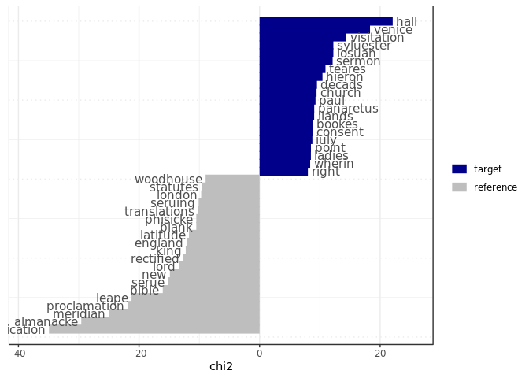

    ## 
    ## Community: 5

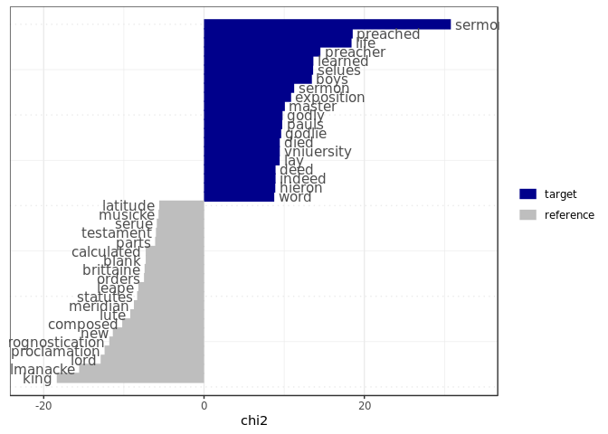

    ## 
    ## Community: 6


    ## 
    ## Community: 7

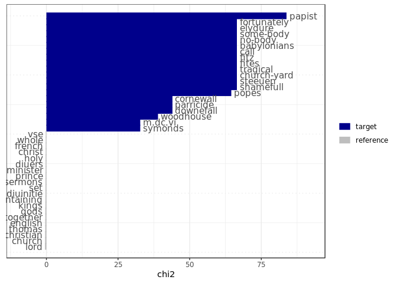

    ## 
    ##  1611-1620 
    ## 
    ## 25 top features/tokens
    ## $Community_1
    ##   preached        god   together       word     sermon      great       gods 
    ##         42         41         37         36         34         34         33 
    ##  maiesties     prince       iohn    sermons  christian      death       king 
    ##         31         29         29         28         27         27         26 
    ## containing     church    english     thomas     christ   preacher       lord 
    ##         26         26         25         24         22         22         21 
    ##  according       good  diuinitie     french 
    ##         21         20         20         20 
    ## 
    ## $Community_2
    ##  preached    sermon     death    church      true      iohn      gods christian 
    ##        45        42        38        38        34        33        33        31 
    ##       god      king      word    thomas     kings      last  together  preacher 
    ##        30        30        29        28        26        26        25        25 
    ##    french      lord   english diuinitie      life maiesties     great     right 
    ##        25        23        22        21        20        20        19        19 
    ##  generall 
    ##        19 
    ## 
    ## $Community_3
    ##     william        iohn      famous    maisters   dedicated     masters 
    ##           2           1           1           1           1           1 
    ## illustrious        euer    composed     musicke    chappell      louers 
    ##           1           1           1           1           1           1 
    ##        bull     orlando     gibbons      musick   parthenia  maydenhead 
    ##           1           1           1           1           1           1 
    ##  virginalls        byrd   gentilmen     ma:ties    ingrauen        hole 
    ##           1           1           1           1           1           1 
    ##    dorethie 
    ##           1 
    ## 
    ## $Community_4
    ##       word   preached       iohn       gods       true  christian        god 
    ##        132        123        121        116        113        106        106 
    ##     sermon     thomas      death      great       king   preacher   together 
    ##         97         95         94         93         92         89         87 
    ##       last       life     church     london     prince        new containing 
    ##         80         77         76         76         74         72         70 
    ##       lord   minister       good    english 
    ##         69         68         66         62 
    ## 
    ## $Community_5
    ##  preached    sermon      word       god  preacher     death      gods   sermons 
    ##       123       100        95        78        75        72        66        65 
    ##      iohn      true    church     great diuinitie      last christian      king 
    ##        60        57        57        56        55        53        52        51 
    ##  minister    thomas   english  together      life      good      lord    doctor 
    ##        51        49        45        44        44        40        39        37 
    ##    prince 
    ##        37 
    ## 
    ## $Community_6
    ##            lord             god prognostication       almanacke           great 
    ##             113             109             107              98              90 
    ##             new        meridian           serue          london            iohn 
    ##              81              76              72              70              60 
    ##       generally       brittaine           leape      calculated             set 
    ##              44              44              44              43              39 
    ##           parts       according      bissextile        latitude          famous 
    ##              37              37              37              35              34 
    ##        composed         english         england     leape-yeare          thomas 
    ##              33              32              32              32              27 
    ## 
    ## $Community_7
    ##         king proclamation    maiesties     maiestie          new    testament 
    ##          130          116          105           57           57           56 
    ##       former     speciall       queene        newly translations   diligently 
    ##           52           51           50           46           46           44 
    ##     compared        bible      reuised         holy      england commandement 
    ##           44           43           42           42           41           40 
    ##   containing       london    originall       realme       within      tongues 
    ##           38           38           36           34           33           33 
    ##        great 
    ##           32 
    ## 
    ## 
    ## Community: 1

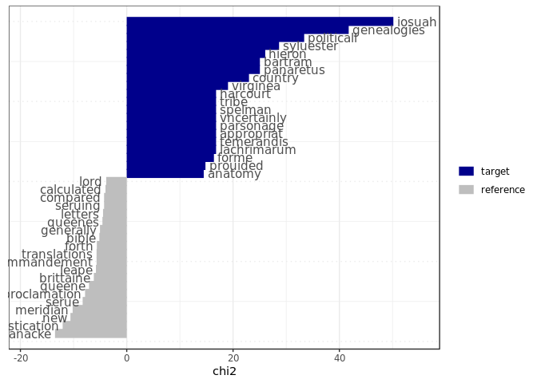

    ## 
    ## Community: 2

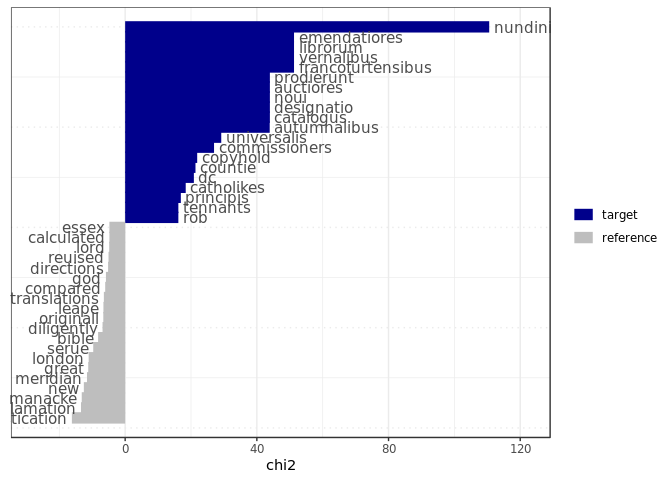

    ## 
    ## Community: 3

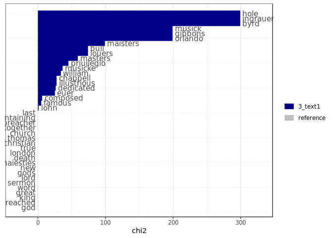

    ## 
    ## Community: 4

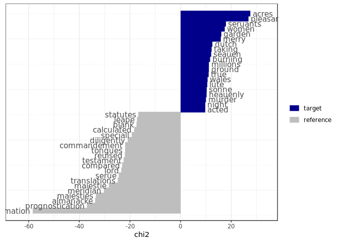

    ## 
    ## Community: 5

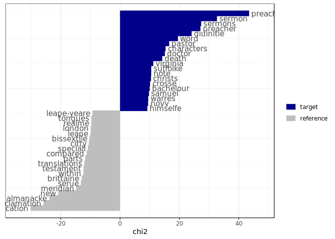

    ## 
    ## Community: 6


    ## 
    ## Community: 7

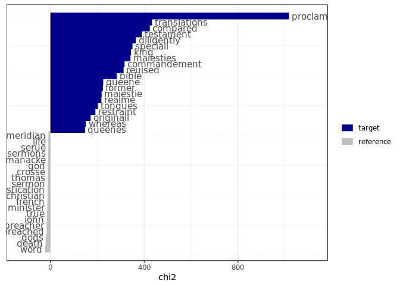

    ## 
    ##  1616-1625 
    ## 
    ## 25 top features/tokens
    ## $Community_1
    ##       king      great       word        god   preached     sermon       last 
    ##        136        127        120        118        118        109        108 
    ##       true      newes       gods   together   preacher     church       duke 
    ##        106        102         98         97         95         93         92 
    ##     diuers     france      count       iohn  christian     prince concerning 
    ##         90         88         85         84         81         81         76 
    ##    present     french containing    english 
    ##         76         74         72         72 
    ## 
    ## $Community_2
    ##   preached       word        god     sermon       gods       iohn      great 
    ##        148        142        129        129        115        113        113 
    ##   preacher       true       king       last   together     church    english 
    ##        107        106        101        100         98         91         81 
    ##       duke   minister       good     diuers        new     prince     london 
    ##         72         71         70         69         68         67         67 
    ##      count containing  christian    sermons 
    ##         67         66         66         66 
    ## 
    ## $Community_3
    ##        new       king      great       true       last       iohn    present 
    ##         74         73         67         66         62         58         54 
    ##     diuers     prince      count   relation      newes      death   betweene 
    ##         48         48         46         44         43         42         42 
    ##       duke        god     london   together    english concerning       good 
    ##         42         41         41         39         38         36         36 
    ##       lord   emperour     church   seuerall 
    ##         36         36         35         35 
    ## 
    ## $Community_4
    ##             god            lord           great             new prognostication 
    ##             208             156             144             141             133 
    ##          london            iohn       almanacke        meridian           serue 
    ##             118             117             115              96              96 
    ##            word        preached      calculated          sermon            gods 
    ##              95              85              79              77              76 
    ##           parts            true         english          church        together 
    ##              75              72              69              68              67 
    ##        preacher      bissextile        minister             set            king 
    ##              66              61              60              59              58 
    ## 
    ## $Community_5
    ##         libri       henrico cantuariensis         lucem        angliæ 
    ##             1             1             1             1             1 
    ##   bibliotheca         nempè         porrò         comes       eadmeri 
    ##             1             1             1             1             1 
    ##       monachi      historiæ       nouorum        sæculi        gestas 
    ##             1             1             1             1             1 
    ##          modò     spectator      diligens         actor     plerunque 
    ##             1             1             1             1             1 
    ##     interfuit    guilielmis       regibus       salutis         mlxvi 
    ##             1             1             1             1             1 
    ## 
    ## $Community_6
    ##         king proclamation    maiesties     maiestie          new       realme 
    ##          206          179          116           63           51           50 
    ##       queene    testament       former      england         lord        newly 
    ##           49           48           48           45           42           42 
    ## commandement     speciall   containing translations   diligently     compared 
    ##           41           41           40           40           40           40 
    ##      reuised         holy       within          god    originall        great 
    ##           39           35           35           34           34           34 
    ##      queenes 
    ##           31 
    ## 
    ## 
    ## Community: 1

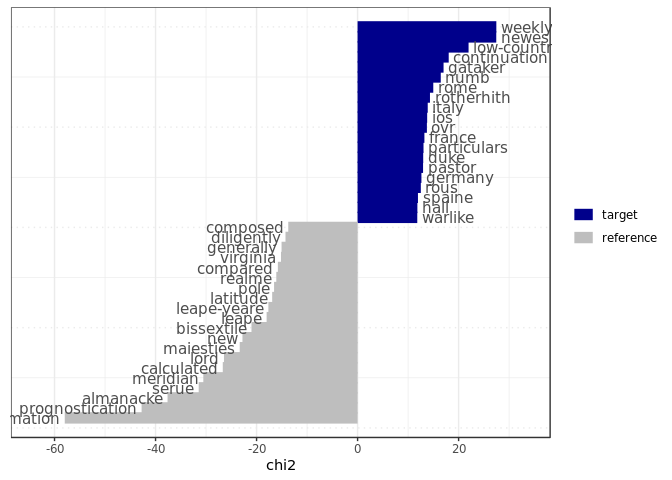

    ## 
    ## Community: 2


    ## 
    ## Community: 3

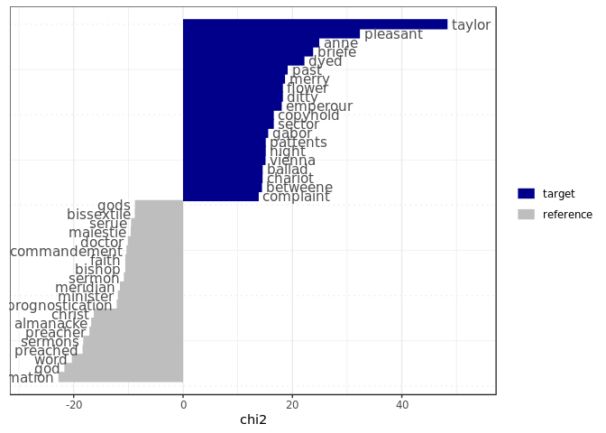

    ## 
    ## Community: 4


    ## 
    ## Community: 5

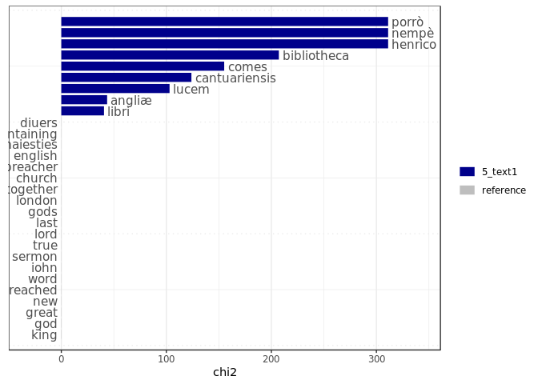

    ## 
    ## Community: 6

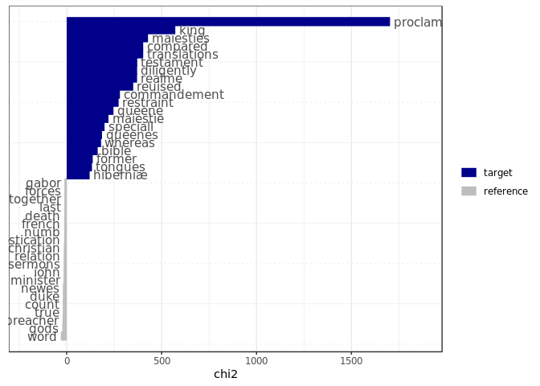

    ## 
    ##  1621-1630 
    ## 
    ## 25 top features/tokens
    ## $Community_1
    ##       iohn     sermon   preached        god       word       king       true 
    ##         56         54         51         50         43         40         40 
    ##     church      great       gods        new   preacher   together       last 
    ##         39         38         38         38         37         37         31 
    ##    present     diuers   seuerall    william    england      faith containing 
    ##         30         29         29         28         28         28         27 
    ##        vse   minister      count   treatise 
    ##         27         27         27         26 
    ## 
    ## $Community_10
    ##      iohn  preached    sermon       god      king      true    london     great 
    ##        54        50        45        38        38        38        32        27 
    ##      gods       new     right    church      lord      word  seuerall     pauls 
    ##        27        27        26        26        25        25        25        24 
    ##   english maiesties    french  religion   sermons  preacher      good     kings 
    ##        24        22        22        21        21        20        20        20 
    ##     death 
    ##        19 
    ## 
    ## $Community_2
    ##           times        saluedoe       collected       excellent        preached 
    ##               2               2               1               1               1 
    ##       necessary            good         sermons          common     euerlasting 
    ##               1               1               1               1               1 
    ## prognostication          change         weather        compiled             vse 
    ##               1               1               1               1               1 
    ##          profit        countrey           kinki       abenezrah        wandring 
    ##               1               1               1               1               1 
    ##             iew            true            time      especially          oxford 
    ##               1               1               1               1               1 
    ## 
    ## $Community_3
    ##         king proclamation    maiesties     speciall       former          new 
    ##          325          264          126           57           56           53 
    ##    testament        newly     compared commandement          god         lord 
    ##           52           50           49           49           48           48 
    ##      england      reuised   diligently translations    originall     maiestie 
    ##           48           48           48           48           44           40 
    ##         holy        bible   containing       realme          old   parliament 
    ##           39           37           37           37           35           35 
    ##     subiects 
    ##           35 
    ## 
    ## $Community_4
    ##             god            lord             new prognostication       almanacke 
    ##             186             155             152             145             129 
    ##           great          london        meridian            iohn           serue 
    ##             118             115             108             106              91 
    ##      calculated      bissextile           parts           leape          church 
    ##              86              83              73              72              68 
    ##         english            pole        preached          sermon           citie 
    ##              66              66              59              58              57 
    ##            true        composed        latitude        britaine          famous 
    ##              55              55              52              51              50 
    ## 
    ## $Community_5
    ##   church      god preached   sermon     word     iohn     gods   london 
    ##       60       53       52       44       42       40       35       33 
    ##     true preacher minister     lord  sermons  english together   christ 
    ##       33       32       32       26       25       24       23       22 
    ##   master    great      new     holy  england  learned   robert    faith 
    ##       22       21       21       20       19       19       18       18 
    ##     time 
    ##       18 
    ## 
    ## $Community_6
    ##        newes         king        great       diuers         duke         last 
    ##          108          102           80           78           76           75 
    ##        count         numb  particulars       lately       prince      present 
    ##           73           62           59           58           58           57 
    ##       france     together  proceedings continuation   containing       forces 
    ##           57           55           51           48           46           46 
    ##         true     preached       sermon   concerning     seuerall     emperour 
    ##           45           44           43           43           43           43 
    ##         iohn 
    ##           40 
    ## 
    ## $Community_7
    ##       king      great      newes       true       last        god     diuers 
    ##        178        156        135        124        119        114        113 
    ##        new       duke     sermon       iohn   preached      count   together 
    ##        109        109        104        104        103        102         98 
    ##    english     prince     france       word   seuerall containing     church 
    ##         94         93         92         91         89         88         88 
    ##   relation     lately       gods    present 
    ##         87         84         83         80 
    ## 
    ## $Community_8
    ##        duos      primus  querimonia      europæ      diuisa      libros 
    ##           1           1           1           1           1           1 
    ##        exit     history       bible     briefly   collected    question 
    ##           1           0           0           0           0           0 
    ##     answere   excellent     oration    renowned      orator demosthenes 
    ##           0           0           0           0           0           0 
    ##      philip     macedon      potent   politicke       enemy       state 
    ##           0           0           0           0           0           0 
    ##      athens 
    ##           0 
    ## 
    ## $Community_9
    ##         new    pleasant       great        king    betweene        lord 
    ##          82          43          38          37          28          26 
    ##        iohn      diuers        last      prince     present        true 
    ##          26          26          24          24          23          22 
    ##      france    relation       newes        duke   excellent         god 
    ##          22          22          22          22          21          21 
    ##       gabor  concerning       count       death   christian        good 
    ##          21          20          20          19          18          18 
    ## proceedings 
    ##          17 
    ## 
    ## 
    ## Community: 1


    ## 
    ## Community: 2


    ## 
    ## Community: 3

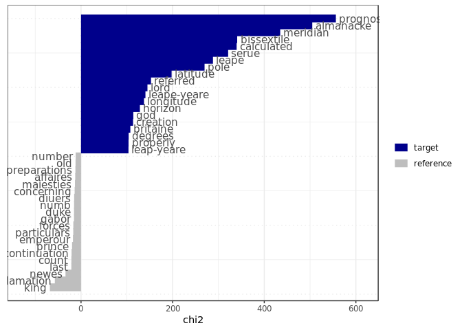

    ## 
    ## Community: 4

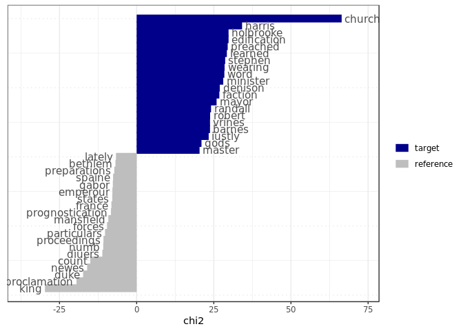

    ## 
    ## Community: 5

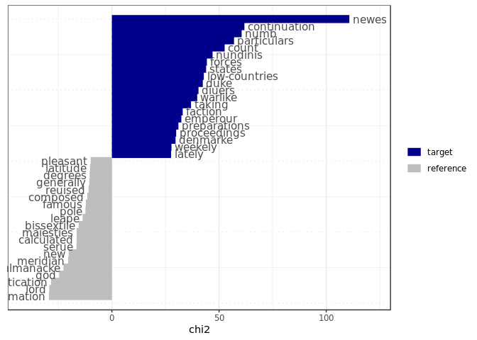

    ## 
    ## Community: 6

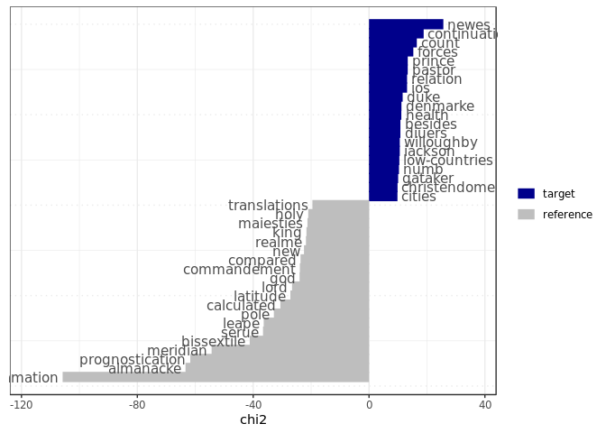

    ## 
    ## Community: 7

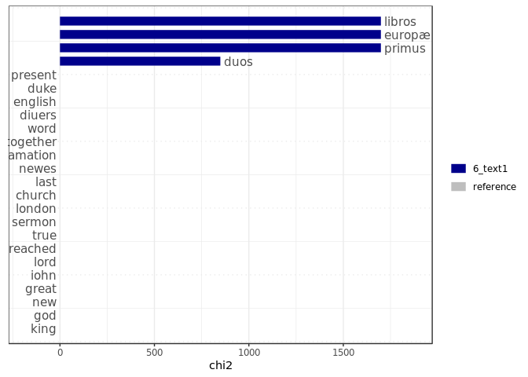

    ## 
    ## Community: 8

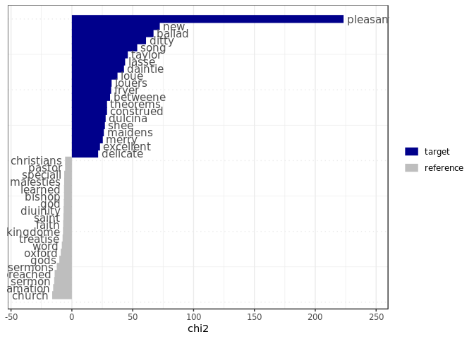

    ## 
    ## Community: 9

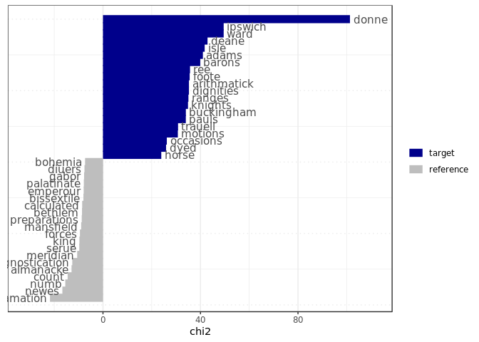

    ## 
    ## Community: 10

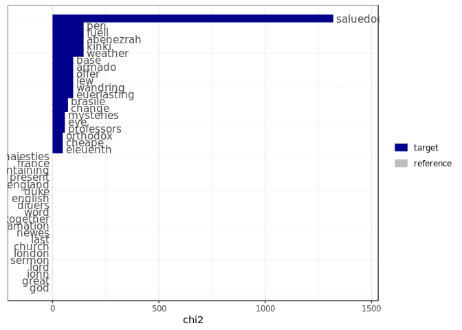

    ## 
    ##  1626-1635 
    ## 
    ## 25 top features/tokens
    ## $Community_1
    ##         king proclamation    maiesties     speciall       former    testament 
    ##          289          250          137           81           80           76 
    ##     compared   diligently translations commandement        newly         holy 
    ##           74           72           71           71           70           70 
    ##    originall      reuised        bible          new      tongues          old 
    ##           66           63           63           61           58           57 
    ##   containing    appointed      england     churches         lord   concerning 
    ##           54           54           45           45           38           38 
    ##         read 
    ##           38 
    ## 
    ## $Community_2
    ##             god             new            lord prognostication       almanacke 
    ##             145             140             139             131             120 
    ##           great        meridian          london            iohn           leape 
    ##             111             107             105              90              90 
    ##           serue      bissextile      calculated        preached        britaine 
    ##              77              77              70              68              67 
    ##            pole           parts          sermon           citie          church 
    ##              65              61              57              56              55 
    ##         ancient         english           third        latitude            city 
    ##              55              51              48              48              46 
    ## 
    ## $Community_3
    ##        kings       london      present     maiestie      company     generall 
    ##            1            1            1            1            1            1 
    ##       parish    according    excellent     december       report         bill 
    ##            1            1            1            1            1            1 
    ##       ending      clearks         king proclamation       better     ordering 
    ##            1            1            0            0            0            0 
    ##      repaire        court         cure      disease       called        euill 
    ##            0            0            0            0            0            0 
    ##  prohibiting 
    ##            0 
    ## 
    ## $Community_4
    ##       new      iohn   english      king  preached      true    church    sermon 
    ##        86        80        60        52        52        51        49        47 
    ##    london     great      lord       god  together      good maiesties       man 
    ##        46        45        45        44        42        42        40        40 
    ##     right  pleasant christian      word     death     kings    french      gods 
    ##        39        39        37        37        37        36        36        36 
    ##      life 
    ##        35 
    ## 
    ## $Community_5
    ##         king         iohn        great       sweden     preached          new 
    ##          235          119          114          108          106          105 
    ##          god     together       sermon        since         gods   containing 
    ##          101           95           93           92           90           88 
    ##         true      present   concerning         word         good       church 
    ##           88           85           82           82           81           80 
    ##       french      english         numb      sermons         duke         lord 
    ##           78           77           76           75           74           73 
    ## continuation 
    ##           72 
    ## 
    ## $Community_6
    ##         quinque  remonstrantium         auctore       argumenta       guilielmo 
    ##               1               1               1               1               1 
    ##         coronis     collationem       hagiensem        pastorum       hollandiæ 
    ##               1               1               1               1               1 
    ##       articulos          divinâ prædestinatione       capitibus         adnexis 
    ##               1               1               1               1               1 
    ##        producta   exceptionibus     vindicantur          amesio            king 
    ##               1               1               1               1               0 
    ##    proclamation          better        ordering         repaire           court 
    ##               0               0               0               0               0 
    ## 
    ## $Community_7
    ##         king       sweden         numb        great        since      present 
    ##          173          103           78           76           76           71 
    ## continuation        newes       taking   concerning       church         duke 
    ##           70           58           55           54           54           54 
    ##       french     generall     together         iohn  particulars      sermons 
    ##           53           52           51           49           49           48 
    ##     preached     passages       lately     preacher      avisoes          god 
    ##           48           46           45           45           45           44 
    ##         last 
    ##           44 
    ## 
    ## $Community_8
    ##          nundinis      autumnalibus               i.c           comitis 
    ##                 2                 2                 2                 2 
    ##         catalogus francofurtensibus        designatio          librorum 
    ##                 1                 1                 1                 1 
    ##              noui      emendatiores         auctiores        prodierunt 
    ##                 1                 1                 1                 1 
    ##       vniversalis         mdcxxviii            angliæ         auspicijs 
    ##                 1                 1                 1                 1 
    ##             thomæ             iuris           selectæ               quæ 
    ##                 1                 1                 1                 1 
    ##             liber              iure           ioannis           seldeni 
    ##                 1                 1                 1                 1 
    ##    successionibus 
    ##                 1 
    ## 
    ## 
    ## Community: 1

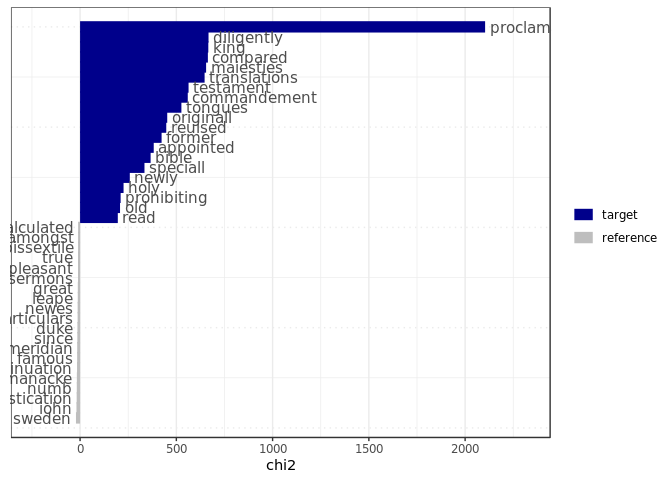

    ## 
    ## Community: 2


    ## 
    ## Community: 3

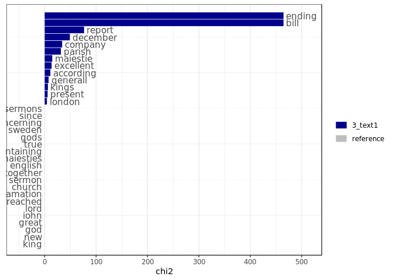

    ## 
    ## Community: 4

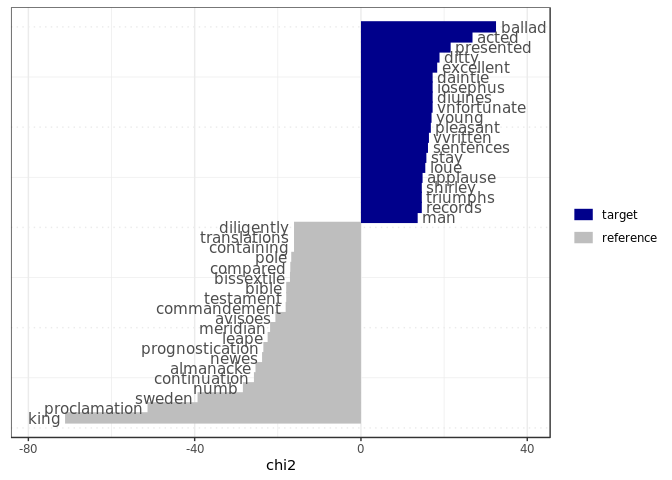

    ## 
    ## Community: 5


    ## 
    ## Community: 6


    ## 
    ## Community: 7

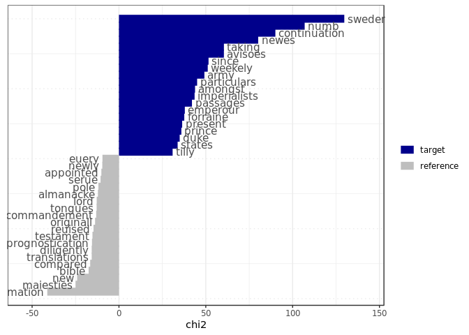

    ## 
    ## Community: 8


    ## 
    ##  1631-1640 
    ## 
    ## 25 top features/tokens
    ## $Community_1
    ##         king proclamation    maiesties          new     speciall       former 
    ##          235          220          100           98           87           82 
    ##    testament        newly     compared         holy   diligently translations 
    ##           81           79           77           77           76           75 
    ##        bible   containing    originall          old    majesties      tongues 
    ##           72           72           65           65           61           61 
    ## commandement         read    appointed     churches   concerning      reuised 
    ##           58           57           56           50           45           40 
    ##       london 
    ##           37 
    ## 
    ## $Community_2
    ##   statutes      cases        use      table   together     titles collection 
    ##         10          7          6          5          4          4          4 
    ##       inne expressing    margent references  materiall     places    persons 
    ##          4          4          4          4          4          3          3 
    ##    english    esquire      books        vse  necessary   branches      notes 
    ##          3          3          3          3          3          3          3 
    ##      whole   hereunto    annexed  lincolnes 
    ##          3          3          3          3 
    ## 
    ## $Community_3
    ##            lord             god           great             new prognostication 
    ##             135             135             120             119             108 
    ##        meridian          london            iohn       almanacke      bissextile 
    ##             101              98              86              79              72 
    ##        preached         english           leape      calculated           parts 
    ##              69              68              65              63              60 
    ##        britaine          church          sermon            city          christ 
    ##              59              56              49              49              48 
    ##           third        together            gods         ancient            true 
    ##              47              46              46              46              46 
    ## 
    ## $Community_4
    ##        god    english        new       lord      great       good   severall 
    ##         83         80         73         71         71         67         65 
    ##       iohn       king     london   together   preached       true  majesties 
    ##         65         64         63         62         60         60         56 
    ##     sermon       last    sermons      acted     thomas  christian       gent 
    ##         56         56         56         52         50         49         47 
    ##     famous     church concerning     french 
    ##         46         45         44         44 
    ## 
    ## $Community_5
    ##       king       numb   preached      great     sweden      since    sermons 
    ##        167        107        104         96         96         89         88 
    ##        god       gods    present     church   together        new       iohn 
    ##         87         84         77         75         75         74         74 
    ##     london   preacher     sermon       last       lord   severall       true 
    ##         72         70         67         66         65         65         65 
    ## concerning     divers    english     french 
    ##         64         62         62         61 
    ## 
    ## $Community_6
    ##       iohn   preacher   preached        god    sermons    english       gods 
    ##         71         58         57         54         54         50         48 
    ##     sermon       lord        new  cambridge     divers   colledge     master 
    ##         47         46         45         41         40         39         39 
    ##     london containing     sundry     christ       good   together     divine 
    ##         38         38         38         37         37         37         37 
    ##     church   treatise       life      great 
    ##         35         34         33         32 
    ## 
    ## 
    ## Community: 1

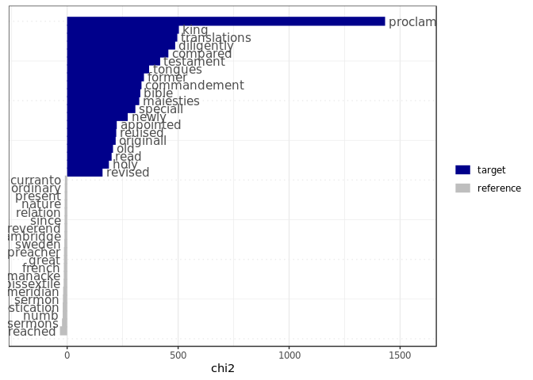

    ## 
    ## Community: 2

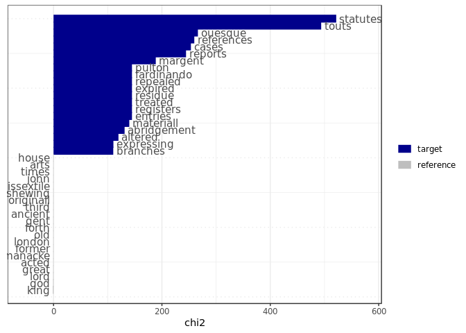

    ## 
    ## Community: 3

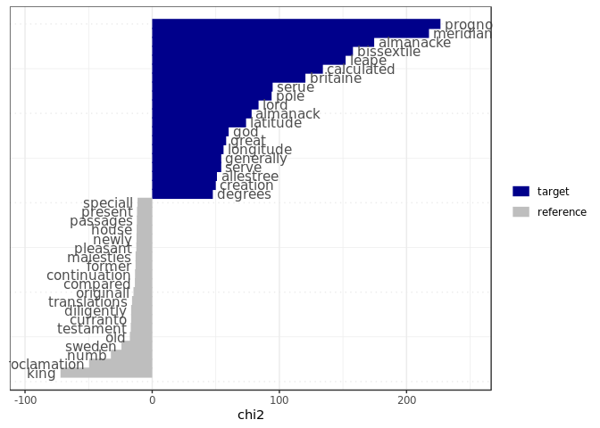

    ## 
    ## Community: 4

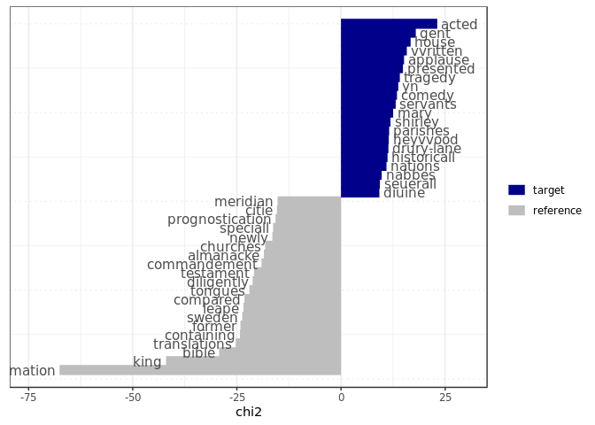

    ## 
    ## Community: 5


    ## 
    ## Community: 6


    ## 
    ##  1636-1645 
    ## 
    ## 25 top features/tokens
    ## $Community_1
    ##  parliament     commons   majesties  concerning       lords       house 
    ##        1165         634         563         494         444         442 
    ##        lord         sir        true      houses        king        sent 
    ##         424         406         388         386         379         365 
    ## declaration      letter    petition     ireland    relation      london 
    ##         335         317         299         284         283         282 
    ##       great       kings     england      answer    kingdome    together 
    ##         257         254         250         244         239         238 
    ##       earle 
    ##         238 
    ## 
    ## $Community_2
    ## parliament      house    commons       lord        god     london   preached 
    ##        324        308        241        235        233        233        212 
    ##     sermon      great     church honourable       john       true        new 
    ##        210        198        191        183        179        170        163 
    ##    england   together      order      lords       iohn concerning       gods 
    ##        156        155        153        153        151        149        145 
    ##   severall   minister     christ    english 
    ##        132        131        129        121 
    ## 
    ## $Community_3
    ## parliament       lord      house    commons concerning     london        god 
    ##        588        396        356        351        345        339        298 
    ##       true      great honourable      lords     church    england   together 
    ##        287        277        270        252        249        234        226 
    ##   relation     sermon  majesties       king   preached   severall       sent 
    ##        225        217        217        209        208        206        205 
    ##     letter        sir      order       john 
    ##        203        196        195        192 
    ## 
    ## $Community_4
    ##  parliament     commons       lords   assembled     ordered        cler 
    ##        2140        1555        1174         901         691         673 
    ##   ordinance  concerning       house   forthwith declaration         sir 
    ##         614         600         577         568         487         487 
    ##        parl      houses        lord      letter   majesties         die 
    ##         457         442         430         430         418         417 
    ##        sent         com      london      county    severall    together 
    ##         389         388         372         359         336         327 
    ##        true 
    ##         312 
    ## 
    ## $Community_5
    ##        king   roundhead        true        life     england       times 
    ##           6           6           5           4           3           3 
    ##      london  parliament    generall     shewing    subjects   necessary 
    ##           3           3           3           3           3           3 
    ##        lord       great declaration     ireland  cathedrall      church 
    ##           2           2           2           2           2           2 
    ##   marquesse     answers       since    relation      letter       peace 
    ##           2           2           2           2           2           2 
    ##      manner 
    ##           2 
    ## 
    ## $Community_6
    ##        sent      letter  parliament       hague       kings     majesty 
    ##           3           3           3           3           2           2 
    ##        ship     holland       great      prince declaration      divers 
    ##           2           2           1           1           1           1 
    ##        hand      london       copie      houses       march     actions 
    ##           1           1           1           1           1           1 
    ##    petition   gentlemen     letters      safety   maiesties   majesties 
    ##           1           1           1           1           1           1 
    ##     message 
    ##           1 
    ## 
    ## $Community_7
    ##     commons       house  parliament      county      christ   assembled 
    ##           7           6           6           6           5           5 
    ##       lords  honourable      saints      london    petition      humble 
    ##           5           5           5           4           4           4 
    ##        true     richard    together   liberties     knights inhabitants 
    ##           4           3           3           3           3           3 
    ##    churches       glory      within       right      thomas       great 
    ##           3           3           2           2           2           2 
    ##     present 
    ##           2 
    ## 
    ## $Community_8
    ##      english         noli      tangere         lord      present    according 
    ##            2            2            2            1            1            1 
    ##        order    discourse satisfaction        sacræ       london       letter 
    ##            1            1            1            1            1            1 
    ##      private         june       thence  apparitions     counties    kingdomes 
    ##            1            1            1            1            1            1 
    ##         copy        neere     affaires     vvritten       either         john 
    ##            1            1            1            1            1            1 
    ##         iuly 
    ##            1 
    ## 
    ## 
    ## Community: 1

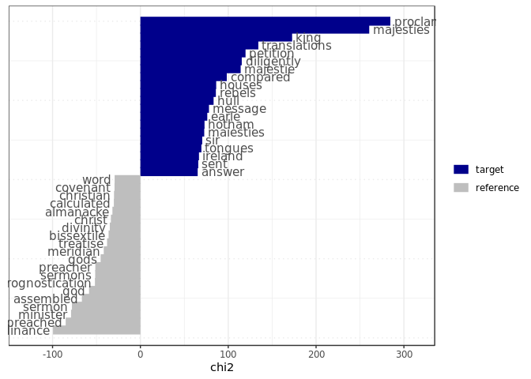

    ## 
    ## Community: 2


    ## 
    ## Community: 3

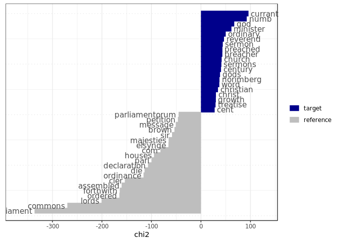

    ## 
    ## Community: 4


    ## 
    ## Community: 5

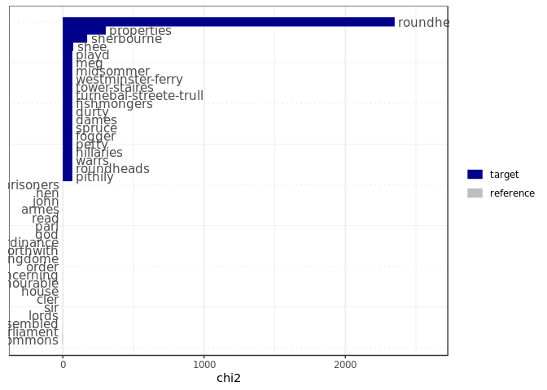

    ## 
    ## Community: 6

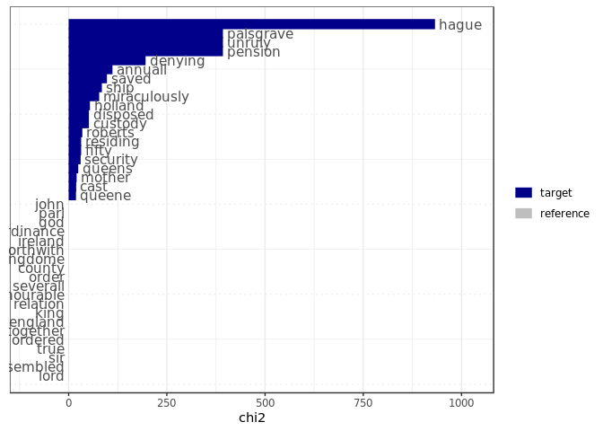

    ## 
    ## Community: 7


    ## 
    ## Community: 8

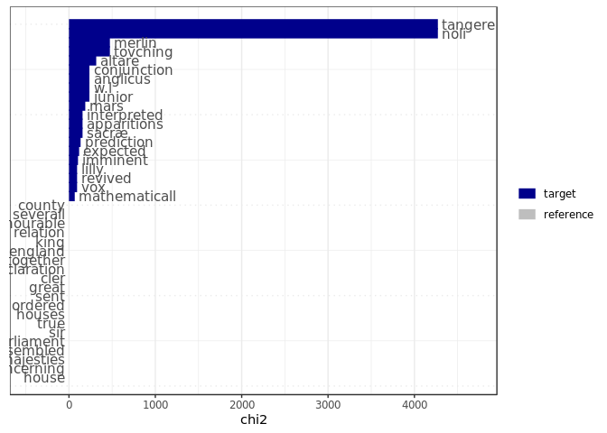

    ## 
    ##  1641-1650 
    ## 
    ## 25 top features/tokens
    ## $Community_1
    ##         house    parliament       commons    honourable      minister 
    ##            23            22            21            20            20 
    ##          gods        sermon      preached         essex        london 
    ##            18            18            16            16            16 
    ##      marshall          word       stephen          fast         order 
    ##            15            13            13            11            10 
    ##    concerning      kingdome   westminster         right     majesties 
    ##            10            10            10            10            10 
    ##         times finchingfield          army        houses         lords 
    ##             9             9             9             9             9 
    ## 
    ## $Community_10
    ##  parliament     commons  concerning        lord   majesties         sir 
    ##        1937         893         873         752         702         643 
    ##       house declaration       lords     england      london      letter 
    ##         606         591         581         542         542         538 
    ##        true        sent      houses        king       great        army 
    ##         510         503         499         498         466         431 
    ##     ireland    together      answer    relation       kings    kingdome 
    ##         423         416         413         399         395         374 
    ##     ordered 
    ##         364 
    ## 
    ## $Community_11
    ##  parliament     commons       lords   assembled     ordered  concerning 
    ##        3207        2152        1585        1539        1042         915 
    ##        cler   forthwith   ordinance         die       house         sir 
    ##         888         883         855         814         710         673 
    ##        lord declaration      letter     england      london        parl 
    ##         663         663         601         582         572         555 
    ##      houses   majesties        sent         com    severall    together 
    ##         529         510         498         483         479         458 
    ##       great 
    ##         423 
    ## 
    ## $Community_12
    ##       king  roundhead       true parliament    england      times   subjects 
    ##          6          6          5          3          3          3          3 
    ##    shewing  necessary   generall   vvherein     church      great       life 
    ##          3          3          3          2          2          2          2 
    ##  dangerous      peace     manner     london      henry     houses   relation 
    ##          2          2          2          2          2          2          2 
    ##      since     letter       lord      kings 
    ##          2          2          2          2 
    ## 
    ## $Community_2
    ##   parliament       letter         sent        hague      holland        kings 
    ##            3            3            3            3            2            2 
    ##      majesty         ship miraculously     petition        great    gentlemen 
    ##            2            2            1            1            1            1 
    ##       divers       london        henry       houses    excellent    kingdomes 
    ##            1            1            1            1            1            1 
    ##        march       queene      letters          dom       others        armes 
    ##            1            1            1            1            1            1 
    ##   commanders 
    ##            1 
    ## 
    ## $Community_3
    ##         king    according     scotland        order        peace   concerning 
    ##            1            1            1            1            1            1 
    ##         lord propositions         sent    faithfull         hand   chancellor 
    ##            1            1            1            1            1            1 
    ##       speech    newcastle         jvly       thence     summarie        short 
    ##            1            1            1            1            0            0 
    ##       survey      annalls   remarkable      records      charles       reigne 
    ##            0            0            0            0            0            0 
    ##      present 
    ##            0 
    ## 
    ## $Community_4
    ##       english          noli       tangere          pond       present 
    ##             2             2             2             2             1 
    ##     according    imprimatur         thing         order          june 
    ##             1             1             1             1             1 
    ##     discourse        london          john        friend     kingdomes 
    ##             1             1             1             1             1 
    ##          give  satisfaction        letter          lord        thomas 
    ##             1             1             1             1             1 
    ##        nature       private common-wealth          copy        thence 
    ##             1             1             1             1             1 
    ## 
    ## $Community_5
    ##   parliament      ireland   concerning        lords      commons      england 
    ##           12           11           10            9            8            8 
    ##      present   honourable        great    presented     kingdome      kingdom 
    ##            6            6            6            6            6            5 
    ##        house       divers       master     passages    majesties  declaration 
    ##            5            5            5            5            5            5 
    ##        synod    assembled       answer     churches       london propositions 
    ##            5            4            4            4            4            4 
    ##      majesty 
    ##            4 
    ## 
    ## $Community_6
    ##         scots       england          king      covenant        people 
    ##             4             3             2             2             2 
    ##        tinker      borialis       kingdom    parliament     according 
    ##             2             2             1             1             1 
    ## commissioners      assembly         order       willing          help 
    ##             1             1             1             1             1 
    ##          mend        honest          work       english         guard 
    ##             1             1             1             1             1 
    ##     countries           viz    concerning        london          army 
    ##             1             1             1             1             1 
    ## 
    ## $Community_7
    ##       lord concerning      yorke      earle       hull       true      towne 
    ##          9          8          8          6          6          5          5 
    ##       iuly   severall        viz     county       marq       king parliament 
    ##          5          4          4          4          4          3          3 
    ##        sir      since     letter     within       sent  maiesties     nevves 
    ##          3          3          3          3          3          3          3 
    ##       iune     london    warwick     master 
    ##          3          2          2          2 
    ## 
    ## $Community_8
    ## parliament    commons concerning    england      house   together     church 
    ##        356        200        196        175        163        161        158 
    ##   scotland       lord     sermon     london        god       john   generall 
    ##        155        155        147        147        132        127        124 
    ##      right      lords   preached       king honourable   severall     christ 
    ##        117        116        115        112        111        108        103 
    ##  assembled   assembly        sir  majesties 
    ##        101        101         99         99 
    ## 
    ## $Community_9
    ## parliament      house    commons     london       lord concerning        god 
    ##        972        638        630        529        523        511        438 
    ## honourable       john    england      great      lords       true   together 
    ##        417        417        413        405        399        391        380 
    ##     church      order     christ     sermon        sir     letter      right 
    ##        372        362        345        339        337        317        315 
    ##   preached   severall   relation   kingdome 
    ##        307        301        284        281 
    ## 
    ## 
    ## Community: 1

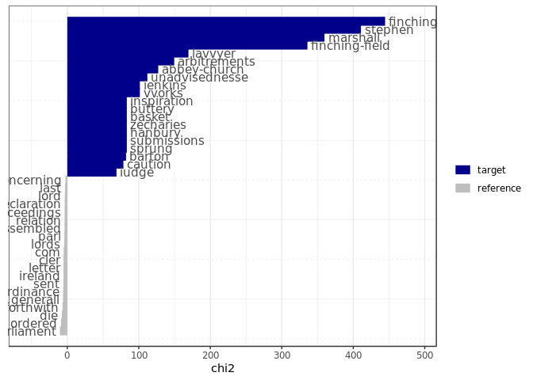

    ## 
    ## Community: 2


    ## 
    ## Community: 3


    ## 
    ## Community: 4


    ## 
    ## Community: 5


    ## 
    ## Community: 6


    ## 
    ## Community: 7

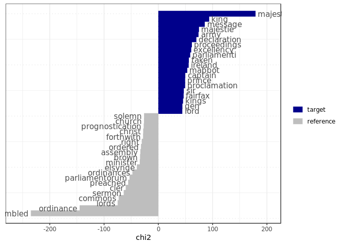

    ## 
    ## Community: 8

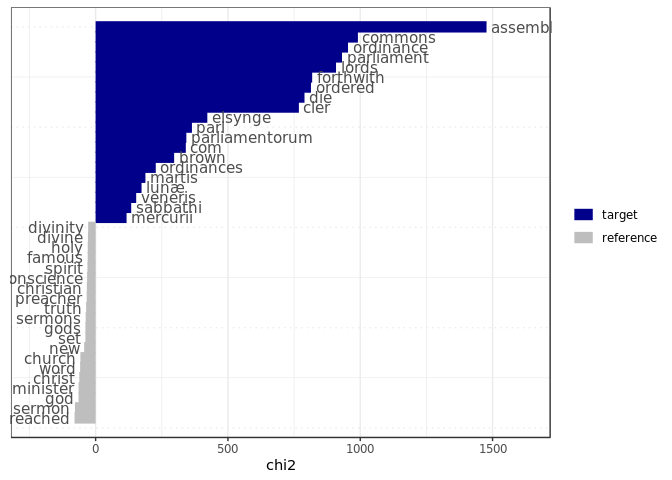

    ## 
    ## Community: 9


    ## 
    ## Community: 10


    ## 
    ## Community: 11


    ## 
    ## Community: 12


    ## 
    ##  1646-1655 
    ## 
    ## 25 top features/tokens
    ## $Community_1
    ## parliament concerning     christ       john   minister        god     london 
    ##        165        156        154        153        148        144        143 
    ##    england   together     sermon       lord     church      great   severall 
    ##        127        126        121        118        115        111        109 
    ##   preached     thomas        new     gospel    william        sir  according 
    ##        108        104        103        101         96         93         92 
    ##      right      times       true      order 
    ##         90         85         84         79 
    ## 
    ## $Community_10
    ##  parliament         act        lord     england     ordered   forthwith 
    ##         463         462         283         225         221         207 
    ##         god      christ     scobell         hen        john      people 
    ##         204         195         195         173         152         142 
    ##      cleric         die parliamenti    together  concerning     council 
    ##         142         138         136         134         133         128 
    ##      answer        true     several       truth declaration       forth 
    ##         125         124         119         114         107         102 
    ##      called 
    ##         101 
    ## 
    ## $Community_11
    ##      elect      world      great   treatise        god    several      jesus 
    ##          3          2          2          2          2          2          2 
    ##       true       last        man   personal        set concerning       john 
    ##          2          2          2          2          1          1          1 
    ##     saints      power    visible       near  messenger       holy       love 
    ##          1          1          1          1          1          1          1 
    ##      glory  following containing     desire 
    ##          1          1          1          1 
    ## 
    ## $Community_12
    ##       john    england parliament        god       lord     christ   together 
    ##        174        140        134        130        128        127        124 
    ## concerning     london     sermon      great    english   severall        new 
    ##        122        121        113        112        108        103        102 
    ##      right   preached       true     church       king   minister     thomas 
    ##         99         97         95         91         85         84         81 
    ##     divine     answer  christian  according 
    ##         79         75         70         69 
    ## 
    ## $Community_13
    ##     london    england       lord concerning parliament     christ       john 
    ##        263        245        244        217        215        214        198 
    ##        god      great   together        new    william       king       city 
    ##        198        192        186        179        141        133        129 
    ##   minister     sermon   generall    english     church    present       true 
    ##        128        125        123        121        121        117        115 
    ##      right     thomas     gospel   severall 
    ##        113        112        111        106 
    ## 
    ## $Community_2
    ##  parliament     commons   assembled     england  concerning        lord 
    ##        1524         805         721         578         565         555 
    ##       lords      london         die     ordered        army       great 
    ##         527         440         440         411         392         385 
    ## declaration   forthwith         act        king    together      letter 
    ##         372         371         369         362         354         353 
    ##         sir        city   ordinance       house        john        cler 
    ##         335         314         306         291         279         264 
    ##       taken 
    ##         262 
    ## 
    ## $Community_3
    ## parliament        god concerning      great    england       john   together 
    ##        169        146        142        136        129        129        122 
    ##     christ     london       lord        new   scotland    english     church 
    ##        122        117        117        114        106         97         81 
    ##   minister       king    present       true      lords   severall      right 
    ##         81         71         71         70         70         69         67 
    ##   generall     gospel       word     sermon 
    ##         67         65         65         63 
    ## 
    ## $Community_4
    ##       great        good    servants     tragedy   majesties       acted 
    ##           2           2           2           2           2           2 
    ##    applause       fayre penniworths         yes      robert        king 
    ##           2           2           2           2           1           1 
    ##     william      master        oxon        arts      french        gent 
    ##           1           1           1           1           1           1 
    ##     schisme      intend       vvith    original        iohn  white-hall 
    ##           1           1           1           1           1           1 
    ##       farre 
    ##           1 
    ## 
    ## $Community_5
    ##      william       prynne   swainswick      english      defence         laws 
    ##            8            8            7            5            5            5 
    ## fundamentall       rights         best  vindication      esquire       nation 
    ##            5            5            4            4            4            4 
    ##   seasonable         true      quakers    liberties        legal      patrons 
    ##            4            4            4            4            4            4 
    ##   government        years      clearly       former      present  information 
    ##            3            3            3            3            3            3 
    ##          old 
    ##            3 
    ## 
    ## $Community_6
    ##        christ    parliament        gospel         great      kingdome 
    ##            15            15            12            11            11 
    ##        nature           set          work    generation        london 
    ##            10             9             9             9             8 
    ##           god          land common-wealth       england      together 
    ##             8             8             7             7             7 
    ##          john          lord        divine        thomas      severall 
    ##             7             7             7             7             7 
    ##        sermon           new         every         names       present 
    ##             7             7             7             7             6 
    ## 
    ## $Community_7
    ##    theologiæ     academiâ         june     civitate        devon       latinè 
    ##            1            1            1            1            1            1 
    ## concionatore         fine  broadstreet     collegii       naturâ       concio 
    ##            1            1            1            1            1            1 
    ##       clerum    guilielmo  cantabrigiæ     comitatu      doctore        socio 
    ##            1            1            1            1            1            1 
    ##        kairō        logoū     ecclesiâ        mariæ  necessitate     hæresium 
    ##            1            1            1            1            1            1 
    ##     sclatero 
    ##            1 
    ## 
    ## $Community_8
    ##        god     christ    norwich       john     church       word     master 
    ##         19         18         18         16         15         15         15 
    ##   collings     thomas  ministers     answer      great  scripture     parish 
    ##         14         12         10         10         10         10         10 
    ##    shewing scriptures     gospel  delivered     called   preacher      faith 
    ##          9          9          9          9          9          9          9 
    ##       true     proved   severall    sermons 
    ##          9          9          8          8 
    ## 
    ## $Community_9
    ##        scots      england         king       people     covenant       tinker 
    ##            4            3            2            2            2            2 
    ##     borialis      english      divines       london        court       honest 
    ##            2            1            1            1            1            1 
    ##    according         best   concerning   parliament     generall        order 
    ##            1            1            1            1            1            1 
    ##       speedy     assembly         work          viz satisfaction    positions 
    ##            1            1            1            1            1            1 
    ##      kingdom 
    ##            1 
    ## 
    ## 
    ## Community: 1


    ## 
    ## Community: 2

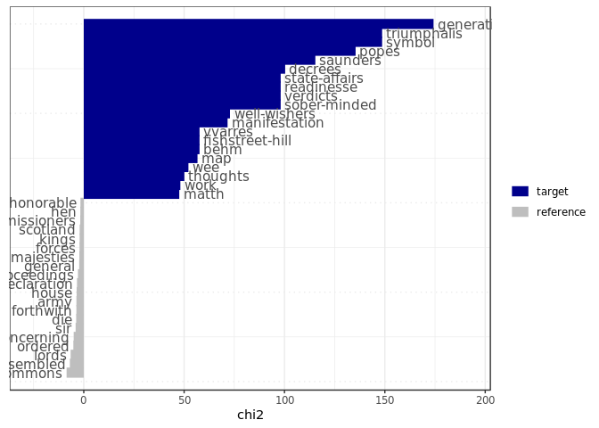

    ## 
    ## Community: 3

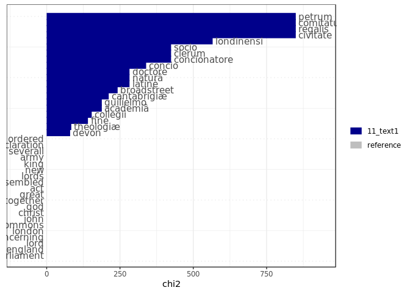

    ## 
    ## Community: 4


    ## 
    ## Community: 5


    ## 
    ## Community: 6

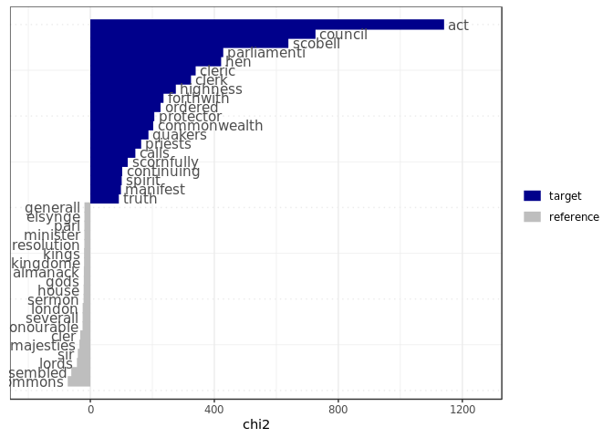

    ## 
    ## Community: 7


    ## 
    ## Community: 8


    ## 
    ## Community: 9

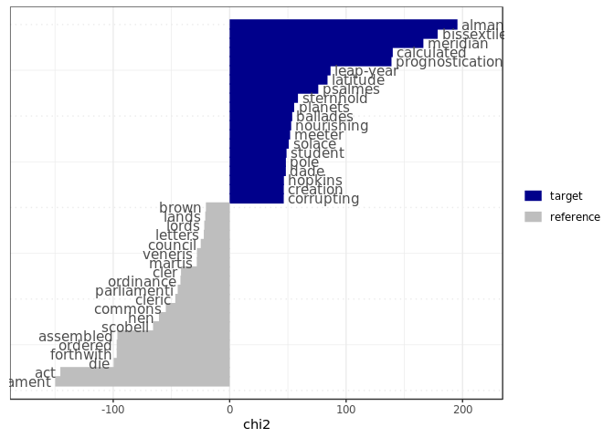

    ## 
    ## Community: 10


    ## 
    ## Community: 11

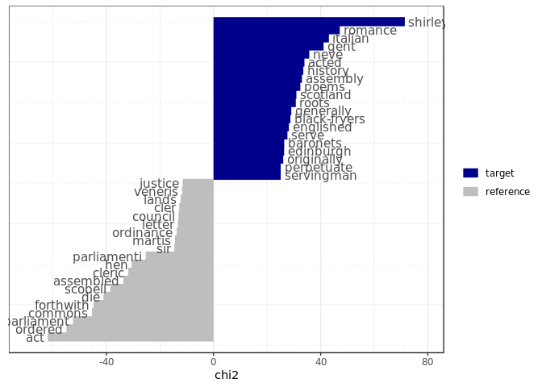

    ## 
    ## Community: 12


    ## 
    ## Community: 13


    ## 
    ##  1651-1660 
    ## 
    ## 25 top features/tokens
    ## $Community_1
    ##     christ   minister       john     church        god    england   together 
    ##        175        162        148        146        143        139        135 
    ##     london       lord     gospel       true        new    english      great 
    ##        135        131        128        123        122        116        115 
    ##   preached     sermon       king    william       word parliament    richard 
    ##        111        106        103         95         87         84         82 
    ## concerning    several       gods      added 
    ##         81         79         75         74 
    ## 
    ## $Community_10
    ##       john        god      great       true       lord       king   together 
    ##         58         55         55         49         48         47         45 
    ##   minister     christ    english parliament   preached     gospel     church 
    ##         44         44         44         43         40         40         39 
    ##    england        use     sermon     thomas     london        new      right 
    ##         39         39         37         37         37         31         30 
    ## concerning    shewing    several    sermons 
    ##         29         29         28         27 
    ## 
    ## $Community_11
    ##        lord  parliament         god      people         act      christ 
    ##         570         543         539         433         375         360 
    ##     england      called        true       truth       forth       great 
    ##         356         342         323         313         309         263 
    ##      answer       world  concerning     several       light     quakers 
    ##         236         223         205         201         200         196 
    ##        king        john    together      spirit declaration     ordered 
    ##         194         193         186         183         178         164 
    ##     council 
    ##         161 
    ## 
    ## $Community_12
    ## parliament       lord    england       john     london   together        act 
    ##        218        189        152        151        131        126        117 
    ##       king        god    several      great        new    english     thomas 
    ##        111        110        106         97         96         87         82 
    ##     church    present        use concerning        law     sermon    william 
    ##         78         78         77         75         75         74         74 
    ##   preached     christ       city       true 
    ##         72         72         69         68 
    ## 
    ## $Community_2
    ##   minister       john     london     christ       lord     church        god 
    ##        247        246        240        237        219        211        201 
    ##     sermon   preached   together    england     gospel      great    several 
    ##        190        188        178        177        165        159        155 
    ## concerning parliament       king        new       true    english      right 
    ##        137        132        130        129        122        121        119 
    ##       word    william        law     thomas 
    ##        111        107        105        104 
    ## 
    ## $Community_3
    ##       king       john parliament    william     prynne       true     church 
    ##         48         38         37         35         33         32         31 
    ##     christ    england    present    members   together       lord      right 
    ##         30         28         27         25         24         22         20 
    ##        god    english      kings        old     nation    quakers    bencher 
    ##         20         20         20         20         20         20         20 
    ##      great    charles      names     gospel 
    ##         19         19         19         18 
    ## 
    ## $Community_4
    ##        devon    guilielmo         june         fine    theologiæ     comitatu 
    ##            1            1            1            1            1            1 
    ##     ecclesiâ       concio         vico       vocato      doctore  broadstreet 
    ##            1            1            1            1            1            1 
    ##       latinè       naturâ concionatore  necessitate     academiâ  cantabrigiæ 
    ##            1            1            1            1            1            1 
    ##     collegii        mariæ      regalis       clerum        kairō        logoū 
    ##            1            1            1            1            1            1 
    ##     hæresium 
    ##            1 
    ## 
    ## $Community_5
    ##     together       christ        truth      several         book     doctrine 
    ##            4            4            4            3            3            3 
    ##      persons       famous        every      quakers      quaking     weakness 
    ##            3            3            3            3            3            3 
    ##        books        right    according      england          use    political 
    ##            2            2            2            2            2            2 
    ##        great    discovery    excellent       person     asserted observations 
    ##            2            2            2            2            2            2 
    ##       degree 
    ##            2 
    ## 
    ## $Community_6
    ##        pauls   containing       edward         pens     invented     engraven 
    ##            2            2            2            2            2            2 
    ##       cocker       church    according practitioner        whole      usefull 
    ##            2            1            1            1            1            1 
    ##   consisting    discovery      present   directions        faire      variety 
    ##            1            1            1            1            1            1 
    ##    ingenious        never       nation      conduct         side        hands 
    ##            1            1            1            1            1            1 
    ##    invention 
    ##            1 
    ## 
    ## $Community_7
    ##     christ        god       john       lord     london   together    england 
    ##        331        295        275        256        214        206        206 
    ##     gospel        new      great     church   minister    english    william 
    ##        184        183        179        164        155        143        139 
    ## parliament       true     sermon     people      jesus concerning   preached 
    ##        138        137        120        119        118        117        115 
    ##  according     thomas    several   almanack 
    ##        115        113        113        113 
    ## 
    ## $Community_8
    ##      elect      jesus    several        man        god   treatise      world 
    ##          3          2          2          2          2          2          2 
    ##       true      great       last   personal  following     saints       john 
    ##          2          2          2          2          1          1          1 
    ##     heaven concerning       near  appearing      glory      power   prophets 
    ##          1          1          1          1          1          1          1 
    ## containing        set     spirit    eternal 
    ##          1          1          1          1 
    ## 
    ## $Community_9
    ##       john    english        god      great    england     church       lord 
    ##        132        124        121        120        119        115        109 
    ##       king   together     christ concerning     sermon     london   preached 
    ##        108        103         88         86         80         80         79 
    ##       true       gent    several        new    william      added     people 
    ##         75         74         73         73         70         67         65 
    ##    present   minister       life     answer 
    ##         65         63         63         63 
    ## 
    ## 
    ## Community: 1


    ## 
    ## Community: 2


    ## 
    ## Community: 3


    ## 
    ## Community: 4

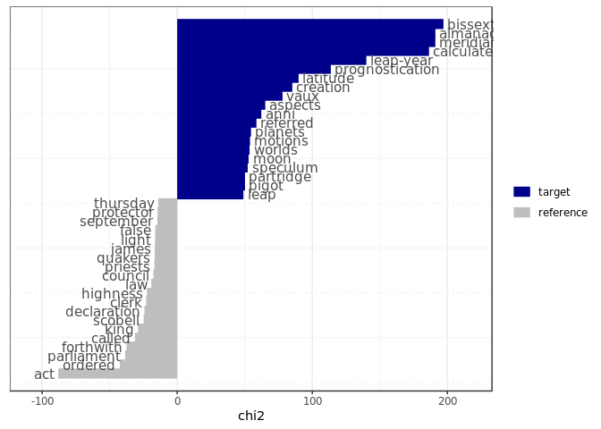

    ## 
    ## Community: 5

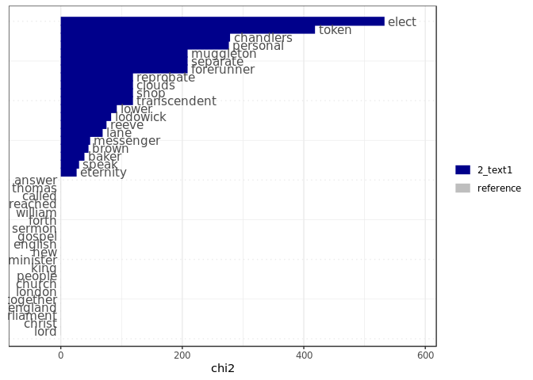

    ## 
    ## Community: 6


    ## 
    ## Community: 7

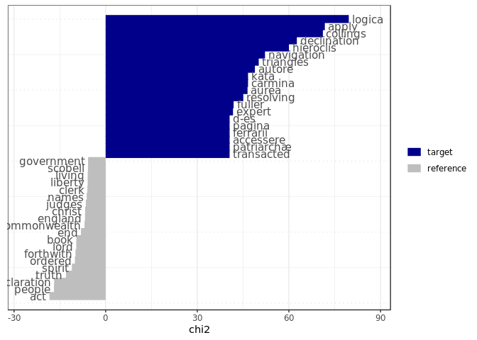

    ## 
    ## Community: 8


    ## 
    ## Community: 9


    ## 
    ## Community: 10


    ## 
    ## Community: 11


    ## 
    ## Community: 12


    ## 
    ##  1656-1665 
    ## 
    ## 25 top features/tokens
    ## $Community_1
    ##    physick     christ   culpeper   diseases     doctor      books       nich 
    ##         51         37         20         18         18         17         17 
    ##     abdiah       cole        god    english      great       john    william 
    ##         16         16         16         16         14         14         14 
    ##        viz       body     shewed     thomas   chapters  physitian     gospel 
    ##         13         13         12         12         12         12         11 
    ##       four physitians      added       book 
    ##         10          9          9          9 
    ## 
    ## $Community_10
    ##        god     people     called       lord      truth      forth       true 
    ##        480        332        283        275        250        227        224 
    ##     christ      light     spirit    quakers       life     answer      world 
    ##        222        178        178        159        143        142        133 
    ## concerning    england       love        man       book      given  testimony 
    ##        126        119        117        115        111        105         99 
    ##       name      power     church      false 
    ##         95         92         91         89 
    ## 
    ## $Community_11
    ##         neve observations         gent        great          viz    necessary 
    ##            4            2            2            2            2            2 
    ##       christ          god         mans       famous      english       london 
    ##            2            2            2            2            2            2 
    ##         lord          new         time    contained        jesus         city 
    ##            2            2            2            2            2            2 
    ##      ancient    practised     almanack   bissextile    leap-year     eclipses 
    ##            2            2            2            2            2            2 
    ##      exactly 
    ##            2 
    ## 
    ## $Community_2
    ##       english         added        church          true         faith 
    ##             2             1             1             1             1 
    ##        extant       kingdom     rebellion         short     character 
    ##             1             1             1             1             1 
    ##         rigid     presbyter     narrative     dangerous      designes 
    ##             1             1             1             1             1 
    ##       scotish   covenanters        tended         ruine      articles 
    ##             1             1             1             1             1 
    ##    dogmatical inconsistency      monarchy       history      compiled 
    ##             1             1             1             1             1 
    ## 
    ## $Community_3
    ##     people     shewed       best  principle   language   together      great 
    ##          2          2          2          2          2          1          1 
    ##   compared      light     christ      false discovered       true     common 
    ##          1          1          1          1          1          1          1 
    ##       hold       evil      right      faith    mystery        lye      jesus 
    ##          1          1          1          1          1          1          1 
    ##  mentioned     desire       give   hereunto 
    ##          1          1          1          1 
    ## 
    ## $Community_4
    ## containing       pens directions     edward   invented      hands   engraven 
    ##          3          3          2          2          2          2          2 
    ##     cocker      pauls    writing   writings  necessary     church     master 
    ##          2          2          2          1          1          1          1 
    ##    authors   practice       rare   examples     nation    england     making 
    ##          1          1          1          1          1          1          1 
    ##      sorts  according    shewing       last 
    ##          1          1          1          1 
    ## 
    ## $Community_5
    ##  parliament         act        lord     several     england       great 
    ##         321         176         122         116         109          99 
    ## westminster      london        king     ordered   september        john 
    ##          88          87          79          76          74          68 
    ##    together         god         new     ireland       begun        true 
    ##          65          63          63          63          63          61 
    ##       clerk declaration   forthwith        last    nicholas       order 
    ##          61          61          58          56          54          53 
    ##    scotland 
    ##          53 
    ## 
    ## $Community_6
    ##       lord       john     church     london        god parliament    england 
    ##        623        595        516        498        497        481        471 
    ##       king     sermon   together    several   preached      great     christ 
    ##        446        405        404        399        397        390        381 
    ##   minister    english       true      right concerning     thomas     gospel 
    ##        381        348        315        308        304        301        297 
    ##    william        new    present       city 
    ##        292        290        281        258 
    ## 
    ## $Community_7
    ##         king proclamation   parliament    majesties          act      commons 
    ##          139          118           86           83           68           48 
    ##        house    assembled        lords      england         lord     gracious 
    ##           41           30           30           28           27           27 
    ##      charles      majesty       speech     together   concerning        great 
    ##           27           27           26           22           22           20 
    ##        reign       houses      ireland      present          god       called 
    ##           20           20           19           19           18           18 
    ##       london 
    ##           17 
    ## 
    ## $Community_8
    ##       new      true      king     great  pleasant     death       god      love 
    ##       128        92        84        75        74        69        62        62 
    ##      lord  together   england      time  relation      last       man      life 
    ##        61        60        59        58        57        55        52        50 
    ##    london    christ    ballad excellent     robin      good      john      song 
    ##        49        47        45        44        43        42        42        41 
    ##      wife 
    ##        41 
    ## 
    ## $Community_9
    ##      death   speeches  suffering  sufferers    mirrour  histories      added 
    ##          2          2          2          2          2          1          1 
    ##    several      means     people        god       life  treatises       work 
    ##          1          1          1          1          1          1          1 
    ##       lord excellency      times      faith     saints       best  collected 
    ##          1          1          1          1          1          1          1 
    ##       last        end        see      third 
    ##          1          1          1          1 
    ## 
    ## 
    ## Community: 1


    ## 
    ## Community: 2

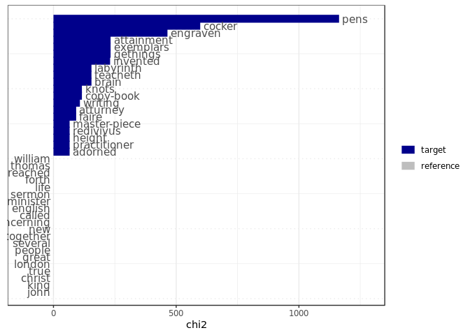

    ## 
    ## Community: 3


    ## 
    ## Community: 4


    ## 
    ## Community: 5


    ## 
    ## Community: 6

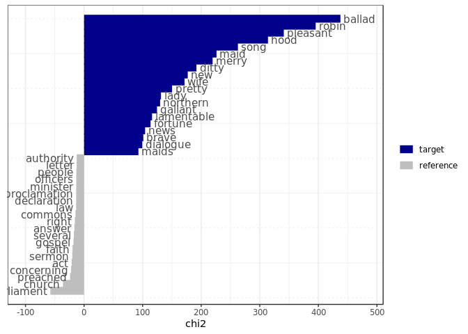

    ## 
    ## Community: 7

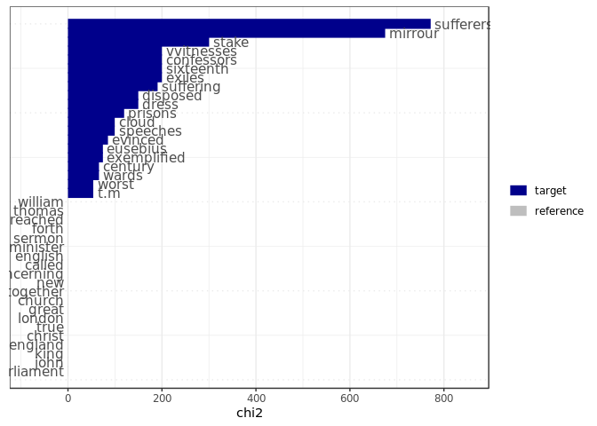

    ## 
    ## Community: 8


    ## 
    ## Community: 9


    ## 
    ## Community: 10


    ## 
    ## Community: 11


    ## 
    ##  1661-1670 
    ## 
    ## 25 top features/tokens
    ## $Community_1
    ##         king proclamation    majesties   parliament          act      charles 
    ##          173          139          104           63           48           41 
    ##      england      command         lord          god     gracious        reign 
    ##           33           31           30           29           29           27 
    ##      majesty       speech       houses        grace         next        peace 
    ##           26           25           25           23           22           22 
    ##       former       france      ireland        great          new  prohibiting 
    ##           22           22           22           22           21           21 
    ##         holy 
    ##           19 
    ## 
    ## $Community_10
    ##       english      articles        church         added         faith 
    ##             2             1             1             1             1 
    ##       kingdom          true     narrative         short        extant 
    ##             1             1             1             1             1 
    ##      monarchy      formerly       history     dangerous      compiled 
    ##             1             1             1             1             1 
    ##     rebellion     character         verse       scotish inconsistency 
    ##             1             1             1             1             1 
    ##     presbyter         rigid      designes   covenanters        tended 
    ##             1             1             1             1             1 
    ## 
    ## $Community_11
    ##    metamorphosis           ovidii          nasonis   accuratissimis 
    ##                1                1                1                1 
    ##          virorum    doctissimorum   castigatioibus         emendata 
    ##                1                1                1                1 
    ##            lucem            edita             holy            bible 
    ##                1                1                0                0 
    ##         articuli            pacis confoederationis     serenissimum 
    ##                0                0                0                0 
    ##    potentissimum        principem          carolum           gratiâ 
    ##                0                0                0                0 
    ##            magnæ        britanniæ          franciæ         hiberniæ 
    ##                0                0                0                0 
    ##            regem 
    ##                0 
    ## 
    ## $Community_12
    ##      people        best    language      shewed   principle    together 
    ##           2           2           2           2           2           1 
    ##     annexed    hereunto      called    compared     letters      within 
    ##           1           1           1           1           1           1 
    ##       jesus      christ     certain       faith       great     quakers 
    ##           1           1           1           1           1           1 
    ##      desire       right      common      growth discovering        true 
    ##           1           1           1           1           1           1 
    ##     account 
    ##           1 
    ## 
    ## $Community_13
    ##      new     love     true    great      god   london     lord  several 
    ##      199      172      153      151      145      137      127      109 
    ##     john minister     good pleasant    young   christ    death     life 
    ##      105      101      101      101      101       98       97       96 
    ## together  england     time     king   church     last      man   gospel 
    ##       91       91       87       86       84       81       80       80 
    ##  shewing 
    ##       74 
    ## 
    ## $Community_14
    ##       john       lord    several     london    english        god        new 
    ##        292        269        260        233        226        214        204 
    ##    england       king      great     church   together  majesties       true 
    ##        201        199        183        180        180        171        163 
    ##     sermon concerning   preached    william  discourse    majesty      right 
    ##        155        149        146        143        134        133        125 
    ##    charles       city      added    present 
    ##        124        120        119        118 
    ## 
    ## $Community_2
    ##             time     instructions        archibald          marquis 
    ##                1                1                1                1 
    ##           argyle      confinement             holy            bible 
    ##                1                1                0                0 
    ##         articuli            pacis confoederationis     serenissimum 
    ##                0                0                0                0 
    ##    potentissimum        principem          carolum           gratiâ 
    ##                0                0                0                0 
    ##            magnæ        britanniæ          franciæ         hiberniæ 
    ##                0                0                0                0 
    ##            regem            fidei       defensorem           celsos 
    ##                0                0                0                0 
    ##      præpotentes 
    ##                0 
    ## 
    ## $Community_3
    ##       lord      monck  albemarle torrington potheridge  majesties honourable 
    ##          4          4          4          4          4          3          3 
    ##     oxford     sermon   preached    england parliament       high    publick 
    ##          3          3          3          2          2          2          2 
    ##       earl      right       john      baron      order      noble       duke 
    ##          2          2          2          2          2          2          2 
    ##     robert   chaplain    secundo     george 
    ##          2          2          2          2 
    ## 
    ## $Community_4
    ##         concerning            english               true          arguments 
    ##                  4                  4                  4                  4 
    ##              brief              forth            epistle common-prayer-book 
    ##                  4                  4                  4                  4 
    ##               main         objections           answered              notes 
    ##                  4                  4                  4                  3 
    ##            several             answer       observations           ordinary 
    ##                  3                  3                  3                  3 
    ##        consolatory             gospel             powell             church 
    ##                  3                  3                  3                  2 
    ##                use            private          spiritual             former 
    ##                  2                  2                  2                  2 
    ##           churches 
    ##                  2 
    ## 
    ## $Community_5
    ##    servants        life       acted       roger   lestrange   majesties 
    ##           4           4           4           4           4           3 
    ##      church        time  principles      comedy    licensed   cathedral 
    ##           3           3           3           3           3           2 
    ##  faithfully       kings       royal governments     princes        done 
    ##           2           2           2           2           2           2 
    ##   integrity   christian     shewing     theatre    monarchy     plainly 
    ##           2           2           2           2           2           2 
    ##   pretended 
    ##           2 
    ## 
    ## $Community_6
    ## concerning        god     people       love      faith      flesh       life 
    ##          9          4          4          4          3          3          3 
    ##    wisdome   received     called       read     christ    christs      words 
    ##          3          3          2          2          2          2          2 
    ##   faithful  receiving   meekness   patience      earth    friends     edifie 
    ##          2          2          2          2          2          2          2 
    ##      build    outward  offerings     belief 
    ##          2          2          2          2 
    ## 
    ## $Community_7
    ##   charles       god majesties      king   blessed    memory   majesty  reverend 
    ##         2         2         1         1         1         1         1         1 
    ##    father      lord       edw   saviour    christ    sacred    oxford   ireland 
    ##         1         1         1         1         1         1         1         1 
    ## soveraign    mighty   princes     james  ordained  eighteen    except      time 
    ##         1         1         1         1         1         1         1         1 
    ##    manner 
    ##         1 
    ## 
    ## $Community_8
    ##      church       roman          ri      watson  britannick      gratiâ 
    ##           2           2           2           2           2           1 
    ##  concerning     majesty priviledges   entituled        four       great 
    ##           1           1           1           1           1           1 
    ##     britain       order     liberty     ancient    asserted    chaplain 
    ##           1           1           1           1           1           1 
    ##    ordinary epistolaris    diatribe        fide   rationali    salutari 
    ##           1           1           1           1           1           1 
    ##     subnexa 
    ##           1 
    ## 
    ## $Community_9
    ##       lord       king     church        god    several      right     sermon 
    ##         44         37         36         36         33         32         32 
    ##        use       john   preached     london     bishop visitation  majesties 
    ##         31         31         30         28         28         28         27 
    ## concerning    england    majesty   reverend    english     father       true 
    ##         27         27         26         24         24         23         23 
    ##    william    charles      great containing 
    ##         22         21         21         20 
    ## 
    ## 
    ## Community: 1

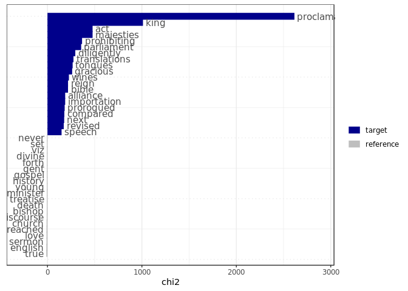

    ## 
    ## Community: 2


    ## 
    ## Community: 3


    ## 
    ## Community: 4

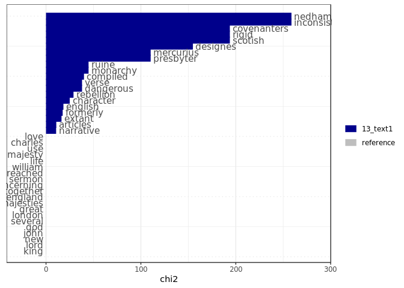

    ## 
    ## Community: 5

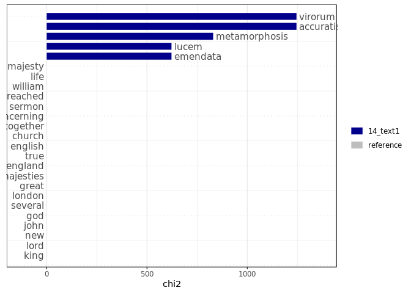

    ## 
    ## Community: 6


    ## 
    ## Community: 7


    ## 
    ## Community: 8

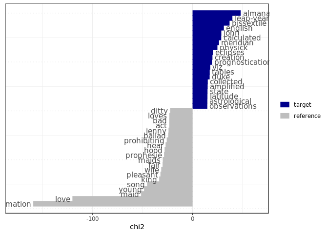

    ## 
    ## Community: 9


    ## 
    ## Community: 10

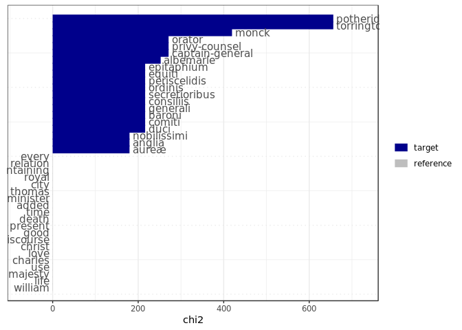

    ## 
    ## Community: 11

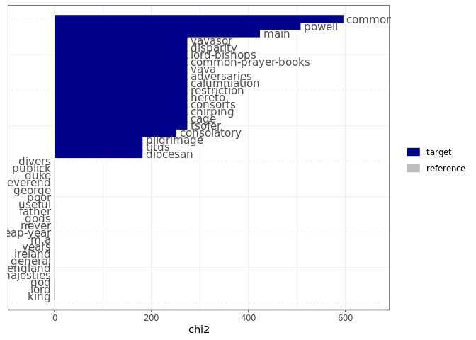

    ## 
    ## Community: 12


    ## 
    ## Community: 13


    ## 
    ## Community: 14

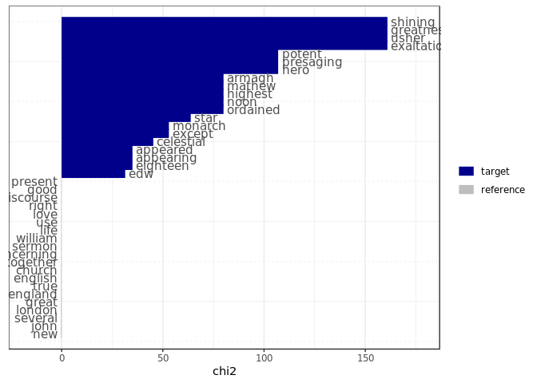

    ## 
    ##  1666-1675 
    ## 
    ## 25 top features/tokens
    ## $Community_1
    ##         king    majesties proclamation      command   parliament      charles 
    ##          140          103          101           50           45           38 
    ##      england          act         lord      several          god          new 
    ##           34           34           32           32           30           29 
    ##      general        great        peace      special      majesty     together 
    ##           29           27           27           27           25           24 
    ##   containing       former       france     original          old        newly 
    ##           22           22           22           21           20           20 
    ##       houses 
    ##           20 
    ## 
    ## $Community_10
    ##     london    several    england    english       john     church      great 
    ##         62         59         58         58         56         55         53 
    ##       true   preached       love   together        new    william concerning 
    ##         52         52         52         49         46         45         44 
    ##       life        use  according    account        god       lord  discourse 
    ##         44         40         40         40         39         39         38 
    ##    sermons      order     sermon    shewing 
    ##         37         36         36         36 
    ## 
    ## $Community_11
    ##        plain      grounds     religion confirmation        added       church 
    ##            3            1            1            1            1            1 
    ##          m.a       rector      edition    discourse      witches     familiar 
    ##            1            1            1            1            1            1 
    ##    questions        brief       useful     hitherto       extant     question 
    ##            1            1            1            1            1            1 
    ##      answers    corrected     capacity      reduced    different      meanest 
    ##            1            1            1            1            1            1 
    ##  explanation 
    ##            1 
    ## 
    ## $Community_12
    ##     world   english    nature  interest  compound    simple majesties       new 
    ##         4         2         2         2         2         2         1         1 
    ##       god     whole     rules  officers   general    making     parts  together 
    ##         1         1         1         1         1         1         1         1 
    ##      fire    mighty    famous      true      john    divers       use      book 
    ##         1         1         1         1         1         1         1         1 
    ## collected 
    ##         1 
    ## 
    ## $Community_13
    ##     english    together        john         new  containing         sir 
    ##          29          28          26          23          22          20 
    ##     several         use       added       great  concerning        book 
    ##          20          20          20          19          19          19 
    ## description     england        true        king      london        lord 
    ##          19          18          17          16          16          16 
    ##      thomas      sermon     majesty   majesties      french      nature 
    ##          16          16          15          15          15          15 
    ##     account 
    ##          14 
    ## 
    ## $Community_14
    ##         libri  memorabilium       valerii        maximi        treaty 
    ##             1             1             1             1             0 
    ##    friendship      commerce       majesty         great       britain 
    ##             0             0             0             0             0 
    ##        serene        prince          duke         savoy     concluded 
    ##             0             0             0             0             0 
    ##      florence     september     majesties       command          king 
    ##             0             0             0             0             0 
    ##  proclamation          free   exportation       woollen manufacturers 
    ##             0             0             0             0             0 
    ## 
    ## $Community_15
    ##         monck     albemarle    torrington    potheridge        sermon 
    ##             4             4             4             4             3 
    ##          duke     majesties          lord       secundo        george 
    ##             2             2             2             2             2 
    ##         order    honourable         noble          earl        garter 
    ##             2             2             2             2             2 
    ##      preached             =          rege         baron        anglia 
    ##             2             2             2             2             2 
    ## secretioribus     consiliis       ordinis         aureæ        carolo 
    ##             2             2             2             2             2 
    ## 
    ## $Community_2
    ##    several    english       john       king      acted     common        law 
    ##         58         43         40         38         36         34         33 
    ##     courts containing  majesties   together        use      great     london 
    ##         33         32         31         31         31         30         30 
    ##    england     french       lord      court    william   statutes    charles 
    ##         30         28         28         28         28         27         26 
    ##    present      added       gent    history 
    ##         26         26         26         26 
    ## 
    ## $Community_3
    ##    several       john   together    english        new     church     sermon 
    ##         72         55         52         51         47         47         42 
    ##  discourse      great    england        god       lord     london      added 
    ##         41         40         40         39         37         36         35 
    ##   preached        use    persons   treatise containing       book  majesties 
    ##         35         34         33         33         31         31         30 
    ##       true       life    william       king 
    ##         30         30         30         29 
    ## 
    ## $Community_4
    ##       lord       john        new     london   almanack    several        god 
    ##        155        155        143        137        110        109        108 
    ##    england  majesties  leap-year    english       true   together    william 
    ##        103         99         95         92         86         82         80 
    ## calculated       city bissextile   preached     sermon   meridian      great 
    ##         80         79         79         78         75         71         70 
    ##      right    account      royal   creation 
    ##         70         70         68         64 
    ## 
    ## $Community_5
    ##       new      love      true  pleasant     young    london   several      time 
    ##       299       293       183       147       147       129       119       102 
    ##       man     great    lovers      good      john      last      lord allowance 
    ##       100        94        93        92        91        88        86        86 
    ##      maid       god   english      song  together     death      king       old 
    ##        85        81        81        81        79        77        74        74 
    ##      poor 
    ##        74 
    ## 
    ## $Community_6
    ##        dade       great        free         new    brittain      london 
    ##           2           1           1           1           1           1 
    ##     england       parts represented      island     certain       state 
    ##           1           1           1           1           1           1 
    ##    forreign      church     account   discussed        gent     william 
    ##           1           1           1           1           1           1 
    ##   discourse   practices  principles  succinctly     divines    moderate 
    ##           1           1           1           1           1           1 
    ##       truly 
    ##           1 
    ## 
    ## $Community_7
    ##         god   merchants        true   delivered   elizabeth    relation 
    ##           1           1           1           1           1           1 
    ##      worthy         joy        live       godly   leicester       lying 
    ##           1           1           1           1           1           1 
    ##         dye temptations    daughter    deathbed     bristol        maid 
    ##           1           1           1           1           1           1 
    ##    stretton        fear     maidens wonderfully       satan      noting 
    ##           1           1           1           1           1           1 
    ## summer-time 
    ##           1 
    ## 
    ## $Community_8
    ##   minister     gospel        god    several        new     christ   together 
    ##        111        110         91         90         78         78         76 
    ##       john   preached       true      great    sermons      death       life 
    ##         73         73         71         69         66         64         62 
    ##     thomas       lord  christian     london  discourse    william       love 
    ##         62         60         59         58         57         56         56 
    ##     sermon      added    england concerning 
    ##         55         48         47         47 
    ## 
    ## $Community_9
    ##    english    several     island    lincoln       arts      great       duke 
    ##          3          2          2          2          2          1          1 
    ##     france   severall     london   together       care  cambridge       true 
    ##          1          1          1          1          1          1          1 
    ##     thomas     letter  following  answering  souldiers experience     clergy 
    ##          1          1          1          1          1          1          1 
    ##      usual       sums      added       pass 
    ##          1          1          1          1 
    ## 
    ## 
    ## Community: 1


    ## 
    ## Community: 2


    ## 
    ## Community: 3

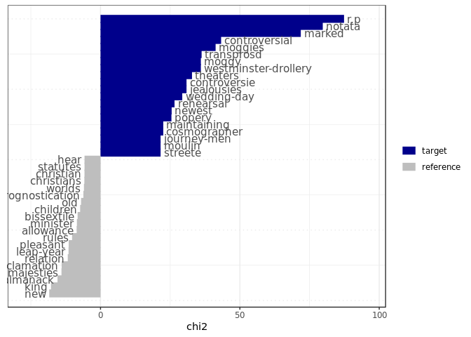

    ## 
    ## Community: 4


    ## 
    ## Community: 5


    ## 
    ## Community: 6

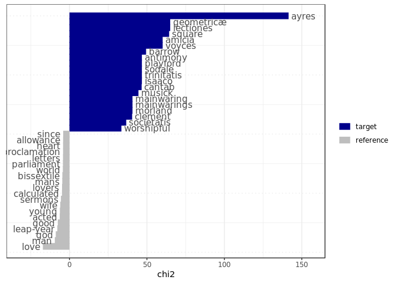

    ## 
    ## Community: 7


    ## 
    ## Community: 8

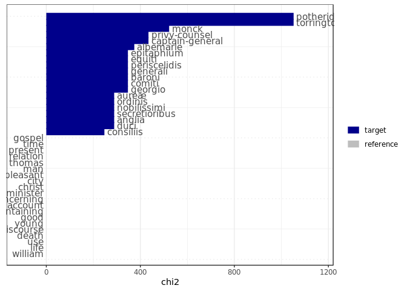

    ## 
    ## Community: 9


    ## 
    ## Community: 10


    ## 
    ## Community: 11

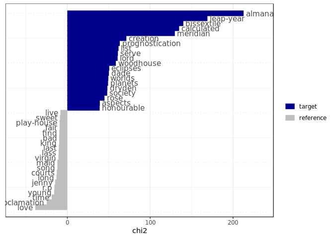

    ## 
    ## Community: 12

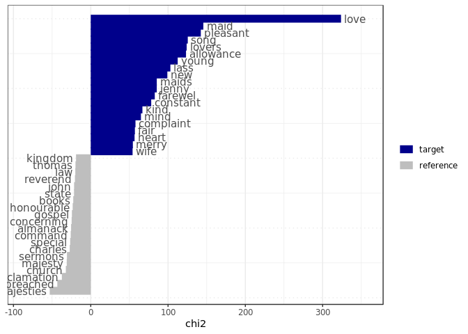

    ## 
    ## Community: 13


    ## 
    ## Community: 14

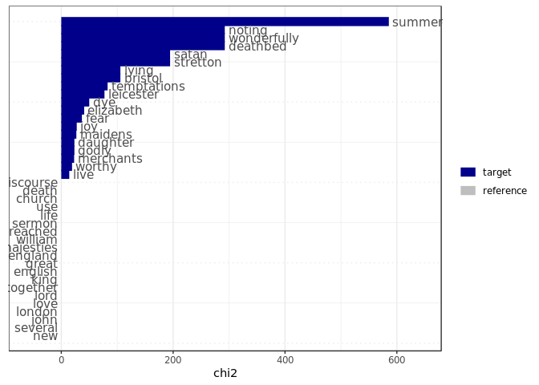

    ## 
    ## Community: 15


    ## 
    ##  1671-1680 
    ## 
    ## 25 top features/tokens
    ## $Community_1
    ##         king    majesties proclamation   parliament      command      several 
    ##          165          153          109           67           66           56 
    ##          new         lord      england      majesty         john      special 
    ##           53           52           51           51           46           44 
    ##      charles       london          god   containing          old         holy 
    ##           39           38           38           37           35           34 
    ##        newly       former       prince      william    testament translations 
    ##           34           34           34           34           33           32 
    ##   diligently 
    ##           32 
    ## 
    ## $Community_10
    ##     london       john       lord    england    several     church     sermon 
    ##        285        254        244        242        219        202        201 
    ##   preached        new    english       true    account        god    william 
    ##        200        192        185        171        167        167        163 
    ##      right      great   together       city  discourse   almanack       life 
    ##        151        149        146        144        130        130        128 
    ## concerning     thomas honourable  majesties 
    ##        126        124        113        107 
    ## 
    ## $Community_11
    ##    several       john   together       lord        sir        new     london 
    ##         50         50         42         30         30         29         29 
    ##    english     sermon      great  majesties containing      right     church 
    ##         29         28         28         27         27         27         27 
    ##       king    england      henry honourable    william     divers       city 
    ##         26         25         25         25         25         24         24 
    ##      added      parts   treatise      cases 
    ##         24         24         23         23 
    ## 
    ## $Community_12
    ##       new      love      true  pleasant     young       man      time     great 
    ##       270       257       174       139       129       116       103       101 
    ## allowance      last      good    lovers   several     death    london   account 
    ##        94        93        93        92        89        87        80        75 
    ##      king      life       old  together  relation      lord      song       god 
    ##        74        72        71        71        70        70        68        67 
    ##      maid 
    ##        67 
    ## 
    ## $Community_13
    ##    several       john    england    english   together     church     london 
    ##        120        110        100         91         83         77         73 
    ##        new    william       lord      added       true       king      great 
    ##         71         71         70         70         65         65         65 
    ##       life      court    account containing    history    present     french 
    ##         59         59         58         58         56         54         54 
    ## concerning        sir        use     sermon 
    ##         53         52         51         50 
    ## 
    ## $Community_2
    ##      royal    society      acted    majesty       john       king     french 
    ##         40         30         24         21         20         15         15 
    ##     letter     fellow   together       list    present    english      added 
    ##         14         14         13         12         12         12         12 
    ##    charles  discourse     comedy containing   servants       lord  majesties 
    ##         12         11         11         11         11         11         10 
    ##    theatre    several concerning     sacred 
    ##         10         10         10         10 
    ## 
    ## $Community_3
    ##            dade           state           serve         account             new 
    ##               2               1               1               1               1 
    ##          london            gent           great        almanack       leap-year 
    ##               1               1               1               1               1 
    ##        meridian         william prognostication          behold          island 
    ##               1               1               1               1               1 
    ##      calculated        brittain      privilegio        forreign             ode 
    ##               1               1               1               1               0 
    ##             roy           sieur      des-chants       innocence          lettre 
    ##               0               0               0               0               0 
    ## 
    ## $Community_4
    ##      church     several        rome    together indulgences    religion 
    ##           9           7           6           5           5           4 
    ##         god      christ        john   communion     norfolk      popish 
    ##           4           4           4           4           4           3 
    ##      thomas      manner       jesus    minister      gospel        true 
    ##           3           3           3           3           3           2 
    ##        king     persons        good      danger       right        lord 
    ##           2           2           2           2           2           2 
    ##        land 
    ##           2 
    ## 
    ## $Community_5
    ##     church     sermon   preached    england    several    william   ordinary 
    ##         42         33         33         32         31         27         26 
    ##       lord   religion   together      added      cases      right  discourse 
    ##         25         23         23         22         22         21         20 
    ##   chaplain       john      great    majesty  majesties       book     london 
    ##         20         19         19         19         18         18         16 
    ## containing        god    english  christian 
    ##         16         15         15         15 
    ## 
    ## $Community_6
    ##  relation      true   account   present  creature    street monstrous      seen 
    ##         2         2         2         2         2         2         2         2 
    ##      skin   members  licensed   several  original      land     never      john 
    ##         2         1         1         1         1         1         1         1 
    ##     dutch    giving  happened    french according    action       end    nature 
    ##         1         1         1         1         1         1         1         1 
    ##     count 
    ##         1 
    ## 
    ## $Community_7
    ##      true   several   account      john    london   english    church     great 
    ##       219       212       173       124       122       115       110       108 
    ##  relation  minister     death   william    christ   england  together    sermon 
    ##       107       107       106       106       101        99        99        96 
    ##       god      lord      life    gospel  preached lestrange       new  licensed 
    ##        94        93        91        91        90        89        88        84 
    ##    thomas 
    ##        82 
    ## 
    ## $Community_8
    ##        earl        case      worthy  parliament   majesties        holy 
    ##           2           2           1           1           1           1 
    ##    original    servants      thomas     shewing      speech   gentleman 
    ##           1           1           1           1           1           1 
    ##      letter     liberty     subject       kings         sir      judges 
    ##           1           1           1           1           1           1 
    ##   scripture       verse    justices      friend      robert confinement 
    ##           1           1           1           1           1           1 
    ##     anthony 
    ##           1 
    ## 
    ## $Community_9
    ##         draw          use      england   directions        shire         book 
    ##           11           10            9            8            8            7 
    ##         time         hand        stand        names         know          lay 
    ##            6            6            6            5            5            5 
    ##      drawing         gold    necessary         work instructions       silver 
    ##            5            4            4            4            4            4 
    ##         arts        spent          new       london      grounds         done 
    ##            4            4            3            3            3            3 
    ##       useful 
    ##            3 
    ## 
    ## 
    ## Community: 1

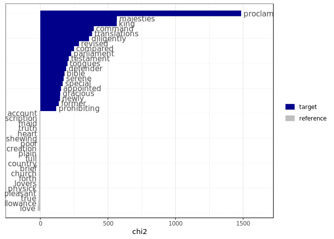

    ## 
    ## Community: 2

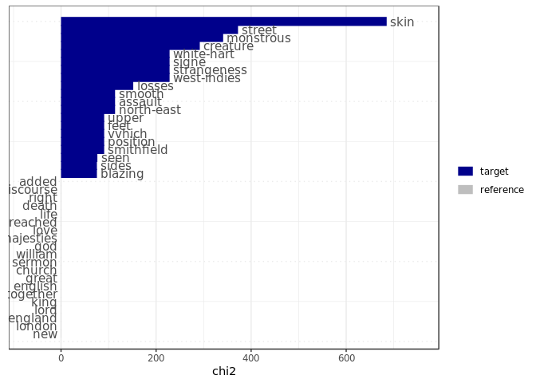

    ## 
    ## Community: 3

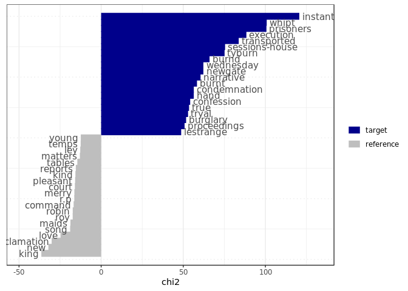

    ## 
    ## Community: 4


    ## 
    ## Community: 5


    ## 
    ## Community: 6

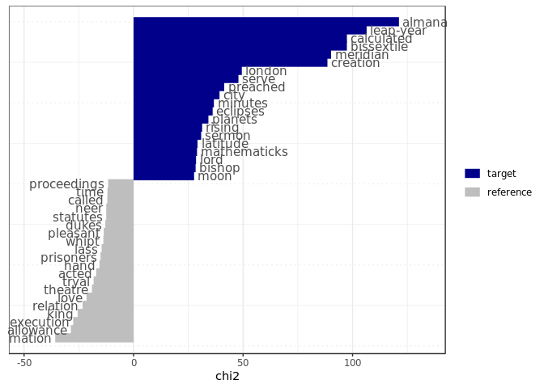

    ## 
    ## Community: 7


    ## 
    ## Community: 8

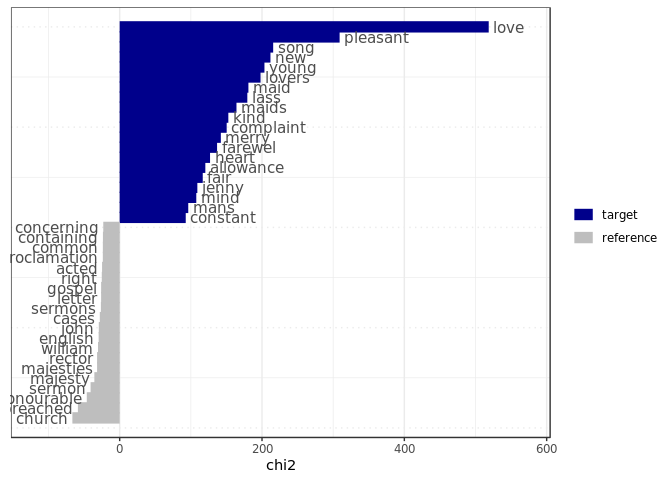

    ## 
    ## Community: 9


    ## 
    ## Community: 10

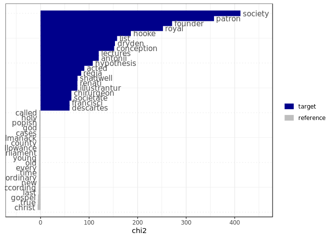

    ## 
    ## Community: 11

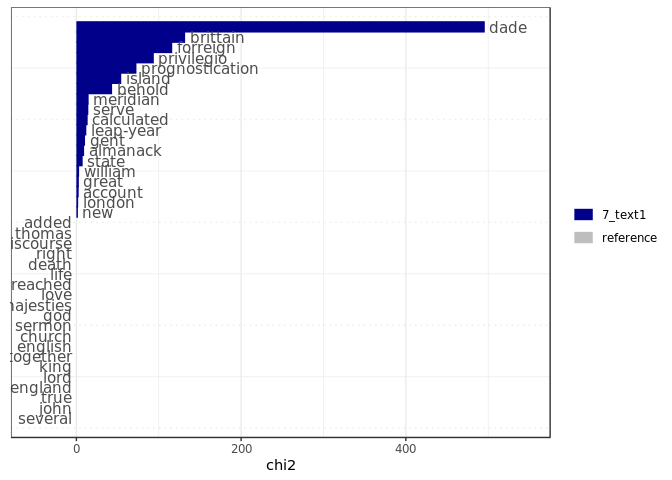

    ## 
    ## Community: 12

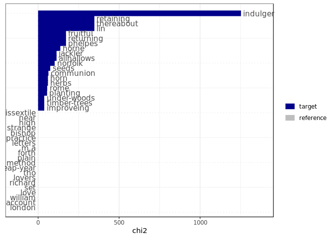

    ## 
    ## Community: 13


    ## 
    ##  1676-1685 
    ## 
    ## 25 top features/tokens
    ## $Community_1
    ##       life    actions     joseph      lesly   minister     useful  attornies 
    ##          4          3          3          3          3          2          2 
    ##      court     extant       gent     revivd containing      death       holy 
    ##          2          2          2          2          2          2          2 
    ##     george        viz      dives   abrahams     gospel        god        man 
    ##          2          2          2          2          2          2          2 
    ##   religion  universal  sacrament   sorcerer 
    ##          2          2          2          2 
    ## 
    ## $Community_10
    ##          every         august           life       religion     protestant 
    ##              3              3              2              2              2 
    ##         tyburn          stand          titus         proved          paper 
    ##              2              2              2              2              2 
    ##          reply    westminster          oates       new-gate        perjury 
    ##              2              2              2              2              2 
    ## royal-exchange        pillory           work        william           last 
    ##              2              2              1              1              1 
    ##         answer           duke           plot      pretended     concerning 
    ##              1              1              1              1              1 
    ## 
    ## $Community_11
    ##        sir     thomas     fisher       work    william       last    persons 
    ##          3          2          2          1          1          1          1 
    ##    several        new      never discourses     lately historical    visible 
    ##          1          1          1          1          1          1          1 
    ##    student     sundry        old compleatly    english       wife         kt 
    ##          1          1          1          1          1          1          1 
    ##    therein  elizabeth  memorable  performed 
    ##          1          1          1          1 
    ## 
    ## $Community_12
    ##        bank   proposals   majesties      answer   discovery        body 
    ##           3           3           2           2           2           2 
    ##     majesty  parliament      charge      hazard        bees straw-hives 
    ##           2           2           2           2           2           2 
    ##       bills       every         god         man      nature    together 
    ##           1           1           1           1           1           1 
    ##       royal        true      popish        plot reflections      letter 
    ##           1           1           1           1           1           1 
    ##     general 
    ##           1 
    ## 
    ## $Community_13
    ##    account       true    several       john     london   together    william 
    ##        405        391        348        287        236        220        208 
    ##       king       lord    england      death        god       last      great 
    ##        202        202        201        192        180        172        172 
    ##     church       life   relation     christ     letter concerning    instant 
    ##        167        165        164        162        162        157        156 
    ##     thomas    present  execution       city 
    ##        151        145        138        137 
    ## 
    ## $Community_14
    ##        parts     composed        henry       sacred      majesty     ordinary 
    ##            1            1            1            1            1            1 
    ##      purcell     organist        basse       royall     sonnatas     viollins 
    ##            1            1            1            1            1            1 
    ##        organ   harpsecord     composer     chappell      entring       clerks 
    ##            1            1            1            1            0            0 
    ##         vade        exact   collection   precedents declarations    pleadings 
    ##            0            0            0            0            0            0 
    ##      actions 
    ##            0 
    ## 
    ## $Community_15
    ##        divine     discovery       learned       strange      pleasure 
    ##             2             1             1             1             1 
    ##         tears     wonderful       english         newly         print 
    ##             1             1             1             1             1 
    ##        edward       christs        empire        ground        houses 
    ##             1             1             1             1             1 
    ##      englands       composd         tryal         ruine        humbly 
    ##             1             1             1             1             1 
    ##      reverend consideration   recommended       rendred        danger 
    ##             1             1             1             1             1 
    ## 
    ## $Community_16
    ##      young       hood       love      robin   pleasant       took        old 
    ##          4          4          3          3          2          2          2 
    ##      satyr achitophel    absalom        man     answer       duke   dutchess 
    ##          2          2          2          1          1          1          1 
    ##       kind  monmouths      pitty       case      whose      great     knight 
    ##          1          1          1          1          1          1          1 
    ##       time   northern    fathers       bold 
    ##          1          1          1          1 
    ## 
    ## $Community_17
    ##             quæ      societatis    londinensium  medicamentorum     præparantur 
    ##               2               2               2               2               2 
    ##         venalia        prostant        collegii           opera       catalogus 
    ##               2               2               1               1               1 
    ##          studio        officina            chym     londinensis         notitia 
    ##               1               1               1               1               1 
    ##       medicorum pharmacopoeorum        consilio          londin         chymica 
    ##               1               1               1               1               1 
    ##       exhibitum            aulâ  pharmacopœorum          exacta    spagyricorum 
    ##               1               1               1               1               1 
    ## 
    ## $Community_18
    ##      church      popish indulgences    religion        rome      sermon 
    ##           6           5           5           4           4           3 
    ##    together    preached      priest   majesties        true      horrid 
    ##           3           3           3           2           2           2 
    ##       order        mary        pope       popes   communion  especially 
    ##           2           2           2           2           2           1 
    ##        life        holy      divine destruction       added   christian 
    ##           1           1           1           1           1           1 
    ##     persons 
    ##           1 
    ## 
    ## $Community_19
    ##      answer      letter    religion     several      friend     treason 
    ##           4           4           3           3           3           3 
    ##  government        high     instant       tryal     william       death 
    ##           3           3           3           3           2           2 
    ##      london        king       state  conspiring       kings   execution 
    ##           2           2           2           2           2           2 
    ##       right    beheaded  parliament  succession protestants      member 
    ##           2           2           2           2           2           2 
    ##      howard 
    ##           2 
    ## 
    ## $Community_2
    ##       new      love      true  pleasant     death     great     young    london 
    ##       349       281       227       178       164       160       152       145 
    ##   several      life       man according   account      good     order      king 
    ##       144       140       133       124       123       123       123       122 
    ##      last    lovers   england      lord      time      song       r.p      poor 
    ##       121       116       113       105       103       103        97        93 
    ##  together 
    ##        91 
    ## 
    ## $Community_20
    ##    london      true       man  relation     every   account   persons  receipts 
    ##         7         6         5         5         4         4         4         4 
    ##    people    manner execution     child    murder    within      near      plot 
    ##         4         4         4         4         4         4         3         3 
    ##      book      good      full     young  likewise      city    bloody    doctor 
    ##         3         3         3         3         3         3         3         3 
    ##     woman 
    ##         3 
    ## 
    ## $Community_3
    ##         king    majesties proclamation          new         lord   parliament 
    ##          194          168          123           77           76           75 
    ##      account      majesty       london         john      command          act 
    ##           74           74           72           70           68           66 
    ##         true      several      england   containing          old      william 
    ##           60           59           51           49           49           48 
    ##      present      charles         holy          god     together       thomas 
    ##           48           46           45           45           43           42 
    ##        james 
    ##           42 
    ## 
    ## $Community_4
    ##       friend       advice    character     dialogue        vvith         open 
    ##            1            1            1            1            1            1 
    ##    practises         poem         lewd        layed     informer      freeman 
    ##            1            1            1            1            1            1 
    ##   heraclitus      painter        hodge     goodlove      entring       clerks 
    ##            1            1            1            1            0            0 
    ##         vade        exact   collection   precedents declarations    pleadings 
    ##            0            0            0            0            0            0 
    ##      actions 
    ##            0 
    ## 
    ## $Community_5
    ##     church       king    several    english       john        sir   together 
    ##         25         22         21         20         19         19         17 
    ##      royal    account      state     edward   religion       duke concerning 
    ##         17         16         14         14         13         13         13 
    ##      great       lord    justice      cases  majesties      court     sermon 
    ##         13         13         13         13         12         12         12 
    ##  discourse      henry      moral     french 
    ##         12         12         12         12 
    ## 
    ## $Community_6
    ##    england     church     london    several     sermon    account       lord 
    ##        306        276        261        253        245        234        234 
    ##        new       john   preached       true   together    english       king 
    ##        226        225        213        213        189        180        176 
    ##      right    william      great    present       life concerning  discourse 
    ##        169        161        160        153        147        145        142 
    ## honourable    history      death containing 
    ##        141        140        137        136 
    ## 
    ## $Community_7
    ##     london    england     sermon       lord     church       john   preached 
    ##        297        283        271        265        251        245        239 
    ##    several        new       king    account      right    english  majesties 
    ##        234        219        208        185        177        159        158 
    ##       city       true honourable      great    majesty   together      royal 
    ##        157        155        152        147        147        144        144 
    ##     letter concerning     thomas        sir 
    ##        144        141        133        129 
    ## 
    ## $Community_8
    ##     sermon   preached     church    majesty   ordinary    several     london 
    ##         89         85         67         51         51         49         49 
    ##   chaplain       john       lord    england    william honourable    account 
    ##         47         47         47         43         40         38         37 
    ##      right  discourse       life  majesties concerning       king   religion 
    ##         34         33         32         31         30         30         29 
    ##   together    sermons     thomas containing 
    ##         29         29         28         27 
    ## 
    ## $Community_9
    ##     sheriffs       london    character      briefly       stated         used 
    ##            3            2            2            2            2            1 
    ##       popish    pretended   concerning    redivivus     declared         time 
    ##            1            1            1            1            1            1 
    ##       modern      present observations        cause     dialogue       proper 
    ##            1            1            1            1            1            1 
    ##   government        drawn  vindication        right    middlesex     discover 
    ##            1            1            1            1            1            1 
    ##        reply 
    ##            1 
    ## 
    ## 
    ## Community: 1


    ## 
    ## Community: 2

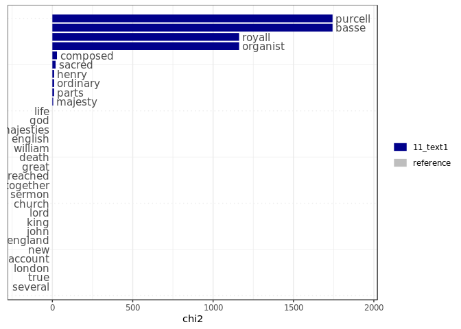

    ## 
    ## Community: 3


    ## 
    ## Community: 4


    ## 
    ## Community: 5


    ## 
    ## Community: 6


    ## 
    ## Community: 7


    ## 
    ## Community: 8


    ## 
    ## Community: 9

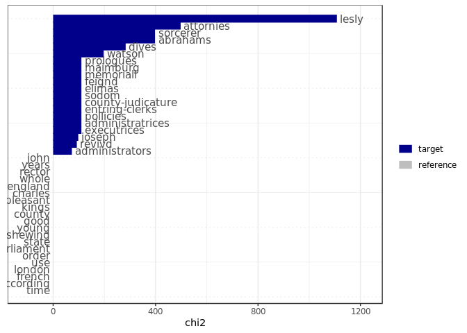

    ## 
    ## Community: 10

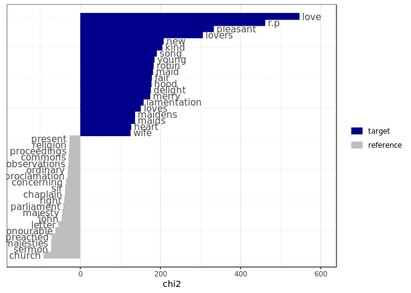

    ## 
    ## Community: 11

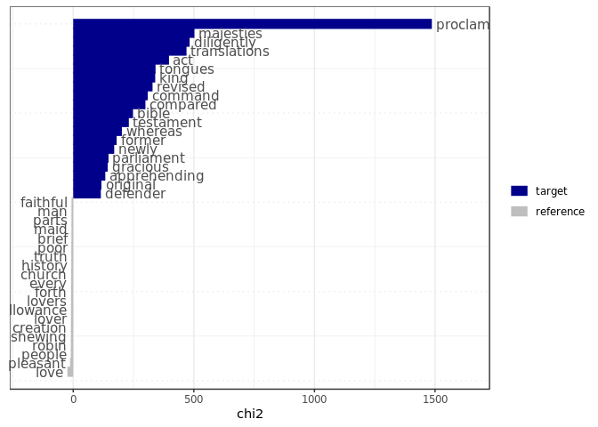

    ## 
    ## Community: 12


    ## 
    ## Community: 13

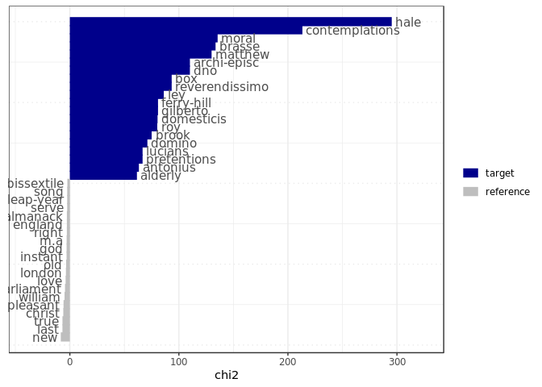

    ## 
    ## Community: 14

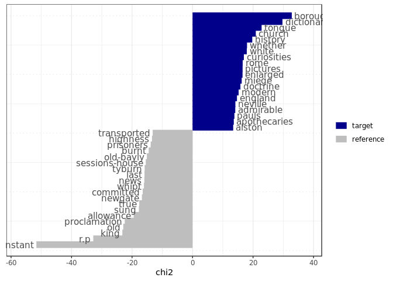

    ## 
    ## Community: 15

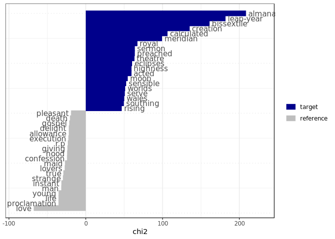

    ## 
    ## Community: 16


    ## 
    ## Community: 17


    ## 
    ## Community: 18

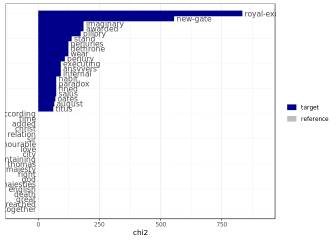

    ## 
    ## Community: 19

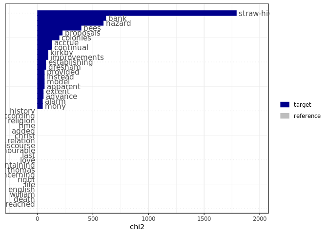

    ## 
    ## Community: 20


    ## 
    ##  1681-1690 
    ## 
    ## 25 top features/tokens
    ## $Community_1
    ##     sermon   preached     church     london       lord       john      right 
    ##         90         82         52         51         45         43         36 
    ##   chaplain honourable     rector      mayor  majesties   aldermen       true 
    ##         32         31         27         26         25         25         23 
    ## concerning        m.a    england     fellow     thomas   religion    account 
    ##         23         22         22         21         19         18         17 
    ##  september   ordinary    william  cambridge 
    ##         17         17         16         16 
    ## 
    ## $Community_10
    ##    account       king       true    england     letter    several     church 
    ##        404        334        285        283        241        229        213 
    ##   together    present  majesties    english     french      great     london 
    ##        205        183        177        177        168        167        161 
    ##       john   licensed       lord concerning    ireland        new       city 
    ##        156        148        147        146        146        145        144 
    ##   relation containing    william      order 
    ##        135        135        134        134 
    ## 
    ## $Community_11
    ##        new  according      order   licensed       love     london    account 
    ##        571        453        411        357        293        266        261 
    ##       true    england      great       king    several   pleasant       lord 
    ##        257        248        239        234        222        217        208 
    ##      young   together      death  excellent       john       song containing 
    ##        188        186        185        178        163        154        150 
    ##    english       last       life       city 
    ##        150        146        145        144 
    ## 
    ## $Community_12
    ##          every         august           life         tyburn          paper 
    ##              3              3              2              2              2 
    ##     protestant       religion    westminster          reply         proved 
    ##              2              2              2              2              2 
    ##          stand          titus          oates       new-gate        perjury 
    ##              2              2              2              2              2 
    ##        pillory royal-exchange           lord          grace           duke 
    ##              2              2              1              1              1 
    ##        publick      narrative     confession         fryday        william 
    ##              1              1              1              1              1 
    ## 
    ## $Community_13
    ##       john      dayes     seller      place    shewing     length  remarques 
    ##          5          4          4          3          3          3          3 
    ##    usefull        new   meridian   moveable      month    setting   almanack 
    ##          3          3          3          3          3          3          3 
    ## calculated     feasts       suns    riseing      table     famous   latitude 
    ##          3          3          3          3          2          2          2 
    ##  longitude principles      whose     island 
    ##          2          2          2          2 
    ## 
    ## $Community_14
    ##  scripture       life      right honourable      order    respect     church 
    ##          2          1          1          1          1          1          1 
    ##  principal      added      plain containing     useful  necessary collection 
    ##          1          1          1          1          1          1          1 
    ##        sir      short     divine     divers    fathers   doctrine     popish 
    ##          1          1          1          1          1          1          1 
    ##  whereunto      notes       rome directions 
    ##          1          1          1          1 
    ## 
    ## $Community_15
    ##    messalina        queen       albion       amours        woman      quality 
    ##           14            8            8            7            6            6 
    ##      account         last        reign         four        years    intrigues 
    ##            5            5            5            5            5            5 
    ##      publick        court      arrival london-derry    imposture    confidant 
    ##            4            4            4            4            4            4 
    ##      gothick         june         safe      general         king      briefly 
    ##            4            3            3            3            3            3 
    ##       prince 
    ##            3 
    ## 
    ## $Community_16
    ##      french        true       henry protestants      murder        earl 
    ##           3           2           2           2           2           1 
    ##      proofs       great       court     present     history     england 
    ##           1           1           1           1           1           1 
    ##       reign     english     amorous         sir     general  discovered 
    ##           1           1           1           1           1           1 
    ##      others       essex   discovery        full      prince      orange 
    ##           1           1           1           1           1           1 
    ##       clear 
    ##           1 
    ## 
    ## $Community_17
    ##    account     french      total       last engagement       near      dutch 
    ##          6          6          5          4          4          3          3 
    ## ammunition      fleet     defeat     fleets perticular      coast    routing 
    ##          3          3          3          3          3          3          3 
    ##      brest  thursdays  majesties     forces  prisoners    england    english 
    ##          3          3          2          2          2          2          2 
    ##     number      taken    morning        ely 
    ##          2          2          2          2 
    ## 
    ## $Community_18
    ##          sir          old       thomas      therein      several      persons 
    ##            4            2            2            2            2            2 
    ##      english   historical         work        pauls       lately    cathedral 
    ##            2            2            2            2            2            2 
    ##      visible   discourses      student          new  antiquities        never 
    ##            2            2            2            2            2            2 
    ##      rendred    performed    monuments inscriptions       sundry   compleatly 
    ##            2            2            2            2            2            2 
    ##       tombes 
    ##            2 
    ## 
    ## $Community_19
    ##          new         king       french      auction         john      several 
    ##           42           41           37           35           33           33 
    ##         sale      england         four         best      instant      english 
    ##           33           32           29           28           27           27 
    ##        royal   collection         sold        novel coffee-house      history 
    ##           26           26           26           25           24           23 
    ##      masters    afternoon        great       church    majesties    excellent 
    ##           23           22           22           22           21           21 
    ##        acted 
    ##           21 
    ## 
    ## $Community_2
    ##  medicamentorum             quæ    londinensium     præparantur         venalia 
    ##               2               2               2               2               2 
    ##        prostant      societatis           opera          londin       catalogus 
    ##               2               2               1               1               1 
    ##            aulâ  pharmacopœorum        officina         chymica     londinensis 
    ##               1               1               1               1               1 
    ##          exacta         notitia    spagyricorum           aulam   pharmaceuticæ 
    ##               1               1               1               1               1 
    ##        consilio pharmacopoeorum    approbatione        collegii       medicorum 
    ##               1               1               1               1               1 
    ## 
    ## $Community_20
    ##    majesty      henry   ordinary     sacred      parts   composed      basse 
    ##          1          1          1          1          1          1          1 
    ##      organ    purcell     royall   organist   sonnatas   viollins harpsecord 
    ##          1          1          1          1          1          1          1 
    ##   composer   chappell      works    learned      pious      whole       duty 
    ##          1          1          0          0          0          0          0 
    ##        man  christian       life  beginning 
    ##          0          0          0          0 
    ## 
    ## $Community_21
    ##      young       hood       love      robin        old   pleasant      satyr 
    ##          4          4          3          3          2          2          2 
    ##       took    absalom achitophel        man      right       duke   relation 
    ##          2          2          2          1          1          1          1 
    ##      great      order      going       time       case    princes    admired 
    ##          1          1          1          1          1          1          1 
    ##     answer         kt    fathers  according 
    ##          1          1          1          1 
    ## 
    ## $Community_3
    ##         king    majesties proclamation          act      account      majesty 
    ##          304          259          173          144          142          114 
    ##   parliament      england       london         true        queen         lord 
    ##          106          102           95           95           94           92 
    ##      several        james      ireland      william       letter      present 
    ##           89           86           85           82           82           77 
    ##      command          new      whereas       church        great     together 
    ##           76           75           75           74           72           63 
    ##      kingdom 
    ##           63 
    ## 
    ## $Community_4
    ##        god       true     christ     people concerning       lord      truth 
    ##         66         58         54         46         43         36         36 
    ##   together    william    account     church       john     called    several 
    ##         35         32         32         31         29         27         27 
    ##     spirit    friends    quakers     thomas       time       book       life 
    ##         27         27         27         26         25         25         24 
    ##      great    england      every  testimony 
    ##         24         24         24         24 
    ## 
    ## $Community_5
    ##        right         bill       answer   succession   postscript    exclusion 
    ##            5            4            4            4            4            4 
    ##        hunts        tryal   government      bishops       london      instant 
    ##            4            3            3            3            2            2 
    ##         high      treason        kings      several     religion        books 
    ##            2            2            2            2            2            2 
    ##       clergy unlawfulness   discourses     mistakes   rectifying  mischievous 
    ##            2            2            2            2            2            2 
    ##    bench-bar 
    ##            2 
    ## 
    ## $Community_6
    ##       poem  character   dialogue     friend     advice       open       lewd 
    ##          1          1          1          1          1          1          1 
    ##      vvith    painter   informer      hodge heraclitus  practises      layed 
    ##          1          1          1          1          1          1          1 
    ##   goodlove    freeman      works    learned      pious      whole       duty 
    ##          1          1          0          0          0          0          0 
    ##        man  christian       life  beginning 
    ##          0          0          0          0 
    ## 
    ## $Community_7
    ##    england    account     church     sermon    several       john       true 
    ##        257        226        223        209        208        201        194 
    ##     london     letter       king   preached       lord   together    present 
    ##        184        176        176        171        168        161        145 
    ##    english    william     answer concerning      great      death  discourse 
    ##        143        138        134        130        126        112        110 
    ##   minister   religion containing        god 
    ##        107        104        103         99 
    ## 
    ## $Community_8
    ##    sheriffs      london   character      stated     briefly       right 
    ##           3           2           2           2           2           1 
    ##        time      proper       reply       cause      judges      popish 
    ##           1           1           1           1           1           1 
    ## vindication       legal   pretended    election     ensuing   middlesex 
    ##           1           1           1           1           1           1 
    ##   depending    declared   successor    unfolded    managers    ansvvers 
    ##           1           1           1           1           1           1 
    ##    electing 
    ##           1 
    ## 
    ## $Community_9
    ##     church    england     sermon       lord    account    several       king 
    ##        337        294        267        261        260        255        249 
    ##     london   preached       john    english        new concerning      right 
    ##        226        209        196        195        194        183        170 
    ##    present  majesties   together       true      great     answer  discourse 
    ##        169        166        166        165        156        153        152 
    ##     letter    william honourable    history 
    ##        150        148        142        139 
    ## 
    ## 
    ## Community: 1

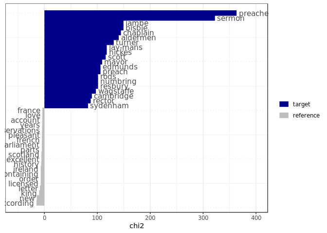

    ## 
    ## Community: 2


    ## 
    ## Community: 3

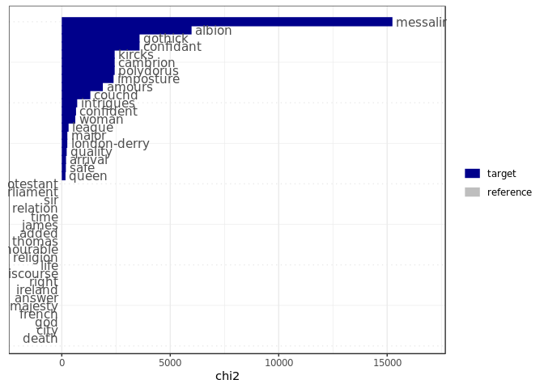

    ## 
    ## Community: 4

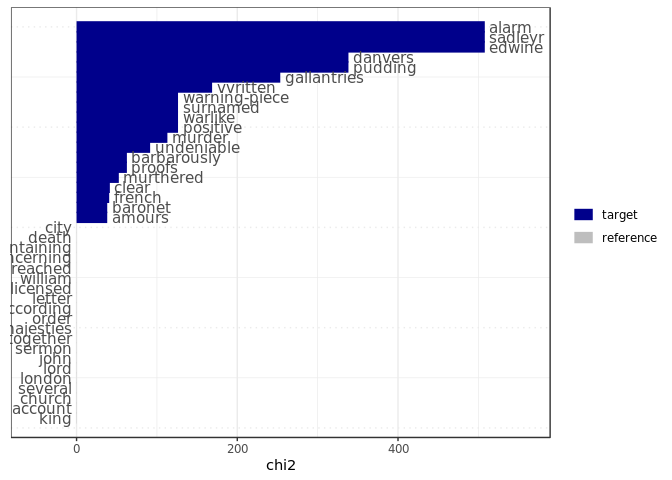

    ## 
    ## Community: 5

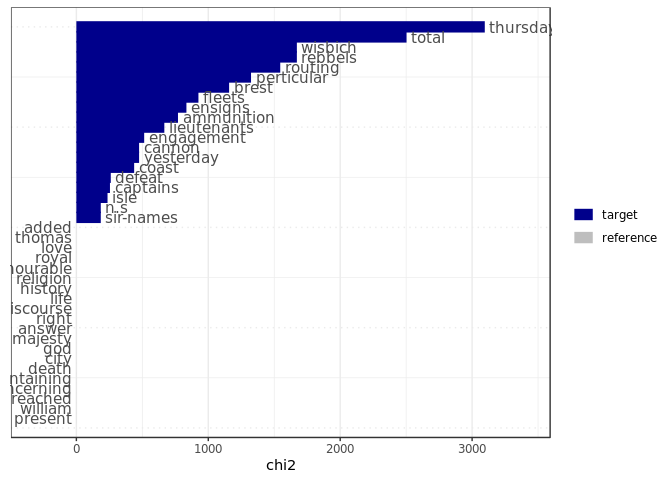

    ## 
    ## Community: 6


    ## 
    ## Community: 7


    ## 
    ## Community: 8


    ## 
    ## Community: 9


    ## 
    ## Community: 10

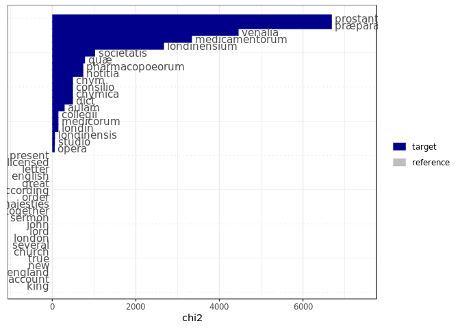

    ## 
    ## Community: 11

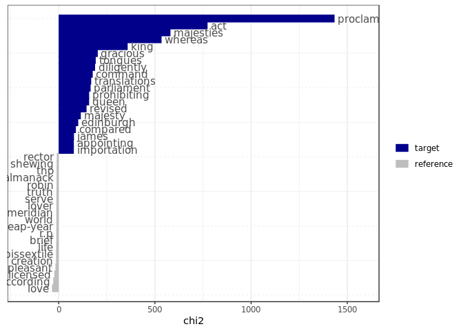

    ## 
    ## Community: 12


    ## 
    ## Community: 13


    ## 
    ## Community: 14


    ## 
    ## Community: 15

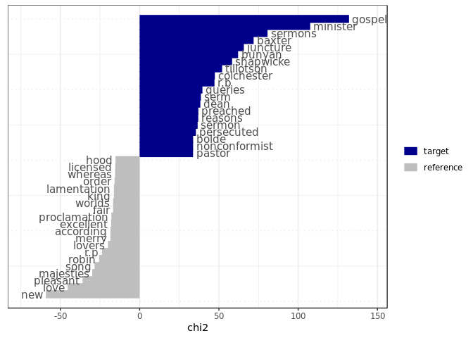

    ## 
    ## Community: 16

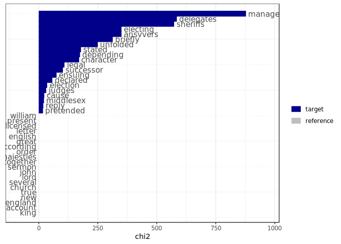

    ## 
    ## Community: 17

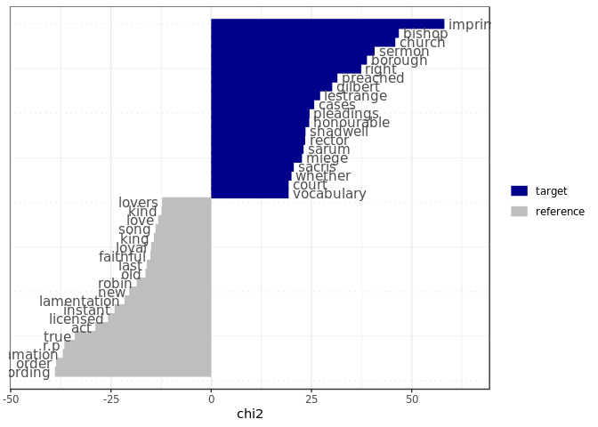

    ## 
    ## Community: 18


    ## 
    ## Community: 19


    ## 
    ## Community: 20


    ## 
    ## Community: 21

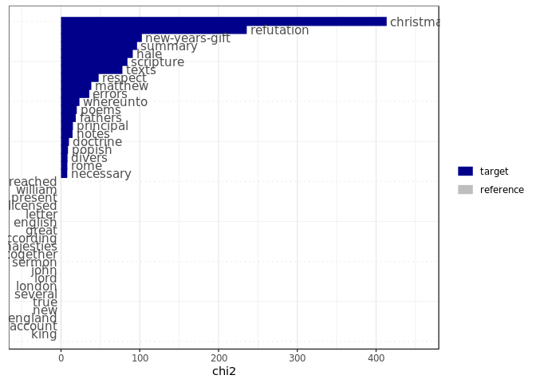

    ## 
    ##  1686-1695 
    ## 
    ## 25 top features/tokens
    ## $Community_1
    ##         king    majesties          act proclamation        queen   parliament 
    ##          256          255          212          169          143          143 
    ##      account      several    authority      william      majesty      ireland 
    ##           97           80           80           79           78           75 
    ##         lord      england      kingdom     gracious      whereas        great 
    ##           74           72           69           67           67           66 
    ##      command       london       france       letter          new        lords 
    ##           66           63           62           62           61           59 
    ##       french 
    ##           59 
    ## 
    ## $Community_10
    ##    account     french       last engagement      total     defeat      dutch 
    ##          9          6          4          4          4          3          3 
    ##      fleet       near     fleets perticular ammunition      coast      brest 
    ##          3          3          3          3          3          3          3 
    ##    routing  thursdays    england     others  majesties      taken     forces 
    ##          3          3          2          2          2          2          2 
    ##  discovery     lately  prisoners      found 
    ##          2          2          2          2 
    ## 
    ## $Community_11
    ##  majesties       king    english    several     sermon     church       john 
    ##        127        117        109        105         97         82         81 
    ##       lord      great      queen     french    england        new collection 
    ##         79         77         77         77         75         75         72 
    ## containing     letter      royal      books concerning    auction    history 
    ##         68         67         65         65         64         62         59 
    ##       true       sold   licensed       sale 
    ##         59         57         56         56 
    ## 
    ## $Community_12
    ##        john      church  containing   authority      luther     curious 
    ##           3           2           2           2           2           2 
    ##      common  directions       kings       great      popery     english 
    ##           1           1           1           1           1           1 
    ##   catalogue    scotland   majesties      french       taken        earl 
    ##           1           1           1           1           1           1 
    ## westminster       parts      rebels   contained     history      forces 
    ##           1           1           1           1           1           1 
    ##  collection 
    ##           1 
    ## 
    ## $Community_13
    ##        john      shower   discourse     preachd    soldiers     funeral 
    ##           6           6           3           3           3           3 
    ##  repentance     several      church     english        life       death 
    ##           3           2           2           2           2           2 
    ##        time      london      sermon  scriptures     shewing       pauls 
    ##           2           2           2           2           2           2 
    ##  discourses bibliotheca     auction    departed earthquakes       texts 
    ##           2           2           2           2           2           2 
    ##   doolittle 
    ##           2 
    ## 
    ## $Community_14
    ##    several   treatise       john   together     office        sir      moral 
    ##          4          3          3          2          2          2          2 
    ##  calumnies    persons   marriage        age    apology    eminent      happy 
    ##          2          2          2          2          2          2          2 
    ##      means   troubled       mind   penitent batchelors excellence  necessity 
    ##          2          2          2          2          2          2          2 
    ##       live      women        geo  directory 
    ##          2          2          2          2 
    ## 
    ## $Community_15
    ##      ever      time       new       use     april     easie     night   setting 
    ##        12         2         2         2         2         2         2         2 
    ##    rising      moon     moons      suns   readily      card       ons       law 
    ##         2         2         2         2         2         2         2         1 
    ## excellent   majesty   england  licensed  december majesties      king     queen 
    ##         1         1         1         1         1         1         1         1 
    ##   special 
    ##         1 
    ## 
    ## $Community_16
    ##    method     added      life    french practical  catholic     jesus according 
    ##         2         1         1         1         1         1         1         1 
    ##   persons  religion      four      lady      mass    mental    prayer   renderd 
    ##         1         1         1         1         1         1         1         1 
    ##       r.f   composd   francis     easie    nephew gentleman sacrifice     sorts 
    ##         1         1         1         1         1         1         1         1 
    ##   suffolk 
    ##         1 
    ## 
    ## $Community_2
    ##     england      letter      prince     present     account    licensed 
    ##          51          44          38          35          35          24 
    ##      orange        king    relating         viz      papers     affairs 
    ##          24          23          21          20          20          20 
    ##       order  collection  protestant   according    juncture     address 
    ##          19          19          19          19          18          17 
    ##     english        true      answer        lord  parliament protestants 
    ##          17          16          15          15          15          15 
    ##       lords 
    ##          14 
    ## 
    ## $Community_3
    ##    account    several    england     sermon       lord       john     church 
    ##        306        295        285        252        241        239        235 
    ##     london   preached        new    english       king        god  majesties 
    ##        228        206        195        192        185        174        172 
    ##      great    william       true  according   together   licensed containing 
    ##        168        167        160        155        154        147        147 
    ##     french      added    present     letter 
    ##        147        142        142        137 
    ## 
    ## $Community_4
    ##     sermon  majesties   preached       lord      queen   chaplain     church 
    ##         58         45         38         31         30         30         28 
    ##    command       john     london   ordinary    preachd      right       king 
    ##         28         26         26         23         23         20         20 
    ##    england    several     rector    special honourable     bishop   religion 
    ##         19         18         18         18         17         17         17 
    ##     sunday white-hall       true   majestys 
    ##         17         16         16         15 
    ## 
    ## $Community_5
    ##   licensed  according      order    account        new       king    england 
    ##        691        636        634        595        550        538        520 
    ##       true     french     church    several       lord     london     letter 
    ##        386        375        370        367        357        342        342 
    ##    english      great    present  majesties    william   together     sermon 
    ##        336        333        327        324        300        294        289 
    ##       john containing concerning    ireland 
    ##        272        271        268        263 
    ## 
    ## $Community_6
    ##      french protestants       edict        king    religion    reformed 
    ##           5           5           5           4           4           3 
    ##       added    gracious     kingdom     account      letter       given 
    ##           2           2           2           2           2           2 
    ##        full     publick prohibiting       henry   pretended grandfather 
    ##           2           2           2           2           2           2 
    ##    exercise        form concessions   perpetual     totally   subscribe 
    ##           2           2           2           2           2           2 
    ##       swear 
    ##           2 
    ## 
    ## $Community_7
    ##   allowance     account       signs vermiculars       worms     english 
    ##           5           4           4           4           4           3 
    ##    licensed       order   according      proved        best  directions 
    ##           3           3           3           3           3           2 
    ##        life       royal         new     history      france      famous 
    ##           2           2           2           2           2           2 
    ##      modern      london  historical      causes        mans       young 
    ##           2           2           2           2           2           2 
    ##     country 
    ##           2 
    ## 
    ## $Community_8
    ##   scripture      church  collection       short   principal    doctrine 
    ##           2           1           1           1           1           1 
    ##        rome      errors       plain     summary      popish       notes 
    ##           1           1           1           1           1           1 
    ##       texts  refutation         law   bankrupts    treatise    statutes 
    ##           1           1           0           0           0           0 
    ##   explained     several       cases resolutions   judgments     decrees 
    ##           0           0           0           0           0           0 
    ##      common 
    ##           0 
    ## 
    ## $Community_9
    ##      french        true      murder protestants       henry     england 
    ##           3           2           2           2           2           1 
    ##       great     english         sir     present      others       reign 
    ##           1           1           1           1           1           1 
    ##        earl         new     history       court       essex   discovery 
    ##           1           1           1           1           1           1 
    ##     general       clear        full       newly information      prince 
    ##           1           1           1           1           1           1 
    ##      orange 
    ##           1 
    ## 
    ## 
    ## Community: 1

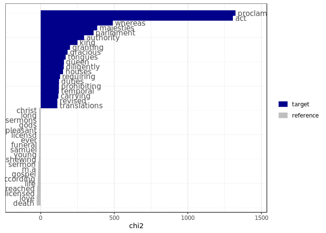

    ## 
    ## Community: 2


    ## 
    ## Community: 3


    ## 
    ## Community: 4

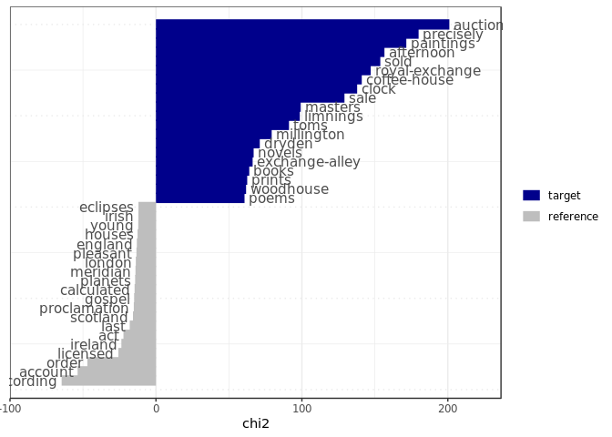

    ## 
    ## Community: 5


    ## 
    ## Community: 6


    ## 
    ## Community: 7

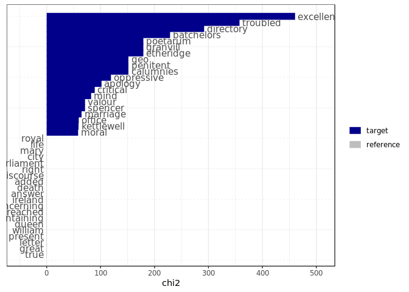

    ## 
    ## Community: 8


    ## 
    ## Community: 9


    ## 
    ## Community: 10

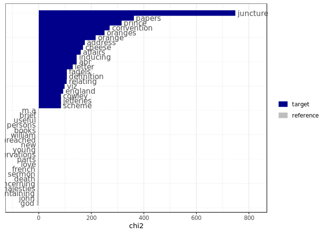

    ## 
    ## Community: 11

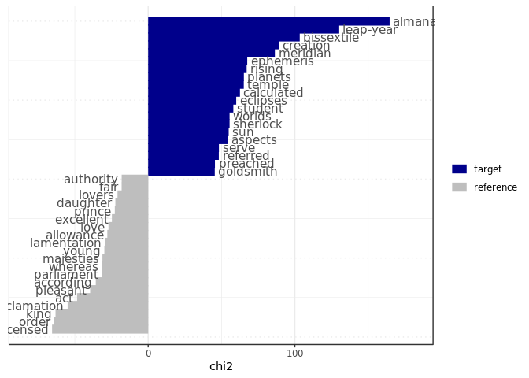

    ## 
    ## Community: 12

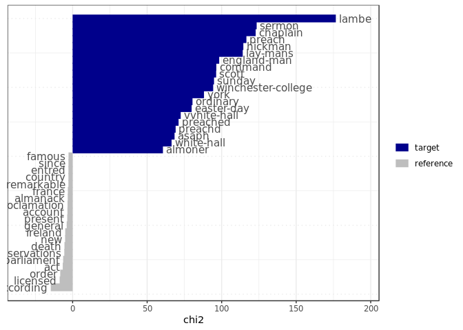

    ## 
    ## Community: 13


    ## 
    ## Community: 14


    ## 
    ## Community: 15


    ## 
    ## Community: 16


    ## 
    ##  1691-1700 
    ## 
    ## 25 top features/tokens
    ## $Community_1
    ##     sermon    several       john    english     london containing      added 
    ##         90         80         74         58         58         55         54 
    ##    account   preached    preachd    william        new   together     church 
    ##         48         48         47         45         42         41         41 
    ##       life  discourse    history     french       cure       king    england 
    ##         39         38         35         35         35         33         33 
    ##    shewing        god      right     manner 
    ##         32         32         31         30 
    ## 
    ## $Community_10
    ##      life     clare     added  religion gentleman    method      lady catholick 
    ##         4         3         2         2         2         2         2         2 
    ##    sister    warner    french practical   edition     faith     third     sorts 
    ##         2         2         1         1         1         1         1         1 
    ##  children     easie     jesus according     death   persons elizabeth      four 
    ##         1         1         1         1         1         1         1         1 
    ##      poor 
    ##         1 
    ## 
    ## $Community_11
    ##    sinners   pleasant       love        god       ways     divine       john 
    ##          4          3          3          3          3          3          3 
    ##    eminent    hayward containing       king      great    account       life 
    ##          3          3          2          2          2          2          2 
    ##    whereby       holy     choice   precious redemption    mankind  occasions 
    ##          2          2          2          2          2          2          2 
    ##    persons      sexes      blood manifested 
    ##          2          2          2          2 
    ## 
    ## $Community_12
    ##         new  collection        john       songs  directions        book 
    ##           9           6           5           5           4           4 
    ##      method         j.s    composed    organist     william        used 
    ##           4           4           4           4           3           3 
    ##      master     composd     purcell harpsichord  philosophy       parts 
    ##           3           3           3           3           2           2 
    ##      church   christian      london      choice       young     delight 
    ##           2           2           2           2           2           2 
    ##     masters 
    ##           2 
    ## 
    ## $Community_13
    ##       new      song excellent     calld     young  pleasant allowance      lady 
    ##        35        26        23        19        12         8         8         7 
    ##    french  relation      king   account gentleman       man playhouse     order 
    ##         6         6         5         5         5         5         5         4 
    ## according    musick majesties    sermon     queen   another      john      mary 
    ##         4         4         4         4         4         4         4         4 
    ##  executed 
    ##         4 
    ## 
    ## $Community_14
    ##    account    several    england     church    english        new      order 
    ##        135        120        107        102         89         88         87 
    ##     french       king containing  according    william        god       john 
    ##         84         84         83         79         77         70         70 
    ##    quakers   together   licensed     sermon      added    present     letter 
    ##         69         66         65         64         63         63         63 
    ##      great       lord      whole        use 
    ##         61         60         59         57 
    ## 
    ## $Community_15
    ##        true     account   behaviour    executed       dying      tyburn 
    ##          65          62          61          61          58          58 
    ##   criminals        last    speeches  confession   wednesday      friday 
    ##          58          57          57          47          31          24 
    ##     instant confessions        july   condemned   delivered    december 
    ##          18          15          11          10           8           8 
    ##       march       paper   september     january       april   according 
    ##           7           7           6           6           6           5 
    ##     october 
    ##           5 
    ## 
    ## $Community_16
    ##           york         church         george         sermon       preached 
    ##              3              2              2              2              2 
    ##         novemb         sunday      cathedral         halley          peter 
    ##              2              2              2              2              2 
    ## metropolitical         rector            m.a      cuthberts    bibliotheca 
    ##              2              1              1              1              0 
    ##     ashmoliana      catalogue        library        learned         famous 
    ##              0              0              0              0              0 
    ##          elias        ashmole     containing         rarest          books 
    ##              0              0              0              0              0 
    ## 
    ## $Community_17
    ##              plainly               reason               charge 
    ##                    1                    1                    1 
    ##             bringing               paying           experience 
    ##                    1                    1                    1 
    ##                provd               boards          unnecessary 
    ##                    1                    1                    1 
    ##           altogether milld-lead-sheathing                stuff 
    ##                    1                    1                    1 
    ##                plank           damageable          bibliotheca 
    ##                    1                    1                    0 
    ##           ashmoliana            catalogue              library 
    ##                    0                    0                    0 
    ##              learned               famous                elias 
    ##                    0                    0                    0 
    ##              ashmole           containing               rarest 
    ##                    0                    0                    0 
    ##                books 
    ##                    0 
    ## 
    ## $Community_2
    ##    learning     english discoveries     several  historical       never 
    ##           1           1           1           1           1           1 
    ##       order       whole        wits       world     travels      method 
    ##           1           1           1           1           1           1 
    ##       moral      divine   according       kinds        work    licensed 
    ##           1           1           1           1           1           1 
    ##        rare    contains      essays     divided        done      voyage 
    ##           1           1           1           1           1           1 
    ## recommended 
    ##           1 
    ## 
    ## $Community_3
    ##          act    majesties         king   parliament      majesty      several 
    ##          390          191          173          172          134          129 
    ##         lord       sermon proclamation      william        right       duties 
    ##          110          104          103          102          101           87 
    ##     reverend        queen          god         john      england     preached 
    ##           85           85           84           81           78           78 
    ##       bishop      present          new   honourable      whereas     granting 
    ##           77           76           74           72           66           64 
    ##          war 
    ##           63 
    ## 
    ## $Community_4
    ##       true    murther    several       last    account      great  committed 
    ##          7          7          6          6          6          5          5 
    ## principles       poem    strange    newgate       copy particular       life 
    ##          4          4          4          4          4          3          3 
    ##       love       near      world       holy  barbarous      death    persons 
    ##          3          3          3          3          3          3          3 
    ##       case      dutch      house       duke 
    ##          3          3          3          3 
    ## 
    ## $Community_5
    ##     sermon       john    english honourable       king    several        new 
    ##        195        153        143        137        133        126        122 
    ##  majesties    preachd    england     french     church    account       lord 
    ##        120        116        115        114        114        108        108 
    ##      right   chaplain      added      queen     london    william    majesty 
    ##        106        106        102        100         91         89         87 
    ##      great containing   majestys     letter 
    ##         86         85         85         82 
    ## 
    ## $Community_6
    ##         lord      england      account       london          new     almanack 
    ##          166          154          141          140          138          134 
    ##      several    according         john    leap-year   bissextile        order 
    ##          126          116          102          100           93           88 
    ##   containing      english          god         city     creation observations 
    ##           82           82           82           79           79           77 
    ##   calculated     meridian       rising       sermon      setting       useful 
    ##           77           77           76           76           76           72 
    ##     licensed 
    ##           69 
    ## 
    ## $Community_7
    ##     sermon       john    several    account     church concerning    england 
    ##        318        278        272        239        220        211        204 
    ##   minister     london     gospel       king   preached    william        god 
    ##        200        198        190        188        187        186        183 
    ##     letter     french     christ       lord  discourse      death    present 
    ##        176        170        168        163        159        154        152 
    ##      great      added    english        new 
    ##        150        149        147        144 
    ## 
    ## $Community_8
    ##    several        new    account    england       king      order    english 
    ##        252        247        214        212        178        175        164 
    ##    william  according       john   together       love       true containing 
    ##        164        164        155        144        138        138        135 
    ##      great       life     french      added       lord    present     london 
    ##        132        132        128        126        126        124        123 
    ##   licensed        god    history      death 
    ##        120        118        117        115 
    ## 
    ## $Community_9
    ##   account     order according  licensed    france      king      near    motion 
    ##         8         7         7         6         5         4         4         4 
    ##    giving  dreadful       new    london  children       use     death    county 
    ##         4         4         3         3         3         3         3         3 
    ##     dutch      john     march      duke      mary   holland      june   ireland 
    ##         3         3         3         3         3         3         3         3 
    ##   history 
    ##         2 
    ## 
    ## 
    ## Community: 1


    ## 
    ## Community: 2


    ## 
    ## Community: 3

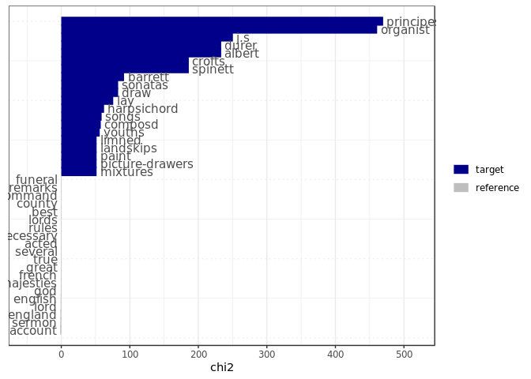

    ## 
    ## Community: 4


    ## 
    ## Community: 5


    ## 
    ## Community: 6


    ## 
    ## Community: 7

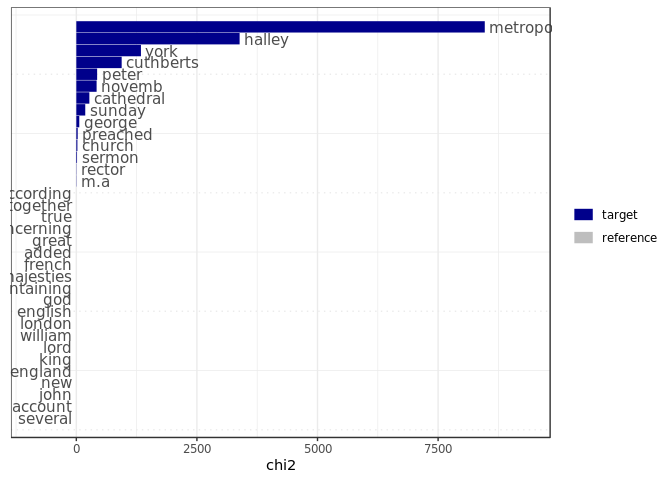

    ## 
    ## Community: 8

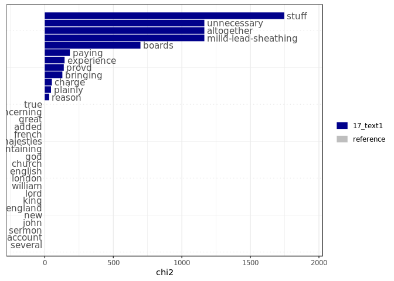

    ## 
    ## Community: 9

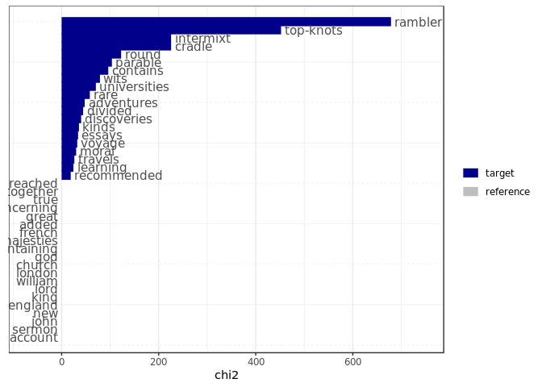

    ## 
    ## Community: 10


    ## 
    ## Community: 11


    ## 
    ## Community: 12


    ## 
    ## Community: 13


    ## 
    ## Community: 14


    ## 
    ## Community: 15

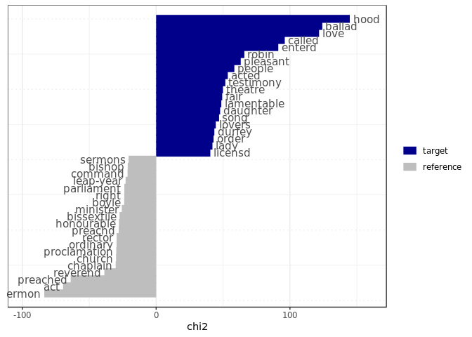

    ## 
    ## Community: 16

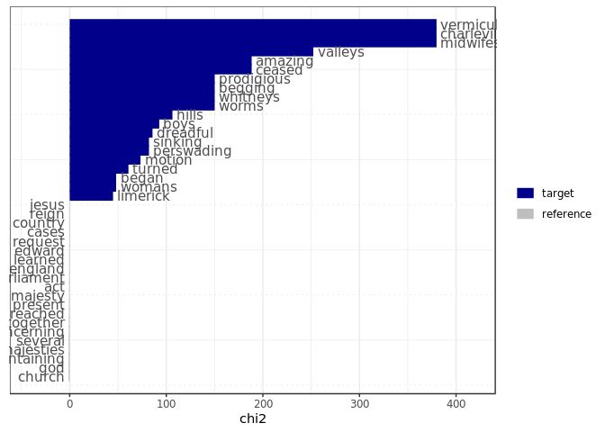

    ## 
    ## Community: 17


    ## 
    ##  1696-1705 
    ## 
    ## 25 top features/tokens
    ## $Community_1
    ##     sermon    several       john     church    england    account concerning 
    ##        406        366        359        351        305        302        255 
    ##    preachd containing    william    english       king     letter      added 
    ##        244        240        238        229        229        219        218 
    ##        new     london     french   together   minister      death      great 
    ##        216        207        183        180        171        169        164 
    ##        god  discourse   preached      whole 
    ##        164        159        159        157 
    ## 
    ## $Community_10
    ##    sinners       holy       john    hayward containing    several       life 
    ##          5          4          4          4          3          3          3 
    ##        god       ways  occasions    eminent       love     divine   pleasant 
    ##          3          3          3          3          3          3          3 
    ##       hell    praises       king      great    account    whereby      short 
    ##          3          3          2          2          2          2          2 
    ##     choice       view  gentlemen    persons 
    ##          2          2          2          2 
    ## 
    ## $Community_11
    ##      william      kingdom         king      justice      several          law 
    ##           19           18           17           15           13           13 
    ##        cases         john       common  reformation        tryal          sir 
    ##           12           11           11           11           11           10 
    ##    pleadings        baron        added         lord  westminster      persons 
    ##           10            9            8            8            8            8 
    ## declarations        chief   honourable       tryals     sheriffs       french 
    ##            8            8            8            8            8            7 
    ##          new 
    ##            7 
    ## 
    ## $Community_12
    ##         new        john        book  collection  directions       songs 
    ##           6           6           5           4           4           4 
    ##         j.s      linnen     purcell    organist      draper     william 
    ##           4           4           4           4           4           3 
    ##        used     drawing      master    composed       henry     composd 
    ##           3           3           3           3           3           3 
    ##        blow     revived      albert       durer harpsichord     english 
    ##           3           3           3           3           3           2 
    ##     majesty 
    ##           2 
    ## 
    ## $Community_13
    ##    several        new    england     sermon    account       king    english 
    ##        156        145        144        139        135        130        126 
    ##       john    history      added       lord      order containing honourable 
    ##        120        119        110        104        103        101        101 
    ##  according    william      right     church        god     letter      death 
    ##         99         97         96         94         89         86         84 
    ##    preachd    letters     london       life 
    ##         81         80         80         78 
    ## 
    ## $Community_14
    ##        great        whole  arithmetick    necessary        rules      command 
    ##            1            1            1            1            1            1 
    ##        trade introduction      variety        lower         hand        hands 
    ##            1            1            1            1            1            1 
    ##       speedy       london      fitting     performd         gill    practical 
    ##            1            1            1            1            1            1 
    ##       fairly        youth      writing      designd       adornd  merchandize 
    ##            1            1            1            1            1            1 
    ##     describd 
    ##            1 
    ## 
    ## $Community_15
    ##    several     christ containing       john     sermon        new      great 
    ##         85         71         51         51         49         48         48 
    ##        god    shewing       life       true   together      added     london 
    ##         46         45         44         44         40         40         39 
    ##      whole    english    account      parts        use     nature        man 
    ##         38         37         37         37         35         33         33 
    ##      death    william  according      sorts 
    ##         33         31         31         31 
    ## 
    ## $Community_16
    ##              plainly           experience               reason 
    ##                    1                    1                    1 
    ##               charge             bringing                provd 
    ##                    1                    1                    1 
    ##               paying          unnecessary           altogether 
    ##                    1                    1                    1 
    ##               boards                plank                stuff 
    ##                    1                    1                    1 
    ## milld-lead-sheathing           damageable             friendly 
    ##                    1                    1                    0 
    ##            discourse              english            dissenter 
    ##                    0                    0                    0 
    ##               french           protestant                  new 
    ##                    0                    0                    0 
    ##             parallel              history            catilines 
    ##                    0                    0                    0 
    ##           conspiracy 
    ##                    0 
    ## 
    ## $Community_17
    ##      spirits       libros       french       europe      account      authors 
    ##            3            3            2            2            2            2 
    ##     monsieur   historical      journal      persons         city        paper 
    ##            2            2            2            2            2            2 
    ##         bill     relation      magical      pointis    cartagena      english 
    ##            2            2            2            2            2            1 
    ## particularly   containing        years   particular         life     publishd 
    ##            1            1            1            1            1            1 
    ##        power 
    ##            1 
    ## 
    ## $Community_18
    ##      concio    botolphi      london   ecclesiae     georgii         die 
    ##           2           2           1           1           1           1 
    ##       s.t.p     publici       juris         jun     bedford    sherlock 
    ##           1           1           1           1           1           1 
    ##      clerum   decembris ecclesiarum         a.d   gulielmum londinensem 
    ##           1           1           1           1           1           1 
    ##   collegium    sionense         cal   mdcxcviii  guilielmum    unitarum 
    ##           1           1           1           1           1           1 
    ##      viculo 
    ##           1 
    ## 
    ## $Community_2
    ##          act   parliament    majesties      majesty      several         king 
    ##          407          218          186          168          129          122 
    ## proclamation     gracious      william        right      england        lords 
    ##          105           99           96           89           83           83 
    ##       duties         lord          new        queen       answer      whereas 
    ##           80           79           75           73           73           73 
    ##      account      present   honourable       houses          god   containing 
    ##           69           68           64           60           58           57 
    ##     granting 
    ##           57 
    ## 
    ## $Community_3
    ##    account    england    several     church     letter    william       king 
    ##        214        198        172        157        152        139        136 
    ## parliament     sermon       john       true    english        new concerning 
    ##        130        129        127        125        124        114        112 
    ##     french    present        god     london    majesty      added       poem 
    ##        105        104        103        100         97         95         91 
    ##     people containing       last honourable 
    ##         90         87         85         85 
    ## 
    ## $Community_4
    ##     fleet     fight    french     great   account      last     order    popery 
    ##         2         2         1         1         1         1         1         1 
    ##     birth according      john      land     march      done       sir judgments 
    ##         1         1         1         1         1         1         1         1 
    ##      high     night    friday     vvith      rare  november    damage   admiral 
    ##         1         1         1         1         1         1         1         1 
    ##       bay 
    ##         1 
    ## 
    ## $Community_5
    ##     almanack         lord         john      england          new       london 
    ##          112           95           88           82           79           79 
    ##      several      account       rising      setting   bissextile    leap-year 
    ##           75           68           66           64           64           64 
    ##   calculated       psalms      english     meridian observations     creation 
    ##           60           59           58           58           57           56 
    ##          god        whole        every     eclipses         moon         book 
    ##           51           50           49           48           46           45 
    ##      planets 
    ##           45 
    ## 
    ## $Community_6
    ##     sermon    preachd     church       john    england    account    several 
    ##        120        102         86         74         69         66         65 
    ## honourable        new    majesty    english       king   chaplain    history 
    ##         54         53         53         50         44         43         42 
    ##      right        god      great    william   reverend       lord   majestys 
    ##         42         40         39         39         38         38         38 
    ##   ordinary containing     rector        sir 
    ##         38         37         37         36 
    ## 
    ## $Community_7
    ##        french  mathematical geometrically       english       handled 
    ##             2             2             2             1             1 
    ##      dialogue         james          lord         plain         parts 
    ##             1             1             1             1             1 
    ##     geography      sciences    navigation        christ        nature 
    ##             1             1             1             1             1 
    ##  demonstrated          done          able           key       planets 
    ##             1             1             1             1             1 
    ##  institutions       enquiry   practically      doctrine      asserted 
    ##             1             1             1             1             1 
    ## 
    ## $Community_8
    ##    several        new    english       john       king    england       lord 
    ##        149        117        100         97         89         85         85 
    ##     sermon     church   together   majestys    william     london      added 
    ##         85         83         78         73         70         70         66 
    ## collection    majesty containing    account      right     french      parts 
    ##         66         65         65         64         63         62         60 
    ## honourable    preachd      acted parliament 
    ##         60         56         55         54 
    ## 
    ## $Community_9
    ##      life     every     month spiritual catholick   retreat    warner     clare 
    ##         3         2         2         2         2         2         2         2 
    ##   english    french  religion     great      time     added     third    father 
    ##         1         1         1         1         1         1         1         1 
    ## gentleman    method     roman     shewn   setting    common   edition      good 
    ##         1         1         1         1         1         1         1         1 
    ##      poor 
    ##         1 
    ## 
    ## 
    ## Community: 1


    ## 
    ## Community: 2

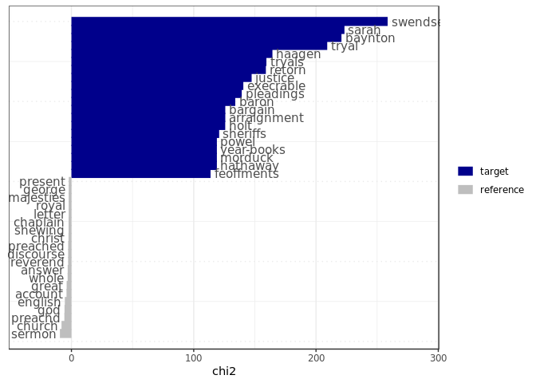

    ## 
    ## Community: 3


    ## 
    ## Community: 4


    ## 
    ## Community: 5


    ## 
    ## Community: 6

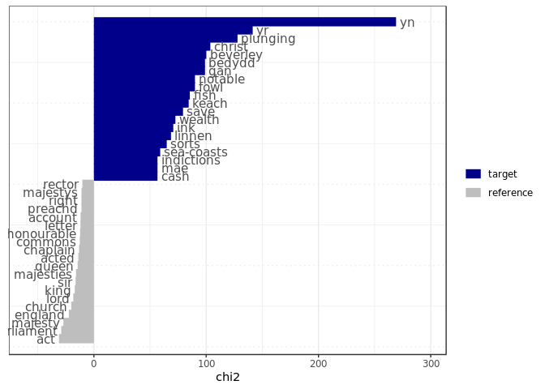

    ## 
    ## Community: 7


    ## 
    ## Community: 8

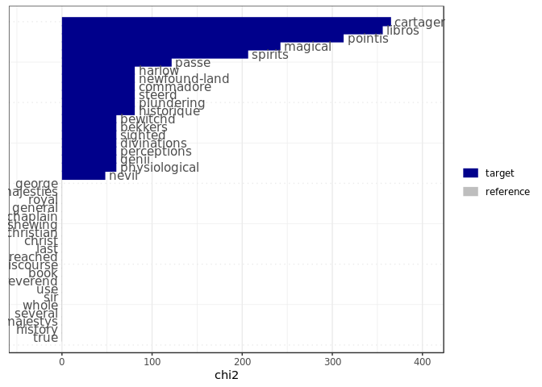

    ## 
    ## Community: 9


    ## 
    ## Community: 10


    ## 
    ## Community: 11

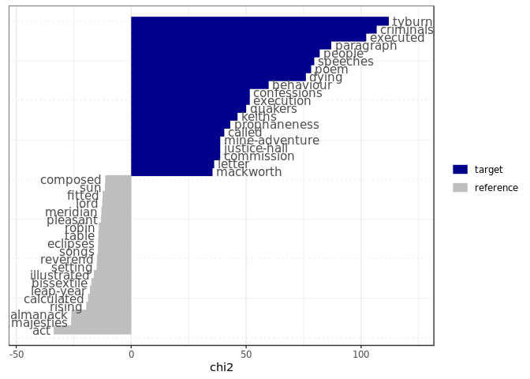

    ## 
    ## Community: 12


    ## 
    ## Community: 13


    ## 
    ## Community: 14


    ## 
    ## Community: 15

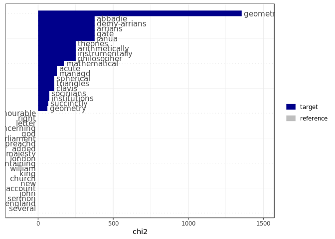

    ## 
    ## Community: 16


    ## 
    ## Community: 17


    ## 
    ## Community: 18

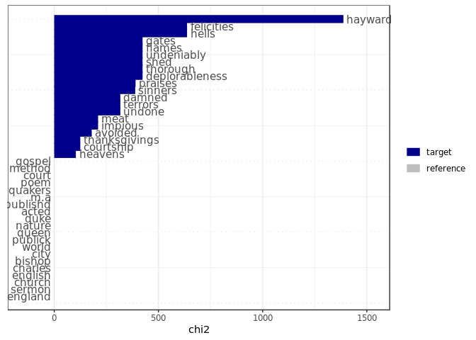

    ## 
    ##  1701-1710 
    ## 
    ## 25 top features/tokens
    ## $Community_1
    ##     sermon    preachd     church    several       john    england       lord 
    ##        703        560        517        399        379        365        345 
    ##    account      right    william honourable    majesty        new    english 
    ##        344        300        287        258        254        244        238 
    ##     letter   chaplain        god containing     london   reverend       king 
    ##        236        231        227        225        222        219        218 
    ##      great       true      added     bishop 
    ##        209        196        191        191 
    ## 
    ## $Community_10
    ##    natural      hands    variety    writing   sculpsit   ornament    bickham 
    ##          1          1          1          1          1          1          1 
    ##        lex   vadiorum        law  mortgages    treated     nature    several 
    ##          0          0          0          0          0          0          0 
    ##      sorts   provisos       deed   absolute defeazance     demise   redemise 
    ##          0          0          0          0          0          0          0 
    ##   covenant  otherwise    special    clauses 
    ##          0          0          0          0 
    ## 
    ## $Community_11
    ##     sermon    several    preachd     church containing    english    account 
    ##        144        116        114        100         96         95         90 
    ##       john    william    england        god        new      great       lord 
    ##         87         78         77         76         74         69         66 
    ##      right     french   reverend      added      whole       king        use 
    ##         65         65         64         61         61         55         54 
    ##      parts    history     london   publishd 
    ##         53         52         51         49 
    ## 
    ## $Community_12
    ##       several        london          town          life         whole 
    ##             5             4             4             3             3 
    ##         great         witty     dialogues           spy        single 
    ##             3             3             3             3             3 
    ##        subtle     intregues     macdonald         rules         added 
    ##             3             3             3             2             2 
    ##       account        laying      relating       actions       various 
    ##             2             2             2             2             2 
    ## extraordinary      greatest     ingenious       brought   discovering 
    ##             2             2             2             2             2 
    ## 
    ## $Community_13
    ##     prayers     several     england        soul       every       added 
    ##           4           3           3           3           3           2 
    ##       parts meditations       exact        week     account        time 
    ##           2           2           2           2           2           2 
    ##   discourse     actions   contained    glorious    together       hymns 
    ##           2           2           2           2           2           2 
    ##   practical      divine     ireland    flanders       birth      prayer 
    ##           2           2           2           2           2           2 
    ##     heroick 
    ##           2 
    ## 
    ## $Community_14
    ##        london        concio       sanctam       synodum archiepiscopo 
    ##             1             1             1             1             1 
    ##     episcopis         clero    provinciae cantuariensis    celebratam 
    ##             1             1             1             1             1 
    ##      ecclesia    cathedrali         pauli           die     ecclesiae 
    ##             1             1             1             1             1 
    ##     gulielmum         mdcci      sherlock     decembris       decanum 
    ##             1             1             1             1             1 
    ##           lex      vadiorum           law     mortgages       treated 
    ##             0             0             0             0             0 
    ## 
    ## $Community_15
    ##      dancing      engravd         john       french   collection         bass 
    ##            6            4            3            3            3            3 
    ##       dances       manner         four    character      authors      masters 
    ##            3            2            2            2            2            2 
    ##        essex     publishd demonstrated          new      country      figures 
    ##            2            2            2            2            2            2 
    ##       copper       plates      italian       choice        notes        steps 
    ##            2            2            2            2            2            2 
    ##   characters 
    ##            2 
    ## 
    ## $Community_16
    ##          act    majesties   parliament      majesty        queen      several 
    ##          353          211          197          161          137          123 
    ## proclamation     gracious        lords      england        right          new 
    ##          120          111           89           84           83           83 
    ##   honourable       answer       humble       church        great         john 
    ##           75           75           74           72           72           71 
    ##         anne         king         lord   containing      address      account 
    ##           71           70           67           66           66           62 
    ##       duties 
    ##           62 
    ## 
    ## $Community_2
    ##    several    england       soul        new      death       body   together 
    ##          6          5          5          5          4          4          4 
    ##       true     lisbon    express    answers     christ     london      state 
    ##          4          4          4          3          3          3          3 
    ##       duke       life     divers       john    william containing   problems 
    ##          3          3          3          3          3          3          3 
    ## generation      women  questions aristotles 
    ##          3          3          3          3 
    ## 
    ## $Community_3
    ##     sermon       john    preachd     church    several    england    account 
    ##        200        162        143        126        118        105        103 
    ##        new containing     london    history    english      added        god 
    ##         99         86         83         83         82         81         81 
    ##      great       king      death      parts     letter       lord     christ 
    ##         75         74         71         68         66         65         61 
    ##       life        use  discourse    william 
    ##         61         61         61         60 
    ## 
    ## $Community_4
    ##    anglicanæ     ecclesiæ     epistolæ        sacra          quæ   compendium 
    ##            1            1            1            1            1            1 
    ##   presbyteri      auctore       brevis       fields    veritatis        s.t.p 
    ##            1            1            1            1            1            1 
    ##     methodus     gulielmi    nicholsii      confess       quædam     accedunt 
    ##            1            1            1            1            1            1 
    ##      antonii        walæi       ethicæ aristotelicæ       normam   christianæ 
    ##            1            1            1            1            1            1 
    ##    revocatum 
    ##            1 
    ## 
    ## $Community_5
    ##   almanack       john    english       lord     psalms        new      whole 
    ##        124         86         63         61         55         54         50 
    ##       book     thomas     others      metre  collected    hopkins  sternhold 
    ##         48         44         44         43         42         42         41 
    ##     london     rising    setting        set   together      forth   meridian 
    ##         40         40         40         38         36         34         34 
    ##   churches  leap-year       sung calculated 
    ##         33         32         31         30 
    ## 
    ## $Community_6
    ##   together        sir       earl    several    william particular      court 
    ##          4          4          4          3          3          3          2 
    ##      right honourable     london       john  originals   relating    letters 
    ##          2          2          2          2          2          2          2 
    ## privileges      names      spain     temple     papers   treaties   temporal 
    ##          2          2          2          2          2          2          2 
    ##   sandwich  godolphin      parts   treatise 
    ##          2          2          1          1 
    ## 
    ## $Community_7
    ##      royal   majestys      queen     divers     oxford   problems   touching 
    ##          7          4          4          3          3          3          3 
    ## remarkable       town       bath        joy    several      court    answers 
    ##          3          3          3          3          2          2          2 
    ##      added    persons    majesty      state    england   highness       book 
    ##          2          2          2          2          2          2          2 
    ## physicians    quality    william   relation 
    ##          2          2          2          2 
    ## 
    ## $Community_8
    ##       john    quakers     christ     people        god       book      truth 
    ##         50         45         43         43         30         29         29 
    ##    account       life     called        new collection    several     answer 
    ##         28         27         27         27         25         24         24 
    ##       true concerning      brief  christian     thomas     george     divine 
    ##         24         23         21         20         19         18         18 
    ##       lord    friends      calld    servant 
    ##         17         17         17         17 
    ## 
    ## $Community_9
    ##    england    account    several     letter     church     sermon    english 
    ##        320        294        287        272        271        247        209 
    ##       john     french    present        new    preachd      added       king 
    ##        204        204        197        191        182        181        179 
    ## containing       poem       lord parliament   majestys       true      right 
    ##        175        174        172        164        152        151        147 
    ##      great    majesty      royal     london 
    ##        146        141        140        139 
    ## 
    ## 
    ## Community: 1


    ## 
    ## Community: 2


    ## 
    ## Community: 3


    ## 
    ## Community: 4


    ## 
    ## Community: 5

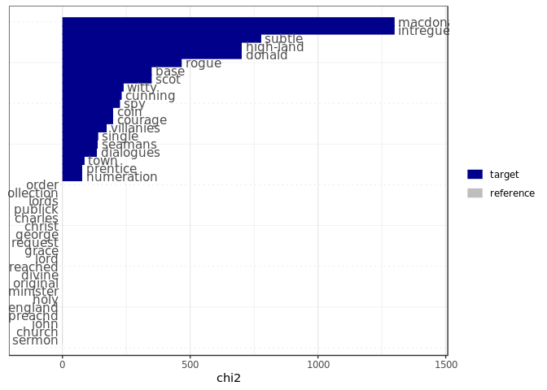

    ## 
    ## Community: 6

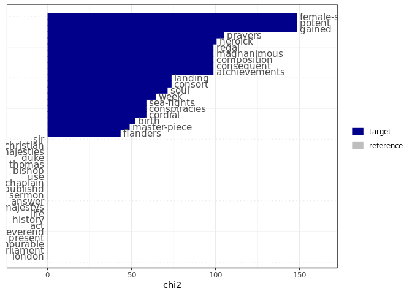

    ## 
    ## Community: 7

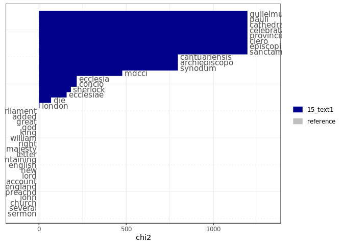

    ## 
    ## Community: 8


    ## 
    ## Community: 9

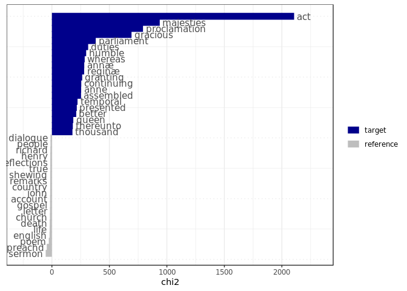

    ## 
    ## Community: 10

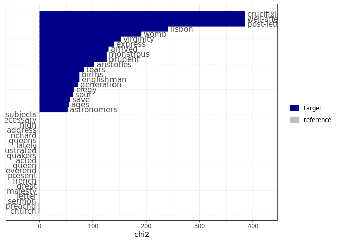

    ## 
    ## Community: 11


    ## 
    ## Community: 12

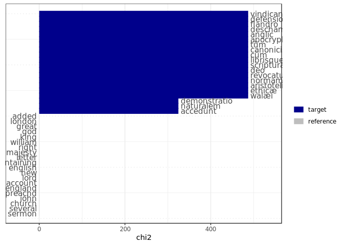

    ## 
    ## Community: 13


    ## 
    ## Community: 14

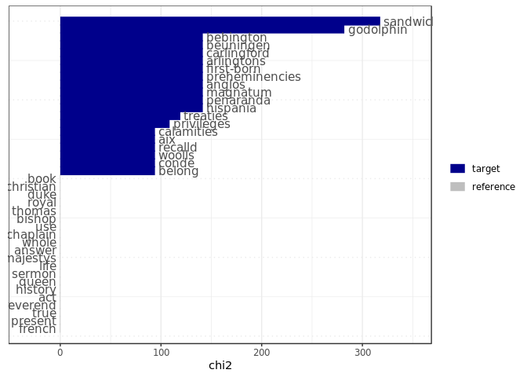

    ## 
    ## Community: 15

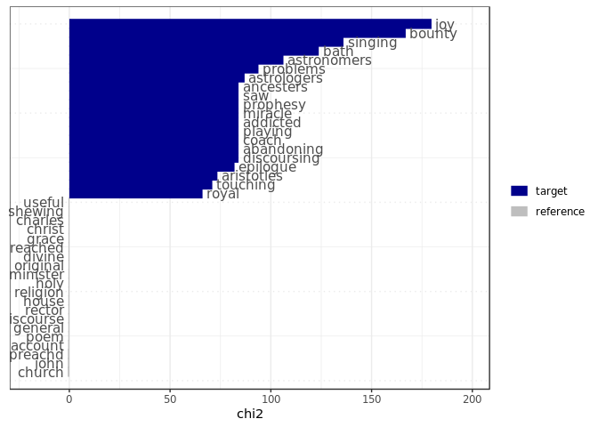

    ## 
    ## Community: 16

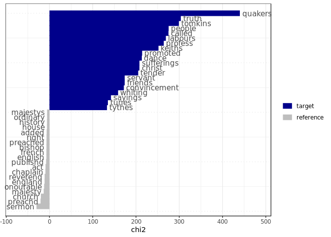

    ## 
    ##  1706-1715 
    ## 
    ## 25 top features/tokens
    ## $Community_1
    ##     sermon    preachd     church       lord    several      right    account 
    ##        346        287        262        247        233        210        196 
    ##       john    english    england    william        new        god    majesty 
    ##        193        168        161        161        159        153        148 
    ##      added   majestys honourable   chaplain   reverend     bishop containing 
    ##        146        142        141        140        139        136        135 
    ##      great   publishd concerning       king 
    ##        134        130        120        118 
    ## 
    ## $Community_10
    ##      dancing       french     françois       dances        royal          new 
    ##           11            6            6            6            5            5 
    ##         john      figures    character      country   collection     describd 
    ##            4            4            4            4            4            4 
    ##  beneficence   angleterre         très      english       method       manner 
    ##            4            4            4            3            3            3 
    ##        essex   characters demonstrated       copper       plates       master 
    ##            3            3            3            3            3            3 
    ##  protestants 
    ##            3 
    ## 
    ## $Community_11
    ##      natural      variety        hands      writing     ornament     sculpsit 
    ##            1            1            1            1            1            1 
    ##      bickham        novus     græcorum epigrammatum    poematiōn     delectus 
    ##            1            0            0            0            0            0 
    ##         nova     versione        notis        operâ        thomæ      johnson 
    ##            0            0            0            0            0            0 
    ##          a.m         usum       scholæ    etonensis      joannis         raii 
    ##            0            0            0            0            0            0 
    ##     synopsis 
    ##            0 
    ## 
    ## $Community_12
    ##    honourable          earl         smith        oxford       majesty 
    ##             3             3             3             2             2 
    ##         right          lord great-britain          gent          high 
    ##             2             2             2             2             2 
    ##        humbly      inscribd      mortimer     treasurer     principal 
    ##             2             2             2             2             1 
    ##        sacred          anne        memory      glorious         great 
    ##             1             1             1             1             1 
    ##       britain         lords       present      religion    excellency 
    ##             1             1             1             1             1 
    ## 
    ## $Community_13
    ##         last        years         four        reign      inquiry miscarriages 
    ##           14           12           12           12           12           12 
    ##        great       church        queen   parliament    pretender        bring 
    ##           10            9            9            8            8            8 
    ##        trade        taken      destroy        money        raise       queens 
    ##            7            7            7            7            7            7 
    ##        peace     relating        spain       france  particulars       scheme 
    ##            7            7            7            7            7            7 
    ##         laid 
    ##            7 
    ## 
    ## $Community_14
    ##          act    majesties       sermon      preachd      majesty        queen 
    ##          477          240          239          218          216          179 
    ##   parliament        great      several       church         lord        right 
    ##          177          133          128          125          122          120 
    ##          new         john   honourable      england     thousand proclamation 
    ##          106          102           99           98           98           98 
    ##      britain         king      hundred      william     gracious     chaplain 
    ##           95           93           90           90           87           87 
    ##       better 
    ##           84 
    ## 
    ## $Community_15
    ##     letter    account     church    several    england       lord     sermon 
    ##        240        228        207        193        185        169        164 
    ##    present       john        new      great    english      added containing 
    ##        159        156        149        142        137        137        137 
    ##       life       poem       king    history      right       true     french 
    ##        134        134        128        127        126        119        119 
    ##    preachd     bishop honourable      state 
    ##        117        109        108        106 
    ## 
    ## $Community_16
    ##        royal          new       george       french        death        court 
    ##            1            1            1            1            1            1 
    ##         town       prince        words          tho     mourning     highness 
    ##            1            1            1            1            1            1 
    ##   admonition     humility        pride       durfey     friendly         troy 
    ##            1            1            1            1            1            1 
    ##        tears      tribute       abated        lowly        novus     græcorum 
    ##            1            1            1            1            0            0 
    ## epigrammatum 
    ##            0 
    ## 
    ## $Community_17
    ##   complete    writing    natural       body    several containing      whole 
    ##          2          2          1          1          1          1          1 
    ##       maps     making    england    variety  companion delightful    various 
    ##          1          1          1          1          1          1          1 
    ##   improved     proper    christs   hospital    designs   likewise        set 
    ##          1          1          1          1          1          1          1 
    ##      hands    letters       moll      wales 
    ##          1          1          1          1 
    ## 
    ## $Community_2
    ##     people       life     christ       john    quakers    account concerning 
    ##         28         27         27         26         25         23         21 
    ##     called    friends        god       true sufferings      truth    william 
    ##         20         19         18         18         18         18         17 
    ##    servant    several      brief     thomas       lord   children     george 
    ##         17         16         16         16         14         14         13 
    ##  christian   faithful     gospel    ancient 
    ##         13         13         13         11 
    ## 
    ## $Community_3
    ##   almanack       john       lord    english        new      whole    several 
    ##        117         97         80         78         66         65         62 
    ##     psalms     others  collected       book    england        god     thomas 
    ##         55         51         48         47         45         45         44 
    ## containing    hopkins      added        set      metre  leap-year concerning 
    ##         42         38         37         37         37         37         36 
    ##     london        law  sternhold      great 
    ##         36         36         36         35 
    ## 
    ## $Community_4
    ##     sermon    preachd     letter    account       john       king    several 
    ##        361        302        253        215        205        204        171 
    ##     church    england    present      added       lord parliament      great 
    ##        171        161        147        128        128        125        122 
    ##    history   reverend    english        new     london concerning    majesty 
    ##        119        119        116        115        114        110        109 
    ## containing      death   minister     thomas 
    ##        108        108        108        106 
    ## 
    ## $Community_5
    ##       london        names    knowledge        parts      several introduction 
    ##            2            2            1            1            1            1 
    ##        short     together        every   particular     aldermen  westminster 
    ##            1            1            1            1            1            1 
    ##    wonderful     bringing     november        court          set     thursday 
    ##            1            1            1            1            1            1 
    ##         list         fair      grammar         city        forth       cities 
    ##            1            1            1            1            1            1 
    ##       tongue 
    ##            1 
    ## 
    ## $Community_6
    ##     sermon    preachd    account    several     church       lord       john 
    ##        207        172        143        124        119        108        103 
    ##      added    english       life      right containing     london        new 
    ##        102         94         94         92         85         85         83 
    ##    england honourable    history        god   chaplain       true      great 
    ##         83         80         78         78         77         76         73 
    ##    majesty      parts       king    william 
    ##         71         67         65         63 
    ## 
    ## $Community_7
    ##     sermon     church    preachd    account    england    several       john 
    ##        335        318        306        225        194        190        190 
    ##     letter       lord       king      right      great      added        new 
    ##        186        168        155        154        152        142        141 
    ##    history    majesty    present    english     london honourable   publishd 
    ##        133        125        125        123        121        121        121 
    ## containing concerning     rector       true 
    ##        118        109        106        106 
    ## 
    ## $Community_8
    ##   prophets    account  pretended      false especially      death      times 
    ##          4          3          2          2          2          2          2 
    ##    present sufferings     prince     ladies      cruel    strange      devil 
    ##          2          2          2          2          2          2          2 
    ##    english       near       last     useful      essay       life      royal 
    ##          1          1          1          1          1          1          1 
    ##       john    command      added containing 
    ##          1          1          1          1 
    ## 
    ## $Community_9
    ##       whole      tables       rates        cent       penny     hundred 
    ##           3           3           3           3           3           2 
    ##     several      london        book arithmetick    interest      simple 
    ##           2           2           2           2           2           2 
    ##         viz     present      duties     exactly merchandize    decimals 
    ##           2           2           2           2           2           2 
    ##  calculated       value     langham      broker        last       added 
    ##           2           2           2           2           1           1 
    ##     general 
    ##           1 
    ## 
    ## 
    ## Community: 1

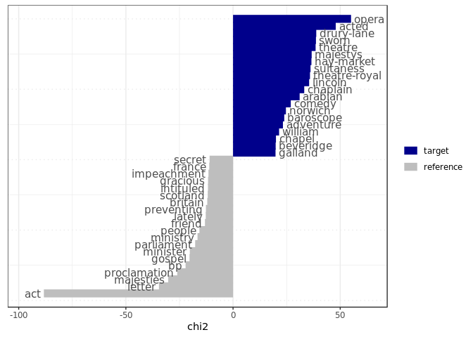

    ## 
    ## Community: 2

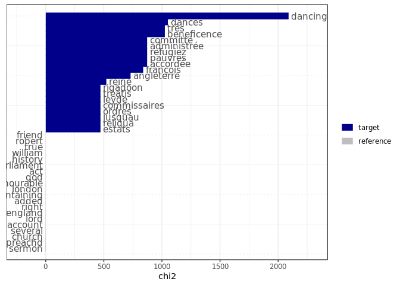

    ## 
    ## Community: 3


    ## 
    ## Community: 4


    ## 
    ## Community: 5


    ## 
    ## Community: 6

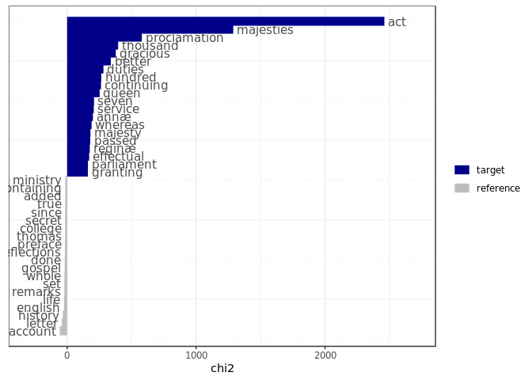

    ## 
    ## Community: 7


    ## 
    ## Community: 8


    ## 
    ## Community: 9


    ## 
    ## Community: 10

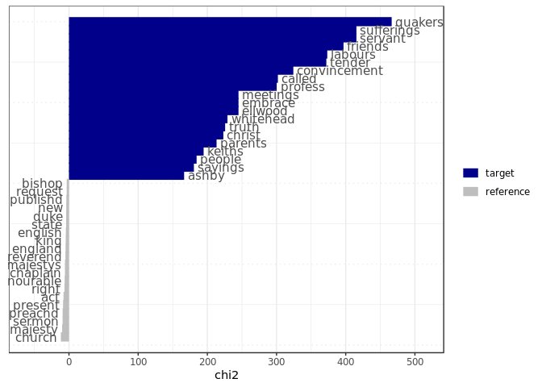

    ## 
    ## Community: 11


    ## 
    ## Community: 12

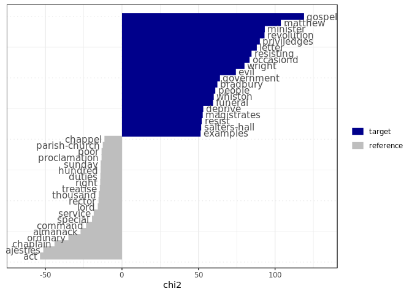

    ## 
    ## Community: 13

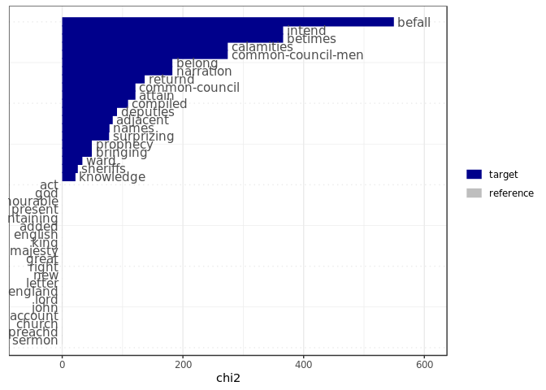

    ## 
    ## Community: 14

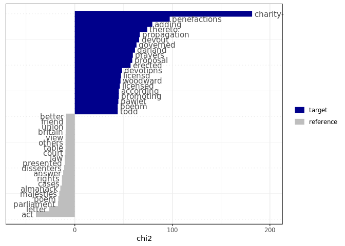

    ## 
    ## Community: 15


    ## 
    ## Community: 16


    ## 
    ## Community: 17

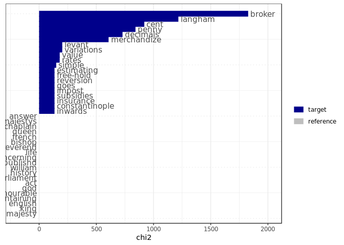

    ## 
    ##  1711-1720 
    ## 
    ## 25 top features/tokens
    ## $Community_1
    ##    several     church     sermon       lord       john    account    english 
    ##        208        155        137        130        130        128        117 
    ##       king containing    preachd      right      added    england      whole 
    ##        115        113        110        108        107         99         95 
    ##        new honourable    history    william   majestys   relating      great 
    ##         91         87         85         82         81         81         80 
    ##   together concerning    majesty        use 
    ##         71         71         69         68 
    ## 
    ## $Community_10
    ##     sermon       lord    preachd    several     bishop        new       john 
    ##        101         77         76         71         70         66         65 
    ##     letter      added        god     church containing    william      right 
    ##         65         63         61         59         58         50         49 
    ##    account    english        use   reverend     french    history concerning 
    ##         49         48         45         44         44         43         42 
    ##   publishd      whole     london   together 
    ##         42         42         39         39 
    ## 
    ## $Community_11
    ##     church    account     letter    several       lord    england containing 
    ##        351        323        315        309        253        249        225 
    ##     sermon      added       king       john    history      right        new 
    ##        225        219        209        209        196        194        184 
    ##    present     bishop      great    preachd    english       life   reverend 
    ##        181        179        175        172        163        161        160 
    ## concerning honourable     london     french 
    ##        158        143        141        141 
    ## 
    ## $Community_12
    ##         poem       settle         king      majesty      account       nature 
    ##            8            5            3            3            3            3 
    ##     treatise         last pestilential      edition  illustrated          new 
    ##            3            3            3            2            2            2 
    ##       memory        right   honourable      english       proper         used 
    ##            2            2            2            2            2            2 
    ##       french   excellency      curious    practical       joseph      learned 
    ##            2            2            2            2            2            2 
    ##      british 
    ##            2 
    ## 
    ## $Community_13
    ##       john        new       lord    english      whole   almanack containing 
    ##        100         93         89         79         75         74         72 
    ##     psalms    several       book     others   together      added    history 
    ##         65         58         57         56         54         50         48 
    ##    account  collected     thomas    england  according      diary    hopkins 
    ##         47         47         46         43         41         40         40 
    ##      metre  sternhold        god      great 
    ##         40         40         39         39 
    ## 
    ## $Community_14
    ##     sermon     letter    preachd     church    account       john       king 
    ##        496        472        420        345        323        302        301 
    ##    several       lord    england    present      added     london   reverend 
    ##        250        245        239        215        203        202        197 
    ##        god containing concerning     bishop    history      right parliament 
    ##        192        185        181        179        176        169        165 
    ##   publishd       true      great        new 
    ##        164        163        163        161 
    ## 
    ## $Community_15
    ##         proper            new         church     characters           four 
    ##              4              3              2              2              2 
    ##         musick         twenty        composd          tunes         dances 
    ##              2              2              2              2              2 
    ## country-dances         violin        hautboy          flute          added 
    ##              2              2              2              2              1 
    ##     collection        several          right       religion         sermon 
    ##              1              1              1              1              1 
    ##        preachd       chaplain          essay         rector        loyalty 
    ##              1              1              1              1              1 
    ## 
    ## $Community_16
    ##       john     people     christ    quakers    william       life    several 
    ##         22         20         16         15         14         14         13 
    ##       love sufferings      brief    account     called       true  christian 
    ##         13         13         13         12         12         11         11 
    ##    friends concerning       lord       holy    servant    epistle     tender 
    ##         11         10         10         10         10          9          9 
    ## collection        god   faithful      truth 
    ##          8          8          8          8 
    ## 
    ## $Community_17
    ##          great        britain          hands           john        english 
    ##              9              9              8              6              6 
    ##        grammar           easy writing-master        writing     accomptant 
    ##              6              5              5              5              5 
    ##          added            use     containing         useful          parts 
    ##              4              4              4              4              4 
    ##       examples        schools        bickham       sculpsit       compleat 
    ##              4              4              4              4              3 
    ##        improvd            new         making           arts          large 
    ##              3              3              3              3              3 
    ## 
    ## $Community_18
    ##    honourable          earl         smith          gent          lord 
    ##             3             3             3             2             2 
    ##         right       majesty        oxford          high great-britain 
    ##             2             2             2             2             2 
    ##      mortimer     treasurer        humbly      inscribd          anne 
    ##             2             2             2             2             1 
    ##        memory        sacred      glorious      religion           set 
    ##             1             1             1             1             1 
    ##         lords       present        others         great    excellency 
    ##             1             1             1             1             1 
    ## 
    ## $Community_19
    ##         last         four        reign        years      inquiry miscarriages 
    ##           15           14           13           13           13           13 
    ##       church        great        queen   parliament    pretender       scheme 
    ##           11           10            9            8            8            8 
    ##        money        bring      destroy        order          new        taken 
    ##            8            8            7            7            7            7 
    ##     relating        trade       france        spain       queens        peace 
    ##            7            7            7            7            7            7 
    ##  particulars 
    ##            7 
    ## 
    ## $Community_2
    ##     petiver      london       james       royal      fellow     figures 
    ##           4           2           2           2           2           2 
    ##     society        domi       socio      nomina      naturæ collectanea 
    ##           2           2           2           2           2           2 
    ##    forisque     auctori communicata      jacobo       regia  societatis 
    ##           2           2           2           2           2           2 
    ##     londini       names  containing        john     english     history 
    ##           2           1           1           1           1           1 
    ##      places 
    ##           1 
    ## 
    ## $Community_20
    ##     sermon     church    preachd    account    several       king       lord 
    ##        319        302        285        234        228        222        198 
    ##     letter    england      right      great        new       john      added 
    ##        186        180        171        163        157        149        145 
    ##     bishop    english containing    history   publishd     london honourable 
    ##        140        137        135        133        131        130        128 
    ##    present   reverend    majesty     rector 
    ##        127        117        117        114 
    ## 
    ## $Community_3
    ##        history        authors       critical        ancient         modern 
    ##             11             10              9              8              8 
    ##         oxford       writings        foreign      domestick        writers 
    ##              8              8              8              8              8 
    ##         athenæ     britannicæ       worthies       cambrige          myles 
    ##              8              8              8              7              5 
    ##         davies     dissenters       together     occasional        eminent 
    ##              5              2              2              2              2 
    ## qualifications          print           sons     manuscript           home 
    ##              2              2              2              2              2 
    ## 
    ## $Community_4
    ##  demonstrated      explaind   experiments    philosophy  experimental 
    ##             2             2             2             2             2 
    ##       william           use        making     according       account 
    ##             1             1             1             1             1 
    ##     curiously         great       curious       designd          best 
    ##             1             1             1             1             1 
    ##          last  improvements        manner copper-plates   description 
    ##             1             1             1             1             1 
    ##        number       figures      engraven    principles         given 
    ##             1             1             1             1             1 
    ## 
    ## $Community_5
    ##        new     method      order      gibbs       kept     little       cure 
    ##          3          2          2          2          1          1          1 
    ## distempers      added     extant  gentlemen     people     manage     church 
    ##          1          1          1          1          1          1          1 
    ## concerning parliament     thomas    matters    persons      essay     proper 
    ##          1          1          1          1          1          1          1 
    ##      lords   practice    present    publick 
    ##          1          1          1          1 
    ## 
    ## $Community_6
    ##   lywodraeth          a.m        allan          hen    ufudd-dod chariadoldeb 
    ##            2            1            1            1            1            1 
    ##         wedi        gosod         mewn      pregeth    adroddwyd           yn 
    ##            1            1            1            1            1            1 
    ##       eglwys         pawl          yng       ngardd      myneich           ar 
    ##            1            1            1            1            1            1 
    ##   ddydd-gwyl        ddewi          sef         dydd       cyntaf       fawrth 
    ##            1            1            1            1            1            1 
    ##       oflaen 
    ##            1 
    ## 
    ## $Community_7
    ##    writing   bubblers containing    several   englands delightful    letters 
    ##          2          2          1          1          1          1          1 
    ##     making      times    designs     proper   likewise    natural      whole 
    ##          1          1          1          1          1          1          1 
    ##      hands    christs    variety   complete    various      forms   business 
    ##          1          1          1          1          1          1          1 
    ##   hospital   memorial       body   ornament 
    ##          1          1          1          1 
    ## 
    ## $Community_8
    ##     sermon       lord     bishop    preachd   reverend      right     church 
    ##        163        144        143        138        124        110         99 
    ##   chaplain     bangor        god     rector     letter     answer honourable 
    ##         78         77         72         71         71         58         56 
    ##    majesty       john    several     father   publishd    england       king 
    ##         55         53         52         49         45         42         42 
    ##    account   ordinary   benjamin concerning 
    ##         41         41         41         39 
    ## 
    ## $Community_9
    ##          act    majesties   parliament      majesty        great      several 
    ##          490          180          169          131          109          106 
    ##         king      britain          new       better proclamation     gracious 
    ##          105           89           86           80           80           79 
    ##      hundred     thousand       making        lords        reign      england 
    ##           78           73           72           69           66           63 
    ##       duties        queen         lord    intituled      present        right 
    ##           62           59           58           58           57           56 
    ##       answer 
    ##           56 
    ## 
    ## 
    ## Community: 1

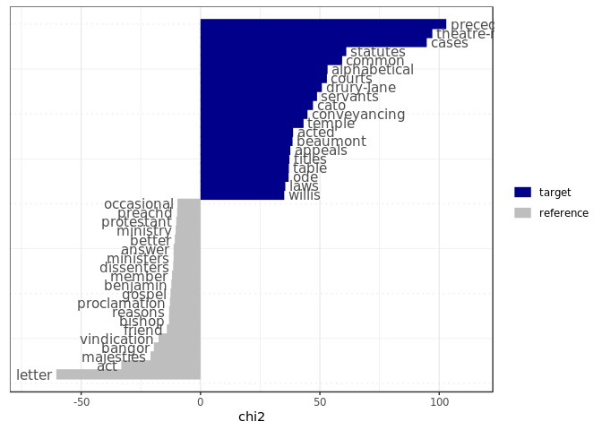

    ## 
    ## Community: 2

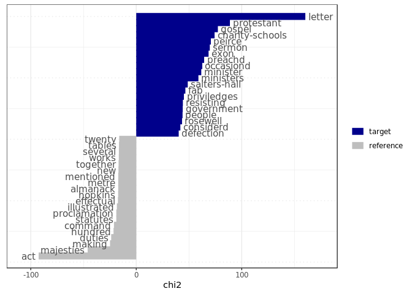

    ## 
    ## Community: 3

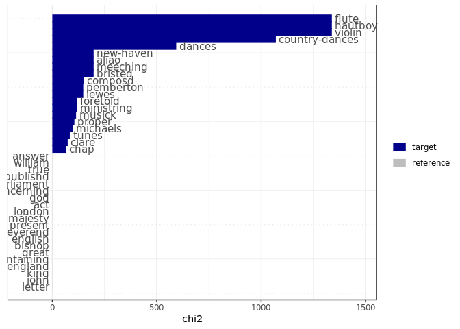

    ## 
    ## Community: 4


    ## 
    ## Community: 5


    ## 
    ## Community: 6

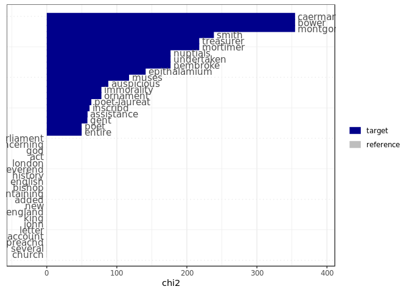

    ## 
    ## Community: 7


    ## 
    ## Community: 8

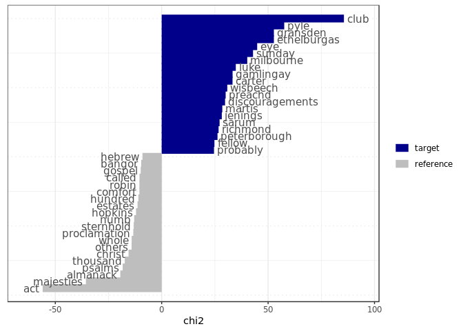

    ## 
    ## Community: 9

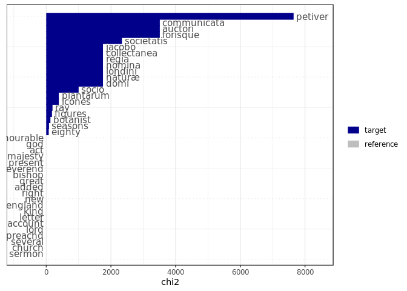

    ## 
    ## Community: 10


    ## 
    ## Community: 11

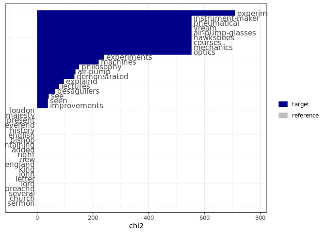

    ## 
    ## Community: 12


    ## 
    ## Community: 13


    ## 
    ## Community: 14

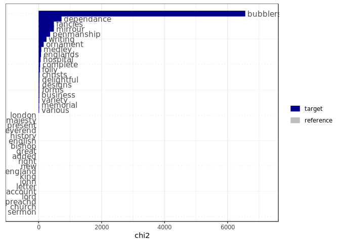

    ## 
    ## Community: 15

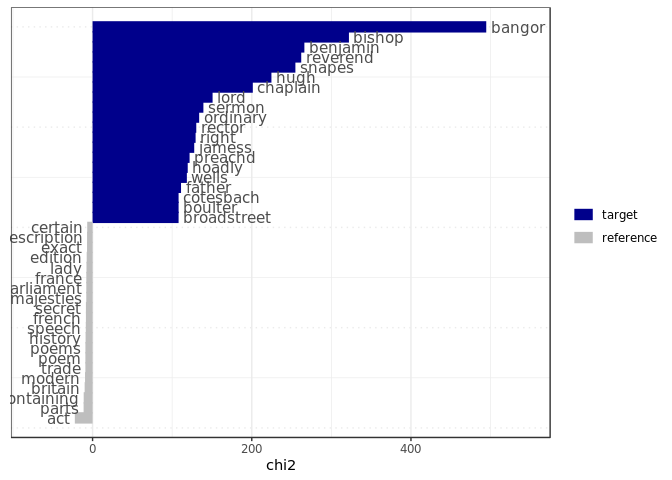

    ## 
    ## Community: 16

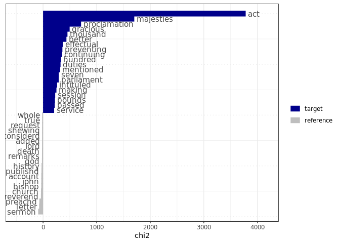

    ## 
    ## Community: 17

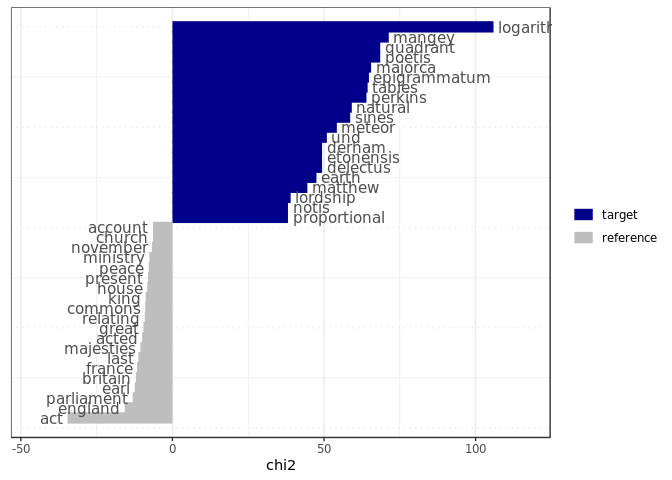

    ## 
    ## Community: 18


    ## 
    ## Community: 19


    ## 
    ## Community: 20


    ## 
    ##  1716-1725 
    ## 
    ## 25 top features/tokens
    ## $Community_1
    ##    several containing    account      added    english   together     church 
    ##        194        154        117        110        107        104        101 
    ##        use        new       john       lord    history     french        sir 
    ##        100         93         93         90         88         84         83 
    ##       laws       king    england   relating       time    persons      great 
    ##         79         75         75         75         73         71         70 
    ##      parts      whole        law    william 
    ##         68         68         67         66 
    ## 
    ## $Community_10
    ##   south-sea   directors proceedings    relation     reports     commons 
    ##           6           4           3           3           3           3 
    ##     company       house   committee     secrecy     account         a.m 
    ##           3           3           3           3           2           2 
    ##       added  archbishop       names      others       great       money 
    ##           2           2           2           2           2           2 
    ##    relating    appendix    mentiond  parliament   otherwise      report 
    ##           2           2           2           2           2           2 
    ## vindication 
    ##           2 
    ## 
    ## $Community_11
    ##       king        new       john      added     dunton     church    nothing 
    ##         19         19         18         17         17         16         15 
    ##    account     letter    history      great      state        god       neck 
    ##         14         14         13         13         13         12         12 
    ## protestant    england      whole        mad       life     london   majestys 
    ##         11         10         10         10          9          9          9 
    ##      right       true      loyal containing 
    ##          9          9          9          8 
    ## 
    ## $Community_12
    ##      mayor        die     martis       king    history       city    several 
    ##          9          8          6          5          5          4          4 
    ##       lord     george      right    georgii          ⁰       book     london 
    ##          4          4          4          4          4          3          3 
    ##        new     thomas       earl       john honourable      court        act 
    ##          3          3          3          3          3          3          3 
    ##    italian   abstract      regis     garter 
    ##          3          3          3          3 
    ## 
    ## $Community_13
    ##     people    quakers     christ       john    william       love  christian 
    ##         11         11         10         10          8          8          8 
    ##       true     called       holy    epistle    warning      brief    friends 
    ##          7          7          6          6          6          6          6 
    ##    baptism        god       lord     advice    servant       life concerning 
    ##          6          5          5          5          5          4          4 
    ##     answer    several     george    serious 
    ##          4          4          4          4 
    ## 
    ## $Community_14
    ##     letter     church    england    several     bishop    account       king 
    ##         65         59         46         43         42         40         36 
    ##     answer   reverend       lord        new     sermon concerning     london 
    ##         34         34         32         30         29         28         28 
    ##       john      added containing      whole       true      house    present 
    ##         28         27         26         25         25         25         24 
    ##    william    preachd    remarks        sir 
    ##         23         23         23         22 
    ## 
    ## $Community_15
    ##     petiver      london     figures      fellow       royal       james 
    ##           4           2           2           2           2           2 
    ##  societatis     society        domi       socio      jacobo    forisque 
    ##           2           2           2           2           2           2 
    ##     londini       regia      naturæ collectanea     auctori communicata 
    ##           2           2           2           2           2           2 
    ##  containing    hitherto       names      plants     english     history 
    ##           1           1           1           1           1           1 
    ##    botanist 
    ##           1 
    ## 
    ## $Community_16
    ##   history      sons     titus occasions     order       war  compleat    manner 
    ##         2         2         2         1         1         1         1         1 
    ##      john     taken    divers      wars  tragical     means       act    fought 
    ##         1         1         1         1         1         1         1         1 
    ##    little according  daughter     merry   fortune  exploits      fall      moor 
    ##         1         1         1         1         1         1         1         1 
    ##       foe 
    ##         1 
    ## 
    ## $Community_17
    ##        new     psalms     church    several containing      whole        sir 
    ##         16         13         12         12         10         10          7 
    ##      added        use      great concerning       holy    england       lord 
    ##          7          7          7          6          6          6          6 
    ##     useful      parts    history      rules      state       john      tunes 
    ##          6          6          6          6          6          6          6 
    ##    version     answer     method     proper 
    ##          6          5          5          5 
    ## 
    ## $Community_2
    ##   lywodraeth          a.m        allan     philipps          hen          sef 
    ##            2            1            1            1            1            1 
    ##           ar    ufudd-dod chariadoldeb         wedi        gosod         mewn 
    ##            1            1            1            1            1            1 
    ##      pregeth    adroddwyd           yn       eglwys         pawl          yng 
    ##            1            1            1            1            1            1 
    ##       ngardd      myneich   ddydd-gwyl        ddewi         dydd       cyntaf 
    ##            1            1            1            1            1            1 
    ##       fawrth 
    ##            1 
    ## 
    ## $Community_3
    ##      account         city      several          use     explaind demonstrated 
    ##            2            2            2            2            2            2 
    ##   philosophy experimental  experiments      william   containing  protestants 
    ##            2            2            2            1            1            1 
    ##         king       church     passages        added      england          law 
    ##            1            1            1            1            1            1 
    ##      country       george      majesty          viz         best      figures 
    ##            1            1            1            1            1            1 
    ##    curiously 
    ##            1 
    ## 
    ## $Community_4
    ## containing    several    account     church       john      added    english 
    ##        234        227        196        160        152        151        147 
    ##       lord     sermon        new      right    england    history    preachd 
    ##        141        140        138        132        131        126        115 
    ##        use   publishd       life     london       true      great       king 
    ##        114        112        110        105        104        103        101 
    ##   together honourable      parts     french 
    ##         98         98         97         96 
    ## 
    ## $Community_5
    ##       lord     church     sermon    several       john      right    preachd 
    ##        208        193        186        181        177        162        137 
    ##     bishop        new   together containing     letter    english    william 
    ##        136        132        122        118        117        112        110 
    ##   reverend honourable    account      added        god        use    england 
    ##        106        100         99         97         94         93         92 
    ##     thomas      whole        sir       king 
    ##         89         88         84         84 
    ## 
    ## $Community_6
    ##       john       lord   almanack containing        new      whole    english 
    ##         94         85         74         73         73         71         70 
    ##     psalms       book     others  collected     thomas   together      diary 
    ##         59         55         55         50         49         46         46 
    ##    history      metre  sternhold    hopkins    account        set        god 
    ##         43         42         42         42         41         37         36 
    ##    several      great      songs   churches 
    ##         36         35         35         35 
    ## 
    ## $Community_7
    ##     letter     sermon    account    preachd     church    several       john 
    ##        474        431        389        350        337        334        329 
    ##    england       lord      added     london       king    history containing 
    ##        268        265        255        248        236        234        231 
    ##      great        new    present   reverend     answer       true    english 
    ##        228        224        223        219        206        191        188 
    ## concerning   publishd    publick      right 
    ##        187        186        185        185 
    ## 
    ## $Community_8
    ##        act     sermon parliament      great       lord    several    preachd 
    ##        434        165        144        133        127        122        114 
    ##     church       king     county    majesty      right     bishop        new 
    ##        113        110        110        107         96         89         88 
    ##     london    britain  majesties     making        god   reverend     better 
    ##         84         83         82         80         74         72         71 
    ##       john      reign    persons     rector 
    ##         69         68         65         65 
    ## 
    ## $Community_9
    ##      bishop    reverend        lord      bangor      sermon     preachd 
    ##          93          83          73          73          67          53 
    ##      letter      church       right         god      answer    benjamin 
    ##          52          48          48          41          39          35 
    ##      father      rector  concerning     several    chaplain      snapes 
    ##          31          29          24          24          24          23 
    ##     majesty   christian westminster      clarke        king    relating 
    ##          22          20          20          20          18          18 
    ##  honourable 
    ##          18 
    ## 
    ## 
    ## Community: 1


    ## 
    ## Community: 2

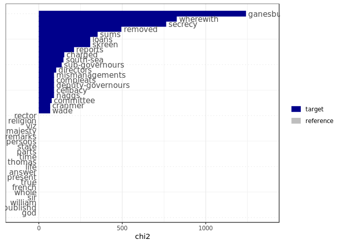

    ## 
    ## Community: 3


    ## 
    ## Community: 4

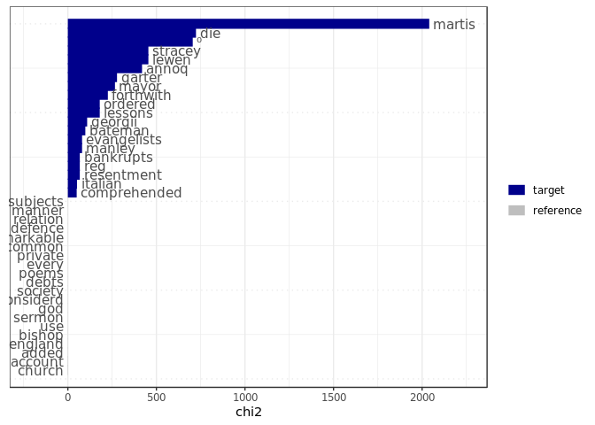

    ## 
    ## Community: 5


    ## 
    ## Community: 6

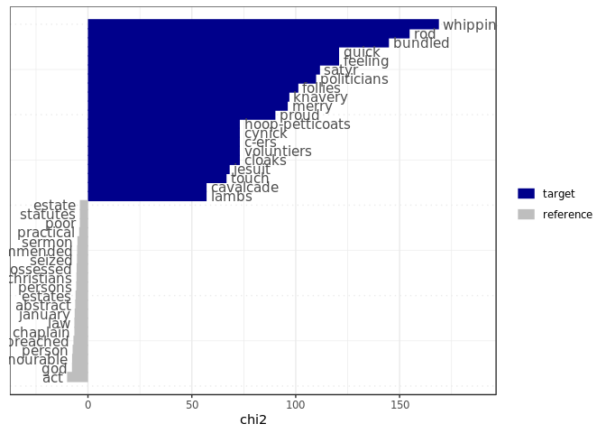

    ## 
    ## Community: 7


    ## 
    ## Community: 8

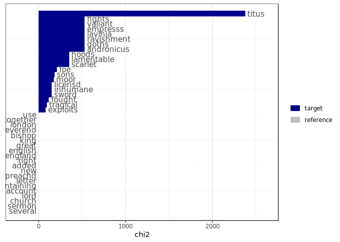

    ## 
    ## Community: 9


    ## 
    ## Community: 10

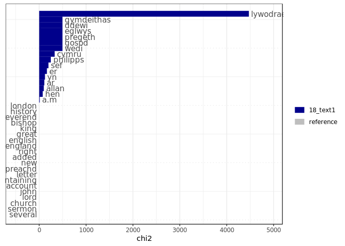

    ## 
    ## Community: 11


    ## 
    ## Community: 12


    ## 
    ## Community: 13


    ## 
    ## Community: 14

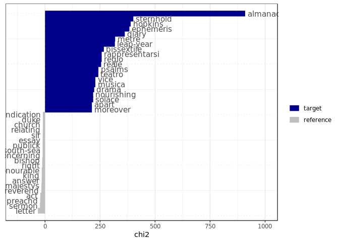

    ## 
    ## Community: 15


    ## 
    ## Community: 16

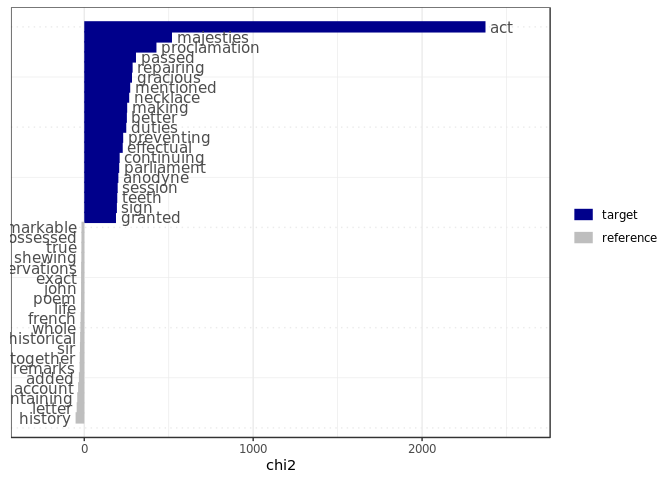

    ## 
    ## Community: 17

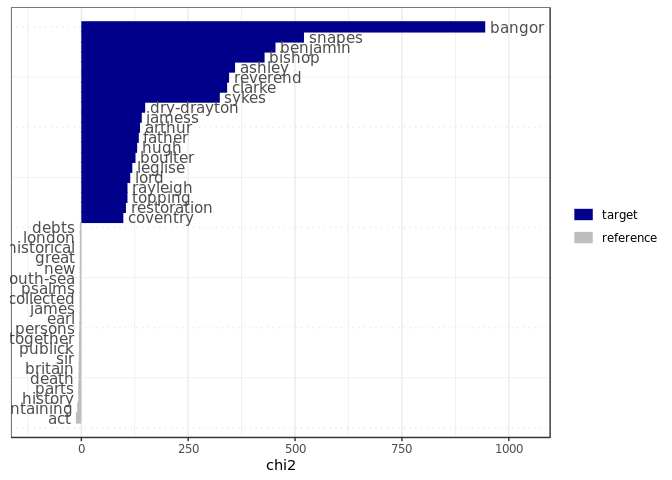

    ## 
    ##  1721-1730 
    ## 
    ## 25 top features/tokens
    ## $Community_1
    ##        act     county    several parliament       lord       king      great 
    ##        390        172        170        162        153        138        136 
    ## containing     sermon      right     church    majesty    persons        new 
    ##        124        121        121        115        108        108        107 
    ##   together   majestys    britain    preachd      added    english       time 
    ##        101         99         93         93         90         89         89 
    ##        god     london honourable    account 
    ##         89         84         83         82 
    ## 
    ## $Community_10
    ##          sermon        preached             god            lord           right 
    ##              49              31              30              26              24 
    ##            john          bishop     anniversary          london   parish-church 
    ##              23              23              23              22              22 
    ##        reverend           peace          father           grand         meeting 
    ##              21              20              20              20              19 
    ##     mary-le-bow         preachd        children charity-schools     westminster 
    ##              19              18              17              17              16 
    ##          church           parts          gospel            jury             use 
    ##              16              15              15              15              14 
    ## 
    ## $Community_11
    ##        new    account     letter    several      great       true containing 
    ##         56         55         53         39         39         36         33 
    ##      added parliament     ballad       life       lord    history       john 
    ##         32         31         31         29         28         26         25 
    ##     lately    remarks     answer    english     london       last       poem 
    ##         24         23         23         21         21         20         20 
    ##    present     thomas     friend       king 
    ##         19         19         19         18 
    ## 
    ## $Community_12
    ##    several        new       book     duties     tables navigation        use 
    ##         12         10         10         10          9          8          7 
    ##      rates      parts      whole      pilot    shewing        act   relating 
    ##          7          6          6          6          5          5          5 
    ##    english honourable      place describing    islands      every   together 
    ##          5          5          5          5          5          4          4 
    ##      added      table       acts    natural 
    ##          4          4          4          4 
    ## 
    ## $Community_13
    ##       book   almanack       john       lord        new     psalms      whole 
    ##         85         83         80         79         77         73         72 
    ##    english  collected containing     thomas     others      metre  sternhold 
    ##         63         54         51         46         45         43         42 
    ##    hopkins   together     london      tunes        set        god       cure 
    ##         42         41         39         38         37         37         37 
    ##   churches  leap-year      parts    account 
    ##         36         36         35         34 
    ## 
    ## $Community_14
    ##    south-sea    directors      reports  proceedings        house      commons 
    ##            5            4            3            3            3            3 
    ##     relation    committee      secrecy      account        added      charged 
    ##            3            3            3            2            2            2 
    ##       others     relating        great        names    otherwise     appendix 
    ##            2            2            2            2            2            2 
    ##         list consecration   archbishop    lordships          a.m      company 
    ##            2            2            2            2            2            2 
    ##  vindication 
    ##            2 
    ## 
    ## $Community_15
    ##          new        right       sermon     preached      several       clergy 
    ##            5            5            4            4            4            4 
    ##        books       london         lord         john        mayor        vicar 
    ##            4            4            4            4            4            3 
    ##      account      england         king          law      english      history 
    ##            3            3            3            3            3            3 
    ##       church   concerning introduction         earl       george     chaplain 
    ##            3            3            3            3            3            3 
    ##   honourable 
    ##            3 
    ## 
    ## $Community_16
    ##     account         use  particular       every        fish  especially 
    ##           1           1           1           1           1           1 
    ##        best     authors         viz   extracted description       whole 
    ##           1           1           1           1           1           1 
    ## illustrated     adapted     whereon    publishd     hundred   curiously 
    ##           1           1           1           1           1           1 
    ##      plates        book     animals        bird       birds    children 
    ##           1           1           1           1           1           1 
    ##    engraved 
    ##           1 
    ## 
    ## $Community_17
    ##        new      sizes  copy-book    account    england    shewing containing 
    ##          2          2          2          1          1          1          1 
    ##      exact      great     london    another       time  beginning        end 
    ##          1          1          1          1          1          1          1 
    ##     copies    letters       true       john    bristol  salisbury     exeter 
    ##          1          1          1          1          1          1          1 
    ##   quantity     pieces     middle        sun 
    ##          1          1          1          1 
    ## 
    ## $Community_18
    ##    several containing        new       john    account    english     sermon 
    ##        272        234        218        212        201        198        190 
    ##     church      added       lord    history      right    preachd      whole 
    ##        179        166        155        146        145        145        143 
    ##        use   together     french      parts    england     thomas     london 
    ##        138        122        121        118        116        114        112 
    ##      great       life   reverend    william 
    ##        111        108        106        105 
    ## 
    ## $Community_19
    ##          use          new  description       sector        lines       nature 
    ##            7            5            5            5            4            4 
    ##       common      general demonstrated         laid construction        short 
    ##            4            4            4            4            4            3 
    ##      account        great       method   navigation         uses         easy 
    ##            3            3            3            3            3            3 
    ##       places      numbers      briefly   artificial      plainly     problems 
    ##            3            3            3            3            3            3 
    ##        sines 
    ##            3 
    ## 
    ## $Community_2
    ##           new       several         acted theatre-royal          john 
    ##            38            36            36            36            33 
    ##        letter         added      majestys    containing        london 
    ##            27            26            26            23            23 
    ##          list        sermon       edition         opera       english 
    ##            23            22            22            22            21 
    ##    concerning           sir         great        french         tunes 
    ##            21            21            20            20            19 
    ##        church      servants        musick       country         civil 
    ##            19            19            19            18            18 
    ## 
    ## $Community_20
    ##    several containing      shire        new    account      great    history 
    ##         25         19         18         16         13         13         12 
    ##     church      years      whole      lives     shires      parts     useful 
    ##         12         11         10         10         10          9          9 
    ##        use      added collection navigation       john       king    english 
    ##          8          8          8          8          8          7          7 
    ##    general       done      world       maps 
    ##          7          7          7          7 
    ## 
    ## $Community_21
    ##     sermon       john    preachd   reverend      death    several        new 
    ##        206        157        142        120         89         82         79 
    ##      added       life        god     christ     letter    request   preached 
    ##         76         69         68         68         64         64         63 
    ##     thomas   publishd    account   religion  christian    sermons     church 
    ##         63         62         61         61         54         54         51 
    ##     answer concerning  ministers  discourse 
    ##         50         49         45         44 
    ## 
    ## $Community_3
    ##       leglise         grace         regni        angliæ      relation 
    ##             2             1             1             1             1 
    ##       imperio   serenissimæ           piæ  potentissimæ        reginæ 
    ##             1             1             1             1             1 
    ##    elizabethæ       religio    gubernatio ecclesiastica           dun 
    ##             1             1             1             1             1 
    ##        piazza     veritable     succincte  linquisition    procedures 
    ##             1             1             1             1             1 
    ##         comme      pratique        italie    represente           cas 
    ##             1             1             1             1             1 
    ## 
    ## $Community_4
    ##    account     letter      great    several     london containing    history 
    ##        237        223        222        199        183        177        169 
    ##      added       john     church       lord    england        new      right 
    ##        164        155        154        147        146        146        146 
    ##       true honourable       poem   together     sermon       king    english 
    ##        144        130        129        128        125        122        122 
    ##        sir    present    publick       life 
    ##        119        118        115        112 
    ## 
    ## $Community_5
    ##     history        lord     several       great      bishop      french 
    ##          36          29          27          25          24          24 
    ##     account      london       right     english    original        king 
    ##          23          23          20          19          18          17 
    ##         new illustrated       added  containing  honourable        life 
    ##          17          16          15          14          14          14 
    ##      france   cambridge     england       parts       whole       royal 
    ##          14          14          13          13          13          13 
    ##        john 
    ##          13 
    ## 
    ## $Community_6
    ##      parts        new    anthems      tunes consisting   organist     proper 
    ##          5          5          4          3          3          3          2 
    ##    variety    william supplement     psalms   measures    composd     select 
    ##          2          2          2          2          2          2          2 
    ##       john     bishop       four        six    college  different     musick 
    ##          2          2          2          2          2          2          2 
    ##      score      croft      found    shewing 
    ##          2          2          1          1 
    ## 
    ## $Community_7
    ##      sheeles        taken          set   collection        hymns      composd 
    ##            2            1            1            1            1            1 
    ##         john       divine         odes       musick        suits      lessons 
    ##            1            1            1            1            1            1 
    ##   spectators         lark   harpsicord     spinnett          sky      cantate 
    ##            1            1            1            1            1            1 
    ##         arie    stromenti     dedicate   excellenza         sigr         duca 
    ##            1            1            1            1            1            1 
    ## queensberrij 
    ##            1 
    ## 
    ## $Community_8
    ##    several        new    account containing      added    english    history 
    ##        185        132        130        130        127        110        107 
    ##     church       john     french     letter     london       life     sermon 
    ##         96         95         93         86         81         81         80 
    ##      whole      great        use       lord    england    william     method 
    ##         74         71         70         69         67         65         65 
    ##       true    present honourable   publishd 
    ##         62         61         61         60 
    ## 
    ## $Community_9
    ##       sermon          set        forth      william        march      preachd 
    ##            2            2            2            2            2            2 
    ##    excellent       sacred       memory       friday       nature     practice 
    ##            1            1            1            1            1            1 
    ##         lord    judgments      charity         true       george        right 
    ##            1            1            1            1            1            1 
    ##       father          god   honourable         love         life         gods 
    ##            1            1            1            1            1            1 
    ## resurrection 
    ##            1 
    ## 
    ## 
    ## Community: 1


    ## 
    ## Community: 2

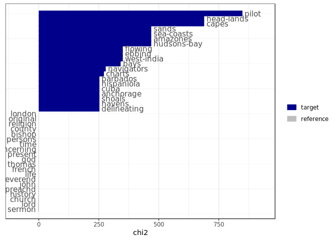

    ## 
    ## Community: 3


    ## 
    ## Community: 4

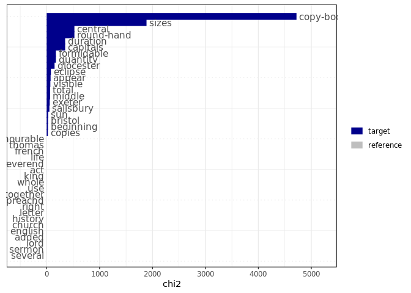

    ## 
    ## Community: 5

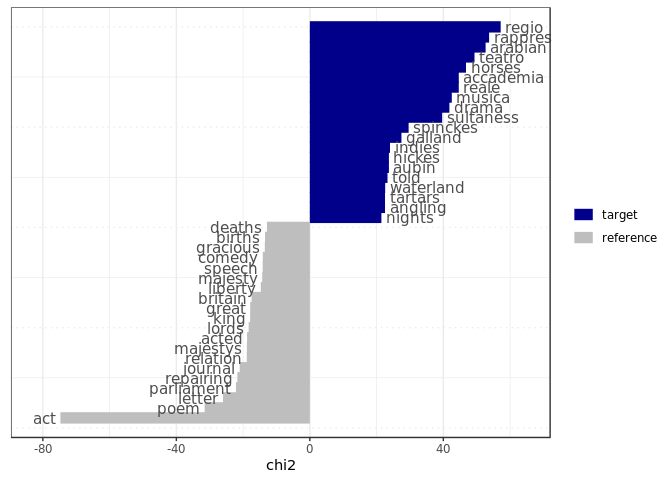

    ## 
    ## Community: 6

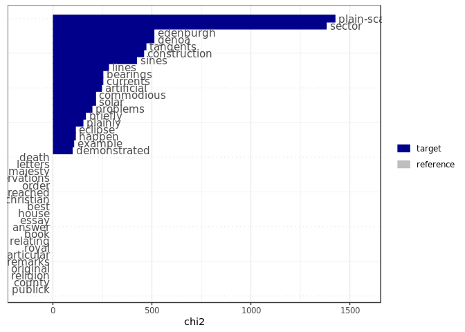

    ## 
    ## Community: 7

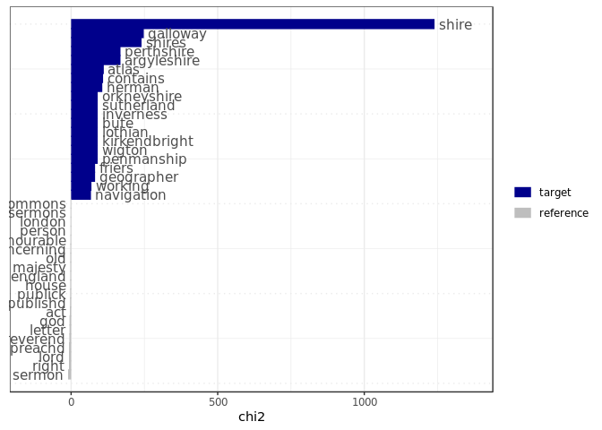

    ## 
    ## Community: 8


    ## 
    ## Community: 9

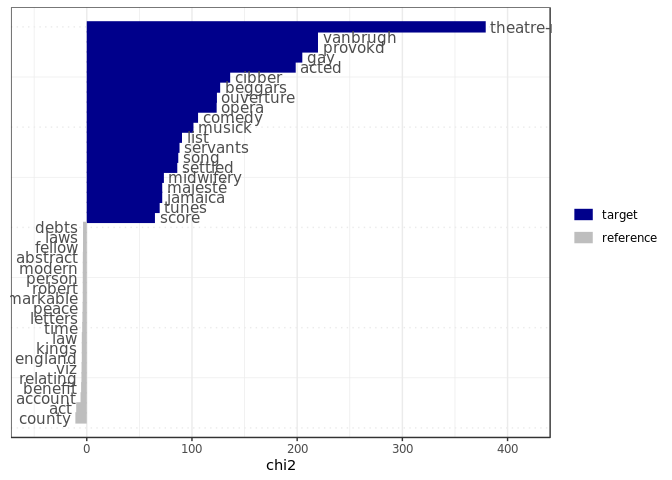

    ## 
    ## Community: 10

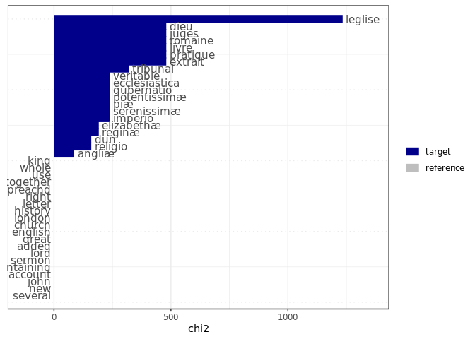

    ## 
    ## Community: 11


    ## 
    ## Community: 12


    ## 
    ## Community: 13

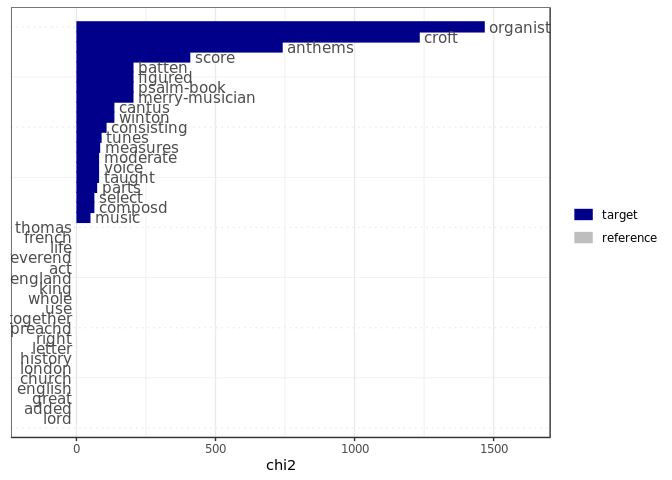

    ## 
    ## Community: 14


    ## 
    ## Community: 15

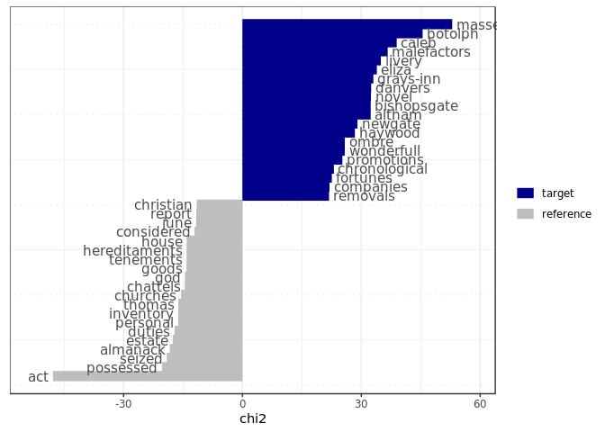

    ## 
    ## Community: 16


    ## 
    ## Community: 17


    ## 
    ## Community: 18

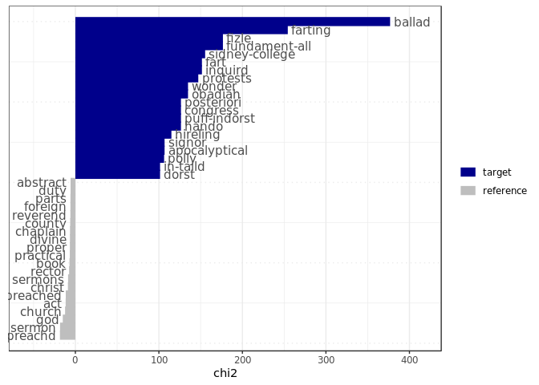

    ## 
    ## Community: 19


    ## 
    ## Community: 20


    ## 
    ## Community: 21

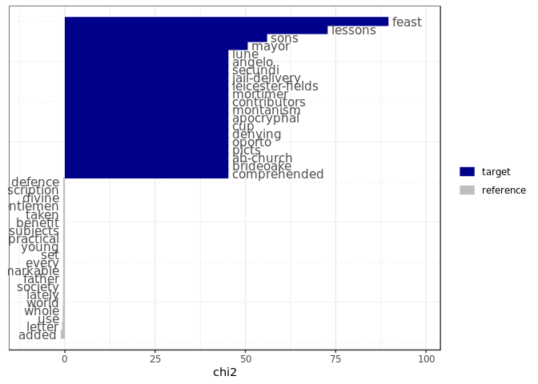

    ## 
    ##  1726-1735 
    ## 
    ## 25 top features/tokens
    ## $Community_1
    ##    several containing        new      added    account      great     letter 
    ##        200        166        161        156        153        136        133 
    ##    history       john honourable       lord      right     method     london 
    ##        113        112        101         98         95         95         88 
    ##     church      whole      house    present       true     sermon    england 
    ##         87         87         87         85         83         82         82 
    ##    english      state parliament        use 
    ##         81         76         76         75 
    ## 
    ## $Community_10
    ##       true  canibalss   religion      added    account     modern      taken 
    ##          4          4          3          2          2          2          2 
    ##      calld     select    comical    stories      story  chronicle      piece 
    ##          2          2          2          2          2          2          2 
    ##   believer discourses      truth government concerning     twelve  inscribed 
    ##          2          1          1          1          1          1          1 
    ##      royal      count    liberty    command 
    ##          1          1          1          1 
    ## 
    ## $Community_11
    ##        sermon      preached        church          lord        london 
    ##            43            33            27            25            23 
    ##        bishop       society       meeting          john         grand 
    ##            23            21            21            20            20 
    ## parish-church         parts   anniversary   mary-le-bow           god 
    ##            20            20            20            20            19 
    ##      reverend         right         peace   westminster      children 
    ##            19            18            18            18            16 
    ##         added     christian        father        gospel          jury 
    ##            15            15            15            15            15 
    ## 
    ## $Community_12
    ##    several containing        new       john    account    history     sermon 
    ##        263        217        216        174        174        172        163 
    ##      added    english     church       lord      whole     thomas    preachd 
    ##        154        149        139        129        122        118        114 
    ##      great      right        use     london       life     french concerning 
    ##        112        110        110        107        103        100         96 
    ##    william     method   religion     letter 
    ##         94         94         90         90 
    ## 
    ## $Community_13
    ##         holy    communion        plain instructions       daniel       worthy 
    ##            1            1            1            1            1            1 
    ##      hallows    receiving   profitable  comfortable  communicant      dunciad 
    ##            1            1            1            1            1            0 
    ##     variorvm  prolegomena   scriblerus    preaching      hearing   practising 
    ##            0            0            0            0            0            0 
    ##         word          god       sermon     preached       church     lawrence 
    ##            0            0            0            0            0            0 
    ##        jewry 
    ##            0 
    ## 
    ## $Community_14
    ##        new     pieces  copy-book containing    masters    engravd        geo 
    ##          3          3          3          2          2          2          2 
    ##    bickham      sizes    curious       john      added    eminent  collected 
    ##          2          2          1          1          1          1          1 
    ##     useful     extant       best     extent      hands     modern    letters 
    ##          1          1          1          1          1          1          1 
    ##     beauty    english     europe     copies 
    ##          1          1          1          1 
    ## 
    ## $Community_15
    ##     joseph   proposal    defence   increase      trade     humble       home 
    ##          2          2          2          2          2          2          2 
    ##     davies  gibraltar   publishd        new     robert     crimes containing 
    ##          2          2          1          1          1          1          1 
    ##     useful     growth    hundred     others      since     little      years 
    ##          1          1          1          1          1          1          1 
    ##   kingdoms        war     friend   entirely 
    ##          1          1          1          1 
    ## 
    ## $Community_16
    ##      history   concluding        added        grand        whole      present 
    ##            1            1            1            1            1            1 
    ##      persons      country        seven    dedicated  distinction         last 
    ##            1            1            1            1            1            1 
    ##      january       ladies        calld entertaining       masque         acts 
    ##            1            1            1            1            1            1 
    ##      comical        punch     downfall      humours         fair     thursday 
    ##            1            1            1            1            1            1 
    ##         play 
    ##            1 
    ## 
    ## $Community_17
    ##         whole         great       edition     courtship           new 
    ##             4             3             2             2             1 
    ##           use       several     additions       company         added 
    ##             1             1             1             1             1 
    ##         grand       shewing         state         court          city 
    ##             1             1             1             1             1 
    ##   proceedings       eminent    containing           set    perfection 
    ##             1             1             1             1             1 
    ##       account         large      compleat      together extraordinary 
    ##             1             1             1             1             1 
    ## 
    ## $Community_18
    ##        sermon         price        chapel      preached         march 
    ##             3             3             3             2             2 
    ##        robert       genuine      pamphlet        excise   westminster 
    ##             2             2             2             2             2 
    ##          dean         noted     wednesday       curious      addressd 
    ##             2             2             2             1             1 
    ##     practical          days         added       present        humbly 
    ##             1             1             1             1             1 
    ##  observations       account          hymn extraordinary          poem 
    ##             1             1             1             1             1 
    ## 
    ## $Community_19
    ##   almanack       lord       john       book        new      whole    english 
    ##         90         83         81         75         73         68         63 
    ##     psalms     thomas  collected containing     others    several        set 
    ##         60         54         52         50         48         47         44 
    ##      metre  sternhold    hopkins        god      parts bissextile      added 
    ##         43         43         43         37         35         34         32 
    ##    account   churches      forth  leap-year 
    ##         32         32         31         31 
    ## 
    ## $Community_2
    ##      account         holy   collection   containing        great      prayers 
    ##            6            5            5            5            4            4 
    ##    collected       french       church      history          new      several 
    ##            4            4            3            3            3            3 
    ##        whole    christian     religion        books      english        royal 
    ##            3            3            3            3            3            3 
    ## instructions       maxims        jacob        kings       choice   hildebrand 
    ##            3            3            3            3            3            3 
    ##     publishd 
    ##            2 
    ## 
    ## $Community_20
    ##   serenissimæ        reginæ       religio         regni        angliæ 
    ##             1             1             1             1             1 
    ##       imperio           piæ  potentissimæ    elizabethæ    gubernatio 
    ##             1             1             1             1             1 
    ## ecclesiastica       dunciad      variorvm   prolegomena    scriblerus 
    ##             1             0             0             0             0 
    ##     preaching       hearing    practising          word           god 
    ##             0             0             0             0             0 
    ##        sermon      preached        church      lawrence         jewry 
    ##             0             0             0             0             0 
    ## 
    ## $Community_21
    ##        new  craftsman containing    several      caleb     church    account 
    ##         23         19         18         17         17         16         16 
    ##    danvers    remarks     letter    william honourable      added      state 
    ##         16         15         15         14         14         14         13 
    ##     french    english  grays-inn     london    history      great    present 
    ##         12         12         12         11         10         10         10 
    ##   writings   publishd    ancient       john 
    ##         10          9          9          9 
    ## 
    ## $Community_3
    ##        act     county parliament   majestys      great       king    majesty 
    ##        387        142        141        111        109        101        101 
    ##    several        new      reign    britain     george     church  repairing 
    ##         87         85         75         73         68         67         61 
    ##     making       lord    present   gracious    persons     passed        god 
    ##         60         57         57         53         52         51         50 
    ##       time      added       acts    session 
    ##         49         48         48         47 
    ## 
    ## $Community_4
    ##        law    several      added containing    account    english        new 
    ##         63         60         60         56         51         46         42 
    ##      whole     common     london      cases      peace      court   relating 
    ##         38         38         35         35         35         35         34 
    ##       king   together    history       lord collection concerning    present 
    ##         32         32         31         31         31         31         30 
    ## parliament       john       laws    general 
    ##         29         28         28         27 
    ## 
    ## $Community_5
    ##      sheeles         john   collection          set       divine      lessons 
    ##            2            1            1            1            1            1 
    ##        taken       musick      composd   harpsicord         odes        hymns 
    ##            1            1            1            1            1            1 
    ##        suits     spinnett          sky         lark   spectators      cantate 
    ##            1            1            1            1            1            1 
    ##         arie    stromenti     dedicate   excellenza         sigr         duca 
    ##            1            1            1            1            1            1 
    ## queensberrij 
    ##            1 
    ## 
    ## $Community_6
    ##     sermon       john        new   preached    several      added   reverend 
    ##        201        137        117        111        109         96         96 
    ##    preachd    account   religion      death     letter     christ     church 
    ##         93         90         86         83         83         79         78 
    ##        god  christian     thomas    history containing     london    request 
    ##         75         75         69         68         68         62         61 
    ##       life concerning      great     answer 
    ##         61         58         54         54 
    ## 
    ## $Community_7
    ##    several containing        new     french    william       life    history 
    ##         61         49         43         43         41         41         40 
    ##       john       lord    english      added       king      great     letter 
    ##         40         39         37         36         36         35         34 
    ##      right      whole        sir     london    account     treaty    present 
    ##         30         29         29         28         28         28         27 
    ##     france shakespear   original      royal 
    ##         27         26         26         26 
    ## 
    ## $Community_8
    ## theatre-royal         acted      majestys          list         opera 
    ##            72            69            62            53            51 
    ##        letter        comedy           new          john        musick 
    ##            50            49            45            44            43 
    ##      servants       several    parliament         great    drury-lane 
    ##            42            41            40            38            35 
    ##         added    containing       present          song       account 
    ##            34            34            32            32            31 
    ##       prefixd          life       moliere          poem      performd 
    ##            30            29            28            27            27 
    ## 
    ## $Community_9
    ##     letter    several      great    account containing      added    remarks 
    ##        299        209        196        193        192        182        151 
    ##    history    present       poem        new     answer     london       king 
    ##        144        141        137        132        130        128        122 
    ##     church       john honourable concerning      right       life       true 
    ##        116        116        115        112        111        108        107 
    ##       lord parliament      state    england 
    ##        104        104        103        101 
    ## 
    ## 
    ## Community: 1

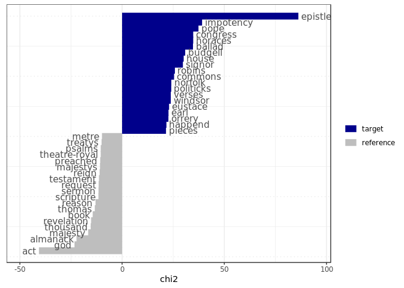

    ## 
    ## Community: 2


    ## 
    ## Community: 3


    ## 
    ## Community: 4

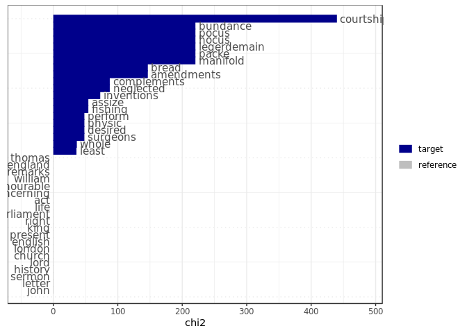

    ## 
    ## Community: 5


    ## 
    ## Community: 6


    ## 
    ## Community: 7


    ## 
    ## Community: 8


    ## 
    ## Community: 9


    ## 
    ## Community: 10

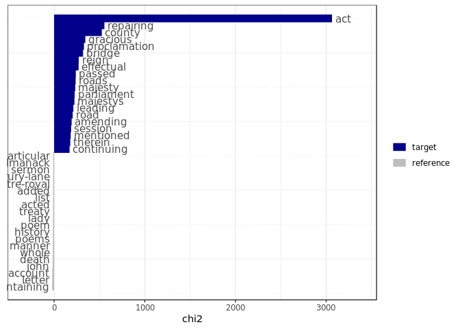

    ## 
    ## Community: 11


    ## 
    ## Community: 12

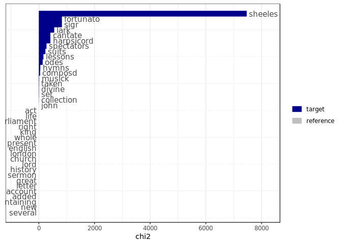

    ## 
    ## Community: 13


    ## 
    ## Community: 14


    ## 
    ## Community: 15


    ## 
    ## Community: 16


    ## 
    ## Community: 17

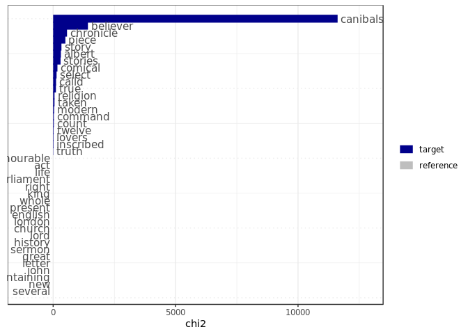

    ## 
    ## Community: 18

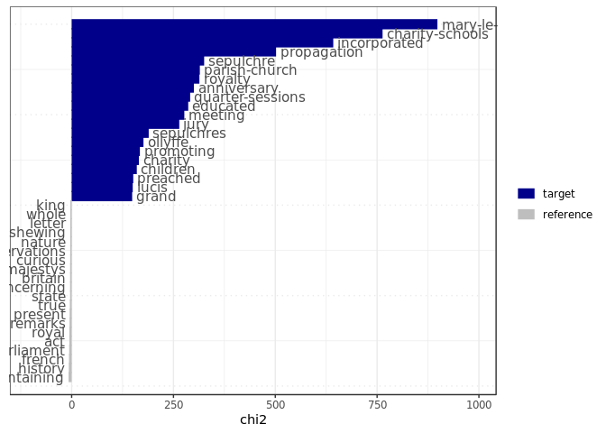

    ## 
    ## Community: 19


    ## 
    ## Community: 20


    ## 
    ## Community: 21

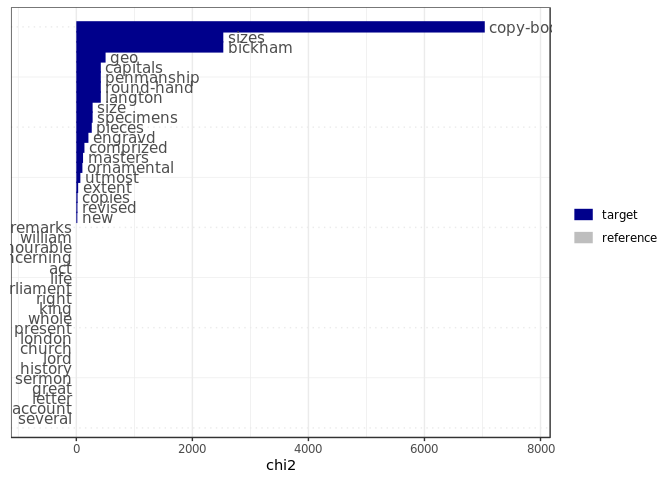

    ## 
    ##  1731-1740 
    ## 
    ## 25 top features/tokens
    ## $Community_1
    ##     sermon       john    several    account        new containing      added 
    ##        250        234        214        200        185        181        162 
    ##    english     church   preached    history      whole    preachd      great 
    ##        155        152        141        137        127        121        116 
    ##     thomas   reverend   religion      parts        use      death       life 
    ##        107        106        104         99         98         92         91 
    ##   together    present        god     nature 
    ##         90         90         88         83 
    ## 
    ## $Community_10
    ##        act    persons        old parliament     better     relief collection 
    ##         12          2          2          2          2          2          1 
    ##      serve containing      irish       poem      added        far        new 
    ##          1          1          1          1          1          1          1 
    ##    prevent      greek        use  improving       maps perpetuate     memory 
    ##          1          1          1          1          1          1          1 
    ##  frivolous    respect   containd     waters 
    ##          1          1          1          1 
    ## 
    ## $Community_11
    ##        nation       lettres      françois    françoises    reflexions 
    ##             1             1             1             1             1 
    ##   germaniques    militaires   litteraires     critiques      allemans 
    ##             1             1             1             1             1 
    ##       ouvrage     également         utile     officiers beaux-esprits 
    ##             1             1             1             1             1 
    ##          lune        lautre       medulla      poetarum     romanorum 
    ##             1             1             0             0             0 
    ##     beautiful   instructive      passages         roman         poets 
    ##             0             0             0             0             0 
    ## 
    ## $Community_12
    ##      english   describing        pilot      several        capes   sea-coasts 
    ##           11            6            6            5            5            5 
    ##   remarkable        words        whole      ancient         book        names 
    ##            4            4            4            4            4            4 
    ##      nations        ports   navigation   head-lands    soundings        roman 
    ##            4            4            4            4            4            3 
    ##          new architecture       rivers   dictionary       places         bays 
    ##            3            3            3            3            3            3 
    ##         able 
    ##            3 
    ## 
    ## $Community_13
    ##         john       church      english      history       thomas         lord 
    ##            5            3            2            2            2            2 
    ##    testament       rector     religion translations      general      publick 
    ##            2            2            1            1            1            1 
    ##      several       others        lewis          new      account   remarkable 
    ##            1            1            1            1            1            1 
    ##       burton        since        right          god        whole   principles 
    ##            1            1            1            1            1            1 
    ##       sermon 
    ##            1 
    ## 
    ## $Community_14
    ##       physick       student    theophilus          gift philanthropos 
    ##             2             2             2             2             2 
    ##          town          love     christian         books          soul 
    ##             1             1             1             1             1 
    ##        parish       library         third     catalogue         sixth 
    ##             1             1             1             1             1 
    ##     seraphick       tenderd      immortal          kent       convert 
    ##             1             1             1             1             1 
    ##     parochial     maidstone       medulla      poetarum     romanorum 
    ##             1             1             0             0             0 
    ## 
    ## $Community_15
    ##       letter     original       french     reverend    important observations 
    ##            4            4            3            3            3            3 
    ##         lord       bishop   parliament   collection      english   containing 
    ##            3            3            3            2            2            2 
    ##      several      authors   remarkable        right     together      present 
    ##            2            2            2            2            2            2 
    ##         john       humbly      history          god     subjects     compleat 
    ##            2            2            2            2            2            2 
    ##       tracts 
    ##            2 
    ## 
    ## $Community_16
    ##        act     county parliament    majesty       king   majestys      great 
    ##        558        189        182        160        146        142        136 
    ##      reign        new    several containing     george    persons        law 
    ##        132        128        119        117        102         92         92 
    ##    britain     passed    present    account       time       acts      added 
    ##         91         86         80         79         75         74         72 
    ##  effectual  repairing    english  intituled 
    ##         70         70         68         67 
    ## 
    ## $Community_17
    ##     letter    account    remarks containing      added    several     answer 
    ##        232        142        139        138        137        125        122 
    ##    present        new     church   religion     london     sermon      great 
    ##        113        111        110        108        108        108        107 
    ##    history       john concerning     nature parliament       true       life 
    ##        106        104        101         92         81         79         78 
    ##       king      right       book    england 
    ##         77         77         77         76 
    ## 
    ## $Community_18
    ##   almanack       lord       john      whole     psalms        new     thomas 
    ##         88         78         73         54         50         47         46 
    ##    english       book     others  collected      metre  sternhold    hopkins 
    ##         45         45         40         40         38         38         38 
    ## bissextile        set  leap-year        god      forth    account   together 
    ##         36         32         32         31         29         28         28 
    ##    planets    history     rising    setting 
    ##         28         27         27         27 
    ## 
    ## $Community_19
    ##     sermon whitefield     george   preached     oxford    account containing 
    ##         79         64         63         52         48         41         39 
    ##    college     london    several     christ   pembroke     church      added 
    ##         39         35         34         34         33         32         30 
    ##       john        new   reverend      great     letter    preachd       life 
    ##         30         27         27         26         26         25         22 
    ##     nature honourable    history       time 
    ##         21         21         20         20 
    ## 
    ## $Community_2
    ## containing    several        new    english      whole      added    account 
    ##         82         71         69         51         50         46         46 
    ##    history       lord     sermon       john      parts      great     french 
    ##         45         45         41         39         38         37         36 
    ##    general       life   compleat     proper       king     method     treaty 
    ##         35         34         33         32         32         32         31 
    ##     nature   together    remarks collection 
    ##         31         31         30         29 
    ## 
    ## $Community_20
    ##     quakers      people vindication       calld     baptism     defence 
    ##          17          15          12          10          10           9 
    ##      answer      called     account        book examination      clergy 
    ##           8           8           7           7           7           6 
    ##    pamphlet       reply     william      letter     remarks      bishop 
    ##           6           6           5           5           5           5 
    ##   intituled    appendix       brief     letters     apology    detected 
    ##           5           5           5           4           4           4 
    ##    asserted 
    ##           4 
    ## 
    ## $Community_21
    ##       true  canibalss   religion      added    account      story     modern 
    ##          4          4          3          2          2          2          2 
    ##      calld     select      piece    stories      taken    comical   believer 
    ##          2          2          2          2          2          2          2 
    ##  chronicle concerning      truth discourses      royal government     lovers 
    ##          2          1          1          1          1          1          1 
    ##     twelve    liberty      count  inscribed 
    ##          1          1          1          1 
    ## 
    ## $Community_22
    ##           new          john       history       curious      passages 
    ##             6             5             5             5             4 
    ##         notes   illustrated      writings    remarkable      reverend 
    ##             4             4             3             3             3 
    ##          maps           old     testament          holy dissertations 
    ##             3             3             3             3             3 
    ##       adorned         bible      dedicata       signora           und 
    ##             3             3             3             3             3 
    ##    collection         savoy     elizabeth         right    stackhouse 
    ##             2             2             2             2             2 
    ## 
    ## $Community_23
    ##      drawing       useful       french          new introduction        parts 
    ##            4            3            2            2            2            2 
    ##   principles         easy     practice       method     monsieur  perspective 
    ##            2            2            2            2            2            2 
    ##    abstracts        youth       gerard     lairesse     improved      whereby 
    ##            2            2            2            2            2            2 
    ##     familiar     directed      fresnoy         arts       others          man 
    ##            2            2            2            1            1            1 
    ##         town 
    ##            1 
    ## 
    ## $Community_24
    ##     letter    several    account      great containing      added    present 
    ##        237        180        176        165        157        146        139 
    ##        new     london    remarks honourable      right    history    england 
    ##        127        112        112        109        106        106        100 
    ##     sermon     church       poem      state    epistle parliament     method 
    ##         99         98         96         93         92         91         89 
    ##       john       lord     answer      house 
    ##         88         86         81         81 
    ## 
    ## $Community_25
    ##    several        new containing      added      great     letter       john 
    ##         99         98         94         88         87         84         75 
    ##    account    english     sermon       list     method parliament        use 
    ##         73         72         67         63         60         58         57 
    ##   religion     church     nature    history    present     answer    remarks 
    ##         56         55         53         52         51         50         49 
    ##      whole     london     french       life 
    ##         49         48         47         46 
    ## 
    ## $Community_26
    ##    containing       account           new       several          life 
    ##           128           116           114           112           109 
    ##       history          john       english         added          lord 
    ##            91            88            81            78            78 
    ##      majestys           sir        french         court         great 
    ##            74            73            70            69            68 
    ##       william          king          poem         acted theatre-royal 
    ##            63            60            60            59            58 
    ##       curious          true        comedy         royal         state 
    ##            57            56            55            54            53 
    ## 
    ## $Community_27
    ##      fluxions         right        manner          last         blood 
    ##             3             2             2             2             2 
    ##    honourable      treatise demonstration        ratios    internally 
    ##             2             2             2             2             2 
    ##       english         verse    containing         james         added 
    ##             1             1             1             1             1 
    ##      critical  dissertation           new          john           sir 
    ##             1             1             1             1             1 
    ##        humbly       certain        thomas   illustrated     imitation 
    ##             1             1             1             1             1 
    ## 
    ## $Community_28
    ##           legis        communis    expositorius           index           voces 
    ##               2               2               2               1               1 
    ##       adjicitur           opere        ignorami      lamentatio   translationem 
    ##               1               1               1               1               1 
    ##          latino        anglicum     dedicatione       dulmannum      præfatione 
    ##               1               1               1               1               1 
    ##       curtesium        lectorem iocupletissimus           voccs locupletissimus 
    ##               1               1               1               1               1 
    ##          angliæ        usitatas        exponens       explanans         medulla 
    ##               1               1               1               1               0 
    ## 
    ## $Community_29
    ##      letter  historical       blank      bevill     higgons       heads 
    ##           2           2           2           2           2           1 
    ##  characters     manners     english       reign        king     england 
    ##           1           1           1           1           1           1 
    ##     several        duke    relating       james        poem      friend 
    ##           1           1           1           1           1           1 
    ##      nature       added reflections        life    writings      french 
    ##           1           1           1           1           1           1 
    ## protestants 
    ##           1 
    ## 
    ## $Community_3
    ##     charles      france   contenant    memoires        sous    françois 
    ##           1           1           1           1           1           1 
    ##       condé     recueil      servir   lhistoire       passé   mémorable 
    ##           1           1           1           1           1           1 
    ##     royaume      regnes     medulla    poetarum   romanorum   beautiful 
    ##           1           1           0           0           0           0 
    ## instructive    passages       roman       poets  collection    disposed 
    ##           0           0           0           0           0           0 
    ##      proper 
    ##           0 
    ## 
    ## $Community_4
    ##     rector       life    several      kings       lord    england    present 
    ##         10          9          8          8          8          7          7 
    ##     samuel     sermon   religion    english     nature        new    account 
    ##          7          7          6          6          6          6          6 
    ##      right        god historical     church    apology   comedian     answer 
    ##          6          6          6          6          6          6          5 
    ##      great      notes       john    history 
    ##          5          5          5          5 
    ## 
    ## $Community_5
    ##      trade    defence     joseph       home   increase     humble   proposal 
    ##          2          2          2          2          2          2          2 
    ##  gibraltar     davies containing     others     friend        new        war 
    ##          2          2          1          1          1          1          1 
    ##     robert      since    sincere     useful    hundred        tho      songs 
    ##          1          1          1          1          1          1          1 
    ##      years      every    upwards   publishd 
    ##          1          1          1          1 
    ## 
    ## $Community_6
    ##        grand      country        added      persons      present      history 
    ##            1            1            1            1            1            1 
    ##        whole         last       ladies         fair        calld      warning 
    ##            1            1            1            1            1            1 
    ##      january         acts        seven entertaining    dedicated      comical 
    ##            1            1            1            1            1            1 
    ##   concluding         ball     thursday  distinction      humours       masque 
    ##            1            1            1            1            1            1 
    ##       revivd 
    ##            1 
    ## 
    ## $Community_7
    ##    bickham    english    masters        geo    engravd      hands  collected 
    ##          6          4          4          4          4          3          3 
    ##       best containing    authors        new        use     useful       easy 
    ##          2          2          2          2          2          2          2 
    ##     pieces  companion    eminent      short      robin    schools    penmans 
    ##          2          2          2          2          2          2          2 
    ##  specimens       junr collection      verse 
    ##          2          2          1          1 
    ## 
    ## $Community_8
    ##        added        merry      edition       female         kick        jenny 
    ##            1            1            1            1            1            1 
    ##     eleventh      contest      medulla     poetarum    romanorum    beautiful 
    ##            1            1            0            0            0            0 
    ##  instructive     passages        roman        poets   collection     disposed 
    ##            0            0            0            0            0            0 
    ##       proper        heads descriptions    allusions  comparisons   characters 
    ##            0            0            0            0            0            0 
    ##   sentiments 
    ##            0 
    ## 
    ## $Community_9
    ##     sermon    account containing    several       lord   preached      added 
    ##         38         29         28         28         28         27         25 
    ##    history    society      right        new     church     bishop      parts 
    ##         25         24         22         21         21         20         19 
    ##     london        use   religion    english   reverend    persons       time 
    ##         19         18         17         17         17         16         16 
    ##        god    meeting    january     french 
    ##         16         16         15         14 
    ## 
    ## 
    ## Community: 1


    ## 
    ## Community: 2

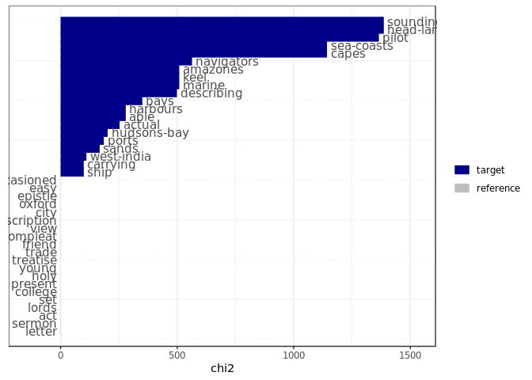

    ## 
    ## Community: 3

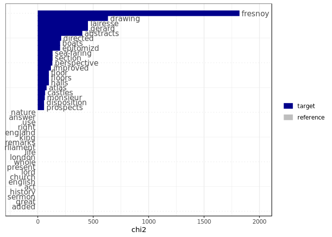

    ## 
    ## Community: 4

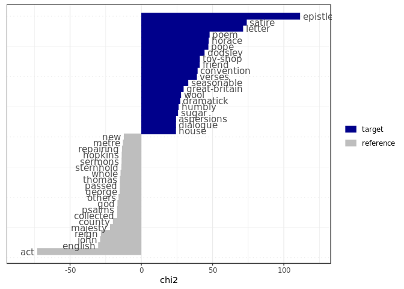

    ## 
    ## Community: 5

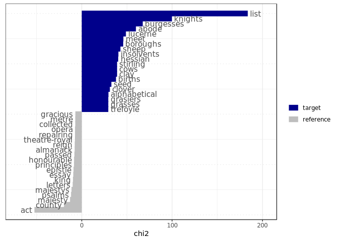

    ## 
    ## Community: 6

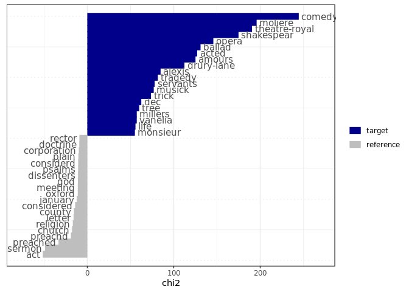

    ## 
    ## Community: 7


    ## 
    ## Community: 8


    ## 
    ## Community: 9


    ## 
    ## Community: 10

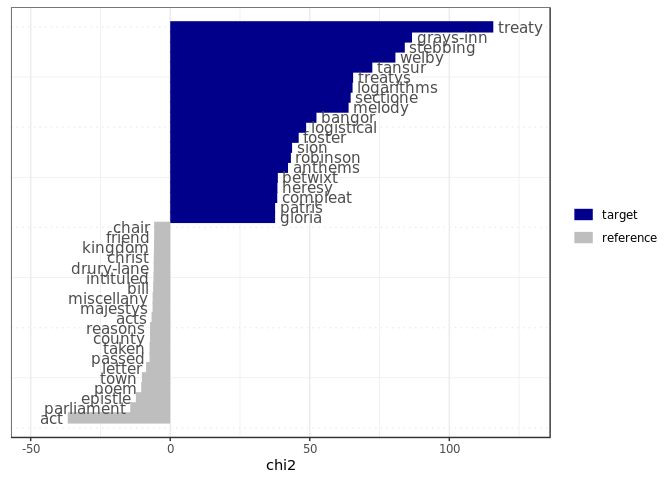

    ## 
    ## Community: 11

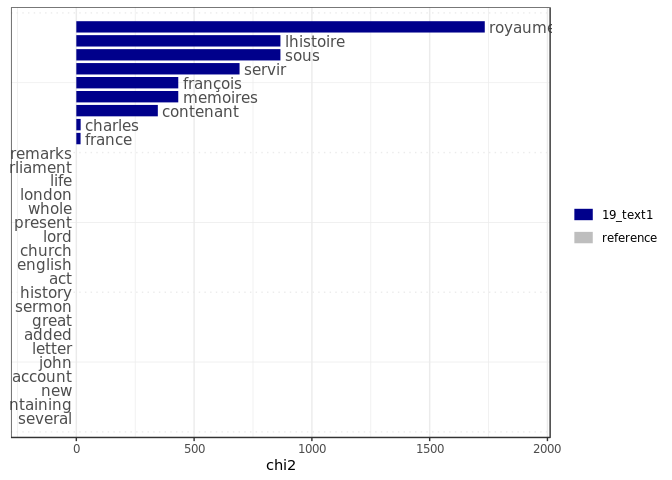

    ## 
    ## Community: 12

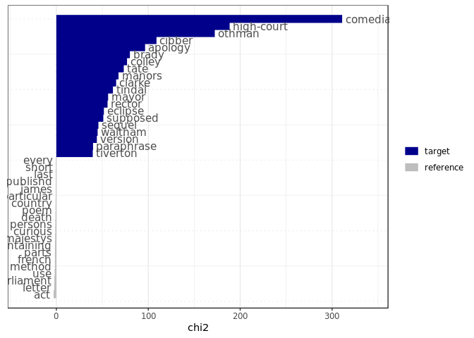

    ## 
    ## Community: 13

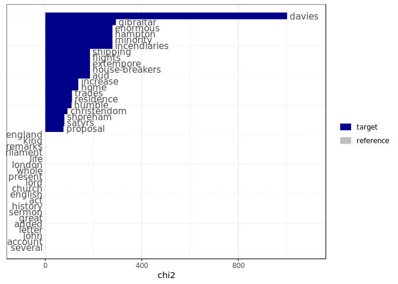

    ## 
    ## Community: 14

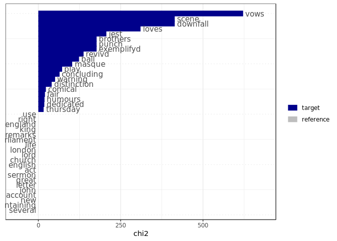

    ## 
    ## Community: 15


    ## 
    ## Community: 16


    ## 
    ## Community: 17

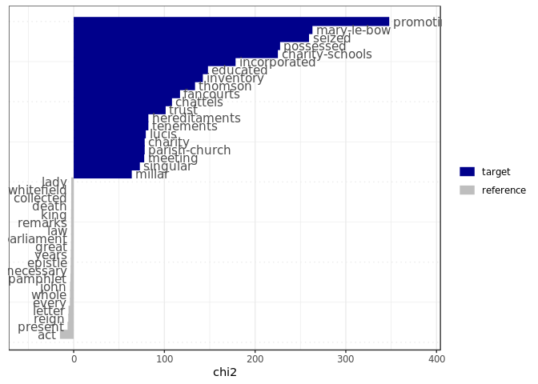

    ## 
    ## Community: 18

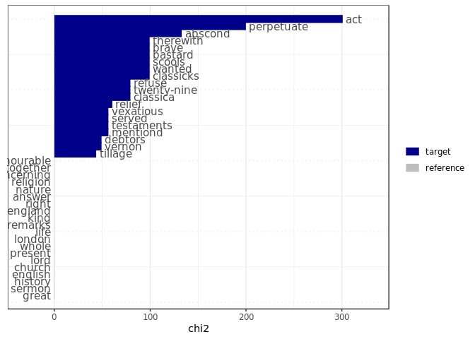

    ## 
    ## Community: 19

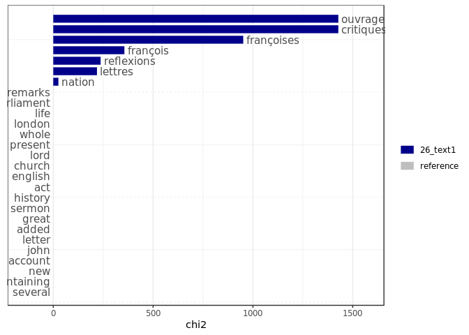

    ## 
    ## Community: 20


    ## 
    ## Community: 21


    ## 
    ## Community: 22

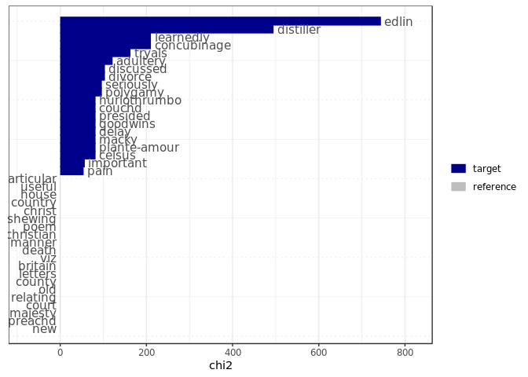

    ## 
    ## Community: 23

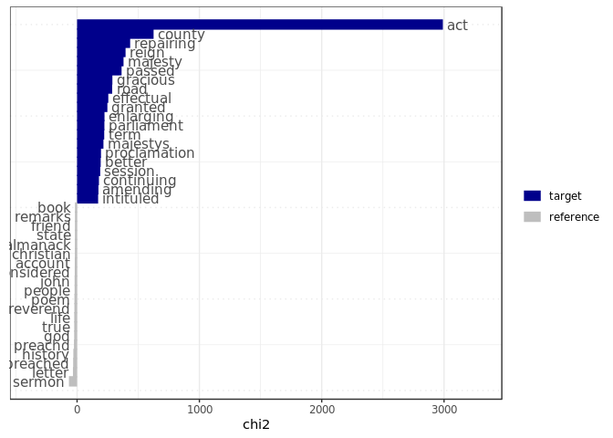

    ## 
    ## Community: 24

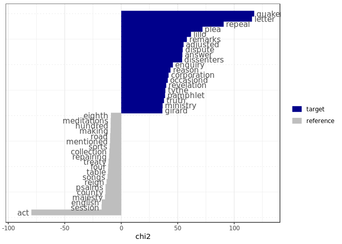

    ## 
    ## Community: 25

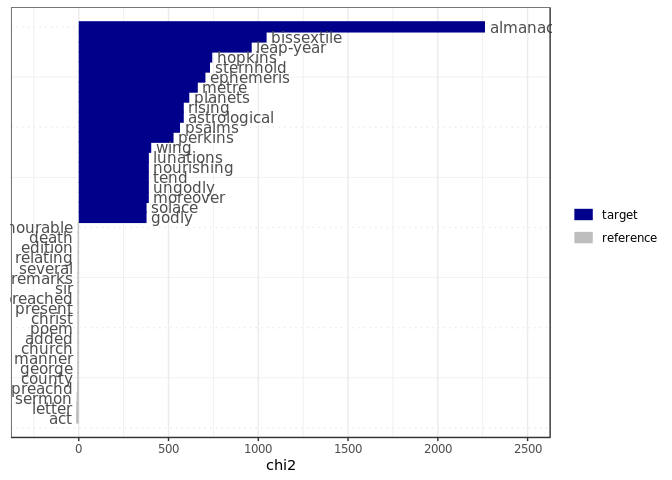

    ## 
    ## Community: 26

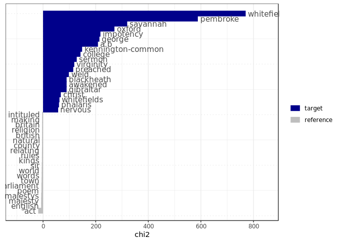

    ## 
    ## Community: 27

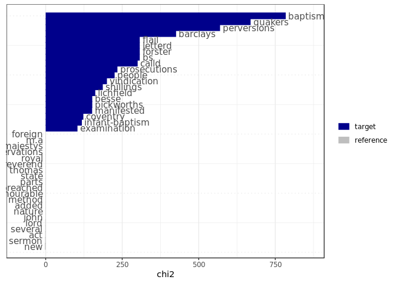

    ## 
    ## Community: 28

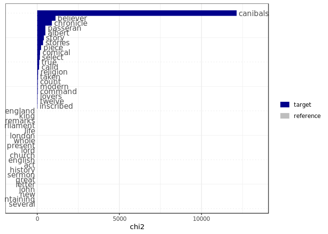

    ## 
    ## Community: 29


    ## 
    ##  1736-1745 
    ## 
    ## 25 top features/tokens
    ## $Community_1
    ##     sermon       john    account    several containing        new    english 
    ##        290        258        249        225        225        222        204 
    ##      added   preached    history      whole     church       life      great 
    ##        189        171        167        164        163        148        138 
    ##     london    preachd   reverend      parts     thomas        use     nature 
    ##        135        132        131        130        122        121        116 
    ##      death    william    present   religion 
    ##        114        113        111        110 
    ## 
    ## $Community_10
    ##          gift       physick       student    theophilus philanthropos 
    ##             2             2             2             2             2 
    ##         books          love     christian         third       library 
    ##             1             1             1             1             1 
    ##        parish         sixth     catalogue          town          soul 
    ##             1             1             1             1             1 
    ##          kent     maidstone       convert      immortal     parochial 
    ##             1             1             1             1             1 
    ##     seraphick       tenderd       several    discourses     practical 
    ##             1             1             0             0             0 
    ## 
    ## $Community_11
    ##       learned       several          earl         right      mistakes 
    ##             2             1             1             1             1 
    ##      stanhope      chaplain        giving      likewise          true 
    ##             1             1             1             1             1 
    ##           six         locke      leibnitz        lockes       whether 
    ##             1             1             1             1             1 
    ##         vicar        extent    honourable understanding         souls 
    ##             1             1             1             1             1 
    ##   vindication     dialogues      enquired    objections          mons 
    ##             1             1             1             1             1 
    ## 
    ## $Community_12
    ##     sermon   preached       john   reverend      added   religion containing 
    ##         95         65         55         52         51         50         47 
    ##        new    account        god    several     letter       life      death 
    ##         43         40         40         39         39         38         37 
    ##     nature    history  christian      whole    request concerning   doctrine 
    ##         36         35         33         32         32         31         30 
    ##      notes    present      parts    preachd 
    ##         30         29         28         28 
    ## 
    ## $Community_13
    ##      present       letter      account   containing      several        great 
    ##          222          208          187          141          126          123 
    ##          new        added       london      history      england        right 
    ##          122          117          109          102           98           93 
    ##         john   honourable         king      english       answer         poem 
    ##           93           91           90           84           83           82 
    ## observations   parliament       church      remarks        state         lord 
    ##           81           81           79           78           76           76 
    ##        whole 
    ##           75 
    ## 
    ## $Community_14
    ##    english navigation        new        use logarithms containing  corrected 
    ##          9          8          7          7          6          5          5 
    ##     number      whole    nations     method     tables     places      pilot 
    ##          5          5          5          5          5          5          5 
    ## describing    several  necessary       book      words      names  carefully 
    ##          5          4          4          4          4          4          4 
    ##     rivers sea-coasts      capes       able 
    ##          4          4          4          4 
    ## 
    ## $Community_15
    ##        act     county    majesty parliament      reign     george   majestys 
    ##        625        244        179        177        156        149        133 
    ##       king      great  repairing     passed    present    britain       acts 
    ##        124        124        113        107         94         93         84 
    ##  effectual     parish       town       road    several whitefield  intituled 
    ##         83         82         77         76         75         74         74 
    ##     oxford       john        new    granted 
    ##         73         72         71         70 
    ## 
    ## $Community_16
    ##        law    several containing        new    account      cases      court 
    ##         75         68         65         54         46         46         45 
    ##    history   practice     common      added       king    present    general 
    ##         41         40         38         36         35         35         35 
    ##       laws      whole     london       john      table    english    england 
    ##         34         31         31         30         30         29         28 
    ##     george      kings     method       lord 
    ##         27         27         27         27 
    ## 
    ## $Community_17
    ##    several     sermon    account     london        new     letter containing 
    ##         67         60         52         52         48         42         41 
    ##    present      added   preached       john    history      great    general 
    ##         38         37         37         36         33         33         33 
    ##      whole        use    shewing     church     nature       lord    preachd 
    ##         31         30         29         26         25         25         25 
    ##   reverend     method     thomas      state 
    ##         25         24         23         22 
    ## 
    ## $Community_18
    ##    account containing      great        new    several    present     letter 
    ##        230        209        178        176        166        166        148 
    ##      added       john    history       life     london    english      whole 
    ##        143        138        133        125        117        105        105 
    ##       king     french    remarks     sermon      right       lord    letters 
    ##         98         97         95         95         95         90         88 
    ## collection       time       true honourable 
    ##         87         86         86         86 
    ## 
    ## $Community_19
    ##     sermon  authority       lord   preached      right    majesty    account 
    ##          7          7          7          6          6          6          6 
    ## honourable   majestys       june     church     hebrew   chaplain   ordinary 
    ##          6          6          6          5          5          5          5 
    ##      grace  whitehall      state       last     france  following    present 
    ##          5          5          4          4          4          4          4 
    ##   reverend     office     philip     thomas 
    ##          4          4          4          4 
    ## 
    ## $Community_2
    ##        henry        carey      several     subjects      hundred      english 
    ##            2            2            1            1            1            1 
    ##       musick        whole         life      various   characters  instruction 
    ##            1            1            1            1            1            1 
    ##    occasions        words      adapted        mirth    dramatick        works 
    ##            1            1            1            1            1            1 
    ##    incidents   calculated      musical        human      ballads      century 
    ##            1            1            1            1            1            1 
    ## conversation 
    ##            1 
    ## 
    ## $Community_20
    ##     sermon       lord    several   preached     bishop       john containing 
    ##         52         49         43         37         34         30         29 
    ##       king      right     london      added      parts honourable     thomas 
    ##         29         28         26         25         25         25         24 
    ##    english    history     church    account      royal      house      court 
    ##         23         23         23         23         23         22         21 
    ##    society      whole    general     nature 
    ##         21         20         20         19 
    ## 
    ## $Community_21
    ##   parliament      history     together        years      debates      several 
    ##            3            2            2            2            2            1 
    ##        added   containing       octavo        price        bound         earl 
    ##            1            1            1            1            1            1 
    ##   remarkable  illustrated observations        state transactions         last 
    ##            1            1            1            1            1            1 
    ##      account       proper        every          use        reign    appointed 
    ##            1            1            1            1            1            1 
    ##      present 
    ##            1 
    ## 
    ## $Community_22
    ##           legis        communis    expositorius           index           voces 
    ##               2               2               2               1               1 
    ##       adjicitur      præfatione        ignorami      lamentatio   translationem 
    ##               1               1               1               1               1 
    ##          latino        anglicum     dedicatione       dulmannum       curtesium 
    ##               1               1               1               1               1 
    ##        lectorem iocupletissimus           voccs locupletissimus          angliæ 
    ##               1               1               1               1               1 
    ##           opere        usitatas        exponens       explanans         several 
    ##               1               1               1               1               0 
    ## 
    ## $Community_23
    ##     psalms       john      whole containing     musick       book        set 
    ##         16         14         13         11         11         11         11 
    ##        new      hymns   together       four     divine      parts    anthems 
    ##         10         10          9          8          8          8          8 
    ##      tunes collection      songs     thomas       sung  collected    english 
    ##          8          7          7          7          7          6          6 
    ##  corrected    william    variety   psalmody 
    ##          6          6          6          6 
    ## 
    ## $Community_24
    ##        oxford        sermon      preached      occasion      minister 
    ##             1             1             1             1             1 
    ##        france       charles          holy       college       present 
    ##             1             1             1             1             1 
    ## parish-church      parishes       norfolk        thomas       october 
    ##             1             1             1             1             1 
    ##        county          town        fellow        wilson     rebellion 
    ##             1             1             1             1             1 
    ##       trinity       suffolk      memoires     contenant          sous 
    ##             1             1             1             1             1 
    ## 
    ## $Community_25
    ##       john    account       lord     letter containing        new   almanack 
    ##        142        119        118        117         92         88         87 
    ##      whole    history     sermon     london    present       book        god 
    ##         80         75         74         74         73         73         68 
    ##    english    several     thomas       true      added     answer    remarks 
    ##         66         64         63         60         59         59         58 
    ##   together     people     church       life 
    ##         58         58         57         56 
    ## 
    ## $Community_26
    ##            rules      perspective         practice           useful 
    ##                4                4                3                2 
    ##        necessary             view           method             easy 
    ##                2                2                2                2 
    ##            parts           french           others          whereby 
    ##                2                2                2                2 
    ##           divers          natural          methods            royal 
    ##                2                2                2                2 
    ##            kinds    copper-plates      discoveries          drawing 
    ##                2                2                2                2 
    ##        positions      proportions     micrographia        designing 
    ##                2                2                2                2 
    ## tapestry-workers 
    ##                2 
    ## 
    ## $Community_3
    ##     account      people     quakers     remarks     english      french 
    ##          15          14          12          10           9           9 
    ##        life      called  containing     letters     england     baptism 
    ##           8           8           7           7           7           7 
    ##     defence     several       calld       brief        john        book 
    ##           7           6           6           6           6           6 
    ##      divers      letter      nature illustrated examination  concerning 
    ##           6           6           5           5           5           5 
    ##     present 
    ##           5 
    ## 
    ## $Community_4
    ##    bristol       john    goodere       life    history     sermon        war 
    ##          2          2          2          1          1          1          1 
    ##    charles        sir      tryal        man    natural      royal      child 
    ##          1          1          1          1          1          1          1 
    ##     honour      james     murder     samuel     parish     friday       city 
    ##          1          1          1          1          1          1          1 
    ## authentick    epistle      march     fields 
    ##          1          1          1          1 
    ## 
    ## $Community_5
    ##      right      great      power     common        old     called    address 
    ##          1          1          1          1          1          1          1 
    ##      lords honourable     island  spiritual     humble   courtier   temporal 
    ##          1          1          1          1          1          1          1 
    ## distressed  discarded   vulgarly    honesty        btn    several discourses 
    ##          1          1          1          1          1          0          0 
    ##  practical   subjects  arguments  collected 
    ##          0          0          0          0 
    ## 
    ## $Community_6
    ##        old      added collection   containd        new  geography      world 
    ##          2          1          1          1          1          1          1 
    ##        far     action       long       word        use        map     places 
    ##          1          1          1          1          1          1          1 
    ##        six   describd       maps     memory   publishd      porto      bello 
    ##          1          1          1          1          1          1          1 
    ##     vernon       took    admiral      greek 
    ##          1          1          1          1 
    ## 
    ## $Community_7
    ##      plates     account        used      london        city     hundred 
    ##           5           5           5           5           5           4 
    ##      nature         new       david illustrated       parts     eminent 
    ##           4           4           4           4           4           4 
    ##      letter     reasons     several      george      psalms       whole 
    ##           4           4           3           3           3           3 
    ##      church      copper      answer    religion     majesty       great 
    ##           3           3           3           3           3           3 
    ##       short 
    ##           3 
    ## 
    ## $Community_8
    ##      bickham introduction        robin      masters      drawing    collected 
    ##            3            2            2            2            2            1 
    ##       george   containing      english       neatly          new         hood 
    ##            1            1            1            1            1            1 
    ##       plates         best        short         easy          use      schools 
    ##            1            1            1            1            1            1 
    ##        taken        hands     engraved         time        hoods        death 
    ##            1            1            1            1            1            1 
    ##         fair 
    ##            1 
    ## 
    ## $Community_9
    ##        nation       lettres    reflexions      françois    françoises 
    ##             1             1             1             1             1 
    ##   germaniques    militaires   litteraires     critiques      allemans 
    ##             1             1             1             1             1 
    ##       ouvrage     également         utile     officiers beaux-esprits 
    ##             1             1             1             1             1 
    ##          lune        lautre       several    discourses     practical 
    ##             1             1             0             0             0 
    ##      subjects     arguments     collected      contents        george 
    ##             0             0             0             0             0 
    ## 
    ## 
    ## Community: 1


    ## 
    ## Community: 2

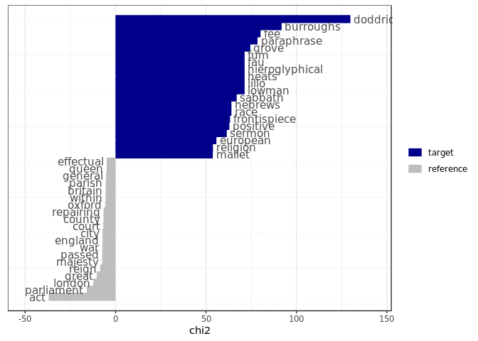

    ## 
    ## Community: 3


    ## 
    ## Community: 4


    ## 
    ## Community: 5


    ## 
    ## Community: 6

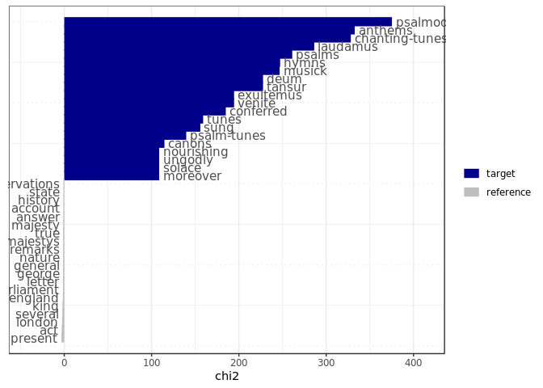

    ## 
    ## Community: 7


    ## 
    ## Community: 8


    ## 
    ## Community: 9


    ## 
    ## Community: 10

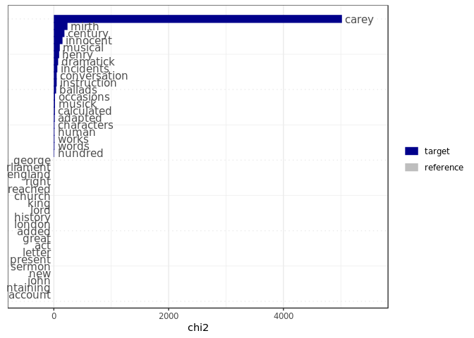

    ## 
    ## Community: 11

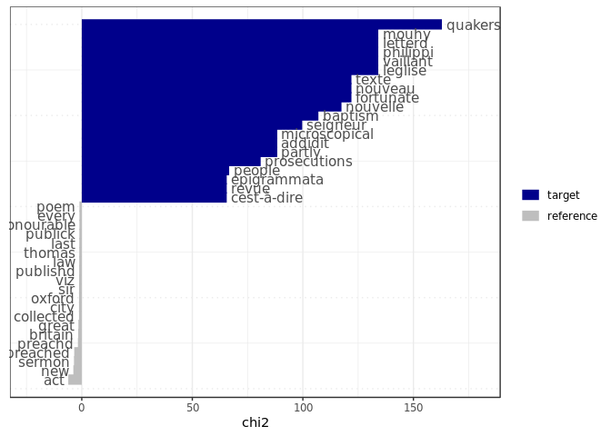

    ## 
    ## Community: 12

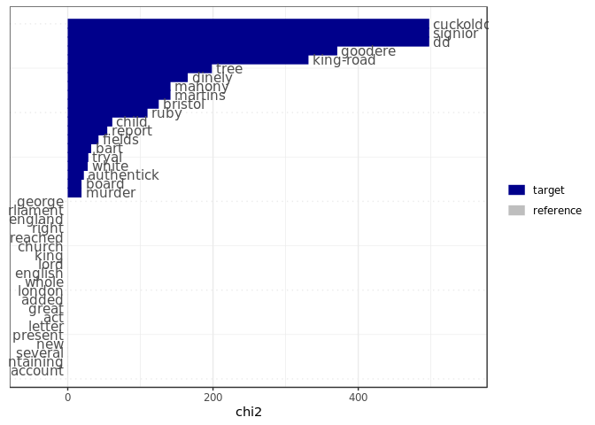

    ## 
    ## Community: 13

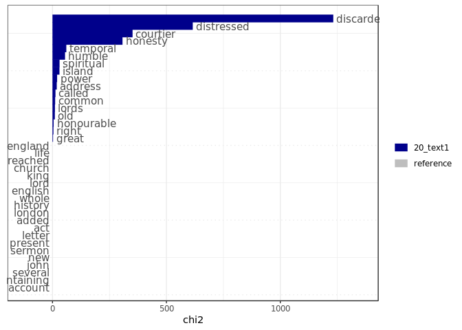

    ## 
    ## Community: 14


    ## 
    ## Community: 15


    ## 
    ## Community: 16


    ## 
    ## Community: 17

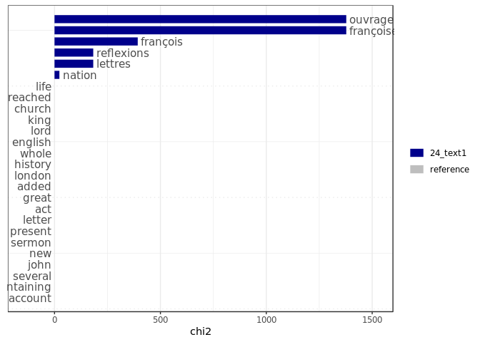

    ## 
    ## Community: 18


    ## 
    ## Community: 19

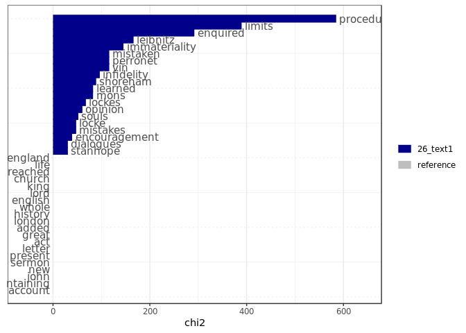

    ## 
    ## Community: 20


    ## 
    ## Community: 21


    ## 
    ## Community: 22


    ## 
    ## Community: 23

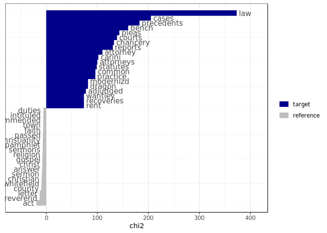

    ## 
    ## Community: 24


    ## 
    ## Community: 25

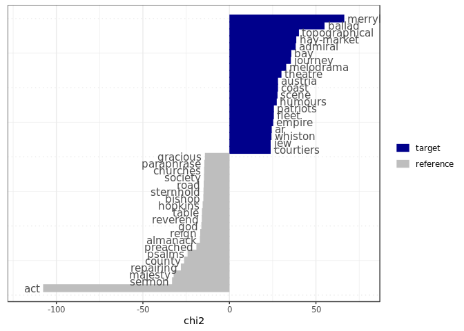

    ## 
    ## Community: 26


    ## 
    ##  1741-1750 
    ## 
    ## 25 top features/tokens
    ## $Community_1
    ##     letter    present containing    account        new    several    history 
    ##        302        264        228        221        197        171        164 
    ##       john      added    general     sermon      great      right     london 
    ##        144        141        140        139        134        127        125 
    ##       lord     church       king    england      state    english    remarks 
    ##        124        122        122        121        121        116        108 
    ##     french   preached       true honourable 
    ##        103        101        101        101 
    ## 
    ## $Community_10
    ##     national        essay         john         poem    prejudice          sir 
    ##            4            3            3            3            3            2 
    ##       knight observations       letter       nation     interest   considered 
    ##            2            2            2            2            2            2 
    ##      natural     poetical      spanish        peace      opposed       treaty 
    ##            2            2            2            2            2            2 
    ##     yielding    detention     jealousy     candidly      ensuing    gibraltar 
    ##            2            2            2            2            2            2 
    ##      barnard 
    ##            2 
    ## 
    ## $Community_11
    ##     sermon     letter    account        use    present        new    english 
    ##         22         22         21         20         19         18         17 
    ##       john     london      whole containing      added    shewing    several 
    ##         17         17         17         14         14         13         12 
    ##       life     thomas     people      great      right     tables    preachd 
    ##         12         12         11         11         11         11         11 
    ##        god   preached   reverend    history 
    ##         11         10         10         10 
    ## 
    ## $Community_12
    ##        act     county    majesty parliament   majestys      reign  repairing 
    ##        637        230        191        170        139        135        124 
    ##      great     passed    britain    several       king    present       town 
    ##        116        102         99         94         94         90         88 
    ##  effectual    session       road     duties       acts     george    granted 
    ##         83         81         81         80         70         69         68 
    ##     making    leading    certain   thousand 
    ##         65         65         63         63 
    ## 
    ## $Community_13
    ##      english        right    gentleman       rescue     formerly        speak 
    ##            2            2            2            2            2            2 
    ##      charged         poet     attempte    aunciente play-wrighte      maister 
    ##            2            2            2            2            2            2 
    ##    williaume   shakespere     faulsely     certaine  new-fangled       wittes 
    ##            2            2            2            2            2            2 
    ##      wotteth       freede     careless  mistakeings     heedless   imprinters 
    ##            2            2            2            2            2            2 
    ##       workes 
    ##            2 
    ## 
    ## $Community_14
    ##    several containing        law        new    account    present      cases 
    ##         52         47         44         38         35         34         34 
    ##     sermon    general      added     london    english    history       john 
    ##         33         33         32         31         29         29         28 
    ## honourable      whole      court       lord   preached   practice    shewing 
    ##         28         28         27         27         26         25         25 
    ##     courts       king    william    england 
    ##         25         23         22         22 
    ## 
    ## $Community_15
    ##       lord       john    account   almanack containing     london     letter 
    ##        132        125        111        104        101         90         85 
    ##     sermon        new    english      whole     thomas    history    present 
    ##         79         78         66         66         64         63         62 
    ##     psalms        god      right    several   preached    general       book 
    ##         56         55         53         52         49         49         48 
    ##      great  collected bissextile       life 
    ##         47         47         47         45 
    ## 
    ## $Community_16
    ##     letter    account    present containing    several      great        new 
    ##         75         73         62         60         57         51         49 
    ##      whole      added    history    conduct    remarks       john     london 
    ##         44         40         38         34         33         33         33 
    ##     french    england      right      trade     sermon      court    general 
    ##         32         31         31         31         30         29         29 
    ##     george       true       king       life 
    ##         28         27         26         26 
    ## 
    ## $Community_17
    ##        lord      sermon    preached      london  containing     several 
    ##          47          43          39          38          27          25 
    ##     account      church   president   governors     history      bishop 
    ##          23          23          23          23          22          22 
    ## westminster     charles         new        john       added        duke 
    ##          21          21          20          20          20          19 
    ##      thomas    reverend       right       grace       great        king 
    ##          19          18          18          18          17          17 
    ##      teatro 
    ##          17 
    ## 
    ## $Community_18
    ##       epistle          love          life       friends        people 
    ##             4             4             4             4             3 
    ##       remarks        church          hall         david       caution 
    ##             3             3             3             3             3 
    ##        gospel        christ        tender       account       present 
    ##             3             3             3             2             2 
    ##       quakers great-britain      ministry water-baptism          holy 
    ##             2             2             2             2             2 
    ##       baptism          john          true     discourse         truth 
    ##             2             2             2             2             2 
    ## 
    ## $Community_19
    ##     reverend     epistles       cicero      present         used     writings 
    ##            3            3            3            2            2            2 
    ##       manner       bishop       psalms     versione  epigrammata     scholiis 
    ##            2            2            2            2            2            2 
    ##     practice      several      england  particulars         july   characters 
    ##            1            1            1            1            1            1 
    ##       robert observations        fully         dean       sermon     preached 
    ##            1            1            1            1            1            1 
    ##      remarks 
    ##            1 
    ## 
    ## $Community_2
    ##      great    several containing    account    history       time      lords 
    ##         15         14         13         12         10         10         10 
    ##     useful    present      whole    curious       lady       best      house 
    ##         10          9          8          8          8          7          7 
    ##      water  tradesman       john       life    memoirs    authors       work 
    ##          7          7          6          6          6          6          6 
    ##     method    genuine kilmarnock      books 
    ##          6          6          6          6 
    ## 
    ## $Community_20
    ##      added      songs    several    account   together       time     nature 
    ##          3          3          2          2          2          2          2 
    ##     thomas        six       tree    composd  hampshire       lowe   groaning 
    ##          2          2          2          2          2          2          2 
    ##   practice containing       near      court characters     people    present 
    ##          1          1          1          1          1          1          1 
    ##       best      house     famous      peter 
    ##          1          1          1          1 
    ## 
    ## $Community_21
    ##      thomas       james        john       added     account       court 
    ##           7           6           5           5           4           4 
    ##    officers   narrative   behaviour      deacon        july   margarets 
    ##           4           4           4           4           3           3 
    ##        life       short       whole       young      george     francis 
    ##           3           3           3           3           3           3 
    ## proceedings      trials       david   rebellion       rebel   southwark 
    ##           3           3           3           3           3           3 
    ##        hill 
    ##           3 
    ## 
    ## $Community_22
    ##        new     george    william       book  chronicle    account     battle 
    ##          7          7          6          6          6          5          5 
    ##    british     ballad containing     prince  physician  secretary        wit 
    ##          4          4          3          3          3          3          3 
    ##    marshal     dathan        jew    dathans koningsegg     modern    several 
    ##          3          3          3          3          3          2          2 
    ##       near    present       last    conduct 
    ##          2          2          2          2 
    ## 
    ## $Community_23
    ## containing    account    several      parts        new       four    english 
    ##         34         23         21         21         20         18         17 
    ##      whole     useful        use    history      added      world      great 
    ##         16         14         13         13         13         12         12 
    ##       true     church     london    general       book    hundred       lord 
    ##         12         12         12         12         12         11         11 
    ##       king    shewing   practice       john 
    ##         11         11         10         10 
    ## 
    ## $Community_24
    ##   parliament     together      history        years      debates      several 
    ##            3            2            2            2            2            1 
    ##   containing       proper      account      present         last       member 
    ##            1            1            1            1            1            1 
    ##       robert      conduct         june observations        house          use 
    ##            1            1            1            1            1            1 
    ##       letter        notes        every      commons    depending        state 
    ##            1            1            1            1            1            1 
    ##    delivered 
    ##            1 
    ## 
    ## $Community_25
    ##     sermon   preached       john     letter    account containing      added 
    ##        215        160        153        147        146        119        118 
    ##    several   reverend       life        god     thomas    present      great 
    ##        108        107        103        100         98         96         87 
    ##     church     christ        new      death    remarks      whole considered 
    ##         87         85         84         82         71         69         68 
    ##     london    william       true    history 
    ##         66         65         65         62 
    ## 
    ## $Community_26
    ##        new    letters       book containing     people      essay   together 
    ##          5          4          3          2          2          2          2 
    ##       four        set     abroad   appendix     number     method      years 
    ##          2          2          2          2          2          2          2 
    ##    effects     divine      peace     others        god      forth      vicar 
    ##          2          2          2          2          2          2          2 
    ##       revd    learned      books    johnson 
    ##          2          2          2          2 
    ## 
    ## $Community_27
    ## westminster   southwark       miles      rocque    accurate         new 
    ##           3           3           3           3           2           2 
    ##  parliament      london     persons         act     country      cities 
    ##           2           2           2           2           2           2 
    ##      survey      jamess   according  kensington      length     borough 
    ##           2           2           2           2           2           2 
    ##    thirteen    nineteen       depth     avenues       roads         use 
    ##           2           2           2           2           1           1 
    ##        john 
    ##           1 
    ## 
    ## $Community_28
    ##     sermon containing    several        new       john    account   preached 
    ##        254        222        211        200        192        183        166 
    ##     church      added      whole       lord    general    history     london 
    ##        162        162        138        135        130        129        122 
    ##    present    english        use      right     thomas      great      parts 
    ##        121        120        115        113        112        111        107 
    ##     nature honourable    preachd     french 
    ##        101         99         93         92 
    ## 
    ## $Community_29
    ##       john    account    several     church     letter containing concerning 
    ##         89         76         73         68         61         57         55 
    ##     sermon       lord      great   preached     london      added   reverend 
    ##         54         49         46         46         45         45         44 
    ##     fellow    england      right    history     thomas       life    william 
    ##         43         41         39         39         39         38         37 
    ##     oxford    college        new     george 
    ##         37         35         34         34 
    ## 
    ## $Community_3
    ##       city containing     sermon   preached       john   minister   parishes 
    ##          3          2          2          2          2          2          2 
    ##     bishop    several    account     august     people    present     called 
    ##          2          1          1          1          1          1          1 
    ##    quakers vindicated    remarks       cast       holy      peter        new 
    ##          1          1          1          1          1          1          1 
    ##    parents     letter    baptist  judgments 
    ##          1          1          1          1 
    ## 
    ## $Community_4
    ##     account      letter        true      friend        full        list 
    ##           1           1           1           1           1           1 
    ##     persons        town   gentleman       exact       fifth     country 
    ##           1           1           1           1           1           1 
    ##    thursday     morning      twelve    happened    hitherto    dreadful 
    ##           1           1           1           1           1           1 
    ##  earthquake     rubbish melancholly       sound      oclock     instant 
    ##           1           1           1           1           1           1 
    ##      modern 
    ##           0 
    ## 
    ## $Community_5
    ##       england         wales          hand       several         great 
    ##             7             5             5             4             4 
    ##         rules        proper         whole          work         hands 
    ##             4             3             3             3             3 
    ##   exemplified    collection       variety        riding       william 
    ##             3             3             3             3             2 
    ##      practice      counties     following         roads hertfordshire 
    ##             2             2             2             2             2 
    ##           man         royal           use       britain      together 
    ##             2             2             2             2             2 
    ## 
    ## $Community_6
    ##      works      henry  dramatick      carey     modern husbandman      month 
    ##          1          1          1          1          0          0          0 
    ##  september    william      ellis    lespion      civil  politique    lettres 
    ##          0          0          0          0          0          0          0 
    ##        dun   voyageur     toutes     sortes     sujets   surnommé   chrétien 
    ##          0          0          0          0          0          0          0 
    ##     errant   practice    farming    carried 
    ##          0          0          0          0 
    ## 
    ## $Community_7
    ##      great     called      right honourable      power      lords  spiritual 
    ##          1          1          1          1          1          1          1 
    ##   temporal        old   courtier     island     common    honesty    address 
    ##          1          1          1          1          1          1          1 
    ##  discarded     humble distressed   vulgarly        btn     modern husbandman 
    ##          1          1          1          1          1          0          0 
    ##      month  september    william      ellis 
    ##          0          0          0          0 
    ## 
    ## $Community_8
    ##    account  receiving       paul       life       time    reasons       used 
    ##          2          2          1          1          1          1          1 
    ##   interest   majestys  gentleman     oxford        get  behaviour       oxon 
    ##          1          1          1          1          1          1          1 
    ##  execution      wells     pardon       gent    forgery authentick       sept 
    ##          1          1          1          1          1          1          1 
    ##  sentences  prevented      crime   clemency 
    ##          1          1          1          1 
    ## 
    ## $Community_9
    ##       gardens     buildings       william      counties       england 
    ##             2             2             1             1             1 
    ##    containing     following           viz        proper hertfordshire 
    ##             1             1             1             1             1 
    ##         right          lord      viscount       adapted         every 
    ##             1             1             1             1             1 
    ##    honourable      dialogue   description         whole  particularly 
    ##             1             1             1             1             1 
    ##       offices         views    particular        oxford      building 
    ##             1             1             1             1             1 
    ## 
    ## 
    ## Community: 1


    ## 
    ## Community: 2


    ## 
    ## Community: 3

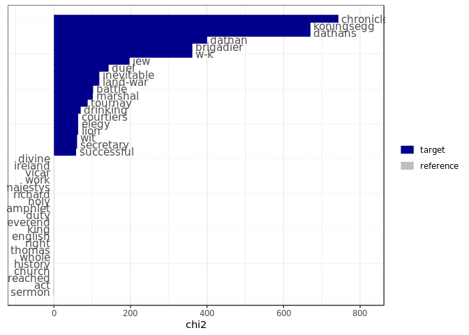

    ## 
    ## Community: 4

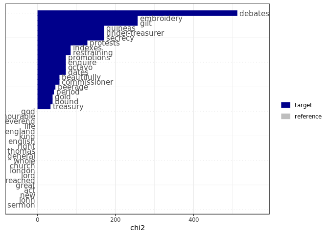

    ## 
    ## Community: 5

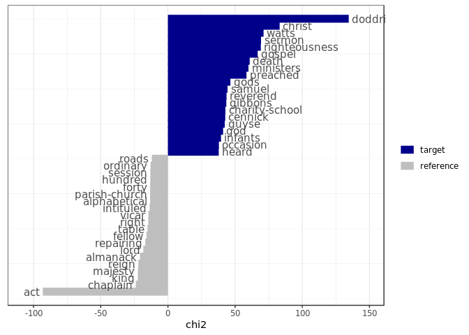

    ## 
    ## Community: 6


    ## 
    ## Community: 7


    ## 
    ## Community: 8


    ## 
    ## Community: 9


    ## 
    ## Community: 10


    ## 
    ## Community: 11


    ## 
    ## Community: 12


    ## 
    ## Community: 13

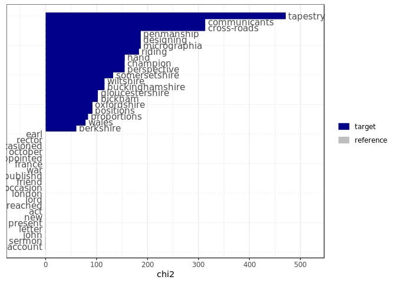

    ## 
    ## Community: 14


    ## 
    ## Community: 15


    ## 
    ## Community: 16


    ## 
    ## Community: 17


    ## 
    ## Community: 18


    ## 
    ## Community: 19

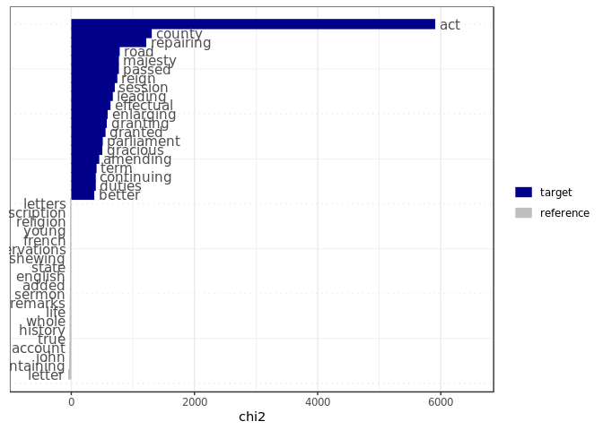

    ## 
    ## Community: 20


    ## 
    ## Community: 21


    ## 
    ## Community: 22


    ## 
    ## Community: 23


    ## 
    ## Community: 24

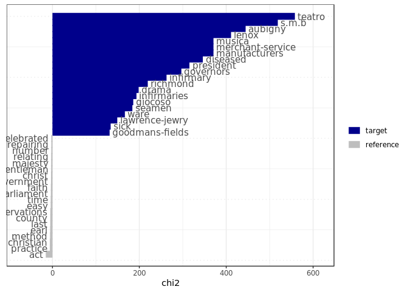

    ## 
    ## Community: 25

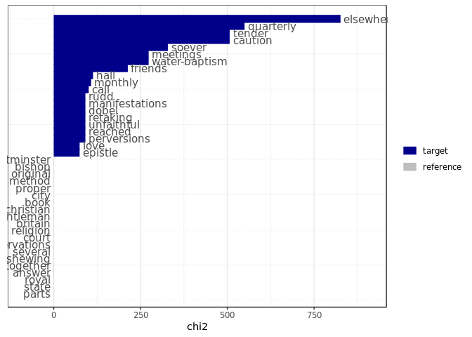

    ## 
    ## Community: 26


    ## 
    ## Community: 27

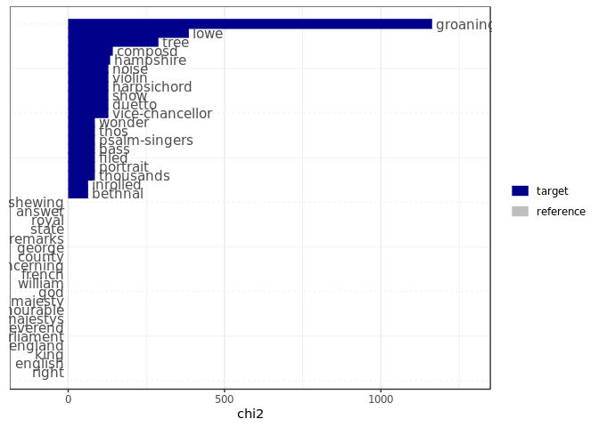

    ## 
    ## Community: 28


    ## 
    ## Community: 29

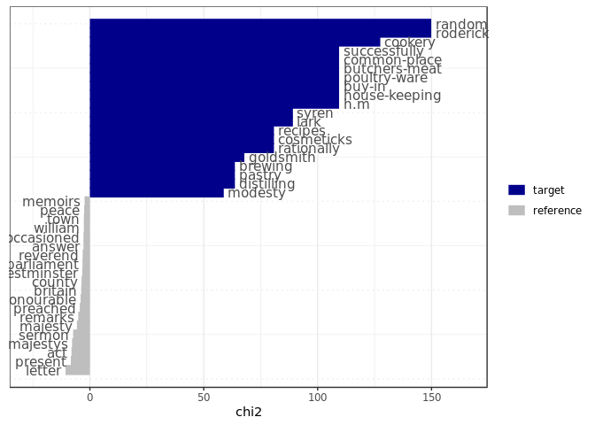

    ## 
    ##  1746-1755 
    ## 
    ## 25 top features/tokens
    ## $Community_1
    ## containing        new    several    account      added    history       john 
    ##         93         67         65         65         60         59         57 
    ##     sermon     church    english      parts        use      right       lord 
    ##         52         48         48         46         44         39         39 
    ##   preached    present       life    william       four concerning    general 
    ##         38         37         37         37         36         36         36 
    ##      essay      james      whole     letter 
    ##         34         34         34         33 
    ## 
    ## $Community_10
    ##     tables        new      whole   harbours       bays describing      ports 
    ##         12         10         10          9          9          9          9 
    ##        use     length      capes    shewing directions sea-coasts      table 
    ##          8          8          8          8          8          8          7 
    ##    english     rivers navigation       ship      pilot    several containing 
    ##          7          7          7          7          7          6          6 
    ##    another  corrected      roads      place 
    ##          6          6          6          6 
    ## 
    ## $Community_11
    ##        act     county parliament    majesty   majestys      great  repairing 
    ##        623        251        171        170        130        119        119 
    ##    several      reign       town       road    britain     passed    present 
    ##        116         99         98         95         90         85         84 
    ##    session     duties  effectual    certain       acts     better     making 
    ##         82         77         76         73         73         71         68 
    ##    persons       city  mentioned       time 
    ##         66         66         66         65 
    ## 
    ## $Community_12
    ##       friends       epistle          life       account    collection 
    ##             8             7             7             6             5 
    ##          love        christ         david        called great-britain 
    ##             5             4             4             4             4 
    ##          hall       caution     elsewhere       various          time 
    ##             4             4             4             3             3 
    ##    containing          john         third           act        gospel 
    ##             3             3             3             3             3 
    ##       travels        people      meetings        advice       quakers 
    ##             3             3             3             3             3 
    ## 
    ## $Community_13
    ##      friend      letter  earthquake     country     account     persons 
    ##           1           1           1           1           1           1 
    ##   gentleman        true        town      twelve    hitherto        list 
    ##           1           1           1           1           1           1 
    ##     morning    happened     instant    dreadful        full       fifth 
    ##           1           1           1           1           1           1 
    ##    thursday       exact       sound melancholly      oclock     rubbish 
    ##           1           1           1           1           1           1 
    ##     present 
    ##           0 
    ## 
    ## $Community_14
    ##   almanack       lord       john        new     psalms bissextile    english 
    ##        111         90         54         53         52         46         45 
    ##      whole  leap-year     useful containing  ephemeris     thomas     london 
    ##         41         40         38         36         34         32         32 
    ##  collected      diary       book     others        god        use      metre 
    ##         31         31         29         29         28         28         28 
    ##  sternhold    hopkins    planets    account 
    ##         28         28         26         25 
    ## 
    ## $Community_15
    ##    england     proper      wales      great       hand    several      whole 
    ##          7          5          5          5          5          4          4 
    ## collection      hands      added  principal       work    gardens    drawing 
    ##          3          3          3          3          3          3          3 
    ##    bickham     riding      pekin    william        man     nature       book 
    ##          3          3          3          2          2          2          2 
    ##        use containing     ladies      essex 
    ##          2          2          2          2 
    ## 
    ## $Community_16
    ##     sermon       john   preached    account     letter containing    several 
    ##        206        187        177        149        142        131        130 
    ##        new      added      great   reverend     thomas       life      death 
    ##        123        113        104        103         89         88         88 
    ##    present     church     london    general        god      whole    request 
    ##         87         84         81         77         75         73         72 
    ##    england   religion        use    remarks 
    ##         71         71         70         70 
    ## 
    ## $Community_17
    ##     members       voted    december       house     commons       names 
    ##           6           4           3           3           3           3 
    ##        list      monday    rejected     altered     ireland     patriot 
    ##           3           3           3           3           2           2 
    ##       sacra freeholders      insula      libera  money-bill      letter 
    ##           2           2           2           2           2           1 
    ##  collection      temple         sir  containing       jones  honourable 
    ##           1           1           1           1           1           1 
    ##        lord 
    ##           1 
    ## 
    ## $Community_18
    ##      choice     spirits       feast         new        sung       songs 
    ##           3           3           3           2           2           2 
    ##        song    vauxhall          ge        lady       vogue  collection 
    ##           2           2           2           1           1           1 
    ##       added         ode  containing   presented     georges      verses 
    ##           1           1           1           1           1           1 
    ##      humbly       every description      george   companion      worthy 
    ##           1           1           1           1           1           1 
    ##      others 
    ##           1 
    ## 
    ## $Community_19
    ##      thomas       james       added        john     account       court 
    ##           6           6           4           4           4           4 
    ##      globes   behaviour   narrative      deacon        life      morgan 
    ##           4           4           4           4           3           3 
    ##       david        hill      george       whole   rebellion proceedings 
    ##           3           3           3           3           3           3 
    ##   margarets     francis   southwark      trials        july    officers 
    ##           3           3           3           3           3           3 
    ##    fletcher 
    ##           3 
    ## 
    ## $Community_2
    ##       number       tables      shewing       sermon     preached         john 
    ##            3            3            3            2            2            2 
    ##       london        value          due   especially       amount          pay 
    ##            2            2            2            2            2            2 
    ##     officers      several          new        added     majestys     servants 
    ##            2            1            1            1            1            1 
    ##       causes        grace dissertation          use   containing      sailors 
    ##            1            1            1            1            1            1 
    ##  recommended 
    ##            1 
    ## 
    ## $Community_20
    ##      account   containing       letter      several          new      history 
    ##          213          211          179          171          165          148 
    ##        great        added         john       london        whole         life 
    ##          137          133          123          116          112          110 
    ##      present         lord observations       church          use      english 
    ##          106          102           97           95           93           87 
    ##       sermon       french      general         time      england      william 
    ##           85           84           84           79           79           77 
    ##      curious 
    ##           76 
    ## 
    ## $Community_21
    ##     letter    account     sermon       john        new containing    several 
    ##        193        147        118        114        111        111        107 
    ##    history       lord     church    present       life   preached      right 
    ##         95         94         92         89         89         89         84 
    ##    remarks     london      added    william      great honourable      essay 
    ##         80         79         75         73         73         71         67 
    ## concerning      royal    general    england 
    ##         66         65         65         62 
    ## 
    ## $Community_22
    ##    account containing        new    several       lord    present     london 
    ##         97         87         72         66         59         57         57 
    ##      added     letter    england     sermon       city    history       time 
    ##         55         52         48         46         45         44         44 
    ##        use    english       john    letters     church      right      court 
    ##         42         42         40         39         39         39         39 
    ## parliament      lists   preached      great 
    ##         38         37         36         36 
    ## 
    ## $Community_23
    ##       letter         lord          new   containing         john      several 
    ##           38           31           28           27           27           25 
    ##          god       sermon          und      history      account        right 
    ##           25           25           25           23           23           23 
    ##        royal       church observations     reverend      remarks      society 
    ##           22           22           21           21           21           20 
    ##        state       london      present       thomas     preached      english 
    ##           19           19           18           18           18           17 
    ##        parts 
    ##           17 
    ## 
    ## $Community_3
    ##     sermon   majestys        sir       city    assizes        knt    norwich 
    ##          4          3          3          3          3          3          3 
    ##     thomas   preached containing       john    richard    preachd    request 
    ##          2          2          2          2          2          2          2 
    ## honourable   religion      court  gentlemen      kings    norfolk       fair 
    ##          2          2          2          2          2          2          2 
    ##     bishop     august       held  wednesday 
    ##          2          2          2          2 
    ## 
    ## $Community_4
    ##    account containing        new     letter    present    several     london 
    ##        106        105        103         92         83         82         79 
    ##       lord      added    history       john      whole     french      royal 
    ##         75         74         73         66         66         64         63 
    ##    general        use      court    william     thomas parliament    england 
    ##         63         57         56         55         54         54         53 
    ##        sir  gentleman       time      great 
    ##         52         48         46         46 
    ## 
    ## $Community_5
    ## comberbach    epistle       life    country    british        ode      verse 
    ##          3          1          1          1          1          1          1 
    ##    defence     favour      reply    preface  exhibited      blank      roger 
    ##          1          1          1          1          1          1          1 
    ##    eclogue      rhyme    contest experiment      byram      byrom    present 
    ##          1          1          1          1          1          1          0 
    ##      state      north    america      essay 
    ##          0          0          0          0 
    ## 
    ## $Community_6
    ##        right      english    gentleman     formerly        speak         poet 
    ##            2            2            2            2            2            2 
    ##     careless     attempte       rescue    aunciente play-wrighte      maister 
    ##            2            2            2            2            2            2 
    ##    williaume   shakespere     faulsely      charged     certaine  new-fangled 
    ##            2            2            2            2            2            2 
    ##       wittes      wotteth       freede  mistakeings     heedless   imprinters 
    ##            2            2            2            2            2            2 
    ##       workes 
    ##            2 
    ## 
    ## $Community_7
    ##         john     almanack   redemption     merlinus    liberatus    partridge 
    ##            9            7            7            7            7            7 
    ##    presented       verses       humbly       worthy      planets         copy 
    ##            3            3            3            3            3            3 
    ##      masters     creation       popish       horrid   mistresses observations 
    ##            3            3            3            3            3            2 
    ##      history         poem      william        world   government       london 
    ##            2            2            2            2            2            2 
    ##    according 
    ##            2 
    ## 
    ## $Community_8
    ##     sermon   preached  worcester    history      added       john honourable 
    ##         22         19         16         15         14         14         13 
    ##    english    present     letter    account    england    request    several 
    ##         12         11         11         11         11         10          9 
    ##   reverend     london        new        sir     church containing     george 
    ##          9          9          8          8          8          8          8 
    ## collection      right    remarks      great 
    ##          7          7          7          7 
    ## 
    ## $Community_9
    ##     sermon        new containing       john   preached    several    account 
    ##        218        204        191        170        161        157        150 
    ##       lord     church      added     london        use     thomas    english 
    ##        139        136        130        122        115        111        108 
    ##      right      whole    present    history  christian   reverend     nature 
    ##        102         99         98         97         97         92         89 
    ## honourable      parts    england    general 
    ##         83         83         81         81 
    ## 
    ## 
    ## Community: 1

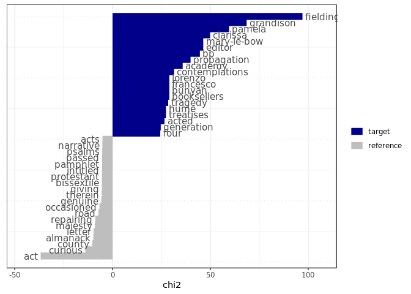

    ## 
    ## Community: 2

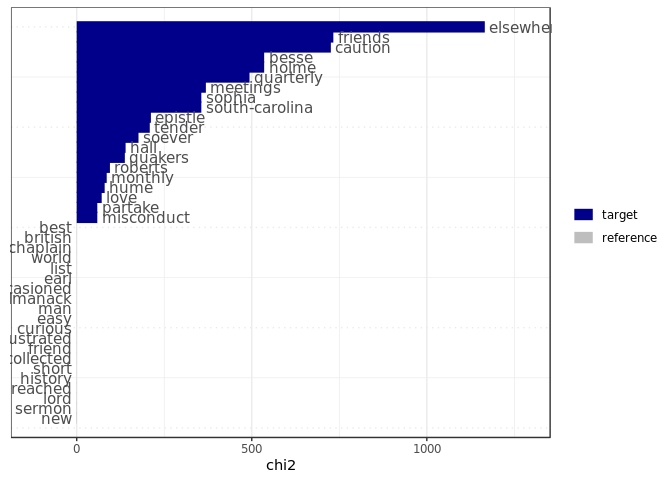

    ## 
    ## Community: 3

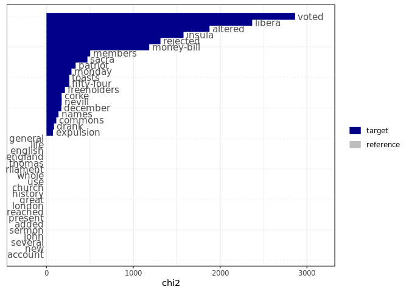

    ## 
    ## Community: 4

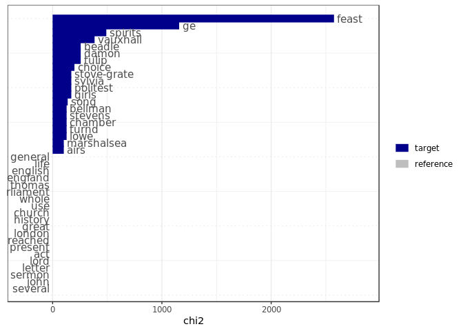

    ## 
    ## Community: 5

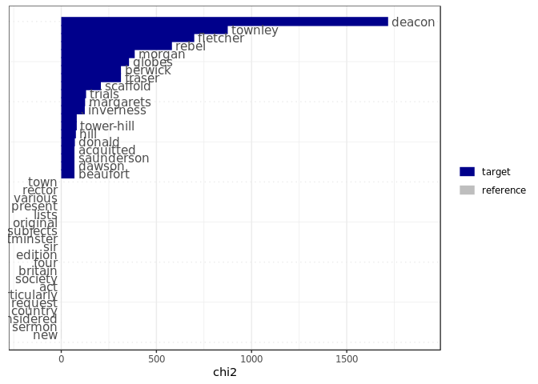

    ## 
    ## Community: 6

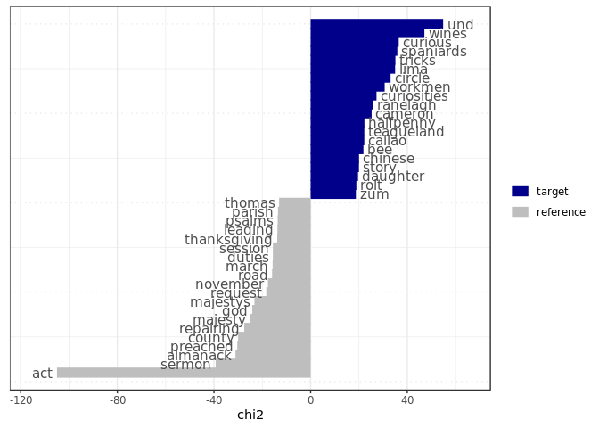

    ## 
    ## Community: 7


    ## 
    ## Community: 8

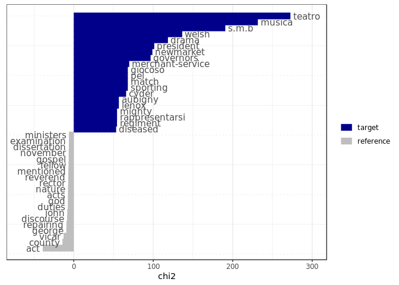

    ## 
    ## Community: 9


    ## 
    ## Community: 10

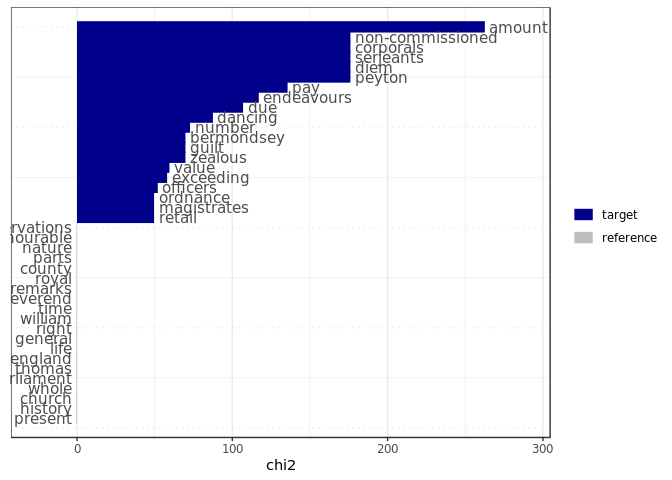

    ## 
    ## Community: 11


    ## 
    ## Community: 12

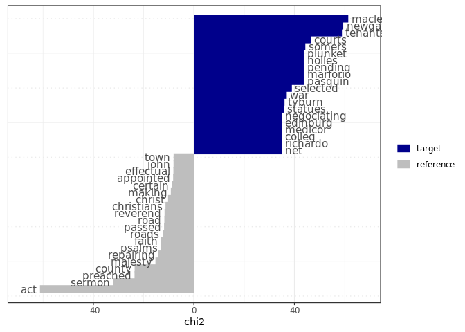

    ## 
    ## Community: 13


    ## 
    ## Community: 14


    ## 
    ## Community: 15


    ## 
    ## Community: 16


    ## 
    ## Community: 17


    ## 
    ## Community: 18


    ## 
    ## Community: 19


    ## 
    ## Community: 20

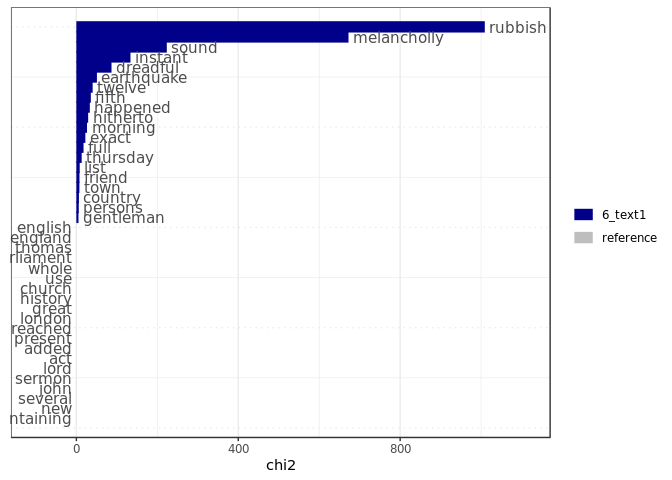

    ## 
    ## Community: 21

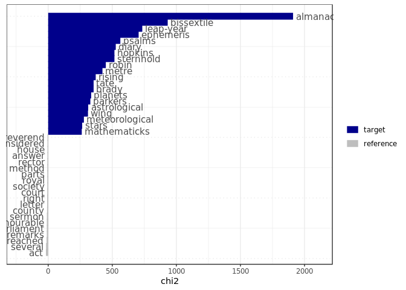

    ## 
    ## Community: 22

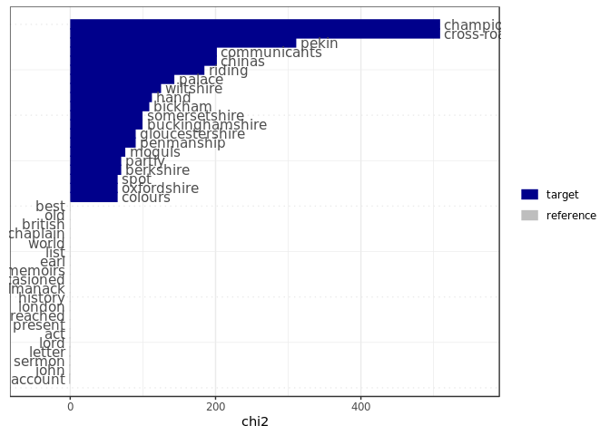

    ## 
    ## Community: 23


    ## 
    ##  1751-1760 
    ## 
    ## 25 top features/tokens
    ## $Community_1
    ## containing     sermon        new    account   preached       john      added 
    ##        314        312        307        277        275        273        253 
    ##    several    history     letter       lord        use       life    present 
    ##        252        232        190        186        180        180        176 
    ##      whole      great    english    general     london      parts     church 
    ##        174        173        171        167        163        150        148 
    ##     thomas    william     french      right 
    ##        147        145        135        133 
    ## 
    ## $Community_10
    ##           use       manners         state           end miscellaneous 
    ##             1             1             1             1             1 
    ##          life        sacred        speech         moral         wales 
    ##             1             1             1             1             1 
    ##          plan           man           viz        sketch          poem 
    ##             1             1             1             1             1 
    ##       princes        essays       solomon  introductory      passions 
    ##             1             1             1             1             1 
    ##        memory        orange           ode        vision       objects 
    ##             1             1             1             1             1 
    ## 
    ## $Community_11
    ##      history       french        newly         wild        madam       savage 
    ##            1            1            1            1            1            1 
    ##         girl       caught        woods    champagne          h-t      magasin 
    ##            1            1            1            1            1            0 
    ## adolescentes    dialogues         sage  gouvernante    plusieurs       éléves 
    ##            0            0            0            0            0            0 
    ##     premiére  distinction       prince     beaumont         tome   colporteur 
    ##            0            0            0            0            0            0 
    ##     histoire 
    ##            0 
    ## 
    ## $Community_12
    ##       letter      england       people      letters      present       france 
    ##           21           18           13            7            5            5 
    ##        sixth        shewn   containing     original    important        owing 
    ##            5            5            4            4            4            4 
    ## constitution       nation         ruin    necessity     progress        fifth 
    ##            4            4            4            4            4            4 
    ##     national   subversion     councils      hanover   calamities     grandeur 
    ##            4            4            4            4            4            4 
    ##     restored 
    ##            4 
    ## 
    ## $Community_13
    ##     tables     sermon   preached     number    shewing        due     london 
    ##          3          3          3          3          3          2          2 
    ##       john   officers especially      value        pay     amount     peyton 
    ##          2          2          2          2          2          2          1 
    ##       cent    hundred containing  necessary      added    english        use 
    ##          1          1          1          1          1          1          1 
    ##    several  reduction     method      power 
    ##          1          1          1          1 
    ## 
    ## $Community_14
    ##        new    account containing     letter       john    several     sermon 
    ##        281        272        242        236        226        213        199 
    ##    history      added   preached      great    present       life    english 
    ##        191        173        172        158        153        150        146 
    ##     london       lord        use     french    general      whole    william 
    ##        145        144        135        126        126        124        122 
    ##    england     church      right    letters 
    ##        120        120        119        118 
    ## 
    ## $Community_15
    ##      several      account         john   containing          new      history 
    ##          107          107          106          105           89           84 
    ##        added       letter         life       sermon        great     preached 
    ##           81           79           76           75           73           66 
    ##        death         lord        court      present      general      england 
    ##           55           52           50           50           47           46 
    ##    christian   collection       church      remarks       french observations 
    ##           46           45           45           44           43           43 
    ##     reverend 
    ##           43 
    ## 
    ## $Community_16
    ##     account         new  containing     history       added       great 
    ##          38          38          37          36          30          30 
    ##         use      useful description     variety     curious     present 
    ##          26          23          20          20          18          18 
    ##     english       parts     various      manner illustrated  historical 
    ##          17          16          16          15          15          14 
    ##     general       young      little     several       royal        view 
    ##          14          14          14          13          13          13 
    ##        life 
    ##          13 
    ## 
    ## $Community_17
    ##   comberbach      british         life      defence      country      preface 
    ##            3            1            1            1            1            1 
    ##        reply        blank      contest    exhibited        verse      epistle 
    ##            1            1            1            1            1            1 
    ##          ode       favour        rhyme        roger      eclogue   experiment 
    ##            1            1            1            1            1            1 
    ##        byram        byrom      magasin adolescentes    dialogues         sage 
    ##            1            1            0            0            0            0 
    ##  gouvernante 
    ##            0 
    ## 
    ## $Community_18
    ##       london  discoveries      society observations          new   directions 
    ##            3            3            3            2            2            2 
    ##      shewing    described  microscopes   microscope      objects   containing 
    ##            2            2            2            2            2            1 
    ##       nature   substances        kinds   calculated        state  examination 
    ##            1            1            1            1            1            1 
    ##      account        henry      curious       member        royal      letters 
    ##            1            1            1            1            1            1 
    ##    explained 
    ##            1 
    ## 
    ## $Community_19
    ##       added     account      letter      bodies   new-stile        time 
    ##           3           3           3           3           3           2 
    ##      person   according      reason    chaplain  parliament  particular 
    ##           2           2           2           2           2           2 
    ##       human    dialogue       found        near   clergyman  conscience 
    ##           2           2           2           2           2           2 
    ##       given     keeping parishioner       stile  scrupulous   christmas 
    ##           2           2           2           2           2           2 
    ##     edition 
    ##           1 
    ## 
    ## $Community_2
    ##      several      country         list      present   containing         john 
    ##            5            5            5            4            3            3 
    ##        james    elections  reflections alphabetical         time        state 
    ##            3            3            3            3            2            2 
    ##        years       sermon     preached   concerning     counties       cities 
    ##            2            2            2            2            2            2 
    ##     boroughs      members     executed         near      shewing  westminster 
    ##            2            2            2            2            2            2 
    ##       within 
    ##            2 
    ## 
    ## $Community_20
    ##     letter        old honourable      trial     friend   recorder         n- 
    ##          5          5          3          3          3          3          3 
    ##    account      house     voyage      right       earl    unhappy  narrative 
    ##          2          2          2          2          2          2          2 
    ##    captain        a-y      added   original    several       last  continued 
    ##          2          2          1          1          1          1          1 
    ##     london    curious     motion    letters 
    ##          1          1          1          1 
    ## 
    ## $Community_21
    ##        act parliament     county    majesty      great   majestys    several 
    ##        765        225        189        187        166        164        149 
    ##       lord    certain        new    present    session    britain       time 
    ##        146        136        130        125        123        119        111 
    ##       john     duties      reign   almanack     better       acts    persons 
    ##        108        102        102        101         95         92         90 
    ##     twenty containing  effectual     london 
    ##         89         88         87         82 
    ## 
    ## $Community_22
    ##          arts      commerce       society encouragement  manufactures 
    ##             4             4             4             4             4 
    ##        london   established      premiums         rules      december 
    ##             3             2             2             1             1 
    ##          list       offered    instituted        orders       magasin 
    ##             1             1             1             1             0 
    ##  adolescentes     dialogues          sage   gouvernante     plusieurs 
    ##             0             0             0             0             0 
    ##        éléves      premiére   distinction        prince      beaumont 
    ##             0             0             0             0             0 
    ## 
    ## $Community_23
    ##     letter       lord    account        new    present    several      added 
    ##         43         40         36         35         31         30         29 
    ##      whole       john    british     london    general      atlas containing 
    ##         28         24         23         23         21         21         20 
    ##     french   almanack       time        use    england    william        war 
    ##         20         20         18         18         18         17         16 
    ##    english     manner      royal        god 
    ##         16         16         16         16 
    ## 
    ## $Community_24
    ##       cent       holy          £        new       days     sermon   preached 
    ##          7          6          6          5          5          5          5 
    ##     church   interest containing      added  cambridge       john    present 
    ##          5          5          4          4          4          4          4 
    ##    england        m.a    shewing      month  brethrens   baptized    account 
    ##          4          4          4          4          4          4          3 
    ##  testament   ordinary    william    persons 
    ##          3          3          3          3 
    ## 
    ## $Community_25
    ##    engraved    students     raphael    painting  historical     account 
    ##           2           2           2           1           1           1 
    ##       short        life   explained      others       guide       young 
    ##           1           1           1           1           1           1 
    ##   discourse  collection illustrated    examples     certain  expression 
    ##           1           1           1           1           1           1 
    ##         viz         sir      regard   imitation    benjamin   engraving 
    ##           1           1           1           1           1           1 
    ##      prints 
    ##           1 
    ## 
    ## $Community_26
    ##     members       voted       house    december        list      monday 
    ##           6           4           3           3           3           3 
    ##    rejected     commons       names     altered     ireland freeholders 
    ##           3           3           3           3           2           2 
    ##       sacra     patriot  money-bill      insula      libera        lord 
    ##           2           2           2           2           2           1 
    ##  containing    original        city      letter      select  collection 
    ##           1           1           1           1           1           1 
    ##  fifty-four 
    ##           1 
    ## 
    ## $Community_27
    ##      sermon        lord     assizes         sir     norwich         knt 
    ##           4           3           3           3           3           3 
    ##       court        time     several   cambridge     account      thomas 
    ##           2           2           2           2           2           2 
    ##    preached        held     request      rector differences  honourable 
    ##           2           2           2           2           2           2 
    ##       civil    majestys      fellow    justices     norfolk         god 
    ##           2           2           2           2           2           2 
    ##      church 
    ##           2 
    ## 
    ## $Community_28
    ##   collection      account      eminent          new        songs         sung 
    ##           14            7            6            6            6            6 
    ##     vauxhall       wreath   performers      hundred    including      curious 
    ##            6            6            6            5            5            5 
    ##      finding      publick        found        taken alphabetical         song 
    ##            5            5            5            5            5            5 
    ##       places     ranelagh        ready        mirth     contents      hunting 
    ##            5            5            5            5            5            5 
    ##      jollity 
    ##            5 
    ## 
    ## $Community_29
    ##   describing   navigation        whole          new        pilot      english 
    ##           12           10           10           10           10            9 
    ##        capes   sea-coasts       tables      england    corrected      shewing 
    ##            9            9            8            8            8            8 
    ##     harbours         bays       rivers        ports        place        roads 
    ##            8            8            8            8            7            7 
    ##    necessary        river      islands particularly      another     enlarged 
    ##            6            6            6            6            6            6 
    ##        sands 
    ##            6 
    ## 
    ## $Community_3
    ##       several    collection       princes       english       account 
    ##            11            10             9             7             7 
    ##        prince       history          last        letter          love 
    ##             6             6             6             6             6 
    ##     formidaur       florian    containing         added        london 
    ##             6             6             5             5             4 
    ##       present      together         every        master        france 
    ##             4             4             4             4             4 
    ## copper-plates           viz           sir    celebrated       fortune 
    ##             4             4             4             4             3 
    ## 
    ## $Community_30
    ## containing     letter      added        new      whole    account    several 
    ##         29         29         21         21         17         17         15 
    ##   together      great     french    present       best expedition        use 
    ##         15         15         14         13         13         12         11 
    ##   compleat    history    english    remarks      royal    general      essay 
    ##         11         10         10         10         10         10         10 
    ##    conduct   receipts     manner   relating 
    ##         10         10          9          9 
    ## 
    ## $Community_31
    ##      roberts        henry      variety      eminent      kingdom        james 
    ##            2            1            1            1            1            1 
    ##       horses     engraved        drawn    companion         ever  represented 
    ##            1            1            1            1            1            1 
    ##       pocket     likeness     striking         race   sportsmans  portraiture 
    ##            1            1            1            1            1            1 
    ##    stallions    attitudes      magasin adolescentes    dialogues         sage 
    ##            1            1            0            0            0            0 
    ##  gouvernante 
    ##            0 
    ## 
    ## $Community_32
    ##         john       prince      english       french      account      england 
    ##            2            1            1            1            1            1 
    ##         true       letter          old      cavalry       giving       battle 
    ##            1            1            1            1            1            1 
    ##     faithful       bloody      hanover       fought       pately       stubbs 
    ##            1            1            1            1            1            1 
    ##      comrade    ferninand      magasin adolescentes    dialogues         sage 
    ##            1            1            0            0            0            0 
    ##  gouvernante 
    ##            0 
    ## 
    ## $Community_33
    ##        globes    navigation       several     geography         noble 
    ##             4             2             2             2             2 
    ##   description    supplement       hundred         parts    containing 
    ##             1             1             1             1             1 
    ##     necessary         added fortification     knowledge        nature 
    ##             1             1             1             1             1 
    ##           use        former        manner       curious      sciences 
    ##             1             1             1             1             1 
    ##  improvements          true         young       charges      intended 
    ##             1             1             1             1             1 
    ## 
    ## $Community_34
    ##       john  discourse    account   preached    william     london    cennick 
    ##         72         65         52         47         41         38         37 
    ##  substance     letter containing  delivered     sermon     church    romaine 
    ##         36         33         32         31         30         29         28 
    ##    several    english    present       west        new   dunstans     christ 
    ##         27         26         26         26         25         25         24 
    ##      added   lecturer    edition       lord 
    ##         23         23         21         21 
    ## 
    ## $Community_35
    ##       john     letter     sermon    account   preached containing    several 
    ##         59         58         52         51         51         49         47 
    ##      right     london     church       lord    england      added    present 
    ##         44         40         40         35         35         34         34 
    ##    english      great        new     people   reverend       king    history 
    ##         32         31         30         29         28         28         27 
    ##     parish honourable    conduct        god 
    ##         27         24         24         24 
    ## 
    ## $Community_4
    ##       letter       sermon   containing      account         john          new 
    ##          121          110          103          101          101           99 
    ##     preached      several        added         lord        royal        great 
    ##           98           95           85           84           75           75 
    ##      present       london       church      general      history        right 
    ##           73           72           71           66           65           63 
    ##   honourable       french observations      england   parliament   concerning 
    ##           62           58           58           58           57           52 
    ##      remarks 
    ##           51 
    ## 
    ## $Community_5
    ##        george       bickham           new      engraved         added 
    ##             4             3             2             2             1 
    ##       english          laid       general         short         essay 
    ##             1             1             1             1             1 
    ##     explained      together       officer   improvement   illustrated 
    ##             1             1             1             1             1 
    ##         words copper-plates   perspective        copper        plates 
    ##             1             1             1             1             1 
    ##       towards      military         hands        county          plan 
    ##             1             1             1             1             1 
    ## 
    ## $Community_6
    ##       letter           b-          g-e          d-e           -d      magasin 
    ##            1            1            1            1            1            0 
    ## adolescentes    dialogues         sage  gouvernante    plusieurs       éléves 
    ##            0            0            0            0            0            0 
    ##     premiére  distinction       prince     beaumont         tome   colporteur 
    ##            0            0            0            0            0            0 
    ##     histoire       morale     critique     chevrier       lettre        déces 
    ##            0            0            0            0            0            0 
    ##          sme 
    ##            0 
    ## 
    ## $Community_7
    ##     letter occasioned    history   original     nature    academy  extracted 
    ##          2          2          1          1          1          1          1 
    ##      short     virtue       cure physicians       john     common   intended 
    ##          1          1          1          1          1          1          1 
    ##     office      david      plain       mind    michael  discourse concerning 
    ##          1          1          1          1          1          1          1 
    ##   reverend     rector    natural    mankind 
    ##          1          1          1          1 
    ## 
    ## $Community_8
    ##       account         cases        letter philosophical         moral 
    ##             4             3             3             3             3 
    ##         taken      epistles    shakespear       charles           use 
    ##             3             3             3             2             2 
    ##   examination          john       william       persons        sermon 
    ##             2             2             2             2             2 
    ##      preached      sensible   illustrated     collected     impartial 
    ##             2             2             2             2             2 
    ##    expedition         sense         water        proved    rheumatism 
    ##             2             2             2             2             2 
    ## 
    ## $Community_9
    ##        england         walter        raleigh        history        brought 
    ##              2              2              2              1              1 
    ##            end            new    illustrated           king      dedicated 
    ##              1              1              1              1              1 
    ##         copper         plates          civil            sir      rebellion 
    ##              1              1              1              1              1 
    ##           earl ecclesiastical  establishment     thirty-two        monarch 
    ##              1              1              1              1              1 
    ##            knt         egbert          begun      salisbury        magasin 
    ##              1              1              1              1              0 
    ## 
    ## 
    ## Community: 1

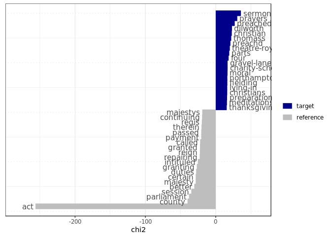

    ## 
    ## Community: 2


    ## 
    ## Community: 3

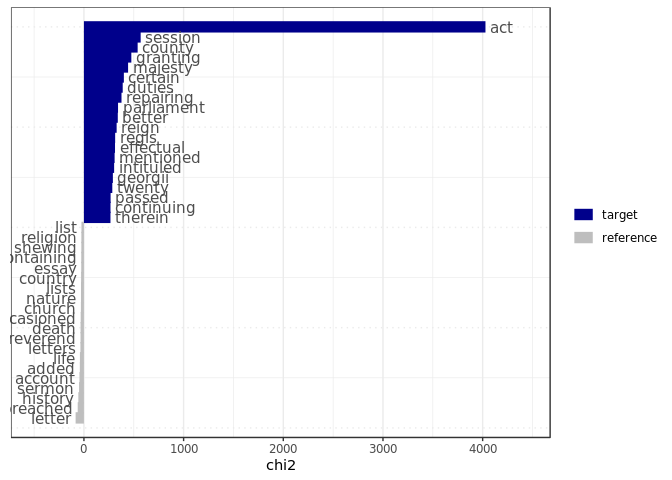

    ## 
    ## Community: 4


    ## 
    ## Community: 5


    ## 
    ## Community: 6

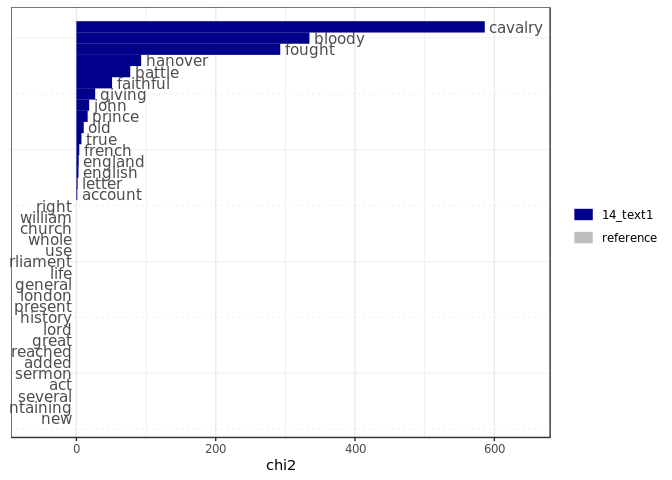

    ## 
    ## Community: 7


    ## 
    ## Community: 8


    ## 
    ## Community: 9


    ## 
    ## Community: 10


    ## 
    ## Community: 11


    ## 
    ## Community: 12

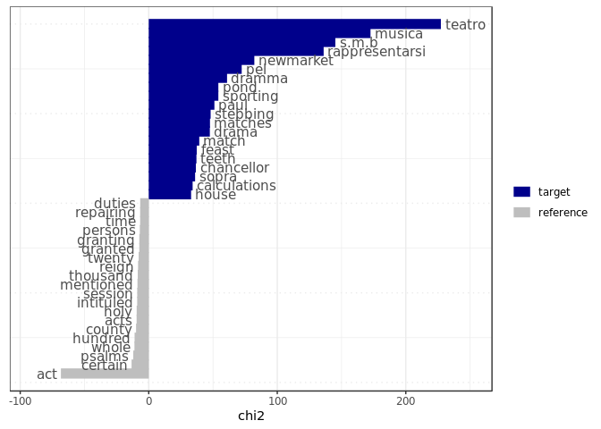

    ## 
    ## Community: 13

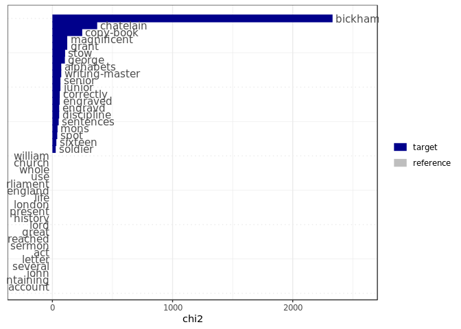

    ## 
    ## Community: 14

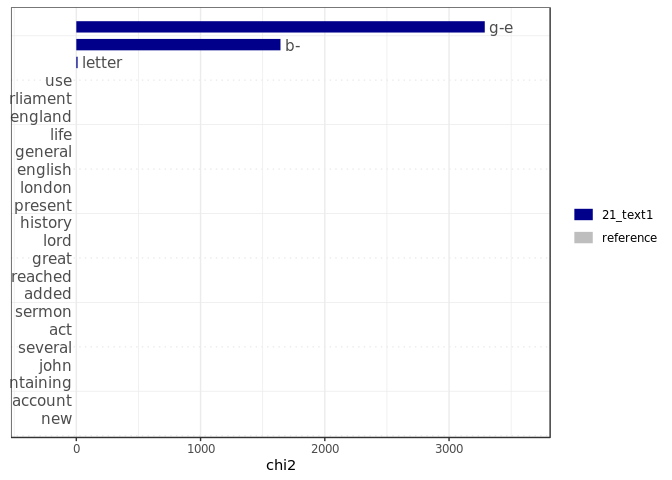

    ## 
    ## Community: 15


    ## 
    ## Community: 16

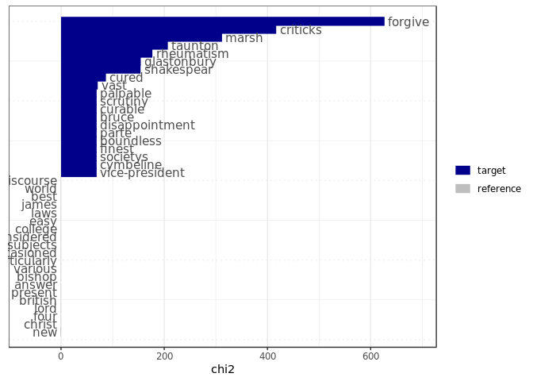

    ## 
    ## Community: 17


    ## 
    ## Community: 18


    ## 
    ## Community: 19


    ## 
    ## Community: 20


    ## 
    ## Community: 21

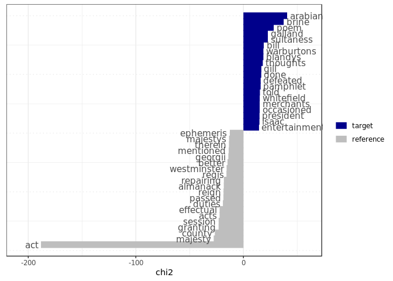

    ## 
    ## Community: 22

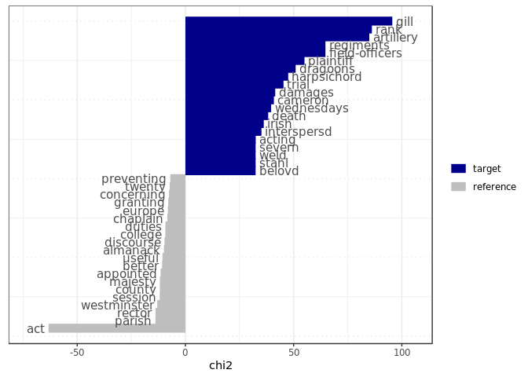

    ## 
    ## Community: 23


    ## 
    ## Community: 24


    ## 
    ## Community: 25


    ## 
    ## Community: 26

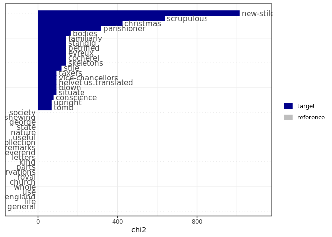

    ## 
    ## Community: 27

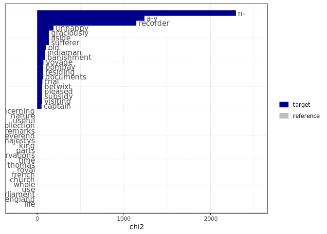

    ## 
    ## Community: 28

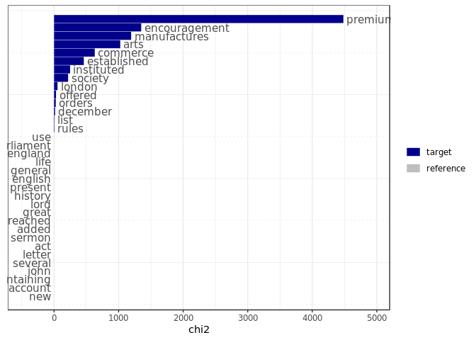

    ## 
    ## Community: 29


    ## 
    ## Community: 30


    ## 
    ## Community: 31


    ## 
    ## Community: 32


    ## 
    ## Community: 33

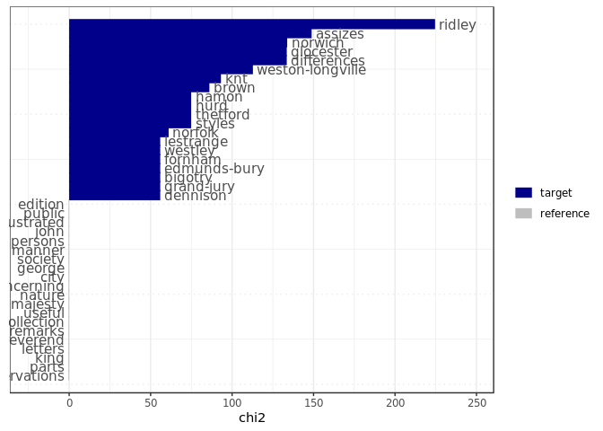

    ## 
    ## Community: 34


    ## 
    ## Community: 35

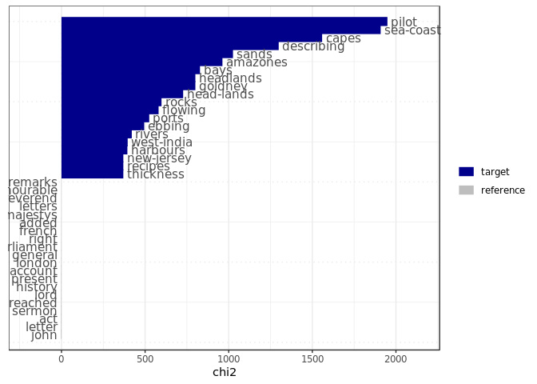

    ## 
    ##  1756-1765 
    ## 
    ## 25 top features/tokens
    ## $Community_1
    ##     memoirs   catherine      jemmat    litanies     prayers     english 
    ##           1           1           1           0           0           0 
    ## recommended    catholic    families       fifth     edition   corrected 
    ##           0           0           0           0           0           0 
    ##    enlarged     licence      devout  christians   companion   holy-days 
    ##           0           0           0           0           0           0 
    ##       pious reflections aspirations     gospels   festivals     blessed 
    ##           0           0           0           0           0           0 
    ##        lord 
    ##           0 
    ## 
    ## $Community_10
    ##  containing         new      letter     several     account     history 
    ##         160         154         140         112         109         107 
    ##     present       added     english        life       great  collection 
    ##          98          91          90          82          82          77 
    ##        best     variety illustrated      london        lord     general 
    ##          75          72          71          69          68          67 
    ##        john       royal     letters     curious       whole    together 
    ##          66          66          65          61          59          59 
    ##       right 
    ##          58 
    ## 
    ## $Community_11
    ##   navigation          new   describing        pilot      english    corrected 
    ##           15           14           12           12           11           10 
    ##        whole        capes   sea-coasts     enlarged particularly       rivers 
    ##           10           10           10            9            9            9 
    ##       tables         book       fourth        river      islands  hudsons-bay 
    ##            8            8            8            8            8            8 
    ##     amazones      shewing         bays   west-india        sands      several 
    ##            8            7            7            7            7            6 
    ##    additions 
    ##            6 
    ## 
    ## $Community_12
    ##     manner  narrative      every        use       four  principal      jones 
    ##          3          3          2          2          2          2          2 
    ##    hundred       mary  convicted        get  macdaniel      berry accomplice 
    ##          2          2          2          2          2          2          2 
    ##     kidden   prefixed      added    finding       time      whole       laid 
    ##          2          1          1          1          1          1          1 
    ##     nature      lords    persons     joseph 
    ##          1          1          1          1 
    ## 
    ## $Community_13
    ##       english    originally          time       william extraordinary 
    ##             1             1             1             1             1 
    ##        joseph       present          king     principal          arms 
    ##             1             1             1             1             1 
    ##     evidences     authentic         times      compiled      earliest 
    ##             1             1             1             1             1 
    ##         peers        garter       records      accounts     including 
    ##             1             1             1             1             1 
    ##       publick     continued        herald           knt       deduced 
    ##             1             1             1             1             1 
    ## 
    ## $Community_14
    ##         james      ferguson           new        method   illustrated 
    ##             5             5             2             2             2 
    ##          easy           sun     astronomy      prefixed      doctrine 
    ##             2             2             2             1             1 
    ##          true           use       figures        tables         short 
    ##             1             1             1             1             1 
    ##     explained copper-plates    containing          john          full 
    ##             1             1             1             1             1 
    ##         plain        course         world        called         books 
    ##             1             1             1             1             1 
    ## 
    ## $Community_15
    ##        new containing       john    several    account     sermon   preached 
    ##        305        228        193        184        167        166        161 
    ##      added    history     letter      great    english        use    william 
    ##        151        135        128        125        122        116        116 
    ##       life    general     london      court      whole    present       lord 
    ##        115        113        112        110        109        108        104 
    ##     church       city    england      lists 
    ##        103        100         98         95 
    ## 
    ## $Community_16
    ##        public         whole          john        answer   interesting 
    ##             1             1             1             1             1 
    ##       queries          case        stated        fairly     originals 
    ##             1             1             1             1             1 
    ##       opinion      concerns        orphan authenticated       ayliffe 
    ##             1             1             1             1             1 
    ##     creditors       addenda  indisputably       memoirs     catherine 
    ##             1             1             1             0             0 
    ##        jemmat      litanies       prayers       english   recommended 
    ##             0             0             0             0             0 
    ## 
    ## $Community_17
    ##          coin        weight         value        silver      fineness 
    ##             2             2             2             2             2 
    ##       english          time copper-plates          view       england 
    ##             1             1             1             1             1 
    ##      together       present        useful        mostly      conquest 
    ##             1             1             1             1             1 
    ##        plates         never        regard      supposed         sorts 
    ##             1             1             1             1             1 
    ##          gold        norman     considerd        dealer       engravd 
    ##             1             1             1             1             1 
    ## 
    ## $Community_18
    ##      fairs   moveable       fixd      robin       hood    account   covenant 
    ##         21         13         12          6          6          5          4 
    ##    several    shewing   shepherd       lord     church       kept        new 
    ##          4          4          4          3          3          3          3 
    ##      grace    address       book     christ        viz   counties  wiltshire 
    ##          3          3          3          3          3          3          3 
    ##   geometry  catherine    prayers particular 
    ##          3          2          2          2 
    ## 
    ## $Community_19
    ##         andrew      henderson        account           life            a.m 
    ##              3              3              2              2              2 
    ##   interspersed        curious          among       faithful        actions 
    ##              2              2              2              2              2 
    ##        militia considerations      anecdotes       question        memoirs 
    ##              2              2              2              2              1 
    ##    reflections         french           time          whole        general 
    ##              1              1              1              1              1 
    ##     containing      character      edinburgh   observations        several 
    ##              1              1              1              1              1 
    ## 
    ## $Community_2
    ##      devout reflections     gospels   festivals      saints        days 
    ##           3           3           3           3           3           3 
    ##   christian      advent     sundays  arithmetic     prayers     english 
    ##           3           3           3           3           2           2 
    ##    catholic       pious aspirations       o.s.f      lenten     monitor 
    ##           2           2           2           2           2           2 
    ##       moral         new      public   principle     founded      method 
    ##           2           2           2           2           2           2 
    ##     finding 
    ##           2 
    ## 
    ## $Community_20
    ##        act parliament    majesty   majestys      great    certain    several 
    ##        755        223        221        207        170        167        163 
    ##       lord    britain    present     duties    session       time      reign 
    ##        137        134        130        129        128        121        111 
    ##        new   granting       king   almanack       acts    account    hundred 
    ##        106        100         96         94         93         91         91 
    ##     better       john   thousand containing 
    ##         91         85         84         83 
    ## 
    ## $Community_21
    ##       john containing   preached        new     sermon    several      great 
    ##         78         71         63         62         59         56         50 
    ##      added    account      right     letter      whole    present       lord 
    ##         47         46         46         44         39         38         37 
    ##    england     church    general       king   reverend    designs     london 
    ##         37         34         33         33         32         31         30 
    ##     method collection      parts      court 
    ##         28         28         27         27 
    ## 
    ## $Community_22
    ##      raphael        ralph     benjamin     students      cartons instructions 
    ##            3            2            2            2            2            1 
    ##    explained  illustrated        young        guide   historical       queens 
    ##            1            1            1            1            1            1 
    ##     passions     engraved       others  description     painting       school 
    ##            1            1            1            1            1            1 
    ##       palace     examples   expression          sir     nicholas    described 
    ##            1            1            1            1            1            1 
    ##   inspection 
    ##            1 
    ## 
    ## $Community_23
    ##       french      several         city        royal  interesting     critical 
    ##            2            2            2            2            2            2 
    ##       forces      account        added      general      william  illustrated 
    ##            2            1            1            1            1            1 
    ##     subjects observations   references         plan   characters        henry 
    ##            1            1            1            1            1            1 
    ##       france        notes      remarks      england    inscribed        great 
    ##            1            1            1            1            1            1 
    ##      natural 
    ##            1 
    ## 
    ## $Community_24
    ##   preached     sermon       lord    account        law     church     london 
    ##         27         24         21         18         18         15         15 
    ##   lecturer    william       john        rev    several    romaine          ` 
    ##         13         12         12         12         12         12         12 
    ##    england   dunstans       west     sunday      chief    edition containing 
    ##         11         11         11         10         10          9          9 
    ##     letter        god     parish concerning 
    ##          9          9          9          9 
    ## 
    ## $Community_25
    ##     roberts   companion     several       henry       james       world 
    ##           2           1           1           1           1           1 
    ##       known     eminent represented        good     variety        ever 
    ##           1           1           1           1           1           1 
    ##     curious    engraved      copper      plates     kingdom        poem 
    ##           1           1           1           1           1           1 
    ## instruction      adornd    holidays      pocket     masters      horses 
    ##           1           1           1           1           1           1 
    ##   amusement 
    ##           1 
    ## 
    ## $Community_26
    ##      john   english   account      true    french    letter       old   england 
    ##         2         1         1         1         1         1         1         1 
    ##    giving    bloody  faithful    battle    prince   cavalry    fought   hanover 
    ##         1         1         1         1         1         1         1         1 
    ##    pately    stubbs   comrade ferninand   memoirs catherine    jemmat  litanies 
    ##         1         1         1         1         0         0         0         0 
    ##   prayers 
    ##         0 
    ## 
    ## $Community_27
    ##    premiere    monsieur    langlois      partie        tome      servir 
    ##           3           2           2           2           1           1 
    ##   lhistoire représentée        fois         vie       labbé    françois 
    ##           1           1           1           1           1           1 
    ##    mémoires     premier     lenglet  spectacles       lundi         roi 
    ##           1           1           1           1           1           1 
    ##      favart     ouvrage        mars     traduit        acte    noblesse 
    ##           1           1           1           1           1           1 
    ## commerçante 
    ##           1 
    ## 
    ## $Community_28
    ##              union             christ       preservative             church 
    ##                  4                  4                  4                  3 
    ##              james             wesley              relly            william 
    ##                  3                  3                  3                  2 
    ##               john           reverend           treatise               real 
    ##                  2                  2                  2                  2 
    ##             theron            aspasio             hervey             called 
    ##                  2                  2                  2                  2 
    ##         considered           apostles misrepresentations           cudworth 
    ##                  2                  2                  2                  2 
    ##              times            notions          occasiond           perilous 
    ##                  2                  2                  2                  2 
    ##               lord 
    ##                  1 
    ## 
    ## $Community_29
    ##     brother     benefit    together  excellency    oratorio        help 
    ##           2           1           1           1           1           1 
    ##     shewing      temple   performed    laurence free-masons    solomons 
    ##           1           1           1           1           1           1 
    ##     secrecy      ahiman       rezon     dermott         sec     memoirs 
    ##           1           1           1           1           1           0 
    ##   catherine      jemmat    litanies     prayers     english recommended 
    ##           0           0           0           0           0           0 
    ##    catholic 
    ##           0 
    ## 
    ## $Community_3
    ##        manual           new      highland      military    discipline 
    ##             1             1             1             1             1 
    ##         short      exercise     explained         words       command 
    ##             1             1             1             1             1 
    ##          laid          duty       officer       soldier   illustrated 
    ##             1             1             1             1             1 
    ##        twelve copper-plates        george         grant       memoirs 
    ##             1             1             1             1             0 
    ##     catherine        jemmat      litanies       prayers       english 
    ##             0             0             0             0             0 
    ## 
    ## $Community_4
    ##        new containing       john    account     sermon   preached    several 
    ##        482        466        440        399        397        380        371 
    ##     letter      added    history    present      great       lord    english 
    ##        358        330        319        294        269        263        260 
    ##     london    general    william      whole      royal    england     church 
    ##        260        259        242        230        228        225        221 
    ##       life        use     french     thomas 
    ##        221        216        212        207 
    ## 
    ## $Community_5
    ##      letter          b-         g-e         d-e          -d     memoirs 
    ##           1           1           1           1           1           0 
    ##   catherine      jemmat    litanies     prayers     english recommended 
    ##           0           0           0           0           0           0 
    ##    catholic    families       fifth     edition   corrected    enlarged 
    ##           0           0           0           0           0           0 
    ##     licence      devout  christians   companion   holy-days       pious 
    ##           0           0           0           0           0           0 
    ## reflections 
    ##           0 
    ## 
    ## $Community_6
    ##    english        new containing dictionary    several   complete       -the 
    ##         10          9          9          5          5          5          5 
    ##  christian      every        use  explained       john        rev        old 
    ##          4          4          4          4          4          4          4 
    ##    grammar    england      royal    history      books      essay   poetical 
    ##          4          4          4          4          4          4          4 
    ##    account arithmetic     manner    general 
    ##          3          3          3          3 
    ## 
    ## $Community_7
    ##        new       song     howard  political     scotch  inscribed   humorous 
    ##         10          6          6          5          5          4          4 
    ##    english      added       john     letter        old    remarks    england 
    ##          3          3          3          3          3          3          3 
    ##      great      print      songs    british     ladies   antidote  performed 
    ##          3          3          3          3          3          3          3 
    ##      races  satirical caledonian   doctrine 
    ##          3          3          3          2 
    ## 
    ## $Community_8
    ##  coronation   narrative       kings    ceremony      letter     letters 
    ##           4           4           3           3           2           2 
    ##        life       right     several        form       royal    together 
    ##           2           2           2           2           2           2 
    ##        king        love     curious        hall        miss  adventures 
    ##           2           2           2           2           2           2 
    ##     genuine        capt    uncommon        deaf reflections        lord 
    ##           2           2           2           2           1           1 
    ##  particular 
    ##           1 
    ## 
    ## $Community_9
    ##       martin       nature          new          use     benjamin construction 
    ##           17           16           15           11           11           10 
    ##  illustrated   containing        large       theory   principles        solar 
    ##            9            9            6            6            6            6 
    ##      glasses       tables        whole    universal  exemplified        every 
    ##            6            5            5            5            5            4 
    ##       method    explained        essay  description        place          eye 
    ##            4            4            4            4            4            4 
    ##        earth 
    ##            4 
    ## 
    ## 
    ## Community: 1

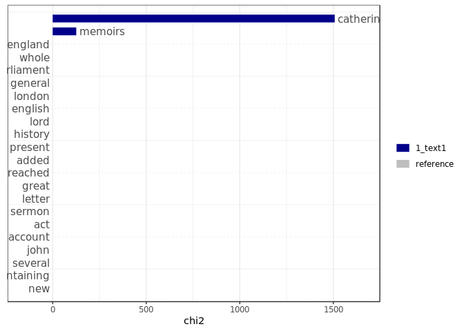

    ## 
    ## Community: 2


    ## 
    ## Community: 3

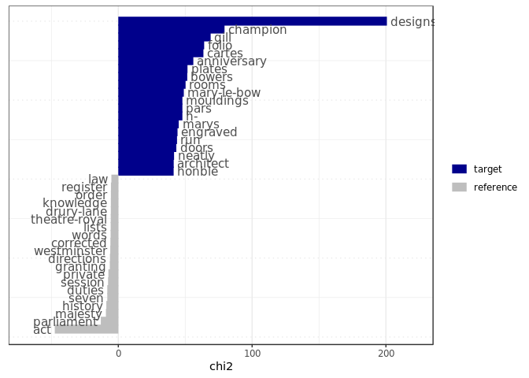

    ## 
    ## Community: 4


    ## 
    ## Community: 5


    ## 
    ## Community: 6

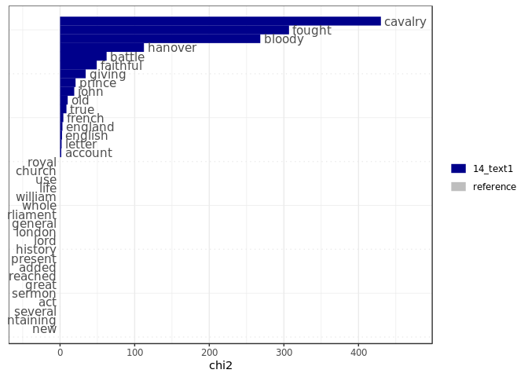

    ## 
    ## Community: 7


    ## 
    ## Community: 8

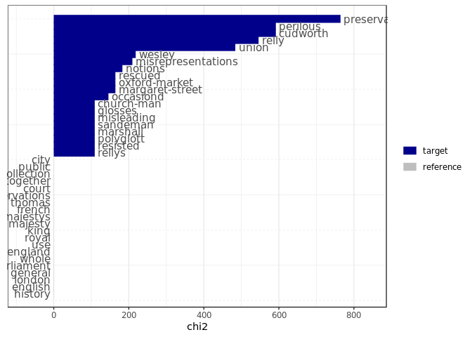

    ## 
    ## Community: 9


    ## 
    ## Community: 10

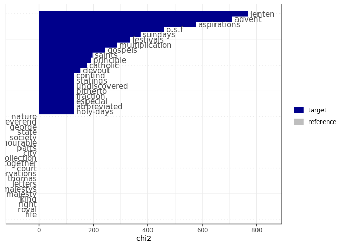

    ## 
    ## Community: 11

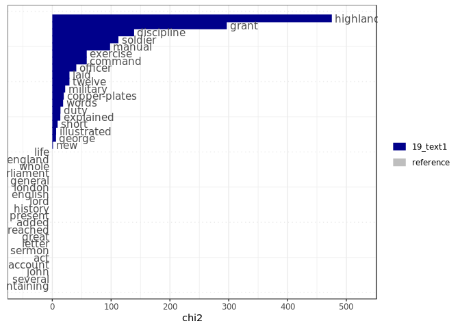

    ## 
    ## Community: 12

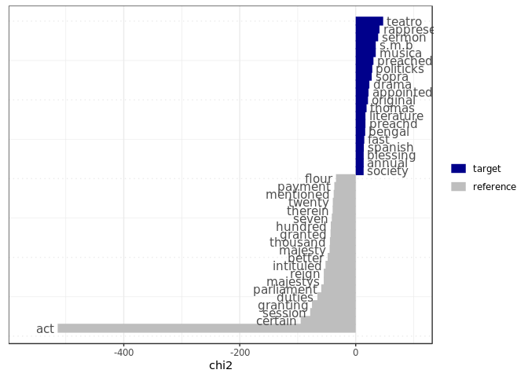

    ## 
    ## Community: 13

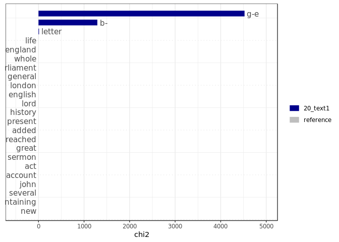

    ## 
    ## Community: 14

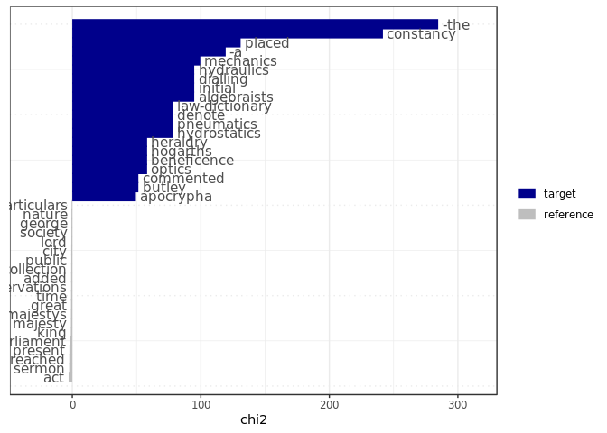

    ## 
    ## Community: 15


    ## 
    ## Community: 16


    ## 
    ## Community: 17

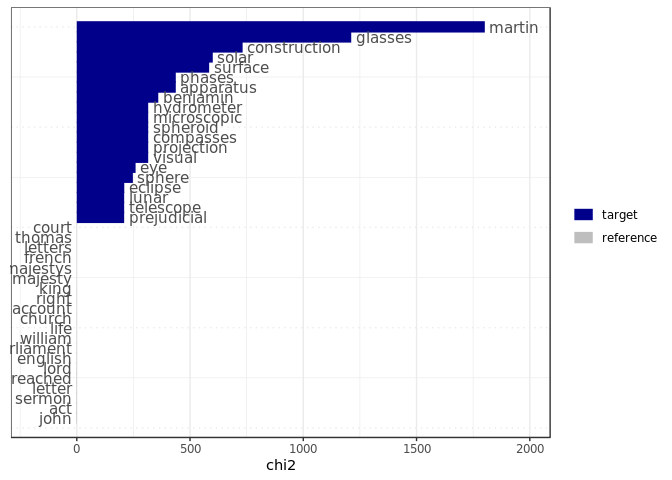

    ## 
    ## Community: 18


    ## 
    ## Community: 19


    ## 
    ## Community: 20


    ## 
    ## Community: 21


    ## 
    ## Community: 22


    ## 
    ## Community: 23

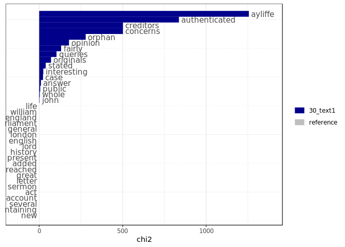

    ## 
    ## Community: 24

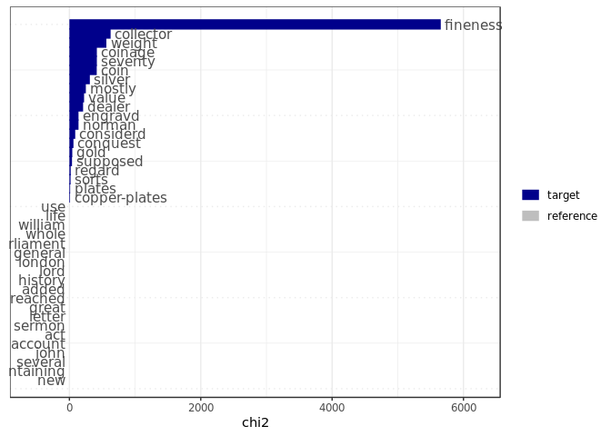

    ## 
    ## Community: 25

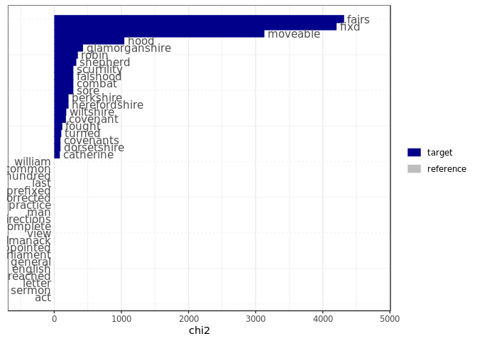

    ## 
    ## Community: 26

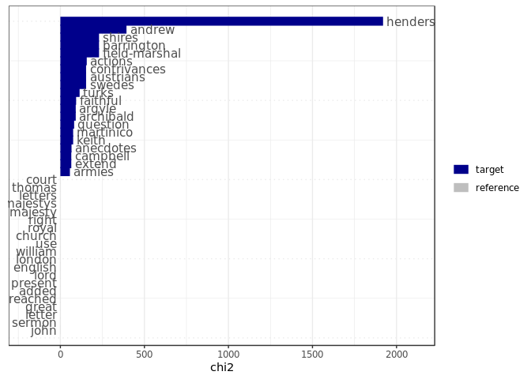

    ## 
    ## Community: 27

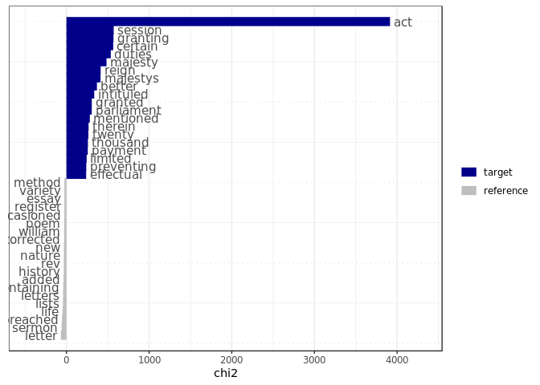

    ## 
    ## Community: 28


    ## 
    ## Community: 29

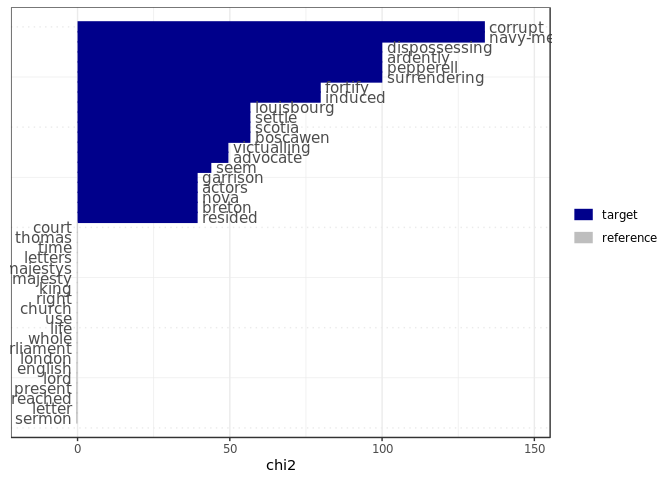

    ## 
    ##  1761-1770 
    ## 
    ## 25 top features/tokens
    ## $Community_1
    ##        new       john containing     sermon   preached        rev    account 
    ##        213        195        159        149        133        128        115 
    ##    several      added     letter      lists     church      court    england 
    ##        106         92         89         88         85         82         79 
    ##     public     london      death     thomas    english parliament     christ 
    ##         77         76         73         72         70         70         69 
    ##   register       lord       life      state 
    ##         69         67         66         65 
    ## 
    ## $Community_10
    ##        new containing     letter    several    present    account    letters 
    ##        336        333        255        222        220        207        188 
    ##    history collection      great      added    english       john     london 
    ##        186        174        171        166        161        158        158 
    ##     public    england      royal parliament      right      every      state 
    ##        157        152        151        142        134        133        132 
    ##       lord       poem   complete    general 
    ##        121        121        120        116 
    ## 
    ## $Community_11
    ## containing    account        new   together      whole       life    history 
    ##         37         26         25         25         23         22         21 
    ##      added    english   complete      great       best     london       easy 
    ##         20         20         20         20         20         19         17 
    ##      every     manner    several     useful    curious       maid    present 
    ##         17         16         16         16         16         16         15 
    ##    general      plain    various      parts 
    ##         15         15         14         14 
    ## 
    ## $Community_12
    ##       james    ferguson         new      method         sun    parallax 
    ##           4           4           2           2           2           2 
    ##        read    prefixed         use        true        full       plain 
    ##           1           1           1           1           1           1 
    ##   mechanics   astronomy    lectures       short      theory      course 
    ##           1           1           1           1           1           1 
    ##       world description       times      tables      called     shewing 
    ##           1           1           1           1           1           1 
    ##  mechanical 
    ##           1 
    ## 
    ## $Community_13
    ##          john         whole        answer        public      concerns 
    ##             1             1             1             1             1 
    ##   interesting        stated          case       queries       opinion 
    ##             1             1             1             1             1 
    ##     originals        orphan authenticated  indisputably     creditors 
    ##             1             1             1             1             1 
    ##        fairly       ayliffe       addenda         essay        fevers 
    ##             1             1             1             0             0 
    ##  particularly        common     continued  inflammatory         kinds 
    ##             0             0             0             0             0 
    ## 
    ## $Community_14
    ##          gold        silver        thomas copper-plates         coins 
    ##             6             6             5             5             5 
    ##      snelling          view         money        struck         james 
    ##             5             4             4             4             3 
    ##          time       charles        copper         value       russian 
    ##             3             3             3             3             3 
    ##       english       present           use       england        tokens 
    ##             2             2             2             2             2 
    ##        pieces       current         india          coin       coinage 
    ##             2             2             2             2             2 
    ## 
    ## $Community_15
    ##         john     religion        words        truth         laid   synonymous 
    ##            2            2            2            2            2            2 
    ## particularly          new        added     treatise  illustrated       nature 
    ##            1            1            1            1            1            1 
    ##        whole       proper    important     intended    establish      learned 
    ##            1            1            1            1            1            1 
    ##         work         true      college        basis       french      writers 
    ##            1            1            1            1            1            1 
    ##         plan 
    ##            1 
    ## 
    ## $Community_16
    ##          new   containing      history      several         john        royal 
    ##          256          251          241          182          181          179 
    ##      account        added      england       sermon      letters      english 
    ##          165          152          137          135          133          131 
    ##         lord     preached      general observations          use        great 
    ##          129          128          126          121          120          119 
    ##       letter       french       london      present        essay      william 
    ##          118          118          116          115          112          108 
    ##       church 
    ##          103 
    ## 
    ## $Community_17
    ##        law       lord containing      court        new    several      cases 
    ##         22         14         13         13         12         12         12 
    ##     george       king       laws      kings     common      added     nature 
    ##         10         10          9          9          8          8          8 
    ##    general     london   preached     elliot   treatise       life     courts 
    ##          8          8          8          8          7          7          7 
    ##    present    history   practice      royal 
    ##          7          7          7          7 
    ## 
    ## $Community_18
    ##        act parliament    majesty   majestys    certain     duties      great 
    ##        701        206        190        182        159        139        119 
    ##       time      reign    britain    session       lord    several        new 
    ##        118        117        109        106        105        105        102 
    ##    present       acts   granting   almanack       king  intituled    hundred 
    ##         94         91         89         83         79         77         75 
    ##     within    england   thousand    therein 
    ##         75         74         73         73 
    ## 
    ## $Community_19
    ##        new containing    english      whole    several       book     method 
    ##         19         16         14         13         13         13         12 
    ##    england navigation      every    present describing     tables      pilot 
    ##         11         11         10         10         10          9          9 
    ##       true     useful    shewing      capes      added       john  corrected 
    ##          8          8          8          8          7          7          7 
    ##    account        use      royal     london 
    ##          7          7          7          7 
    ## 
    ## $Community_2
    ##     cartes        new       john  according     oxford     french      plans 
    ##          5          2          2          2          2          2          2 
    ## university    italian géographie     method  corrected    english     tongue 
    ##          2          2          2          1          1          1          1 
    ##   thoughts     master      right honourable       earl  languages      david 
    ##          1          1          1          1          1          1          1 
    ##       long     sermon   preached     hebrew 
    ##          1          1          1          1 
    ## 
    ## $Community_20
    ##           john           true    inoculation         method           easy 
    ##              5              4              4              3              3 
    ##          whole         letter        letters            rev         church 
    ##              3              3              3              3              3 
    ##        account           full        kingdom          essex         county 
    ##              3              3              3              3              3 
    ##         single     containing         nature           used       pamphlet 
    ##              3              2              2              2              2 
    ##        natural ecclesiastical       religion         friend          every 
    ##              2              2              2              2              2 
    ## 
    ## $Community_21
    ## containing  political      added     letter      whole      songs     prints 
    ##         15         13         12         12         11         11         11 
    ##        new       john    present    account    british    several     london 
    ##         10          9          9          8          8          8          8 
    ##    edition      years      place   antidote caledonian   original     scotch 
    ##          8          8          8          8          8          7          7 
    ##      comic     people     essays     church 
    ##          7          6          6          6 
    ## 
    ## $Community_22
    ##        new containing       john    several     sermon    account      added 
    ##        328        245        182        165        148        143        142 
    ##   preached        use     london    english      royal    england      court 
    ##        139        132        122        118        117        116        111 
    ## parliament    present    history      great     church        act    general 
    ##        110        109        108        108        107        106        102 
    ##     public   register       life   complete 
    ##        101        101        100         99 
    ## 
    ## $Community_23
    ##        letter          life        bishop         parts        london 
    ##             1             1             1             1             1 
    ##    manuscript extraordinary          four       voyages          lady 
    ##             1             1             1             1             1 
    ##    surprizing          capt    adventures       escapes          cork 
    ##             1             1             1             1             1 
    ##       neville        frowde         essay        fevers  particularly 
    ##             1             1             0             0             0 
    ##        common     continued  inflammatory         kinds           new 
    ##             0             0             0             0             0 
    ## 
    ## $Community_24
    ##         man      prayer       lords        true       jesus      christ 
    ##           2           2           1           1           1           1 
    ##      french         age        love    publishd       price       heart 
    ##           1           1           1           1           1           1 
    ##      called    commonly        ever explanation      golden       happy 
    ##           1           1           1           1           1           1 
    ##     timothy  adventures      cupids       harry   eglington       sewed 
    ##           1           1           1           1           1           1 
    ##    lovemore 
    ##           1 
    ## 
    ## $Community_25
    ## philosophiques         contes         moraux      amusemens      poétiques 
    ##              1              1              1              1              1 
    ##         légier       dixmerie          essay         fevers   particularly 
    ##              1              1              0              0              0 
    ##         common      continued   inflammatory          kinds            new 
    ##              0              0              0              0              0 
    ##     successful         method       proposed       removing       speedily 
    ##              0              0              0              0              0 
    ##          added         crises      disorders         lionel       chalmers 
    ##              0              0              0              0              0 
    ## 
    ## $Community_26
    ##       milton     françois     traduits     lallegro   pensieroso        essay 
    ##            1            1            1            1            1            0 
    ##       fevers particularly       common    continued inflammatory        kinds 
    ##            0            0            0            0            0            0 
    ##          new   successful       method     proposed     removing     speedily 
    ##            0            0            0            0            0            0 
    ##        added       crises    disorders       lionel     chalmers charles-town 
    ##            0            0            0            0            0            0 
    ##     treatise 
    ##            0 
    ## 
    ## $Community_27
    ##       society        london      commerce      preached  manufactures 
    ##            29            24            17            14            13 
    ##       account        sermon          arts encouragement          list 
    ##            12            12            11            11            10 
    ##       request     promoting     knowledge     christian      children 
    ##            10             9             9             8             8 
    ##       meeting       history          time parish-church           new 
    ##             8             7             7             7             6 
    ##    containing          lord         vicar         great     gentlemen 
    ##             6             6             6             6             6 
    ## 
    ## $Community_3
    ##        trial          new      england     receipts        added       george 
    ##            3            2            2            2            1            1 
    ##   containing     churches      english     complete    companion observations 
    ##            1            1            1            1            1            1 
    ##  antiquities      palaces      william      british          use      hundred 
    ##            1            1            1            1            1            1 
    ##        roman      thereon         tour          map      several    medicines 
    ##            1            1            1            1            1            1 
    ##    distances 
    ##            1 
    ## 
    ## $Community_4
    ##      memoirs    catherine       jemmat        prose        verse miscellanies 
    ##            2            2            2            1            1            1 
    ##     daughter      admiral          yeo     plymouth        essay       fevers 
    ##            1            1            1            1            0            0 
    ## particularly       common    continued inflammatory        kinds          new 
    ##            0            0            0            0            0            0 
    ##   successful       method     proposed     removing     speedily        added 
    ##            0            0            0            0            0            0 
    ##       crises 
    ##            0 
    ## 
    ## $Community_5
    ##         new  containing     account       whole        john     several 
    ##          86          81          53          48          46          46 
    ##       royal      london     william      plates     english    engraved 
    ##          43          41          35          33          32          32 
    ##       added     present         use     general      letter     england 
    ##          31          31          31          31          30          30 
    ##    preached     history illustrated  particular        lord       parts 
    ##          30          29          28          28          28          28 
    ##  collection 
    ##          27 
    ## 
    ## $Community_6
    ##        new  political     scotch       john     letter    british    remarks 
    ##          5          4          4          3          3          3          3 
    ##  inscribed   antidote  satirical      races caledonian      print      added 
    ##          3          3          3          3          3          3          2 
    ##      whole    english     public        old       earl      great    england 
    ##          2          2          2          2          2          2          2 
    ## remarkable    variety      price  performed 
    ##          2          2          2          2 
    ## 
    ## $Community_7
    ##       love     letter    letters   complete       read    serious    travels 
    ##          2          1          1          1          1          1          1 
    ##     friend   distress      whose   pleasant      death       land    richard 
    ##          1          1          1          1          1          1          1 
    ##      youth      newly delightful  narrative      noble     virtue      sorts 
    ##          1          1          1          1          1          1          1 
    ##       ever     trusty       knox  histories 
    ##          1          1          1          1 
    ## 
    ## $Community_8
    ##         war     general         new       notes      church     germany 
    ##           6           3           2           2           2           2 
    ##  principles        earl     several   different        seat reflections 
    ##           2           2           2           2           2           2 
    ## description inoculation   small-pox    cardinal   campaigns      method 
    ##           2           2           2           2           2           1 
    ##       added    treatise        cure        john  containing      nature 
    ##           1           1           1           1           1           1 
    ##       lords 
    ##           1 
    ## 
    ## $Community_9
    ##     continued       english      compiled       william       present 
    ##             1             1             1             1             1 
    ##       records          king          time extraordinary        joseph 
    ##             1             1             1             1             1 
    ##     principal     authentic     evidences         times       publick 
    ##             1             1             1             1             1 
    ##       deduced      earliest      accounts     including         peers 
    ##             1             1             1             1             1 
    ##    collateral      descents    originally           knt          arms 
    ##             1             1             1             1             1 
    ## 
    ## 
    ## Community: 1


    ## 
    ## Community: 2


    ## 
    ## Community: 3


    ## 
    ## Community: 4


    ## 
    ## Community: 5


    ## 
    ## Community: 6


    ## 
    ## Community: 7

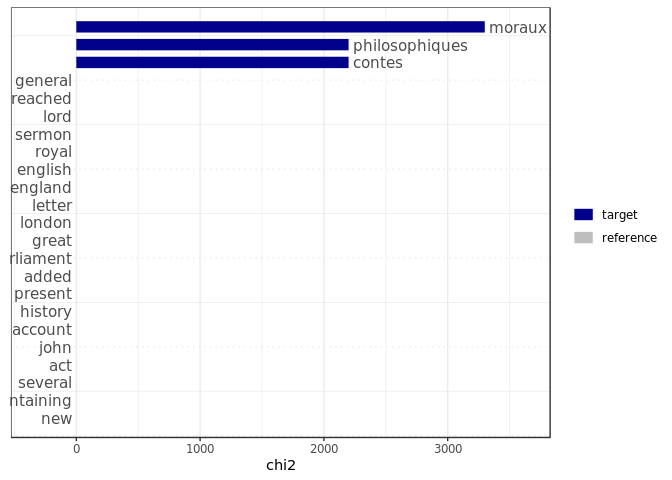

    ## 
    ## Community: 8


    ## 
    ## Community: 9

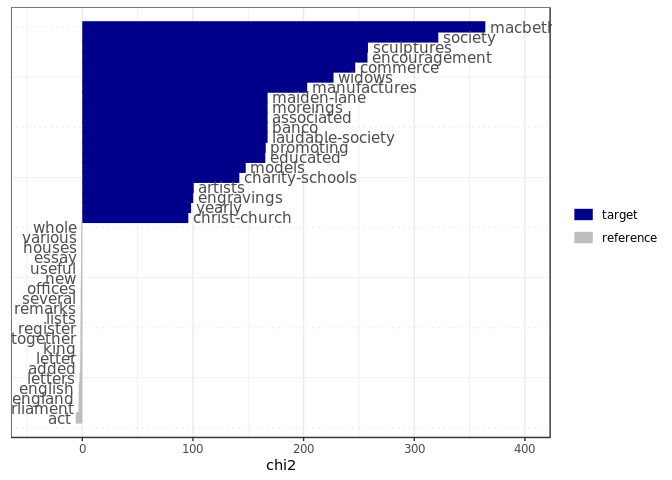

    ## 
    ## Community: 10

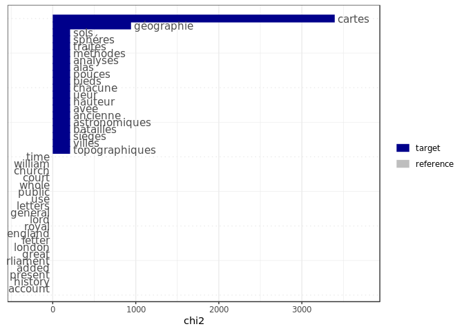

    ## 
    ## Community: 11

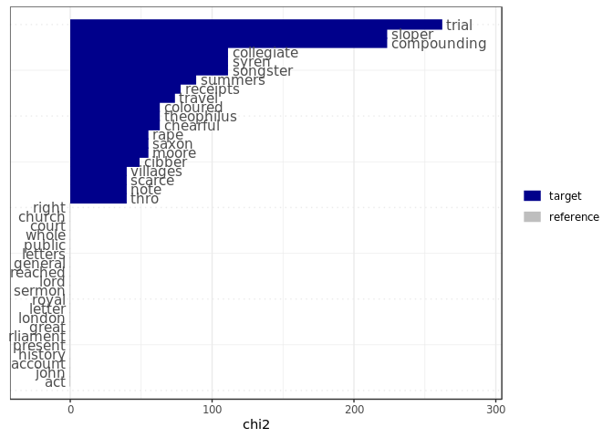

    ## 
    ## Community: 12


    ## 
    ## Community: 13

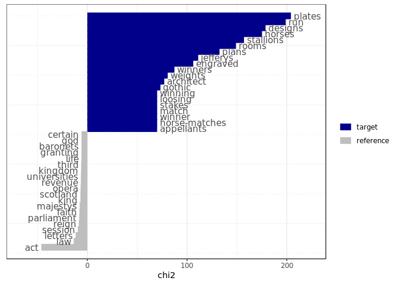

    ## 
    ## Community: 14


    ## 
    ## Community: 15

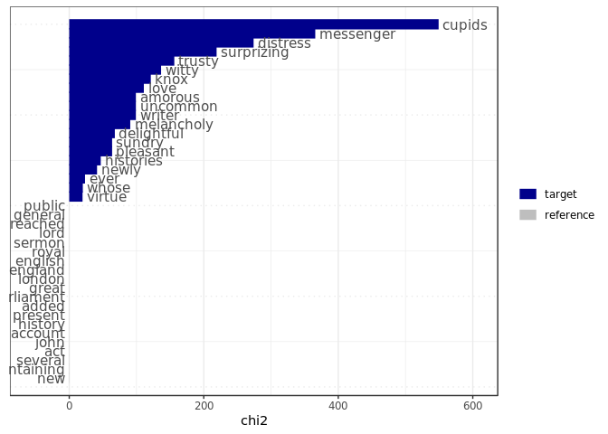

    ## 
    ## Community: 16


    ## 
    ## Community: 17

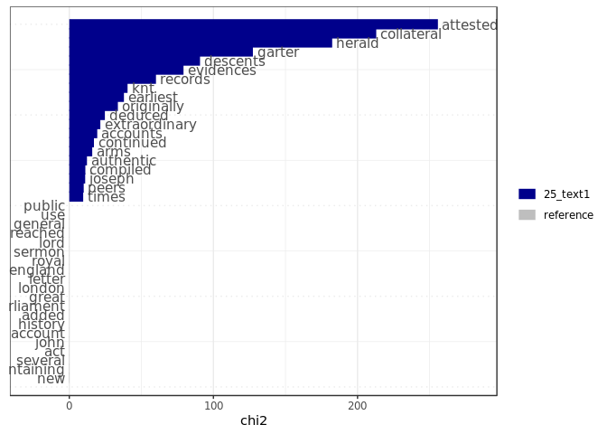

    ## 
    ## Community: 18

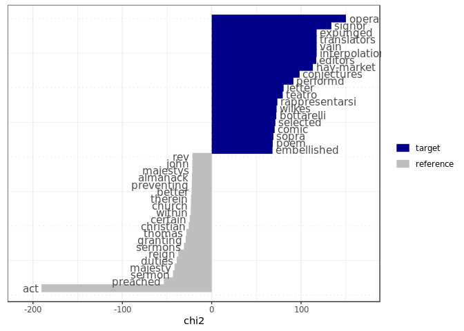

    ## 
    ## Community: 19

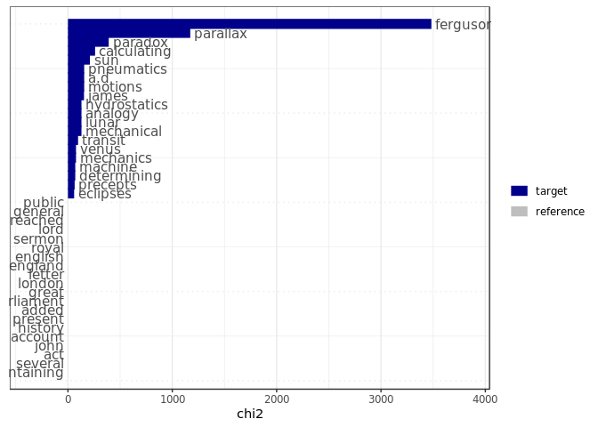

    ## 
    ## Community: 20


    ## 
    ## Community: 21

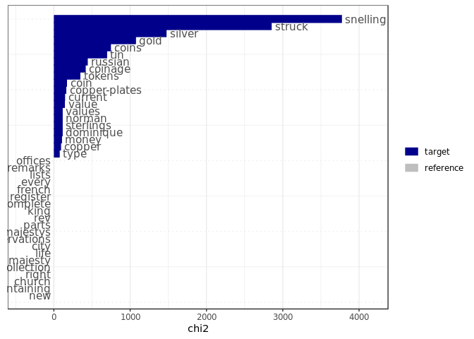

    ## 
    ## Community: 22

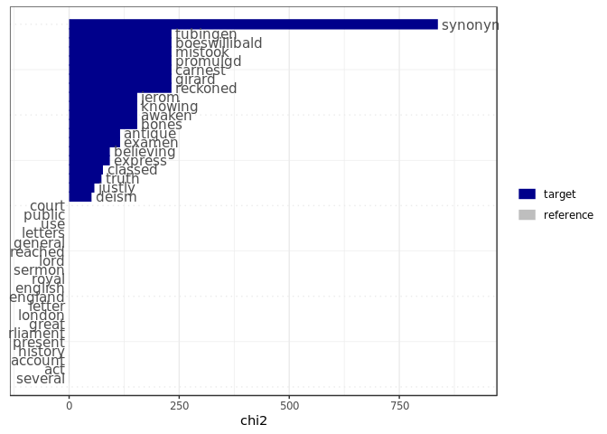

    ## 
    ## Community: 23


    ## 
    ## Community: 24

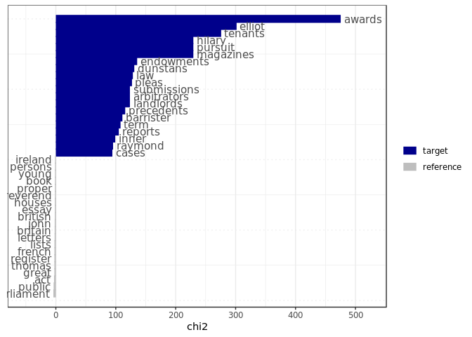

    ## 
    ## Community: 25


    ## 
    ## Community: 26


    ## 
    ## Community: 27


    ## 
    ##  1766-1775 
    ## 
    ## 25 top features/tokens
    ## $Community_1
    ##        new       john containing        rev     sermon      added   preached 
    ##        259        233        212        201        177        160        157 
    ##    account    england     public     church        use    several  christian 
    ##        147        128        124        117        116        115        111 
    ##     letter     london    english      death      state   complete     thomas 
    ##        110        109        107        103        102         99         92 
    ## parliament       life      court        god 
    ##         89         86         85         84 
    ## 
    ## $Community_10
    ##          new      history   containing         john        royal       public 
    ##          170          144          129          128          123          108 
    ##      england      account      william        added         lord      several 
    ##          100           99           96           93           87           85 
    ##      letters      english     complete        state      present         view 
    ##           85           79           76           74           73           72 
    ##       letter   parliament          law     register observations     preached 
    ##           71           70           70           68           68           67 
    ##       sermon 
    ##           65 
    ## 
    ## $Community_11
    ##         new  containing    complete     several      public     england 
    ##         240         194         133         133         124         114 
    ##     account     history     english       state       added     letters 
    ##         114         109         106          99          95          92 
    ##       every  parliament     present       court      london       parts 
    ##          89          86          85          84          83          82 
    ##       royal     edition     offices         use illustrated       great 
    ##          82          80          79          79          77          76 
    ##         law 
    ##          76 
    ## 
    ## $Community_12
    ##    history       miss    account       life     london containing      added 
    ##         26         18         16         16         12         10          8 
    ##       john      taken collection   together      death     manner     letter 
    ##          8          8          8          7          7          6          6 
    ##   daughter    charles adventures   complete    letters    ireland  companion 
    ##          6          6          6          5          5          5          5 
    ##     people        sir   receipts    curious 
    ##          5          5          5          5 
    ## 
    ## $Community_13
    ##     required      willows       waters      mineral       houses    practical 
    ##            4            4            3            3            2            2 
    ## observations         full      gibbons         song        among     preacher 
    ##            2            2            2            2            2            2 
    ##         john          ver       gospel    extracted        psalm       isaiah 
    ##            2            2            2            2            2            2 
    ##        music     mourning experimental       rivers         away         wild 
    ##            2            2            2            2            2            2 
    ##       beasts 
    ##            2 
    ## 
    ## $Community_14
    ##       society        london        sermon      preached          arts 
    ##            33            27            14            14            14 
    ##          john     christian       history  manufactures     knowledge 
    ##            13            12            12            12            11 
    ##       request      commerce       william encouragement           new 
    ##            11            11            10            10             9 
    ##       several          list       meeting     promoting       account 
    ##             9             9             9             9             8 
    ##         david       general       majesty        psalms          best 
    ##             7             7             7             6             6 
    ## 
    ## $Community_15
    ##     called    quakers    several     london     people        new       john 
    ##          7          7          6          6          6          4          4 
    ##     phipps      month containing     method    america  necessity     thomas 
    ##          4          4          3          3          3          3          3 
    ##       life        god     robert   subjects      brief      taken      order 
    ##          3          3          3          3          3          3          3 
    ##     joseph resolution       mary     french 
    ##          3          3          3          3 
    ## 
    ## $Community_16
    ##     compleat     favorite         song       double   collection        price 
    ##            3            3            2            2            2            2 
    ##    performed       violin german-flute  harpsichord   containing          new 
    ##            2            2            2            2            1            1 
    ##       public      william        added       method     composed      masters 
    ##            1            1            1            1            1            1 
    ##        tutor      concise        tunes      methods       modern   celebrated 
    ##            1            1            1            1            1            1 
    ##  description 
    ##            1 
    ## 
    ## $Community_17
    ##         new      tables  describing   corrected     english        time 
    ##          10           8           7           6           6           6 
    ##       pilot       whole        true       capes       every   afternoon 
    ##           6           5           5           5           4           4 
    ##      degree      rivers      taking      number  navigation  logarithms 
    ##           4           4           4           4           4           4 
    ##    latitude   sea-coast      single   logarithm    accuracy        suns 
    ##           4           4           4           4           4           4 
    ## logarithmic 
    ##           4 
    ## 
    ## $Community_18
    ##        act parliament    majesty   majestys      great    certain        new 
    ##        991        274        223        201        200        195        191 
    ##       time    several      reign    present     county    britain     within 
    ##        173        170        170        168        167        160        149 
    ##       lord       john    session       acts    therein  intituled     george 
    ##        146        126        118        117        117        113        109 
    ##     better       king     duties containing 
    ##        109        107        106        104 
    ## 
    ## $Community_19
    ##          new   containing         john        added      present      account 
    ##          400          377          248          237          237          230 
    ##       letter      several       london        great      english      england 
    ##          230          226          221          217          206          203 
    ##      history       public        state      letters   parliament      general 
    ##          201          198          184          179          175          168 
    ##        royal     complete        whole observations   collection         lord 
    ##          166          158          154          151          151          147 
    ##     together 
    ##          136 
    ## 
    ## $Community_2
    ##       milton     françois     lallegro   pensieroso     traduits        court 
    ##            1            1            1            1            1            0 
    ##         city     register   gentlemans     complete       annual     kalendar 
    ##            0            0            0            0            0            0 
    ##   containing          new      correct        lists       houses   parliament 
    ##            0            0            0            0            0            0 
    ##         army         navy universities       public      offices    hospitals 
    ##            0            0            0            0            0            0 
    ## improvements 
    ##            0 
    ## 
    ## $Community_20
    ##       new testament      holy       old      john    libels    onslow  designed 
    ##         3         2         2         2         2         2         2         1 
    ##    george corrected   revised      lord   william   genuine   letters     bible 
    ##         1         1         1         1         1         1         1         1 
    ##     words   various scripture  digested      easy   regular  together     great 
    ##         1         1         1         1         1         1         1         1 
    ## occasions 
    ##         1 
    ## 
    ## $Community_21
    ##   execution     account       place  containing      manner     genuine 
    ##           7           6           6           5           5           4 
    ##        life       death    sentence   prisoners    executed   behaviour 
    ##           4           4           4           4           4           4 
    ##   followers      tyburn impositions      houses       great     variety 
    ##           4           4           4           3           3           3 
    ##   education       birth        mary    striking        hart  exhibiting 
    ##           3           3           3           3           3           3 
    ##       trade 
    ##           3 
    ## 
    ## $Community_22
    ##     history        true inoculation        miss     letters        full 
    ##           9           4           4           3           3           3 
    ##     account        easy      method     kingdom      letter        john 
    ##           3           3           3           3           3           3 
    ##     charles      county      single  containing        used       jesus 
    ##           3           3           3           2           2           2 
    ##       whole       essex        lady        high       every    pamphlet 
    ##           2           2           2           2           2           2 
    ##     baptism 
    ##           2 
    ## 
    ## $Community_23
    ## parliament       lord   pamphlet   entitled    english     thomas   thoughts 
    ##          2          2          2          2          2          2          2 
    ##  middlesex     parish    wesleys         bp       long       copy supplement 
    ##          2          2          2          2          2          2          2 
    ##    conduct     anselm      bayly    slavery      court containing canterbury 
    ##          2          2          2          2          1          1          1 
    ##    members     sacred        old      parts 
    ##          1          1          1          1 
    ## 
    ## $Community_24
    ##  containing     several      letter        miss       added    original 
    ##          14          12          12          11          11          10 
    ##     genuine       whole     memoirs       right        john     letters 
    ##           9           8           8           8           8           7 
    ##     account     english   middlesex        lord    appendix       house 
    ##           7           7           7           6           6           6 
    ## freeholders       court    lecturer       great     britain      london 
    ##           6           5           5           5           5           5 
    ##    language 
    ##           5 
    ## 
    ## $Community_25
    ##       martin          new  illustrated          use     benjamin construction 
    ##           22           18           12           12           12           11 
    ##  description copper-plate        whole   containing   principles       theory 
    ##            9            8            7            6            6            6 
    ##      variety      figures   microscope   logarithms     practice        large 
    ##            5            5            5            5            4            4 
    ##        parts    different      applied       system       nature         time 
    ##            4            4            4            4            4            4 
    ##  instruments 
    ##            4 
    ## 
    ## $Community_26
    ##          new   containing         john      history       public      england 
    ##          195          183          156          139          130          113 
    ##        royal        added      several      account        state      letters 
    ##          112          111          109          108          108          100 
    ##      english observations   parliament        great       letter      present 
    ##           97           94           93           92           85           85 
    ##       london     complete          law        essay          use       thomas 
    ##           83           80           79           78           76           75 
    ##        whole 
    ##           74 
    ## 
    ## $Community_27
    ##        poems        prize     complete       public    practical observations 
    ##            2            2            1            1            1            1 
    ##      various        added      usually          rev  institution      writing 
    ##            1            1            1            1            1            1 
    ##     treatise          tho     familiar    cambridge        scott         time 
    ##            1            1            1            1            1            1 
    ##   collection         name     likewise     progress        cases       physic 
    ##            1            1            1            1            1            1 
    ##    gentleman 
    ##            1 
    ## 
    ## $Community_28
    ##    amusemens    poétiques       légier        court         city     register 
    ##            1            1            1            0            0            0 
    ##   gentlemans     complete       annual     kalendar   containing          new 
    ##            0            0            0            0            0            0 
    ##      correct        lists       houses   parliament         army         navy 
    ##            0            0            0            0            0            0 
    ## universities       public      offices    hospitals improvements     addition 
    ##            0            0            0            0            0            0 
    ##   paraphrase 
    ##            0 
    ## 
    ## $Community_29
    ##           new    containing         whole      engraved        plates 
    ##            27            22            21            21            13 
    ##       england         rooms        useful        thomas    collection 
    ##            11            11            10            10            10 
    ##        copper       drawing       several      together   description 
    ##            10            10             9             9             9 
    ##          maps         wales   illustrated copper-plates     assistant 
    ##             9             9             8             8             8 
    ##       designs         plans         atlas         large       account 
    ##             8             8             8             7             7 
    ## 
    ## $Community_3
    ##           use       several           new     assistant   terrestrial 
    ##            10             9             8             8             7 
    ##         globe    containing         parts        london    concerning 
    ##             7             6             6             6             6 
    ##         whole       account       english   exemplified        church 
    ##             5             5             5             5             4 
    ##      designed     christian        thomas      problems   explication 
    ##             4             4             4             4             4 
    ##        tongue         short         guide     celestial schoolmasters 
    ##             4             4             4             4             4 
    ## 
    ## $Community_4
    ##          new       public observations        whole     writings       method 
    ##            1            1            1            1            1            1 
    ##      shewing      english    collected  illustrated         evil     treatise 
    ##            1            1            1            1            1            1 
    ##      eminent      variety    extracted         good         rise     progress 
    ##            1            1            1            1            1            1 
    ##        cases     diseases         land      authors    medicines interspersed 
    ##            1            1            1            1            1            1 
    ##    physician 
    ##            1 
    ## 
    ## $Community_5
    ##           set         added  introduction          john         elegy 
    ##             4             3             3             3             3 
    ##      complete    containing           new       william         books 
    ##             2             2             2             2             2 
    ##         death       grounds         music   psalm-tunes        entire 
    ##             2             2             2             2             2 
    ## hertfordshire       signora        amwell          gems        church 
    ##             2             2             2             2             1 
    ##        sunday       edition     corrected         notes  observations 
    ##             1             1             1             1             1 
    ## 
    ## $Community_6
    ##         county        islands           city     containing        edition 
    ##              2              2              1              1              1 
    ##        account           view       nobility          seats          state 
    ##              1              1              1              1              1 
    ##           arms    illustrated          coats  copper-plates         thomas 
    ##              1              1              1              1              1 
    ##         robert           time            map        present           plan 
    ##              1              1              1              1              1 
    ##        ancient glocestershire            sir         atkyns            knt 
    ##              1              1              1              1              1 
    ## 
    ## $Community_7
    ##      original        nature    honourable       learned          soul 
    ##             1             1             1             1             1 
    ##    operations       emanuel          body      respects    theosophic 
    ##             1             1             1             1             1 
    ##   lucubration        influx communication    swedenborg         court 
    ##             1             1             1             1             0 
    ##          city      register    gentlemans      complete        annual 
    ##             0             0             0             0             0 
    ##      kalendar    containing           new       correct         lists 
    ##             0             0             0             0             0 
    ## 
    ## $Community_8
    ##       john      horns      added     letter   religion        man    authors 
    ##          3          3          2          2          2          2          2 
    ##      heads profession      beast containing    edition    reading      young 
    ##          2          2          2          1          1          1          1 
    ##       view  spiritual     lately      india     london      every      watts 
    ##          1          1          1          1          1          1          1 
    ##       mans    address commentary instructor 
    ##          1          1          1          1 
    ## 
    ## $Community_9
    ##      robert       smith rat-catcher      vermin    complete      method 
    ##           2           2           2           2           1           1 
    ##    hitherto   universal   contained      farmer         use   directory 
    ##           1           1           1           1           1           1 
    ##   gentleman       rules  calculated      taking       alive       kinds 
    ##           1           1           1           1           1           1 
    ##  destroying    princess      amelia       utter extirpation mischievous 
    ##           1           1           1           1           1           1 
    ##        rats 
    ##           1 
    ## 
    ## 
    ## Community: 1

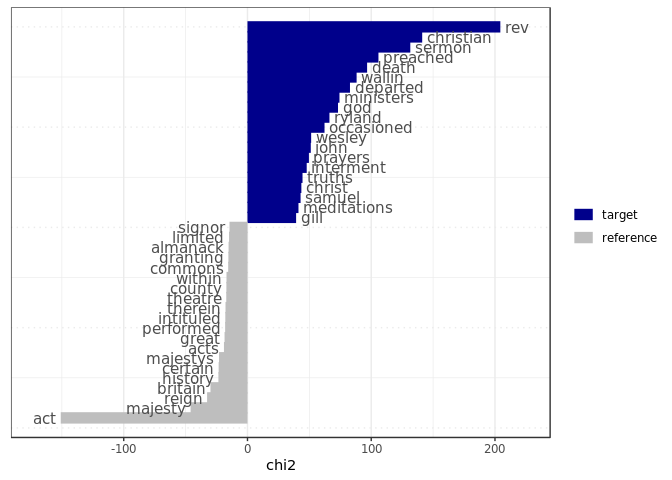

    ## 
    ## Community: 2

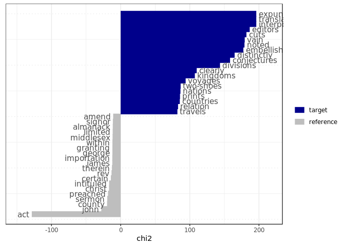

    ## 
    ## Community: 3


    ## 
    ## Community: 4

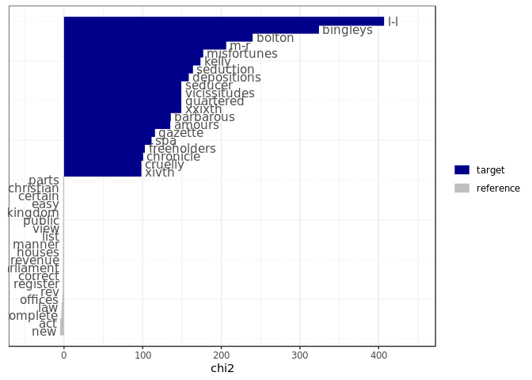

    ## 
    ## Community: 5

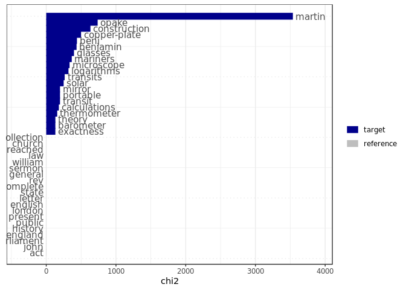

    ## 
    ## Community: 6

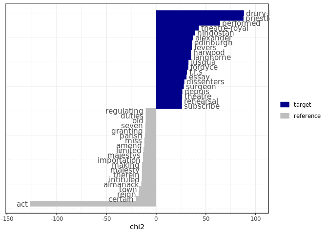

    ## 
    ## Community: 7


    ## 
    ## Community: 8


    ## 
    ## Community: 9


    ## 
    ## Community: 10

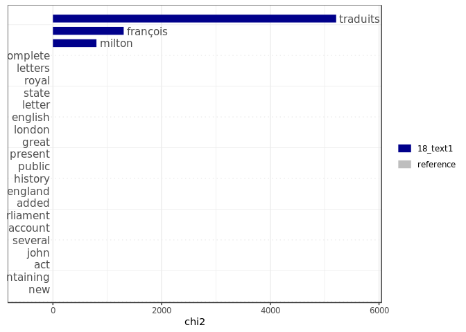

    ## 
    ## Community: 11

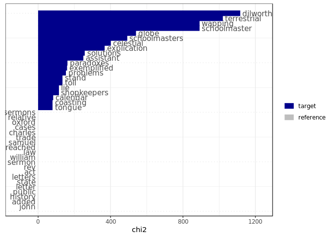

    ## 
    ## Community: 12

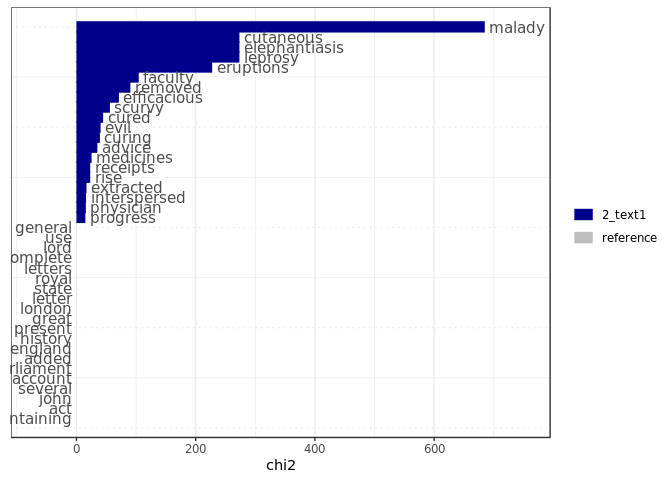

    ## 
    ## Community: 13


    ## 
    ## Community: 14

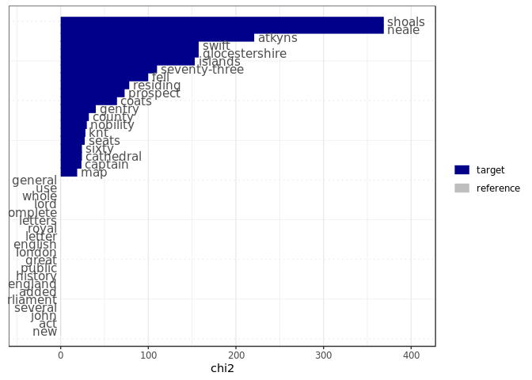

    ## 
    ## Community: 15

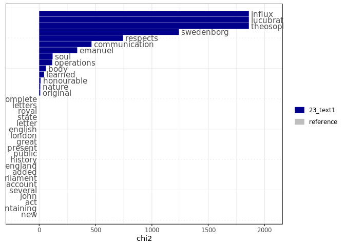

    ## 
    ## Community: 16

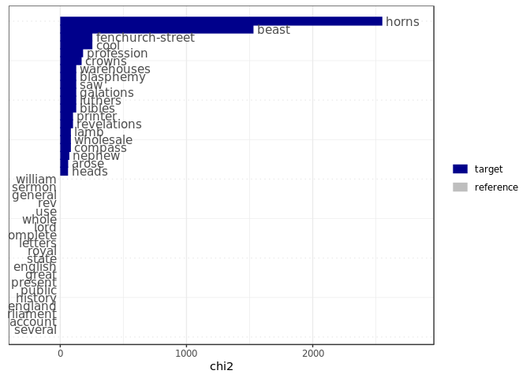

    ## 
    ## Community: 17

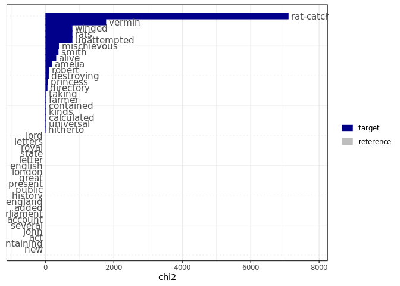

    ## 
    ## Community: 18


    ## 
    ## Community: 19

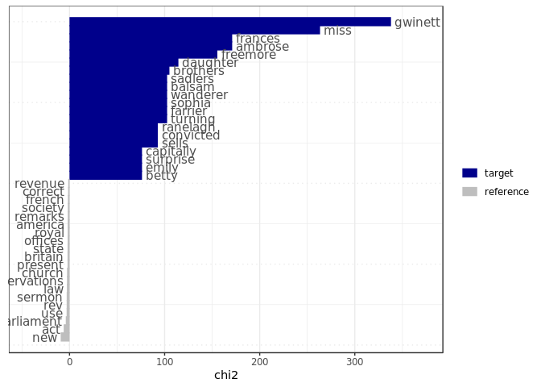

    ## 
    ## Community: 20

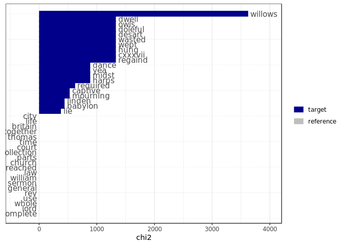

    ## 
    ## Community: 21

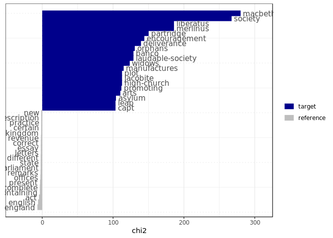

    ## 
    ## Community: 22

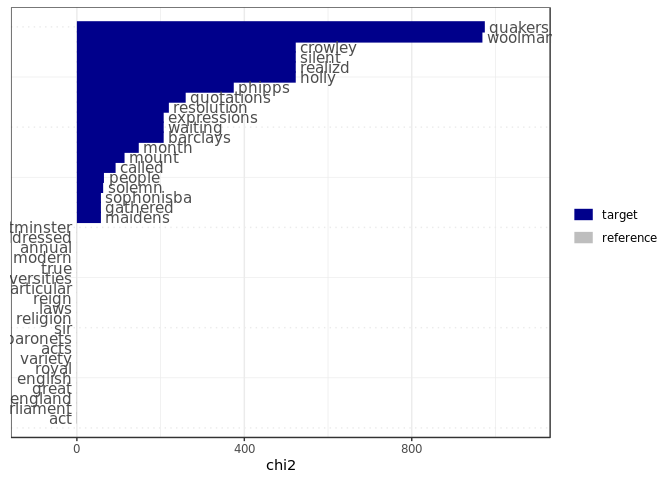

    ## 
    ## Community: 23


    ## 
    ## Community: 24


    ## 
    ## Community: 25


    ## 
    ## Community: 26

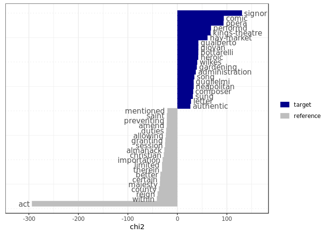

    ## 
    ## Community: 27


    ## 
    ## Community: 28

    ## Warning: Removed 20 rows containing missing values (geom_segment).


    ## 
    ## Community: 29


    ## 
    ##  1771-1780 
    ## 
    ## 25 top features/tokens
    ## $Community_1
    ##          new   containing      history        added      account         john 
    ##          402          356          301          259          255          226 
    ## observations        great      william        royal      english      present 
    ##          219          209          208          201          200          196 
    ##      letters       london       public       letter        state      several 
    ##          196          196          194          190          190          180 
    ##      general         lord      england   parliament       sermon      society 
    ##          177          173          172          161          152          150 
    ##     preached 
    ##          148 
    ## 
    ## $Community_10
    ##       william     gentleman       various         poems     corrected 
    ##             1             1             1             1             1 
    ##      subjects miscellaneous          poem       revised        oliver 
    ##             1             1             1             1             1 
    ##     goldsmith     inscribed     occasions       village     shenstone 
    ##             1             1             1             1             1 
    ## middle-temple    frequented        letter       shebear    containing 
    ##             1             1             0             0             0 
    ##    refutation     arguments    concerning        boston        quebec 
    ##             0             0             0             0             0 
    ## 
    ## $Community_11
    ##          new        lists        court   containing     register         city 
    ##           53           41           32           30           29           24 
    ##     complete       london      correct   parliament       annual       houses 
    ##           19           18           16           15           15           15 
    ##         army         navy      offices   gentlemans       public     calendar 
    ##           15           15           14           14           13           13 
    ##       places     addition improvements universities    hospitals      edition 
    ##           11           11           11           10           10           10 
    ##        names 
    ##           10 
    ## 
    ## $Community_12
    ##     several      london         use       goods   assistant     account 
    ##          10          10           9           9           8           7 
    ##         new       globe terrestrial  containing        days     vessels 
    ##           7           7           7           6           6           6 
    ##    carriers    coasting         lie shopkeepers       whole    designed 
    ##           6           6           6           6           5           5 
    ## exemplified     general      church      proper      places        city 
    ##           5           4           4           4           4           4 
    ##       parts 
    ##           4 
    ## 
    ## $Community_13
    ## containing        new    english     london     public   complete      added 
    ##        259        210        147        131        128        126        117 
    ## parliament      court    theatre        law    england      state      great 
    ##        108        103        103        102         96         93         92 
    ##      royal       john    british  performed       lord    several     letter 
    ##         89         87         86         83         82         81         80 
    ##    account    correct    offices consisting 
    ##         77         77         77         77 
    ## 
    ## $Community_14
    ##          new   containing       letter        added      present         john 
    ##          103           70           65           61           58           55 
    ##      letters      english   parliament      general      account       public 
    ##           55           50           49           47           47           44 
    ## observations         lord        great       church          rev      remarks 
    ##           43           43           39           38           37           36 
    ##         poem      history      several      william        lists      england 
    ##           36           35           34           33           33           33 
    ##    performed 
    ##           32 
    ## 
    ## $Community_15
    ##       john        new containing        rev     sermon   preached      added 
    ##        187        184        155        155        143        129        119 
    ##    account      death     london       life     letter    english    letters 
    ##        104         98         96         92         90         86         85 
    ##  christian    several    history     thomas     church        god    england 
    ##         81         79         79         74         74         71         68 
    ##    present    general      court     christ 
    ##         62         62         61         61 
    ## 
    ## $Community_16
    ##   characters       course       spoken       modern  shakespeare  agriculture 
    ##            3            2            2            2            2            2 
    ##    substance        month deliberation   containing      william observations 
    ##            2            2            2            1            1            1 
    ##        essay       lately interspersed      account      history        fresh 
    ##            1            1            1            1            1            1 
    ##        grand         arts     compiled      society     original    performed 
    ##            1            1            1            1            1            1 
    ##   inspection 
    ##            1 
    ## 
    ## $Community_17
    ##        act parliament     county    majesty        new    certain       john 
    ##       1124        258        253        252        248        241        236 
    ##      great    present   majestys      reign     within    britain    several 
    ##        234        219        215        200        194        190        188 
    ##       time containing    therein     parish     better       lord  intituled 
    ##        181        156        147        138        137        136        130 
    ##       king     george       acts     called 
    ##        128        124        115        113 
    ## 
    ## $Community_18
    ##         rev  containing     present         war     america     several 
    ##           2           1           1           1           1           1 
    ##     account     history  ross-shire         a.m     various       james 
    ##           1           1           1           1           1           1 
    ##   political  discourses   practical    subjects    minister    progress 
    ##           1           1           1           1           1           1 
    ##   impartial   robertson       harry        rise   newcastle      murray 
    ##           1           1           1           1           1           1 
    ## evangelical 
    ##           1 
    ## 
    ## $Community_19
    ##      william      letters          rev          a.m        galic         shaw 
    ##            2            2            2            2            2            2 
    ##   containing observations         laws    gentleman      several       series 
    ##            1            1            1            1            1            1 
    ##       scotch     majestys   dictionary      society   ross-shire        irish 
    ##            1            1            1            1            1            1 
    ##        fatal     analysis     language         lady   government      shewing 
    ##            1            1            1            1            1            1 
    ##   principles 
    ##            1 
    ## 
    ## $Community_2
    ##       john      horns     letter      added    authors        man   religion 
    ##          3          3          2          2          2          2          2 
    ##      heads profession      beast containing     lately       poor     london 
    ##          2          2          2          1          1          1          1 
    ##      india        set     gospel       view      forth    edition      short 
    ##          1          1          1          1          1          1          1 
    ##    richard    address     people  spiritual 
    ##          1          1          1          1 
    ## 
    ## $Community_20
    ##      london        life        john      manner    receipts       added 
    ##           8           6           5           5           5           4 
    ##     account      method    together    complete    sentence  containing 
    ##           4           4           4           4           4           3 
    ##     british       royal       death        city     evening      number 
    ##           3           3           3           3           3           3 
    ##      useful   companion    received        cure        bank     letters 
    ##           3           3           3           2           2           2 
    ## illustrated 
    ##           2 
    ## 
    ## $Community_21
    ##          new   containing     complete      english       public        added 
    ##          346          250          172          158          133          130 
    ##        whole      history      present      account        state        every 
    ##          126          124          122          121          120          120 
    ##         john      several observations        royal   collection       london 
    ##          118          112          107          104          103           99 
    ##      england   parliament      letters          use        great      general 
    ##           98           97           89           87           87           87 
    ##      william 
    ##           86 
    ## 
    ## $Community_3
    ##      letter        lady      infant     history    relating       music 
    ##           3           3           3           2           2           2 
    ##  management association      abrégé   lecriture      sainte  containing 
    ##           2           2           2           2           2           1 
    ##       added     present        john     general      nature   effectual 
    ##           1           1           1           1           1           1 
    ##       means  collection       songs    compiled         new        plan 
    ##           1           1           1           1           1           1 
    ##     hundred 
    ##           1 
    ## 
    ## $Community_4
    ##        new     public parliament   complete    general containing    america 
    ##        116        105        100         84         79         78         75 
    ##      state       list    correct    offices        law    revenue    present 
    ##         72         70         68         66         61         58         57 
    ##      royal      great    england     letter        sir    ireland   register 
    ##         57         56         53         51         49         45         44 
    ##    several   baronets    william      court 
    ##         43         42         41         41 
    ## 
    ## $Community_5
    ##    mémoire     london     depuis     mylord       quil    present        sir 
    ##          6          3          3          3          3          2          2 
    ##     rector      poems    lettres     joseph       city      short      whole 
    ##          2          2          2          2          2          2          2 
    ##     france     pieces      youth       wise   conduite     exposé containing 
    ##          2          2          2          2          2          2          1 
    ## parliament      added        use      great 
    ##          1          1          1          1 
    ## 
    ## $Community_6
    ##     required      willows observations         john      captive       gospel 
    ##            4            4            2            2            2            2 
    ##        among       houses        music         full     preacher    extracted 
    ##            2            2            2            2            2            2 
    ##       isaiah       rivers         song        mirth        saint      gibbons 
    ##            2            2            2            2            2            2 
    ##        psalm      regaind    creatures     heavenly          ver       beasts 
    ##            2            2            2            2            2            2 
    ##         wild 
    ##            2 
    ## 
    ## $Community_7
    ##         court        vision      adultery       epistle    honourable 
    ##             9             8             7             4             2 
    ##         right         human           old        regard         reply 
    ##             2             2             2             2             2 
    ## determination  mademoiselle    electrical           eel          deon 
    ##             2             2             2             2             2 
    ##          adul            ld      serpents    containing       private 
    ##             2             2             2             1             1 
    ##  interspersed  preservation     gentlemen      poetical        guinea 
    ##             1             1             1             1             1 
    ## 
    ## $Community_8
    ##          new       tables    corrected        whole   logarithms         time 
    ##           11            8            6            6            5            4 
    ##      various      english        every          bay  description       number 
    ##            4            4            4            4            4            4 
    ##   describing        capes        pilot  logarithmic    logarithm   containing 
    ##            4            4            4            4            4            3 
    ##          use      account      natural        parts     enlarged         easy 
    ##            3            3            3            3            3            3 
    ## particularly 
    ##            3 
    ## 
    ## $Community_9
    ##    society     london     sermon   preached  christian     church       john 
    ##         61         60         59         57         36         35         33 
    ##        new       lord   reverend    meeting  knowledge    persons      right 
    ##         31         29         28         26         26         26         26 
    ##        rev        use    account        god  promoting    several    request 
    ##         25         24         24         24         21         20         20 
    ##      parts    william containing     rector 
    ##         20         19         18         18 
    ## 
    ## 
    ## Community: 1


    ## 
    ## Community: 2


    ## 
    ## Community: 3

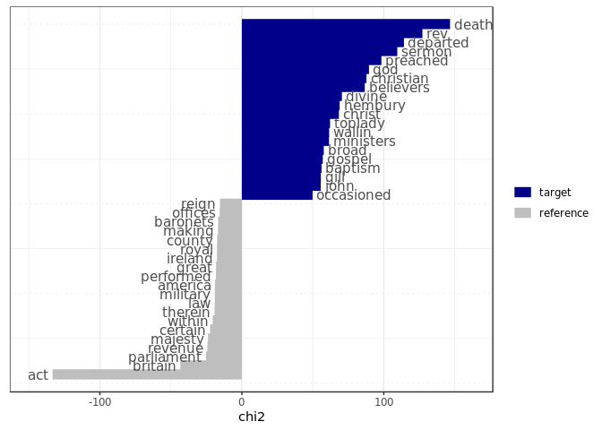

    ## 
    ## Community: 4


    ## 
    ## Community: 5

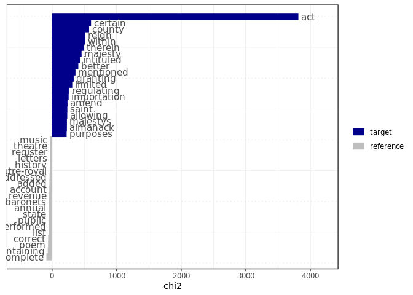

    ## 
    ## Community: 6


    ## 
    ## Community: 7


    ## 
    ## Community: 8

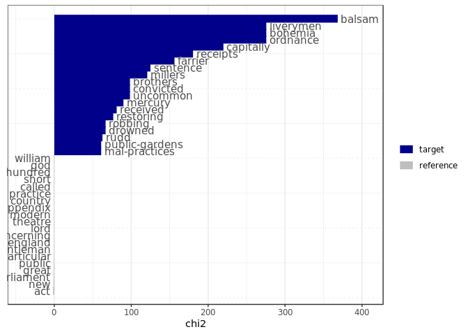

    ## 
    ## Community: 9

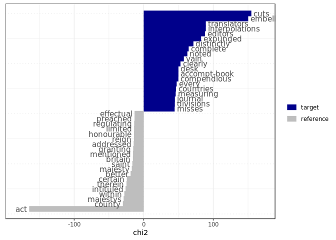

    ## 
    ## Community: 10

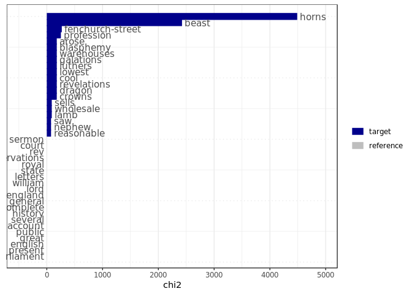

    ## 
    ## Community: 11


    ## 
    ## Community: 12

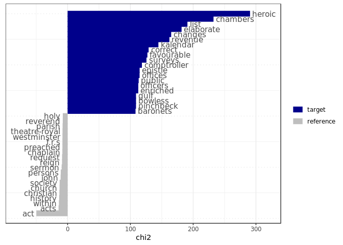

    ## 
    ## Community: 13


    ## 
    ## Community: 14

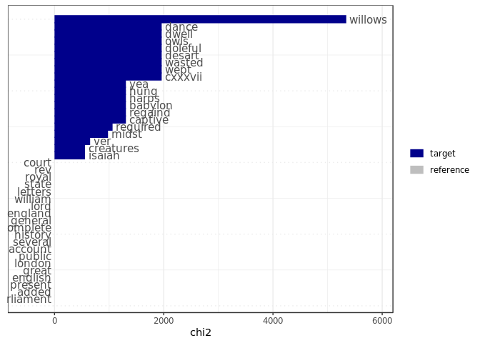

    ## 
    ## Community: 15

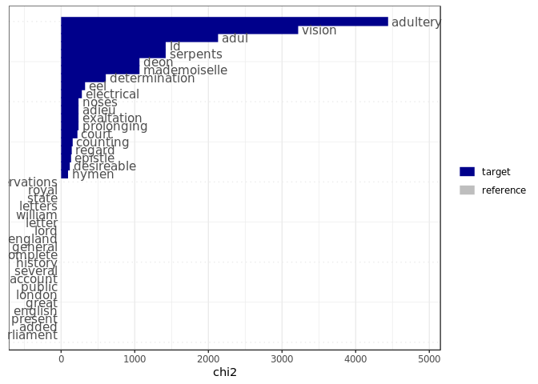

    ## 
    ## Community: 16

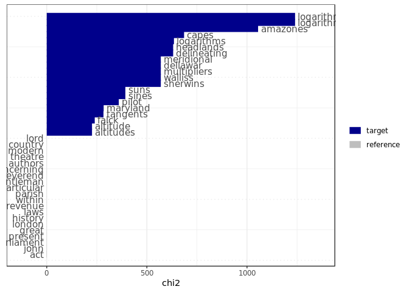

    ## 
    ## Community: 17


    ## 
    ## Community: 18


    ## 
    ## Community: 19

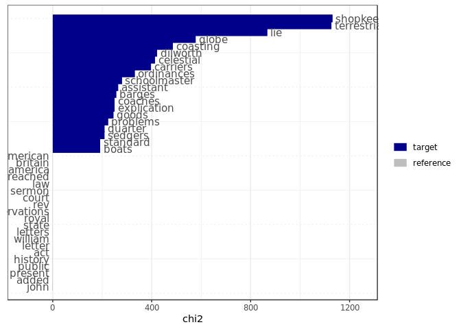

    ## 
    ## Community: 20


    ## 
    ## Community: 21

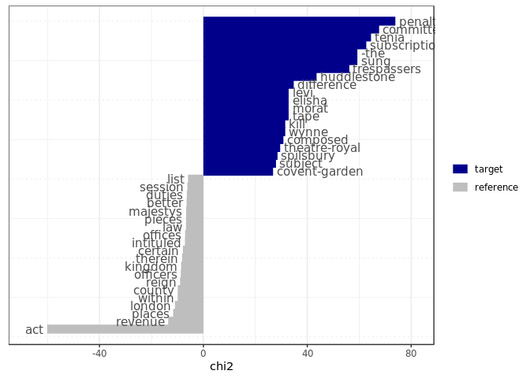

    ## 
    ##  1776-1785 
    ## 
    ## 25 top features/tokens
    ## $Community_1
    ##         goods        london     assistant       account   shopkeepers 
    ##            13            12             9             9             8 
    ##      carriers      coasting       vessels       several          days 
    ##             8             8             8             8             8 
    ##           lie           new    containing       general      designed 
    ##             8             6             5             5             5 
    ##    tradesmans       correct  alphabetical          list stage-coaches 
    ##             4             4             4             4             4 
    ##          inns       coaches           put            go          week 
    ##             4             4             4             4             4 
    ## 
    ## $Community_10
    ##       musica     principj    salvatore     bertezen      sedgers    rudiments 
    ##            1            1            1            1            0            0 
    ## book-keeping    invention     applying     opposing        terms       debtor 
    ##            0            0            0            0            0            0 
    ##     creditor    according      italian       method    explained demonstrated 
    ##            0            0            0            0            0            0 
    ##    perfectly         easy      reduced         four        plain        cases 
    ##            0            0            0            0            0            0 
    ##   applicable 
    ##            0 
    ## 
    ## $Community_11
    ##           new         pilot       surveys    containing         north 
    ##            14            12            12            10            10 
    ##         whole        actual       sailing    directions      engraved 
    ##             9             9             9             8             8 
    ##       channel       bowless       british       islands          capt 
    ##             8             8             7             7             7 
    ##         coast       account      complete  observations         taken 
    ##             7             6             6             6             6 
    ##        tables copper-plates     including      latitude          gulf 
    ##             6             6             6             6             6 
    ## 
    ## $Community_12
    ##    destruction          incas      marmontel   observations   constitution 
    ##              2              2              2              1              1 
    ##         france          berne         empire       environs      lacademie 
    ##              1              1              1              1              1 
    ##      françoise            lun    langleterre         londre        prʹecis 
    ##              1              1              1              1              1 
    ##      decadence     atheronome           peru        lempire          perou 
    ##              1              1              1              1              1 
    ## historiographe       quarante        sedgers      rudiments   book-keeping 
    ##              1              1              0              0              0 
    ## 
    ## $Community_13
    ##   cornelius      cayley   according     setting      christ         rev 
    ##           2           2           1           1           1           1 
    ##       death        john       great      gospel         god      riches 
    ##           1           1           1           1           1           1 
    ##  sufferings       jesus    preacher     wesleys       grace  redemption 
    ##           1           1           1           1           1           1 
    ##     towards       forth         man    dialogue        sins evangelical 
    ##           1           1           1           1           1           1 
    ##       mercy 
    ##           1 
    ## 
    ## $Community_14
    ##          sermon        preached          london          church         society 
    ##              43              43              33              30              30 
    ##       christian         account             rev       promoting       knowledge 
    ##              27              20              20              20              20 
    ##         several        reverend            lord             use         england 
    ##              19              19              17              17              17 
    ##          rector             god         meeting charity-schools          letter 
    ##              15              15              15              15              14 
    ##        children          sunday        thursday           right          bishop 
    ##              14              14              14              13              13 
    ## 
    ## $Community_15
    ##          new   containing      history        royal observations         john 
    ##          242          214          205          187          182          175 
    ##      account       london      society      william      letters       letter 
    ##          170          164          162          157          149          148 
    ##       public        added        state         lord      general        great 
    ##          146          145          142          138          138          132 
    ##          law      english      england      present   parliament       thomas 
    ##          131          130          120          118          117          116 
    ##         view 
    ##          114 
    ## 
    ## $Community_16
    ## containing     series    letters    reduced        new   practice  assistant 
    ##          2          2          2          1          1          1          1 
    ##    correct       list      rates        use    adapted       life       john 
    ##          1          1          1          1          1          1          1 
    ##    history     system     church       rise   progress       five government 
    ##          1          1          1          1          1          1          1 
    ##     spirit      times      grace  impartial 
    ##          1          1          1          1 
    ## 
    ## $Community_17
    ##         order commissioners     longitude           new      nautical 
    ##            15            15            15            14            12 
    ##  astronomical     ephemeris       almanac           bay  observations 
    ##            12            10            10             6             5 
    ##         table       england        tables        survey         pilot 
    ##             5             5             5             5             5 
    ##        useful       english          west   description         north 
    ##             4             4             4             4             4 
    ##         coast        coasts         whole          time       william 
    ##             4             4             3             3             3 
    ## 
    ## $Community_18
    ##      anecdotes          louis            vie particularités         privée 
    ##              3              3              3              3              3 
    ##     principaux      événemens          regne       nouvelle       portrait 
    ##              3              2              2              1              1 
    ##            roi        lauteur        édition   ʹevʹenements          règne 
    ##              1              1              1              1              1 
    ##       corrigée      augmentée     manuscrits          ornée        sedgers 
    ##              1              1              1              1              0 
    ##      rudiments   book-keeping      invention       applying       opposing 
    ##              0              0              0              0              0 
    ## 
    ## $Community_19
    ##          new   containing   parliament       public      general      present 
    ##          255          228          210          168          164          158 
    ##         john        royal         lord        added       letter       london 
    ##          157          150          148          147          144          140 
    ##        court     complete         list        state        great      letters 
    ##          140          138          136          135          129          129 
    ##          law      england      several observations        right      america 
    ##          128          127          124          123          119          118 
    ##      william 
    ##          112 
    ## 
    ## $Community_2
    ##     letter   treatise     christ     sermon        rev      death     andrew 
    ##          4          3          3          3          3          3          3 
    ##       john      grand        god    william       life   preached       west 
    ##          3          3          3          2          2          2          2 
    ##    october    address      reply     philip    withers occasioned     thomas 
    ##          2          2          2          2          2          2          2 
    ##      known    edition      tyler      royal 
    ##          2          2          2          2 
    ## 
    ## $Community_20
    ##           act       certain       majesty    parliament       present 
    ##          1225           354           350           332           314 
    ##         great      majestys        county       britain        duties 
    ##           275           260           250           240           217 
    ##         reign          time           new        public       america 
    ##           204           196           189           178           176 
    ##        within       several           law commissioners       england 
    ##           174           171           161           155           154 
    ##         court         state        better      granting          acts 
    ##           153           150           150           148           140 
    ## 
    ## $Community_21
    ##          lord     dedicated        county      counties         great 
    ##             3             3             3             2             2 
    ##       remarks       letters  observations       conduct         salop 
    ##             2             2             2             2             2 
    ##          hill       medical        member       richard         guide 
    ##             2             2             2             2             2 
    ##          bath           six        attack parliamentary    freeholder 
    ##             2             2             2             2             2 
    ##       burgess        ludlow     addressed           new    containing 
    ##             2             2             1             1             1 
    ## 
    ## $Community_22
    ##        new   complete containing      whole       john      every        rev 
    ##        150         85         78         64         59         53         42 
    ##      added    history    present    account  universal    several     london 
    ##         41         39         39         35         35         34         34 
    ##    various    english collection       life    william       work    general 
    ##         32         30         30         29         28         28         26 
    ##     sermon     church  authentic   together 
    ##         25         25         25         24 
    ## 
    ## $Community_23
    ##      great    account       life       king    gipsies     method  explained 
    ##          3          2          2          2          2          1          1 
    ##    several     places  practical     called      added        age    history 
    ##          1          1          1          1          1          1          1 
    ##    conduct adventures particular    society government    america   commonly 
    ##          1          1          1          1          1          1          1 
    ##  impartial      young     school   language 
    ##          1          1          1          1 
    ## 
    ## $Community_24
    ##     december       months        years         aged        eight         acts 
    ##            1            1            1            1            1            1 
    ##       eleven      tragedy        green       secret         plot       rupert 
    ##            1            1            1            1            1            1 
    ##      sedgers    rudiments book-keeping    invention     applying     opposing 
    ##            0            0            0            0            0            0 
    ##        terms       debtor     creditor    according      italian       method 
    ##            0            0            0            0            0            0 
    ##    explained 
    ##            0 
    ## 
    ## $Community_25
    ##      september       lowellin         manner         london           life 
    ##              2              2              1              1              1 
    ##          death        history        journal     adventures          third 
    ##              1              1              1              1              1 
    ##           miss           long       february          lives      perdition 
    ##              1              1              1              1              1 
    ##        travels           lost         female        officer circumstantial 
    ##              1              1              1              1              1 
    ##        unknown        voyages          siege      gibraltar           safe 
    ##              1              1              1              1              1 
    ## 
    ## $Community_26
    ##       garrick        london           act   westminster         every 
    ##             9             7             6             5             4 
    ##           new       several        common    celebrated      articles 
    ##             4             4             4             4             4 
    ##    containing         added         death entertainment        clarke 
    ##             3             3             3             3             3 
    ##         large     companion        fields   northampton       elegant 
    ##             3             3             3             3             3 
    ##        county           map     curiosity         lands        alleyn 
    ##             3             3             3             3             3 
    ## 
    ## $Community_27
    ##  containing     account         new      london        john       court 
    ##          53          46          43          35          31          31 
    ##     history  parliament     present    complete     america       great 
    ##          30          29          28          28          26          24 
    ##     england      public     several        life       lists       added 
    ##          24          23          22          22          22          21 
    ##         law    register     letters     general     english description 
    ##          21          21          19          18          18          18 
    ##       state 
    ##          18 
    ## 
    ## $Community_28
    ##      doctrine         every philosophical     necessity     edinburgh 
    ##             3             2             2             2             2 
    ##     necessary        review        fisher       disease        leyden 
    ##             2             2             2             2             2 
    ##        method  demonstrated          easy         plain      practice 
    ##             1             1             1             1             1 
    ##      together        proper        others       eminent       authors 
    ##             1             1             1             1             1 
    ##         short       william     yorkshire      treatise           rev 
    ##             1             1             1             1             1 
    ## 
    ## $Community_3
    ##       john        rev     wesley     sermon     letter   preached     thomas 
    ##         43         27         22         20         16         14         14 
    ##     church swedenborg    letters collection    account      short      vicar 
    ##         13         13         12         12         11         11         11 
    ## containing        m.a   original        new       lord     christ      death 
    ##         10         10         10          9          9          9          9 
    ##        god    extract    english    remarks 
    ##          9          9          8          8 
    ## 
    ## $Community_4
    ##          new   containing         john        added       sermon       london 
    ##          352          280          245          193          190          178 
    ##     preached          rev      history      letters      account        royal 
    ##          178          177          177          171          167          164 
    ## observations       public     complete         life        state       letter 
    ##          163          156          154          149          147          142 
    ##      general      english      william      present        great      several 
    ##          138          133          132          132          127          124 
    ##       thomas 
    ##          119 
    ## 
    ## $Community_5
    ##          new         lord     almanack   containing         john       london 
    ##          123          101           96           72           57           49 
    ##      present      history      account   bissextile      england      several 
    ##           46           45           43           42           40           39 
    ##       public          god observations      english        state        added 
    ##           39           38           38           37           34           33 
    ##     complete       letter   parliament          old      general      william 
    ##           33           32           32           31           30           30 
    ##    leap-year 
    ##           30 
    ## 
    ## $Community_6
    ##         new   dalrymple       music   geography       coast     account 
    ##          13          10           9           8           8           7 
    ##         map      memoir      signor        capt     present description 
    ##           7           7           7           7           6           6 
    ##    complete  collection     theatre   performed         set      french 
    ##           6           6           6           6           5           5 
    ##        john       kings      bengal        turc  containing     general 
    ##           5           5           5           5           4           4 
    ##       added 
    ##           4 
    ## 
    ## $Community_7
    ##         arts       polite      various   exhibiting     magazine      drawing 
    ##            3            3            2            2            2            2 
    ##   principles     branches   repository      artists      francis     lectures 
    ##            2            2            2            2            1            1 
    ##        heads      musical miscellanies   fitzgerald      sedgers    rudiments 
    ##            1            1            1            1            0            0 
    ## book-keeping    invention     applying     opposing        terms       debtor 
    ##            0            0            0            0            0            0 
    ##     creditor 
    ##            0 
    ## 
    ## $Community_8
    ##      circular          rule        golden      builders          pain 
    ##             5             4             4             4             4 
    ##       william copper-plates      engraved     measuring          easy 
    ##             3             3             3             3             2 
    ##        manner           new    containing         works     practical 
    ##             2             2             2             2             2 
    ##   experiments         added       variety         rules        youths 
    ##             2             2             2             2             2 
    ##        labour    electrical    carpenters      squaring        method 
    ##             2             2             2             2             1 
    ## 
    ## $Community_9
    ## containing        new     london    english   complete      court    theatre 
    ##        213        170        154        122        115        103         99 
    ##    british     public      added        law    correct parliament consisting 
    ##         96         94         93         86         83         82         81 
    ##      state    account    offices      plays      bells       list      great 
    ##         76         75         73         71         71         69         69 
    ##      royal   esteemed    england        sir 
    ##         67         67         65         64 
    ## 
    ## 
    ## Community: 1

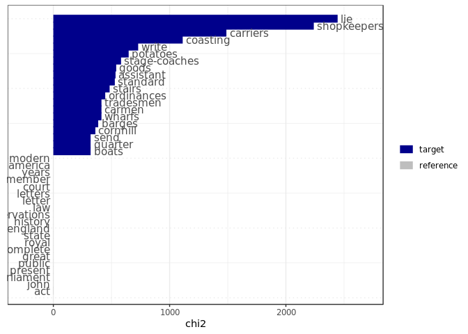

    ## 
    ## Community: 2


    ## 
    ## Community: 3

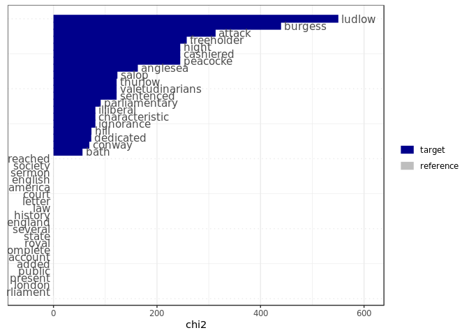

    ## 
    ## Community: 4


    ## 
    ## Community: 5


    ## 
    ## Community: 6

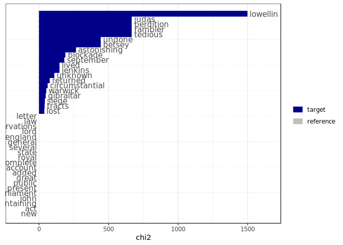

    ## 
    ## Community: 7

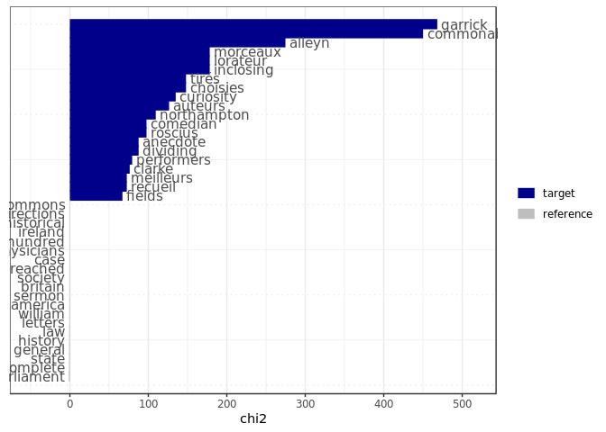

    ## 
    ## Community: 8

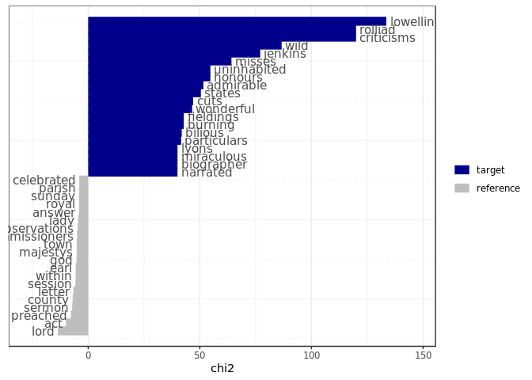

    ## 
    ## Community: 9


    ## 
    ## Community: 10

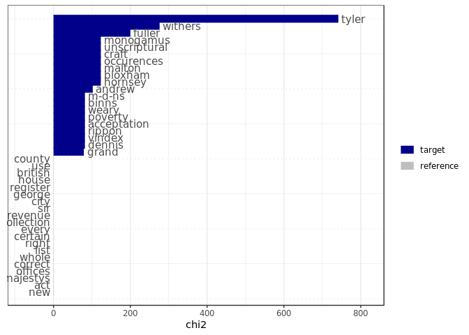

    ## 
    ## Community: 11


    ## 
    ## Community: 12

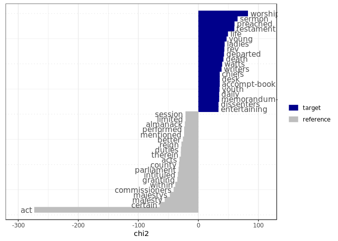

    ## 
    ## Community: 13

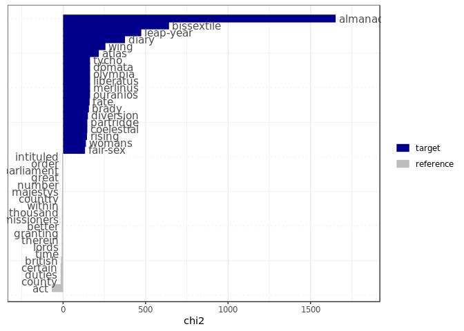

    ## 
    ## Community: 14

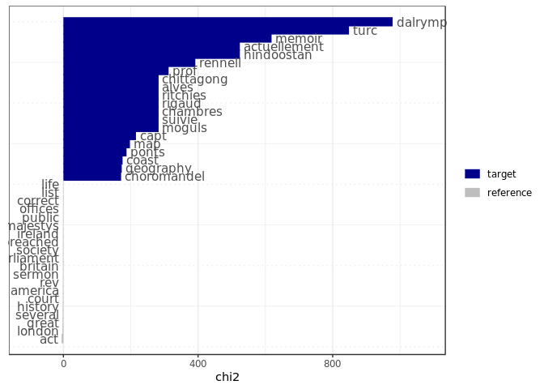

    ## 
    ## Community: 15


    ## 
    ## Community: 16

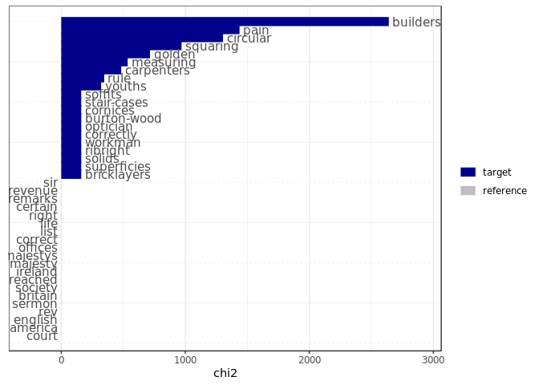

    ## 
    ## Community: 17

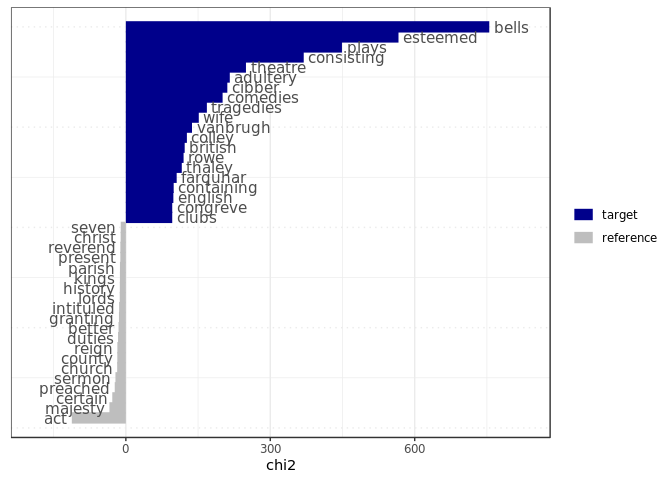

    ## 
    ## Community: 18

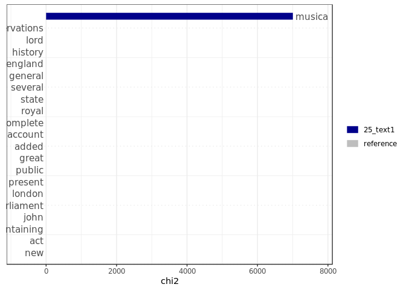

    ## 
    ## Community: 19

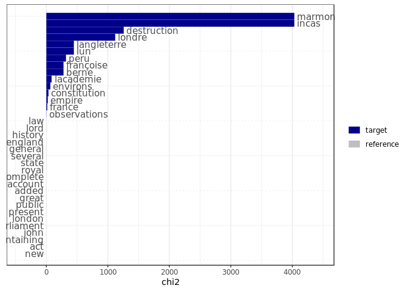

    ## 
    ## Community: 20


    ## 
    ## Community: 21

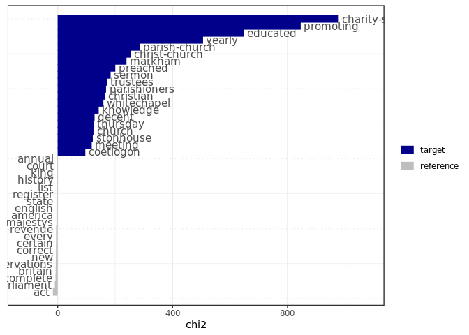

    ## 
    ## Community: 22


    ## 
    ## Community: 23


    ## 
    ## Community: 24


    ## 
    ## Community: 25


    ## 
    ## Community: 26

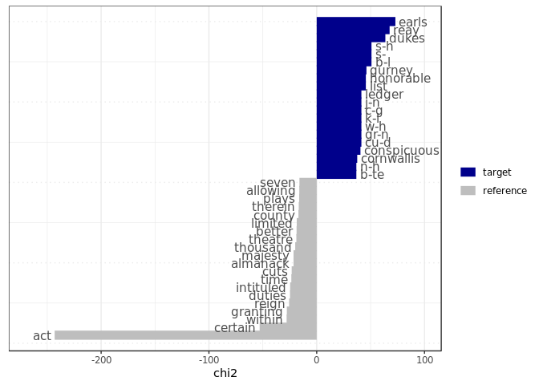

    ## 
    ## Community: 27


    ## 
    ## Community: 28

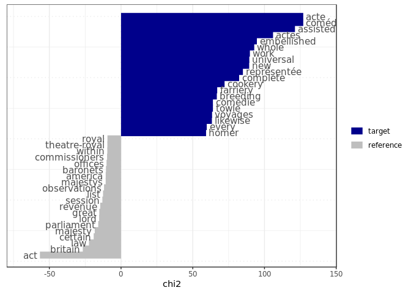

    ## 
    ##  1781-1790 
    ## 
    ## 25 top features/tokens
    ## $Community_1
    ##        new containing    account   complete      whole        rev     london 
    ##        126         73         65         59         55         47         45 
    ##       john  universal    several      added       life      great    british 
    ##         44         40         38         37         36         35         34 
    ##    william    history collection  gentlemen      royal   magazine    present 
    ##         32         31         29         29         26         25         25 
    ##      every    general    various     thomas 
    ##         25         24         24         23 
    ## 
    ## $Community_10
    ##   repository      artists         arts      various     magazine   principles 
    ##            4            4            4            3            3            3 
    ##       polite   exhibiting     branches      drawing      francis   containing 
    ##            3            3            3            3            2            2 
    ##        poems miscellanies     lectures   fitzgerald        moral   characters 
    ##            2            2            2            2            1            1 
    ##   particular      memoirs      british       select      musical       genius 
    ##            1            1            1            1            1            1 
    ##      natural 
    ##            1 
    ## 
    ## $Community_11
    ##    bertezen       given     england       young       kinds   different 
    ##           2           1           1           1           1           1 
    ##  metropolis     brought  perfection     climate        near     founded 
    ##           1           1           1           1           1           1 
    ##        food    thoughts      musica       worms        silk possibility 
    ##           1           1           1           1           1           1 
    ## experiemnts    principj   salvatore     extract         rev        john 
    ##           1           1           1           0           0           0 
    ##     wesleys 
    ##           0 
    ## 
    ## $Community_12
    ##          rev         john       sermon     preached       christ       church 
    ##          133          108          101           85           72           71 
    ##   containing        added          new      william       london       gospel 
    ##           71           70           68           67           67           66 
    ##       chapel       letter        death          god         life         lord 
    ##           65           60           58           53           52           51 
    ##      letters      account     minister      general      society observations 
    ##           50           50           49           44           44           42 
    ##       thomas 
    ##           41 
    ## 
    ## $Community_13
    ##        held     meeting        rose resolutions        john  collection 
    ##           2           2           2           2           1           1 
    ##        sold      public         act     society     several      places 
    ##           1           1           1           1           1           1 
    ##        used  containing       muses     catches     british         new 
    ##           1           1           1           1           1           1 
    ##     william       third       songs     theatre description    songster 
    ##           1           1           1           1           1           1 
    ##     english 
    ##           1 
    ## 
    ## $Community_14
    ##    catalogue       review      monthly        index        names          rev 
    ##            3            2            2            2            2            1 
    ##      journal      general      account        added   containing      british 
    ##            1            1            1            1            1            1 
    ##          end     complete     appendix     literary        books        price 
    ##            1            1            1            1            1            1 
    ##         size     enlarged     inserted    pamphlets commencement       museum 
    ##            1            1            1            1            1            1 
    ##    mentioned 
    ##            1 
    ## 
    ## $Community_15
    ##         dunn       tables    longitude       samuel     latitude       linear 
    ##           20            9            8            7            6            6 
    ##     sciences         moon        sines      teacher      journal       london 
    ##            5            5            5            5            4            4 
    ## mathematical        table        stars     precepts         time   navigation 
    ##            4            4            4            3            3            3 
    ##     abridged     invented          sun     nautical   logarithms     tangents 
    ##            3            3            3            3            3            3 
    ##      secants 
    ##            3 
    ## 
    ## $Community_16
    ##      anecdotes          louis            vie         privée     principaux 
    ##              3              3              3              3              3 
    ## particularités      événemens          regne       nouvelle       corrigée 
    ##              3              2              2              1              1 
    ##      augmentée            roi       portrait        lauteur        édition 
    ##              1              1              1              1              1 
    ##   ʹevʹenements          règne     manuscrits          ornée        extract 
    ##              1              1              1              1              0 
    ##            rev           john        wesleys        journal         august 
    ##              0              0              0              0              0 
    ## 
    ## $Community_17
    ##    faith    great      rev   christ   gospel countess     john  wesleys 
    ##        4        3        2        2        2        2        1        1 
    ##   august   letter   sermon preached minister  william    world  natural 
    ##        1        1        1        1        1        1        1        1 
    ##    whole     cure   london      end   chapel  evening  present   sunday 
    ##        1        1        1        1        1        1        1        1 
    ##    jesus 
    ##        1 
    ## 
    ## $Community_18
    ##   containing          new         john      present   parliament observations 
    ##          384          358          324          321          285          277 
    ##        royal       letter        added        state      account       public 
    ##          272          270          267          253          242          236 
    ##         lord       london      william        great      general        right 
    ##          233          231          227          222          221          220 
    ##        house      england      letters      several      history          sir 
    ##          220          210          202          195          185          183 
    ##          rev 
    ##          163 
    ## 
    ## $Community_19
    ##        rev    letters       book    various     fourth    english   subjects 
    ##          1          1          1          1          1          1          1 
    ##     orator    richard translator     thirty   polwhele theocritus    extract 
    ##          1          1          1          1          1          1          0 
    ##       john    wesleys    journal     august  religious      moral clementina 
    ##          0          0          0          0          0          0          0 
    ##     letter strictures      cokes ordination 
    ##          0          0          0          0 
    ## 
    ## $Community_2
    ##        royal        added          new         john   containing      english 
    ##           34           29           29           26           22           20 
    ##           d- observations      account      theatre          sir       letter 
    ##           20           19           18           16           16           15 
    ##      general   collection        songs      history      remarks          rev 
    ##           15           15           15           15           15           14 
    ##       french       london       george      several    performed     original 
    ##           14           13           13           12           12           12 
    ##        right 
    ##           12 
    ## 
    ## $Community_20
    ##     account         new     curious       youth       short       early 
    ##          10          10          10          10           9           9 
    ##         age   diverting      select    pleasing         old evangelists 
    ##           9           9           9           9           9           9 
    ##     chiefly    designed        cuts        holy      manner       lives 
    ##           9           9           9           9           9           9 
    ##      pieces       bible  scriptures illustrated    passages   amusement 
    ##           9           9           9           9           9           9 
    ##      tender 
    ##           9 
    ## 
    ## $Community_21
    ##     history      little    children        lady       young   amusement 
    ##          21          21          17          14          13          13 
    ##       added  containing        good       great      family         rev 
    ##          12          12          12          11          10           9 
    ##         use       story instruction      master        miss        boys 
    ##           9           9           9           9           9           9 
    ##       short   dialogues    intended    designed improvement   teachwell 
    ##           8           8           8           8           8           8 
    ##     william 
    ##           7 
    ## 
    ## $Community_22
    ##    history containing        new       view   register     annual        rev 
    ##         90         60         57         54         51         51         50 
    ## literature   politics    account    society      whole     london    various 
    ##         48         46         45         44         44         44         41 
    ##       john     thomas    general   preached      royal   complete    letters 
    ##         36         36         36         34         34         34         32 
    ##      great     sermon    william   together 
    ##         32         31         30         30 
    ## 
    ## $Community_23
    ##      great    account       life       king    gipsies     called adventures 
    ##          3          2          2          2          2          1          1 
    ##   commonly    beggars  impartial    leaving   tiverton     school        age 
    ##          1          1          1          1          1          1          1 
    ##    fifteen   entering    society    motives    conduct    related  explained 
    ##          1          1          1          1          1          1          1 
    ##     number characters     shapes   appeared 
    ##          1          1          1          1 
    ## 
    ## $Community_24
    ##       songs      voyage       price    sixpence harpsichord     nouveau 
    ##           1           1           1           1           1           1 
    ## sentimental piano-forte     messiah   shillings    oratorio     verture 
    ##           1           1           1           1           1           1 
    ##     extract         rev        john     wesleys     journal      august 
    ##           0           0           0           0           0           0 
    ##     letters   religious       moral  clementina      letter  strictures 
    ##           0           0           0           0           0           0 
    ##       cokes 
    ##           0 
    ## 
    ## $Community_25
    ##       list    offices    correct        law    revenue       navy   complete 
    ##         38         26         24         23         23         22         21 
    ##  corrected        new    england parliament      ships     public   baronets 
    ##         21         20         20         20         20         18         18 
    ##      state     london    america   scotland    ireland      royal       city 
    ##         17         17         16         16         15         14         14 
    ##      court  different     useful containing 
    ##         14         13         13         12 
    ## 
    ## $Community_26
    ##          new   containing       london      present         john   parliament 
    ##           33           26           19           17           16           15 
    ##          rev      account         king      england      english        court 
    ##           12           12           11           11           11           11 
    ##      general       public        added     complete  illustrated       thomas 
    ##           10           10           10           10           10            9 
    ##        south          law      ireland      several      america observations 
    ##            9            9            8            8            8            8 
    ##     prefixed 
    ##            8 
    ## 
    ## $Community_27
    ##    history   williams     letter containing       life      added        ann 
    ##          8          8          5          5          4          4          4 
    ##   daughter       love       mary     beauty    letters      death collection 
    ##          4          4          4          4          3          3          3 
    ##    variety      young       lady    captain       true    edwards      finds 
    ##          3          3          3          3          3          3          3 
    ##    account adventures      songs      whole 
    ##          2          2          2          2 
    ## 
    ## $Community_28
    ##         john          new       sermon     preached       london          rev 
    ##          191          188          180          164          164          163 
    ##   containing        royal observations      society      william      account 
    ##          160          125          118          115          112          111 
    ##        added       church       public     complete         life      england 
    ##          111          107          102          101           95           95 
    ##        state       thomas      letters          use       letter         lord 
    ##           92           92           88           88           87           83 
    ##      several 
    ##           82 
    ## 
    ## $Community_29
    ##   containing      colours      account        silks     lowellin        added 
    ##            9            9            8            6            6            5 
    ##      curious       manner      jenkins      history        whole     together 
    ##            5            5            5            4            4            4 
    ##      country observations        water      prevent        taken        miles 
    ##            4            4            4            4            4            4 
    ##        years       africa         mode    september         gold       stuffs 
    ##            4            4            4            4            4            4 
    ##       vermin 
    ##            4 
    ## 
    ## $Community_3
    ##   containing          new        royal         john      history      present 
    ##          277          276          241          211          211          182 
    ##        added      account observations        state       london      society 
    ##          170          165          164          160          160          158 
    ##      several     complete   parliament       public      england        great 
    ##          152          149          146          142          142          136 
    ##      william      letters      english          rev      general          law 
    ##          136          134          131          128          125          120 
    ##       thomas 
    ##          118 
    ## 
    ## $Community_30
    ##        rev     letter    english     church     bishop    ireland        law 
    ##         17         15         15         14         14         13         13 
    ##      state   reverend    england    offices   catholic    revenue     public 
    ##         12         12         12         12         12         12         11 
    ##      added    prayers    america     london  christian parliament   baronets 
    ##         11         10         10         10         10         10         10 
    ##  catholics containing      james       john 
    ##         10          9          9          8 
    ## 
    ## $Community_4
    ##           act       majesty       certain    parliament       present 
    ##          1300           367           353           299           295 
    ##        county        duties         great         reign          time 
    ##           268           261           249           225           220 
    ##      majestys       britain       several        within commissioners 
    ##           219           213           199           192           182 
    ##           law           new        better      granting          king 
    ##           177           166           160           155           148 
    ##          acts        parish       england     intituled       session 
    ##           146           142           141           139           138 
    ## 
    ## $Community_5
    ##            rev         church          added           lock           john 
    ##              5              4              3              3              2 
    ##         sermon       preached         thomas        account     containing 
    ##              2              2              2              2              2 
    ##    institution          scots charity-school     ordination        general 
    ##              2              2              2              1              1 
    ##         public     advantages          hymns          notes            new 
    ##              1              1              1              1              1 
    ##         nature   observations            old           list        private 
    ##              1              1              1              1              1 
    ## 
    ## $Community_6
    ## containing     london        new     public      added   complete    account 
    ##        143        140        123         96         88         86         75 
    ##      state    offices       lord      royal        law      great       list 
    ##         72         71         70         69         69         68         66 
    ##    correct       john    england    various      court    revenue    several 
    ##         66         65         65         63         62         60         59 
    ##      trial      whole parliament    ireland 
    ##         59         58         57         48 
    ## 
    ## $Community_7
    ##       duty christians      heart        set    serious        god       wish 
    ##          5          2          2          2          2          2          2 
    ## meditation      forth    briefly    nothing      clean performing      sight 
    ##          2          2          2          2          2          1          1 
    ## assistance      happy       ever      grace        die     secure       soul 
    ##          1          1          1          1          1          1          1 
    ##  neighbour      fight   blessing    extract 
    ##          1          1          1          0 
    ## 
    ## $Community_8
    ##       medical        vinson        people       several        friend 
    ##             2             2             1             1             1 
    ##  observations         cases         house          mary        robert 
    ##             1             1             1             1             1 
    ##       richard          view     character        health         essay 
    ##             1             1             1             1             1 
    ##     subjoined  commentaries       adapted          bath          road 
    ##             1             1             1             1             1 
    ##         widow      deceased oxford-street        define    indisposed 
    ##             1             1             1             1             1 
    ## 
    ## $Community_9
    ##   almanack        new       lord containing     london    england      diary 
    ##         80         63         60         39         31         29         27 
    ##     psalms   complete bissextile     ladies      david       john      atlas 
    ##         27         25         25         24         23         22         22 
    ##       cuts    offices     useful        god     public    history       kind 
    ##         21         21         21         21         20         20         20 
    ##        law    version      brady       tate 
    ##         20         20         20         20 
    ## 
    ## 
    ## Community: 1

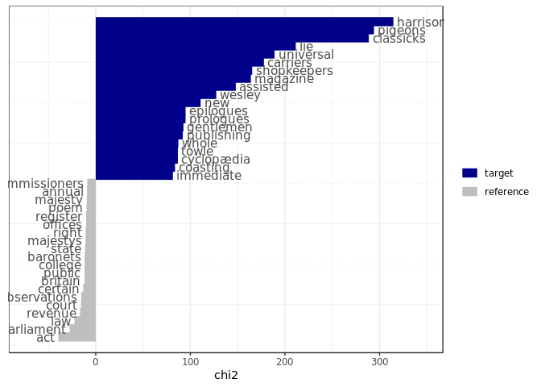

    ## 
    ## Community: 2

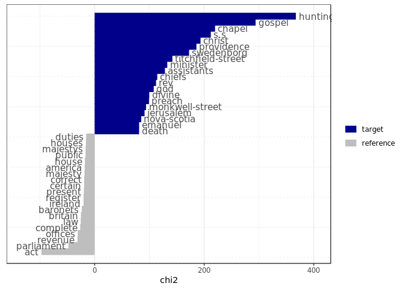

    ## 
    ## Community: 3

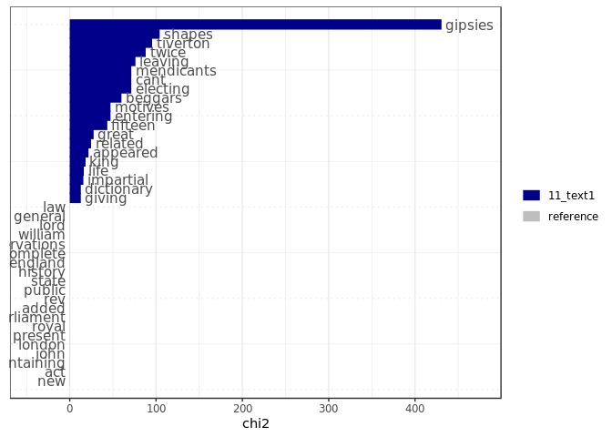

    ## 
    ## Community: 4


    ## 
    ## Community: 5


    ## 
    ## Community: 6


    ## 
    ## Community: 7

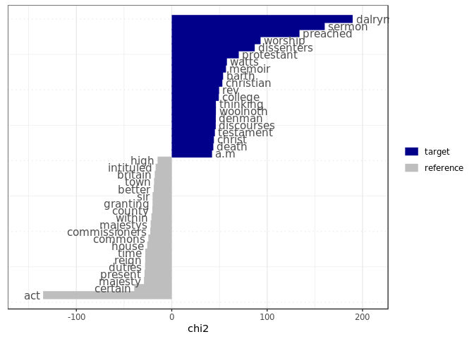

    ## 
    ## Community: 8


    ## 
    ## Community: 9


    ## 
    ## Community: 10


    ## 
    ## Community: 11

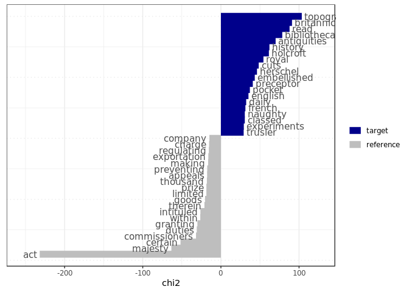

    ## 
    ## Community: 12


    ## 
    ## Community: 13

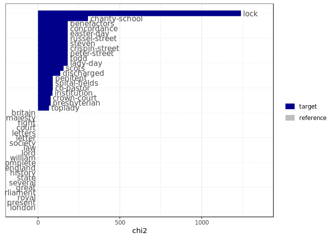

    ## 
    ## Community: 14

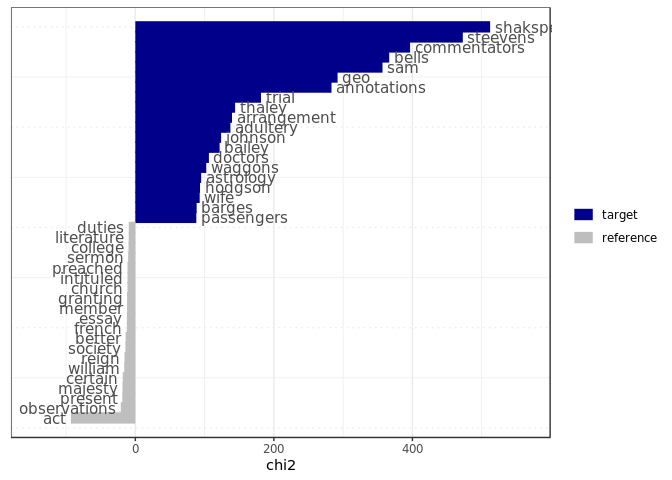

    ## 
    ## Community: 15

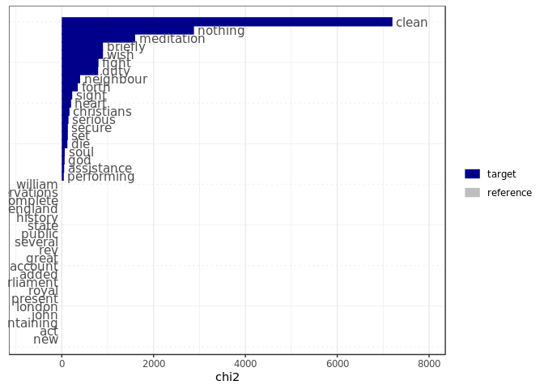

    ## 
    ## Community: 16

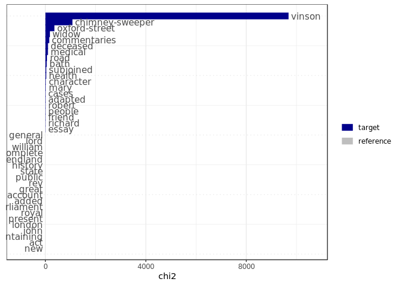

    ## 
    ## Community: 17


    ## 
    ## Community: 18

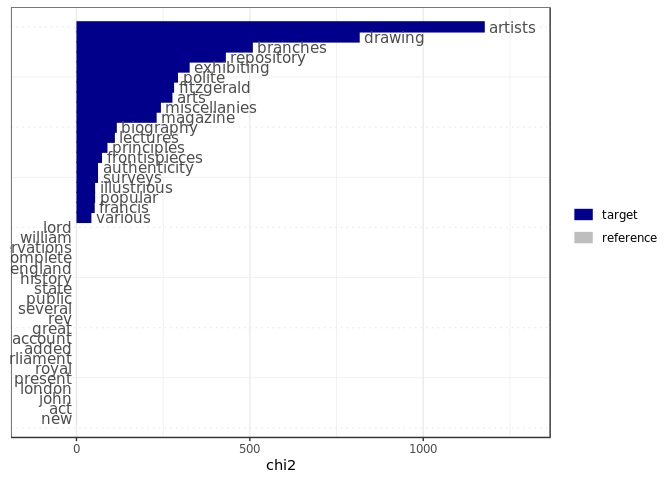

    ## 
    ## Community: 19


    ## 
    ## Community: 20


    ## 
    ## Community: 21

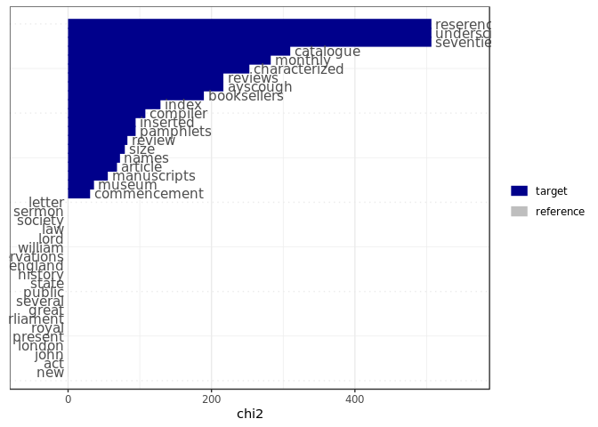

    ## 
    ## Community: 22


    ## 
    ## Community: 23

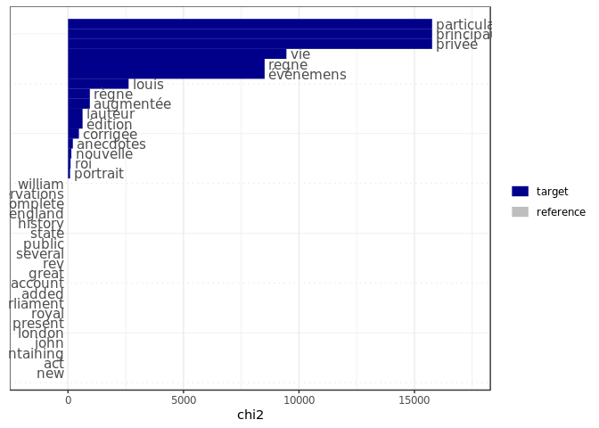

    ## 
    ## Community: 24


    ## 
    ## Community: 25


    ## 
    ## Community: 26


    ## 
    ## Community: 27

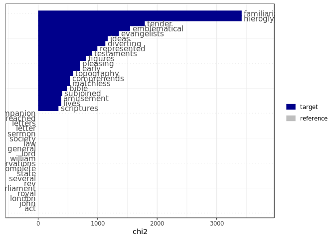

    ## 
    ## Community: 28


    ## 
    ## Community: 29

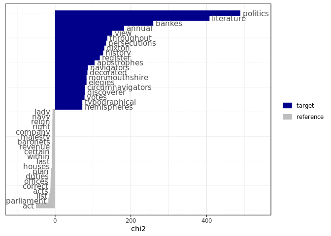

    ## 
    ## Community: 30

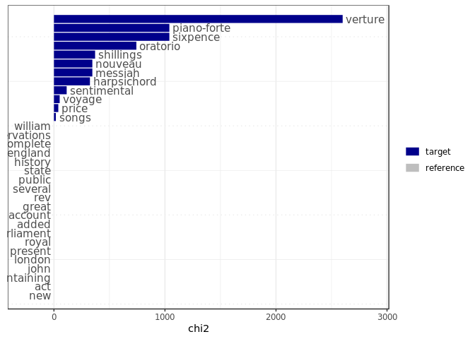

    ## 
    ##  1786-1795 
    ## 
    ## 25 top features/tokens
    ## $Community_1
    ##        rev       john     wesley     thomas    extract     sermon   preached 
    ##         31         24         20         10          8          8          8 
    ##      death    account    letters    journal      cokes     letter    remarks 
    ##          8          7          7          7          6          6          6 
    ## methodists       coke        new     london     christ     kempis    america 
    ##          6          5          5          5          4          4          4 
    ##  discourse  city-road      parts containing 
    ##          4          4          4          4 
    ## 
    ## $Community_10
    ## introduction      edition          new         plan  revolutions         john 
    ##            6            5            4            4            4            3 
    ##      account     together     compiled   collection         time         easy 
    ##            3            3            3            3            3            3 
    ##     improved     designed     arranged      speaker      reading      lessons 
    ##            3            3            3            3            3            3 
    ##    publisher  destruction       christ         life       robert      william 
    ##            3            3            2            2            2            2 
    ##   containing 
    ##            2 
    ## 
    ## $Community_11
    ##         witches           state     interesting         history         majesty 
    ##               2               1               1               1               1 
    ##      providence          series      discovered          divine    entertaining 
    ##               1               1               1               1               1 
    ##      mysterious    confirmation          angels         macleod         visions 
    ##               1               1               1               1               1 
    ##        macleods        darkness      tremendous     apparitions          augens 
    ##               1               1               1               1               1 
    ##       magicians          dreams     revelations superintendency          agency 
    ##               1               1               1               1               1 
    ## 
    ## $Community_12
    ##          ship          time        tables corresponding           sun 
    ##             6             5             5             5             5 
    ##          moon    inspection    directions      distance     margettss 
    ##             5             4             4             4             4 
    ##          true    navigation       channel         stars        horary 
    ##             3             3             3             3             3 
    ##       english           new       general         taken        useful 
    ##             2             2             2             2             2 
    ##       remarks         found       sailing       shewing         ships 
    ##             2             2             2             2             2 
    ## 
    ## $Community_13
    ##          new   containing         john        royal      history          rev 
    ##          495          442          405          332          331          323 
    ##       london        added       sermon       french      account      present 
    ##          314          291          285          277          270          270 
    ##        great     preached      general      william observations       church 
    ##          268          265          260          252          243          229 
    ##      several      england       thomas      english       letter       public 
    ##          219          218          217          206          200          198 
    ##         life 
    ##          196 
    ## 
    ## $Community_14
    ##         john      present   containing          new        house      general 
    ##          268          265          254          252          237          233 
    ##       letter observations   parliament        state        royal        great 
    ##          232          225          220          212          204          202 
    ##      account       public        added      william       london      england 
    ##          195          193          190          188          184          184 
    ##        right       french      history         list       france      commons 
    ##          167          166          161          158          156          154 
    ##          rev 
    ##          149 
    ## 
    ## $Community_15
    ##        several          plain            use   mathematical         scales 
    ##              2              2              2              2              2 
    ##      lightning       meredith            rev           life     instrument 
    ##              2              2              1              1              1 
    ##         sermon       preached          death         robert    explanation 
    ##              1              1              1              1              1 
    ##    description     containing       familiar       together considerations 
    ##              1              1              1              1              1 
    ##         joseph   particularly           york          cases          royal 
    ##              1              1              1              1              1 
    ## 
    ## $Community_16
    ##    history     sunday repository      cheap        new      young    reading 
    ##         44         22         22         21         17         16         16 
    ##      added   children       true      story        rev      great       good 
    ##         15         15         15         15         14         14         14 
    ##     little  amusement containing   designed       lady      moral     family 
    ##         14         14         13         13         13         12         11 
    ##       earl       john    william     letter 
    ##         11         10         10         10 
    ## 
    ## $Community_17
    ##       public          law      revenue      offices     complete   parliament 
    ##           28           28           28           28           26           23 
    ##        state      correct     baronets         list     scotland      england 
    ##           22           22           22           18           16           15 
    ##      ireland      america universities       houses          new       london 
    ##           15           14           14           13           11            9 
    ##    different    corrected        royal        peers        great        parts 
    ##            9            9            9            9            8            8 
    ##   containing 
    ##            8 
    ## 
    ## $Community_18
    ##      history        notes        l.l.d       joseph         time continuation 
    ##            2            1            1            1            1            1 
    ##      england      edition      present   historical     critical   revolution 
    ##            1            1            1            1            1            1 
    ##       andrew       kippis   prospectus     proposal        humes   publishing 
    ##            1            1            1            1            1            1 
    ##       towers       superb      extract   christians      pattern     treatise 
    ##            1            1            0            0            0            0 
    ##    imitation 
    ##            0 
    ## 
    ## $Community_19
    ##        rev       john     sermon        new   preached      added    william 
    ##        270        222        185        181        173        169        165 
    ## containing     church     chapel     letter    general     london     thomas 
    ##        144        134        129        129        118        116        110 
    ##       life    account      death     christ    letters      great    address 
    ##        109        105        105         98         97         90         89 
    ##   minister     gospel    remarks    england 
    ##         88         83         83         83 
    ## 
    ## $Community_2
    ##         new     jamaica        john        west      charts  navigation 
    ##          10           5           4           4           4           4 
    ##         bay     islands     shewing    currents   necessary     seamans 
    ##           4           4           4           4           4           4 
    ##     keeping mathematics       whole     journal  directions        cuba 
    ##           4           4           3           3           3           3 
    ##       pilot      coasts  hispaniola     courses   distances      master 
    ##           3           3           3           3           3           3 
    ##    mariners 
    ##           3 
    ## 
    ## $Community_20
    ##          acts           law           new       persons         parts 
    ##             3             2             1             1             1 
    ##    containing       serious      children     companion          four 
    ##             1             1             1             1             1 
    ##     inscribed        sketch      abstract      selected     performed 
    ##             1             1             1             1             1 
    ## covent-garden        courts    parliament      prefixed         kings 
    ##             1             1             1             1             1 
    ##    exhibiting   interesting       present       servant         essay 
    ##             1             1             1             1             1 
    ## 
    ## $Community_21
    ##         boxing     containing     collection      religious       selected 
    ##              4              3              3              3              3 
    ##          trade       festival        account        general          whole 
    ##              3              3              2              2              2 
    ##          poems          added      addressed           time           book 
    ##              2              2              2              2              2 
    ##       complete         master           easy         method accomplishment 
    ##              2              2              2              2              2 
    ##     honourable        eminent         modern        present      according 
    ##              2              2              2              2              2 
    ## 
    ## $Community_22
    ##     sermon   preached     eighth       view    general    manners   reverend 
    ##          1          1          1          1          1          1          1 
    ##    william     sunday    society    charity   princess     george   progress 
    ##          1          1          1          1          1          1          1 
    ##     period    history    benefit    thomson    century   lectures       poor 
    ##          1          1          1          1          1          1          1 
    ## chelmsford      essex     school      given 
    ##          1          1          1          1 
    ## 
    ## $Community_23
    ##        david       psalms          new      version        brady         tate 
    ##            5            5            4            4            4            4 
    ##     churches         used        tunes     chaplain      majesty     ordinary 
    ##            3            3            2            2            2            2 
    ##        glass       fitted poet-laureat      account        order      pointed 
    ##            2            2            2            1            1            1 
    ##      several   containing      society      british      remarks      morning 
    ##            1            1            1            1            1            1 
    ##        daily 
    ##            1 
    ## 
    ## $Community_24
    ##       trial        earl        john     several   anecdotes    adultery 
    ##           3           3           2           2           2           2 
    ##      wilmot      police       paris   september    lodgings depositions 
    ##           2           2           2           2           2           2 
    ##   including     summary       whole      others  containing       court 
    ##           1           1           1           1           1           1 
    ##       years   described         sir    pleasure  metropolis     curious 
    ##           1           1           1           1           1           1 
    ## illustrated 
    ##           1 
    ## 
    ## $Community_25
    ##          new   containing        added         john        royal observations 
    ##           62           59           53           47           46           44 
    ##      william       london       french      general         life        great 
    ##           41           39           38           37           34           34 
    ##      english      account      present          rev       letter       thomas 
    ##           33           33           32           31           30           29 
    ##      several        james   parliament        court          law      history 
    ##           29           29           28           27           27           27 
    ##     original 
    ##           26 
    ## 
    ## $Community_26
    ##        new containing    history       john collection      whole     london 
    ##        260        181        135        110        110        104        102 
    ##        rev      added      novel   complete    account     sermon      songs 
    ##         97         94         94         87         77         72         71 
    ##    letters       life       view   preached      royal    english    society 
    ##         68         67         67         66         61         60         59 
    ##  companion      great      every    england 
    ##         59         58         58         58 
    ## 
    ## $Community_27
    ##     panorama         view     original       french         life       london 
    ##            4            3            3            3            2            2 
    ##      subject        every   containing       public       cities    middlesex 
    ##            2            2            2            2            2            2 
    ##       square  westminster       german thanksgiving respectfully     sympathy 
    ##            2            2            2            2            2            2 
    ##     painting        souls       glance     informed       thomas      english 
    ##            2            2            2            2            1            1 
    ##          a.m 
    ##            1 
    ## 
    ## $Community_28
    ##       persons      preached        london         order illustrations 
    ##             2             1             1             1             1 
    ##     different        events      minister       several     collected 
    ##             1             1             1             1             1 
    ##         henry       remarks        advice      subjects    respective 
    ##             1             1             1             1             1 
    ##        places         north       various       britain     anecdotes 
    ##             1             1             1             1             1 
    ##      formerly         essay      relating         south        hunter 
    ##             1             1             1             1             1 
    ## 
    ## $Community_29
    ##      clergy      sermon      london    preached      church   cathedral 
    ##          30          26          26          25          23          22 
    ##        sons        paul    thursday     meeting anniversary     society 
    ##          20          20          20          20          20          19 
    ##   knowledge   promoting   christian        lord     schools         rev 
    ##          18          18          17          14          12          11 
    ##      bishop       added    chaplain       lists     account    reverend 
    ##          11          11          11          11          10          10 
    ##     several 
    ##          10 
    ## 
    ## $Community_3
    ##       dibdin    addressed   collection        songs      society        royal 
    ##            6            3            3            3            2            2 
    ##     selected        works     composed   highnesses       prince preservative 
    ##            2            2            2            2            2            2 
    ##       county     interest       thomas          rev      account        great 
    ##            2            2            1            1            1            1 
    ##        death   particular      persons  descriptive          god       honour 
    ##            1            1            1            1            1            1 
    ##       letter 
    ##            1 
    ## 
    ## $Community_30
    ##       papers     original       county   historical     relating   gloucester 
    ##            2            2            2            2            2            2 
    ##       davids  collections genealogical        ralph   monumental      bigland 
    ##            2            2            2            2            2            2 
    ##          rev       sermon     preached       robert       bishop       london 
    ##            1            1            1            1            1            1 
    ##    different       gospel   containing     pastoral       chapel        poems 
    ##            1            1            1            1            1            1 
    ##      serious 
    ##            1 
    ## 
    ## $Community_31
    ##     almanack          new         lord       psalms        david      version 
    ##           70           46           46           31           26           25 
    ##        brady         tate   bissextile   containing        diary        atlas 
    ##           25           25           23           21           21           20 
    ##    leap-year         john          god     churches       london      england 
    ##           20           15           15           13           12           12 
    ##         kind  particulars entertaining        tunes     chaplain         used 
    ##           12           12           12           11           11           11 
    ##      majesty 
    ##           11 
    ## 
    ## $Community_32
    ##   containing         john       letter          new        added         lord 
    ##          253          244          233          221          186          185 
    ##       thomas       london       french      present      account          rev 
    ##          178          164          157          156          151          144 
    ##      general        royal      history        great observations       france 
    ##          139          137          129          127          125          125 
    ##      society       people        right      england         king         life 
    ##          120          117          114          111          110          107 
    ##      address 
    ##          105 
    ## 
    ## $Community_33
    ## containing        new     london      royal     public   complete      state 
    ##        110         72         66         66         64         63         56 
    ##    history      added    correct  performed    various        law    account 
    ##         53         52         51         51         50         50         49 
    ## parliament    offices    revenue    johnson      great       john    england 
    ##         49         47         46         45         42         41         41 
    ##  shakspere       lord        sam    letters 
    ##         40         37         37         36 
    ## 
    ## $Community_34
    ##      several      british     original      various     journals        moore 
    ##            2            2            2            2            1            1 
    ##          new      william      society        poems         mark        added 
    ##            1            1            1            1            1            1 
    ##         true       fellow          age      variety   adventures    principal 
    ##            1            1            1            1            1            1 
    ##          old      england descriptions         navy     selected       edward 
    ##            1            1            1            1            1            1 
    ##        guide 
    ##            1 
    ## 
    ## $Community_4
    ##          new       plates   containing      sailing        pilot        place 
    ##           11            5            4            4            4            4 
    ##      bowless instructions      captain        whole      several      variety 
    ##            4            4            4            3            3            3 
    ##   directions     enlarged     windward      drawing         gulf        ocean 
    ##            3            3            3            3            3            3 
    ##        hands       copper         john      account        great        notes 
    ##            3            3            2            2            2            2 
    ##       bishop 
    ##            2 
    ## 
    ## $Community_5
    ##        new    masters   relative   adultery    several      added   original 
    ##          3          3          3          3          2          2          2 
    ##       city      table  anecdotes    doctors    francis   newsmans    present 
    ##          2          2          2          2          2          2          2 
    ##     worthy mistresses   entrance      rybot       wife   sheridan        gel 
    ##          2          2          2          2          2          2          2 
    ##      conte   treatise    english    account 
    ##          2          1          1          1 
    ## 
    ## $Community_6
    ##       duty christians        god    serious        set meditation    briefly 
    ##          5          2          2          2          2          2          2 
    ##      forth    nothing       wish      heart      clean       soul      fight 
    ##          2          2          2          2          2          1          1 
    ##      sight        die      happy       ever     secure   blessing performing 
    ##          1          1          1          1          1          1          1 
    ## assistance      grace  neighbour    extract 
    ##          1          1          1          0 
    ## 
    ## $Community_7
    ##        act     county    majesty    certain    present parliament      reign 
    ##       1455        463        409        354        344        269        250 
    ##      great     within        law     duties   majestys     making     parish 
    ##        235        225        215        214        208        207        205 
    ##       time       town        new    several    britain       acts       king 
    ##        204        196        193        189        177        163        153 
    ##      canal  intituled   granting      royal 
    ##        149        149        146        145 
    ## 
    ## $Community_8
    ##    composed         act       music       olive         rev       royal 
    ##           4           3           3           3           2           2 
    ##  dispensary    performd    burletta      circus        sion      thomas 
    ##           2           2           2           2           2           1 
    ##     english        life         new   collected    children    compiled 
    ##           1           1           1           1           1           1 
    ##   corrected    churches      called      advice inhabitants       black 
    ##           1           1           1           1           1           1 
    ##        name 
    ##           1 
    ## 
    ## $Community_9
    ##        six     indian    english      notes        age      james      songs 
    ##          2          2          1          1          1          1          1 
    ## permission   american    founded      right honourable     nature  dedicated 
    ##          1          1          1          1          1          1          1 
    ##     humbly       acts      maria       pitt      opera       play    virtues 
    ##          1          1          1          1          1          1          1 
    ##   countess      bacon    italian     cantos 
    ##          1          1          1          1 
    ## 
    ## 
    ## Community: 1

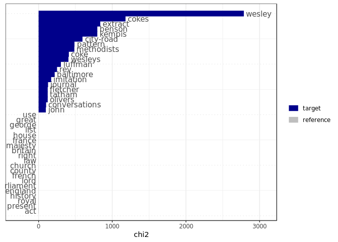

    ## 
    ## Community: 2


    ## 
    ## Community: 3

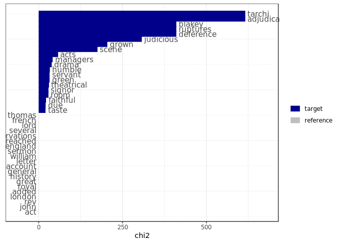

    ## 
    ## Community: 4

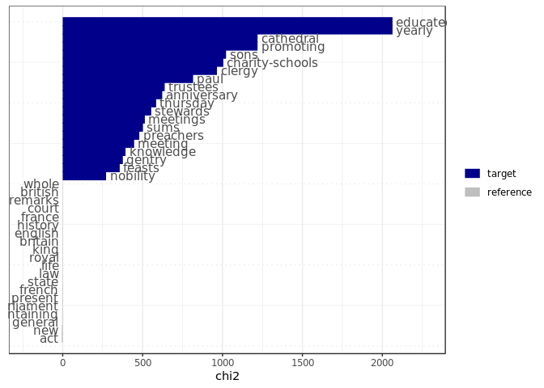

    ## 
    ## Community: 5

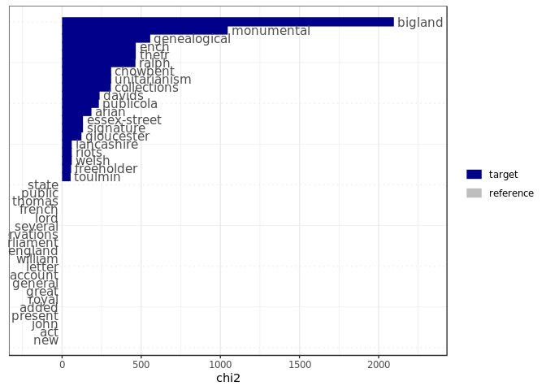

    ## 
    ## Community: 6

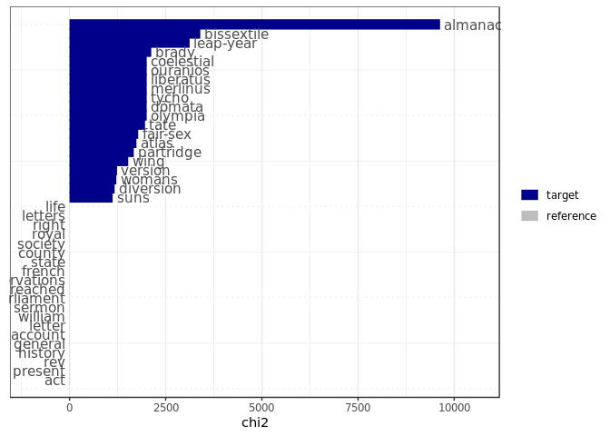

    ## 
    ## Community: 7

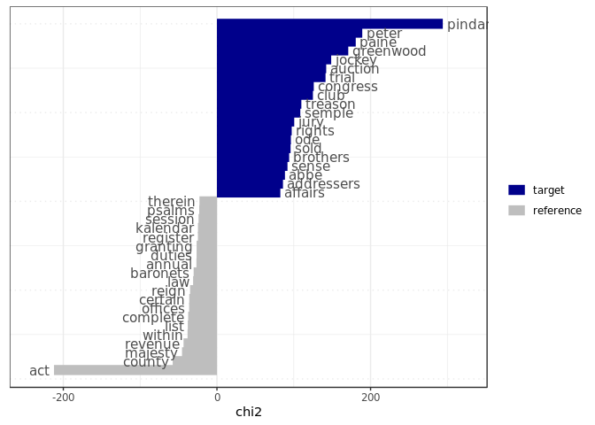

    ## 
    ## Community: 8


    ## 
    ## Community: 9


    ## 
    ## Community: 10


    ## 
    ## Community: 11


    ## 
    ## Community: 12


    ## 
    ## Community: 13


    ## 
    ## Community: 14


    ## 
    ## Community: 15


    ## 
    ## Community: 16


    ## 
    ## Community: 17

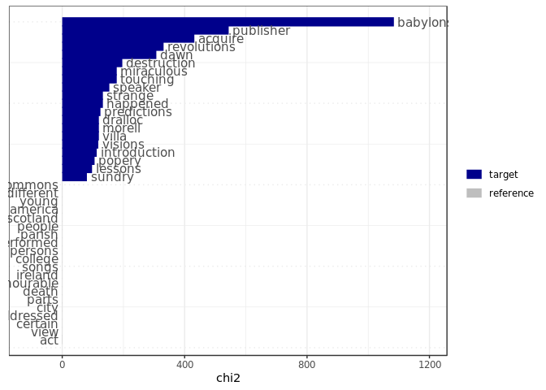

    ## 
    ## Community: 18


    ## 
    ## Community: 19

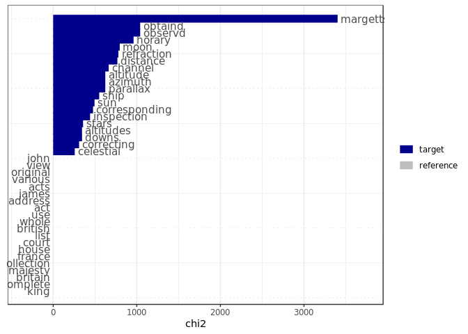

    ## 
    ## Community: 20


    ## 
    ## Community: 21


    ## 
    ## Community: 22


    ## 
    ## Community: 23

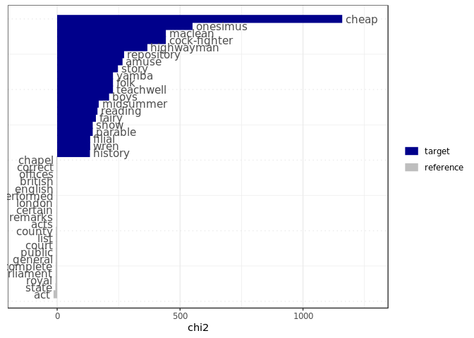

    ## 
    ## Community: 24


    ## 
    ## Community: 25


    ## 
    ## Community: 26


    ## 
    ## Community: 27

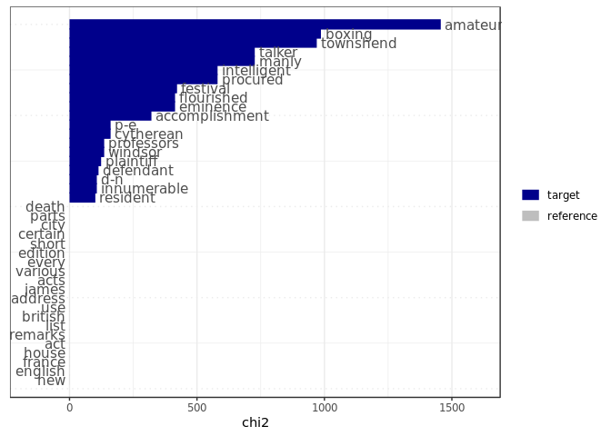

    ## 
    ## Community: 28

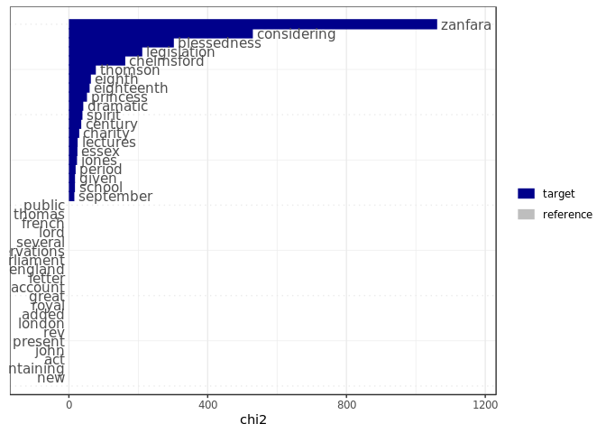

    ## 
    ## Community: 29


    ## 
    ## Community: 30

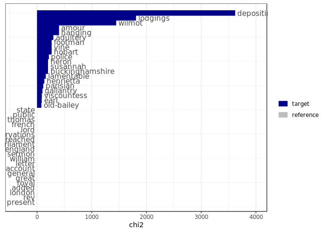

    ## 
    ## Community: 31


    ## 
    ## Community: 32

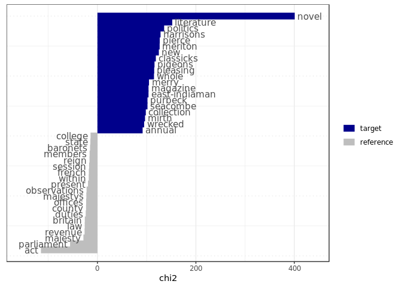

    ## 
    ## Community: 33

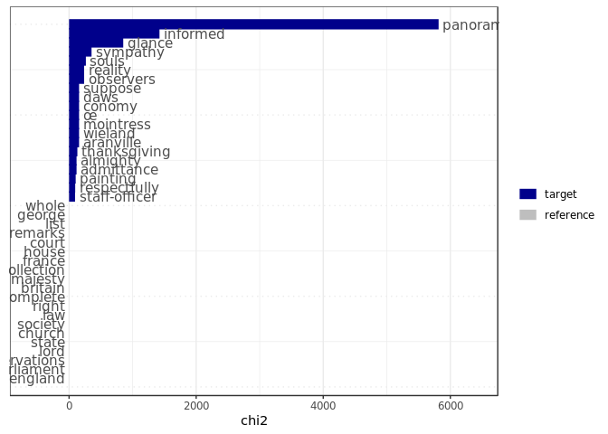

    ## 
    ## Community: 34


    ## 
    ##  1791-1800 
    ## 
    ## 25 top features/tokens
    ## $Community_1
    ##        new        rev       john containing     sermon     london   preached 
    ##        306        271        240        222        185        162        157 
    ##    william     thomas      added       life    general    account      novel 
    ##        156        153        143        142        137        134        125 
    ##    letters    history     letter   minister collection     church     french 
    ##        118        117        110        107        105        105        102 
    ##    england      death     chapel    society 
    ##        101         98         98         94 
    ## 
    ## $Community_10
    ##     musical     science         use      chapel       march        john 
    ##           2           2           1           1           1           1 
    ##  containing     english      nature explanation    complete       essay 
    ##           1           1           1           1           1           1 
    ##   performed  dictionary       words     authors    majestys      german 
    ##           1           1           1           1           1           1 
    ##        full       music     theatre       royal    augustus     stephen 
    ##           1           1           1           1           1           1 
    ##     harmony 
    ##           1 
    ## 
    ## $Community_11
    ##          law         laws     complete    including          new        every 
    ##           14           11            9            7            6            6 
    ##   respecting       europe   parliament instructions      library        ample 
    ##            6            5            5            5            5            5 
    ##          use      william   containing      letters        whole      history 
    ##            4            4            4            4            4            4 
    ##      england      country    gentlemen       temple       houses  illustrated 
    ##            4            4            4            4            4            4 
    ##    practical 
    ##            4 
    ## 
    ## $Community_12
    ##          use      several       nature        plain     meredith mathematical 
    ##            2            2            2            2            2            2 
    ##       scales         life        death     departed particularly          rev 
    ##            2            1            1            1            1            1 
    ##       sermon     preached       christ       joseph   containing     subjects 
    ##            1            1            1            1            1            1 
    ##   instrument       robert  explanation    prophetic  description     familiar 
    ##            1            1            1            1            1            1 
    ##     together 
    ##            1 
    ## 
    ## $Community_13
    ##    lauteur       pere  opuscules  poëtiques    lépitre      short    account 
    ##          1          1          1          1          1          0          0 
    ##       life      death       miss      alice    gilbert   daughter  nathaniel 
    ##          0          0          0          0          0          0          0 
    ##     island    antigua       died     august nineteenth        age       jane 
    ##          0          0          0          0          0          0          0 
    ##    newland     dublin   departed    october 
    ##          0          0          0          0 
    ## 
    ## $Community_14
    ##      europe       order      france    contains  revolution     conduct 
    ##           2           2           2           2           2           2 
    ##  sovereigns           ⁰      letter     address     summary   different 
    ##           2           2           1           1           1           1 
    ##       parts      sketch  remarkable   political     annexed       since 
    ##           1           1           1           1           1           1 
    ##  principles      appeal    morality       table    military   merchants 
    ##           1           1           1           1           1           1 
    ## proprietors 
    ##           1 
    ## 
    ## $Community_15
    ##   containing          new         john       letter        royal       french 
    ##          263          254          213          198          195          183 
    ##        added      general      account      present       thomas       london 
    ##          178          176          169          165          160          155 
    ##      history         lord        great         acts         life observations 
    ##          152          138          138          138          130          128 
    ##    performed      william      english      british      england       german 
    ##          127          124          123          119          119          113 
    ##      theatre 
    ##          112 
    ## 
    ## $Community_16
    ##      history       joseph        l.l.d continuation        notes         time 
    ##            2            1            1            1            1            1 
    ##      england      present      edition   revolution   historical     critical 
    ##            1            1            1            1            1            1 
    ##       andrew       superb        humes   prospectus   publishing       kippis 
    ##            1            1            1            1            1            1 
    ##       towers     proposal        short      account         life        death 
    ##            1            1            0            0            0            0 
    ##         miss 
    ##            0 
    ## 
    ## $Community_17
    ##   directions         ship   navigation      channel      english          new 
    ##            4            4            3            3            2            2 
    ##      remarks  improvement      weather       anchor        clear        ships 
    ##            2            2            2            2            2            2 
    ##      sailing     managing        downs      william         know     treatise 
    ##            2            2            2            1            1            1 
    ##      general    including observations   particular       useful        every 
    ##            1            1            1            1            1            1 
    ##  description 
    ##            1 
    ## 
    ## $Community_18
    ##        easy       every       added       tunes        airs   preceptor 
    ##           3           2           2           2           2           2 
    ##   selection       duets    favorite    rendered        song     playing 
    ##           2           2           2           2           2           2 
    ##       flute       wragg        oboe  instrument       whole     elegant 
    ##           2           2           2           1           1           1 
    ##      manner    relative      german instruction      method   acquiring 
    ##           1           1           1           1           1           1 
    ##    valuable 
    ##           1 
    ## 
    ## $Community_19
    ##         derry          city    collection        member        papers 
    ##             3             2             2             2             2 
    ##      relative         royal    revolution  illustrative         roman 
    ##             2             2             2             2             2 
    ##         siege      derriana m.dc.lxxxviii        dublin       ireland 
    ##             2             2             2             1             1 
    ##       william        london   protestants           rev          john 
    ##             1             1             1             1             1 
    ##        sermon      preached     appointed          fast       general 
    ##             1             1             1             1             1 
    ## 
    ## $Community_2
    ##        death     daughter         lord     together     children      remarks 
    ##            1            1            1            1            1            1 
    ##      british          end        moral       french     american    political 
    ##            1            1            1            1            1            1 
    ##      present      memoirs         lady    anecdotes    dedicated          war 
    ##            1            1            1            1            1            1 
    ##        major interspersed     virtuous       ballad       nation      gallant 
    ##            1            1            1            1            1            1 
    ##   lamentable 
    ##            1 
    ## 
    ## $Community_20
    ##    account        rev      earth      young      death  discourse     chapel 
    ##          3          3          3          3          2          2          2 
    ##     sermon       king    richard     called   inserted       sung       hymn 
    ##          2          2          2          2          2          2          2 
    ## productive vegetation     medley     papacy      short       life   departed 
    ##          2          2          2          2          1          1          1 
    ##        use     people     clarke     letter 
    ##          1          1          1          1 
    ## 
    ## $Community_21
    ##          john     performed covent-garden theatre-royal          acts 
    ##            73            71            65            59            58 
    ##           new        letter    containing       account       present 
    ##            56            43            39            34            34 
    ##        comedy        thomas        french         royal        london 
    ##            34            32            32            32            31 
    ##         added       english       general       society          life 
    ##            31            29            28            28            26 
    ##       william           rev          five       theatre         songs 
    ##            26            26            26            26            25 
    ## 
    ## $Community_22
    ##        rev     charge     davids    october  addressed  gentleman     sermon 
    ##          5          2          2          1          1          1          1 
    ##  wednesday     joseph     thomas containing    reasons     stated    address 
    ##          1          1          1          1          1          1          1 
    ##      james     robert     bishop  different   pastoral    serious  christian 
    ##          1          1          1          1          1          1          1 
    ##    diocese   appendix   occasion      poems 
    ##          1          1          1          1 
    ## 
    ## $Community_23
    ##   containing      history          old         gray        robin        jemmy 
    ##            7            7            6            6            6            6 
    ##      account        death          new        songs   collection        great 
    ##            5            5            5            5            4            4 
    ##        added       jennys entertaining         love      mystery      parents 
    ##            4            4            3            3            3            3 
    ##      ancient        seven        roman        jenny         miss       london 
    ##            3            3            3            3            2            2 
    ##       sermon 
    ##            2 
    ## 
    ## $Community_24
    ##        act    majesty    present    certain     county parliament      reign 
    ##       1892        629        468        462        424        376        312 
    ##       june     duties      great    hundred   thousand     making       time 
    ##        291        289        285        280        270        242        240 
    ##    session   majestys    several    britain        law  intituled   granting 
    ##        240        236        234        228        215        212        209 
    ##       john        new     passed       acts 
    ##        203        202        200        197 
    ## 
    ## $Community_25
    ##       trial        earl        john     several   anecdotes       paris 
    ##           3           3           2           2           2           2 
    ##   september      police    adultery    lodgings      wilmot depositions 
    ##           2           2           2           2           2           2 
    ##    daughter  containing      others       years   including     summary 
    ##           1           1           1           1           1           1 
    ##       whole         m.p     history       essay     curious     memoirs 
    ##           1           1           1           1           1           1 
    ##        lady 
    ##           1 
    ## 
    ## $Community_26
    ##      society       london          new       sermon     preached          rev 
    ##          129           93           93           90           89           87 
    ##         john      william      general       church        royal observations 
    ##           77           72           72           70           69           66 
    ##   containing      account        great        added          law         lord 
    ##           64           63           62           61           59           57 
    ##       public       bishop       clergy      britain   parliament       french 
    ##           55           52           51           51           50           48 
    ##       george 
    ##           45 
    ## 
    ## $Community_27
    ##          new   containing         john      history       london          rev 
    ##          597          478          430          387          345          330 
    ##        royal       french      general        added      account      william 
    ##          318          311          307          301          282          280 
    ##        great observations      present       sermon      society       thomas 
    ##          262          262          258          226          222          220 
    ##      england       public      english     preached         life     complete 
    ##          213          211          210          205          192          192 
    ##          use 
    ##          183 
    ## 
    ## $Community_28
    ##    indian       age    nature     james     notes       six  american      acts 
    ##         2         1         1         1         1         1         1         1 
    ##    satire      play    cantos      pitt   founded   virtues     bacon     short 
    ##         1         1         1         1         1         1         1         0 
    ##   account      life     death      miss     alice   gilbert  daughter nathaniel 
    ##         0         0         0         0         0         0         0         0 
    ##    island 
    ##         0 
    ## 
    ## $Community_29
    ##  parliament  containing        acts interesting   principal       essay 
    ##           4           3           3           2           2           2 
    ##    faithful  remarkable     present         war         law      humble 
    ##           2           2           2           2           2           2 
    ##      market   following    articles    butchers   wholesale   religious 
    ##           2           2           2           2           2           1 
    ##      letter   gentleman      london     servant        four   including 
    ##           1           1           1           1           1           1 
    ##      europe 
    ##           1 
    ## 
    ## $Community_3
    ##     church      added principles     sunday        rev   minister   religion 
    ##          5          4          4          3          3          3          3 
    ##  christian       love     french     humbly  addressed     chapel containing 
    ##          3          3          3          2          2          2          2 
    ##      great    subject     pieces   pastoral       king   entitled     george 
    ##          2          2          2          2          2          2          2 
    ##    richard       work   chaplain      world 
    ##          2          2          2          2 
    ## 
    ## $Community_30
    ##     almanack         lord          new   bissextile       psalms   containing 
    ##           77           49           45           27           26           24 
    ##    leap-year      version        david        brady         tate       tables 
    ##           24           23           23           23           23           22 
    ##        diary        atlas          god         john      correct      england 
    ##           20           20           18           16           16           15 
    ##   remarkable        table         suns      planets     eclipses    ephemeris 
    ##           15           15           15           14           14           13 
    ## entertaining 
    ##           12 
    ## 
    ## $Community_31
    ##         new       pilot     sailing  directions    original       north 
    ##          28          10          10           9           8           8 
    ##     surveys perspective     drawing     variety     captain     edition 
    ##           8           8           8           7           7           7 
    ##      charts    painting        cape     england       coast     florida 
    ##           7           7           7           6           6           6 
    ##        john  containing     general       james       great  particular 
    ##           5           5           5           5           5           5 
    ##       whole 
    ##           5 
    ## 
    ## $Community_32
    ## considered        m.a    applied     sermon   preached    earnest    request 
    ##          1          1          1          1          1          1          1 
    ##  ministers        new  testament    lecture       word     joshua   thursday 
    ##          1          1          1          1          1          1          1 
    ##    mystery     exeter   assembly      bears    toulmin    meaning   mornings 
    ##          1          1          1          1          1          1          1 
    ##      short    account       life      death 
    ##          0          0          0          0 
    ## 
    ## $Community_33
    ##   preached     sermon     church honourable      right     london      mayor 
    ##         63         57         50         50         49         45         40 
    ##       lord       city        rev     sunday   chaplain    william       john 
    ##         39         38         34         33         32         31         28 
    ##     parish     thomas     common   aldermen   sheriffs    council     george 
    ##         28         23         23         23         21         20         18 
    ##      court     master  appointed    general 
    ##         18         17         16         16 
    ## 
    ## $Community_34
    ##        rev       john     sermon     church   preached      added        new 
    ##        209        161        151        115        113         83         78 
    ##     letter      great     thomas    william    address      death     chapel 
    ##         76         74         72         71         71         67         66 
    ##     london    general    account     french       life     sunday containing 
    ##         65         61         58         58         56         55         54 
    ##   minister     people    letters    britain 
    ##         53         52         52         52 
    ## 
    ## $Community_4
    ##    history     church   preached     sermon        rev        new       john 
    ##        162        150        137        135        124        121        120 
    ##     sunday     french    account containing    general       lord      added 
    ##        118        112         94         88         88         82         82 
    ##     france    william      great    present     letter    reading      right 
    ##         81         80         80         80         79         78         77 
    ##    england repository       view     london 
    ##         76         74         70         68 
    ## 
    ## $Community_5
    ##        rev      davis       sion    account       life      death     august 
    ##          2          2          2          1          1          1          1 
    ##        use      union     sunday       john     sermon   preached       name 
    ##          1          1          1          1          1          1          1 
    ##    english   original    borough occasioned        new  collected   children 
    ##          1          1          1          1          1          1          1 
    ##       true  corrected   churches     called 
    ##          1          1          1          1 
    ## 
    ## $Community_6
    ##      theatre        kings          new    catalogue        opera         sold 
    ##           51           34           28           25           24           23 
    ##      auction         john      present        music      english          old 
    ##           22           21           20           20           18           18 
    ##        comic  represented       parish       county    greenwood   collection 
    ##           18           18           17           17           17           15 
    ## observations       monday         copy       strand       lyceum    haymarket 
    ##           15           15           15           15           15           15 
    ##       humbly 
    ##           14 
    ## 
    ## $Community_7
    ##       french         john   containing          new      present       letter 
    ##          315          294          294          293          289          279 
    ##        right        great      general       london      william        house 
    ##          269          262          256          241          237          231 
    ##   parliament       public        state   honourable      britain observations 
    ##          216          215          214          213          208          207 
    ##        royal       france          rev      account      ireland        added 
    ##          205          203          202          194          194          192 
    ##      history 
    ##          185 
    ## 
    ## $Community_8
    ##                  louis                secrets               mémoires 
    ##                      1                      1                      1 
    ##                 servir              lhistoire                  règne 
    ##                      1                      1                      1 
    ##               dernière                  année bertrand-de-molleville 
    ##                      1                      1                      1 
    ##                  short                account                   life 
    ##                      0                      0                      0 
    ##                  death                   miss                  alice 
    ##                      0                      0                      0 
    ##                gilbert               daughter              nathaniel 
    ##                      0                      0                      0 
    ##                 island                antigua                   died 
    ##                      0                      0                      0 
    ##                 august             nineteenth                    age 
    ##                      0                      0                      0 
    ##                   jane 
    ##                      0 
    ## 
    ## $Community_9
    ##         witches    entertaining        darkness     interesting         majesty 
    ##               2               1               1               1               1 
    ##         history           state      discovered         macleod     revelations 
    ##               1               1               1               1               1 
    ##          series          divine     apparitions      providence      mysterious 
    ##               1               1               1               1               1 
    ##          dreams         visions          angels    confirmation         malcolm 
    ##               1               1               1               1               1 
    ##        macleods      tremendous          augens       magicians superintendency 
    ##               1               1               1               1               1 
    ## 
    ## 
    ## Community: 1

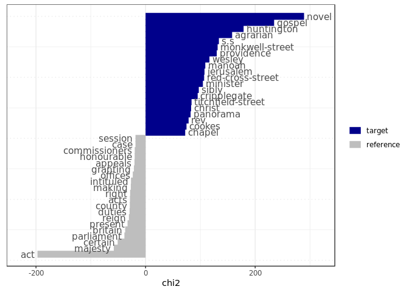

    ## 
    ## Community: 2

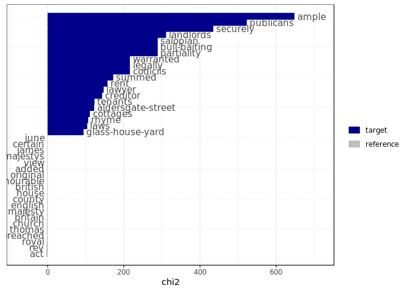

    ## 
    ## Community: 3

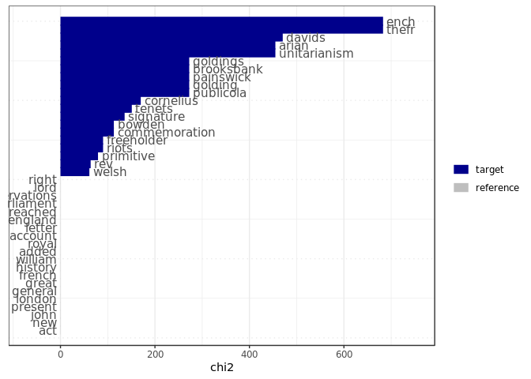

    ## 
    ## Community: 4


    ## 
    ## Community: 5


    ## 
    ## Community: 6

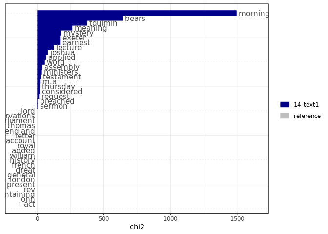

    ## 
    ## Community: 7

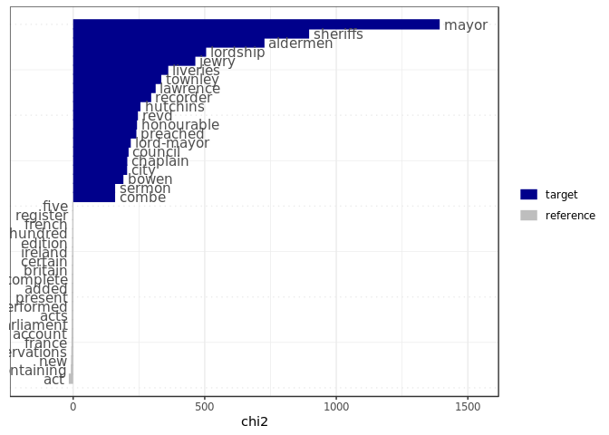

    ## 
    ## Community: 8


    ## 
    ## Community: 9


    ## 
    ## Community: 10

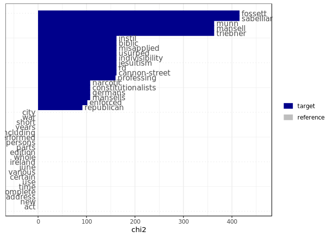

    ## 
    ## Community: 11


    ## 
    ## Community: 12

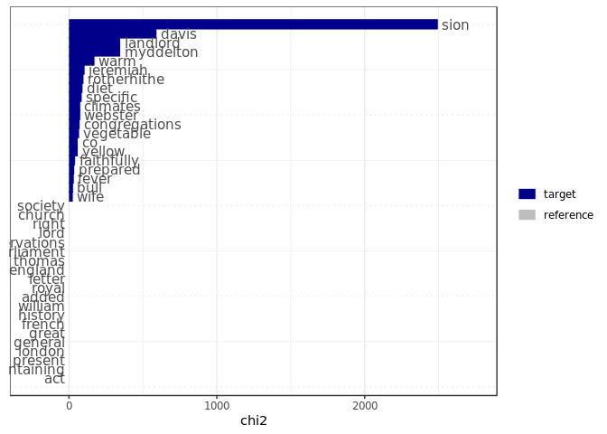

    ## 
    ## Community: 13


    ## 
    ## Community: 14

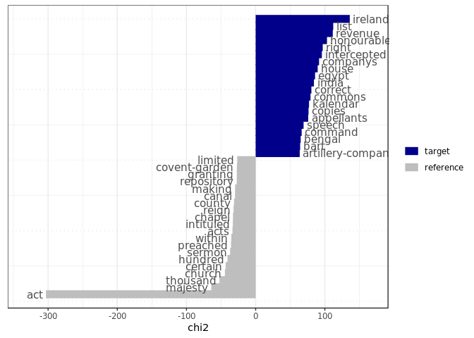

    ## 
    ## Community: 15

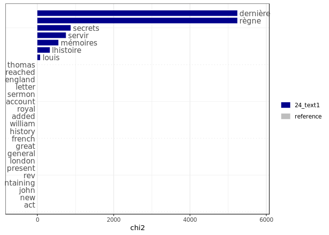

    ## 
    ## Community: 16


    ## 
    ## Community: 17


    ## 
    ## Community: 18

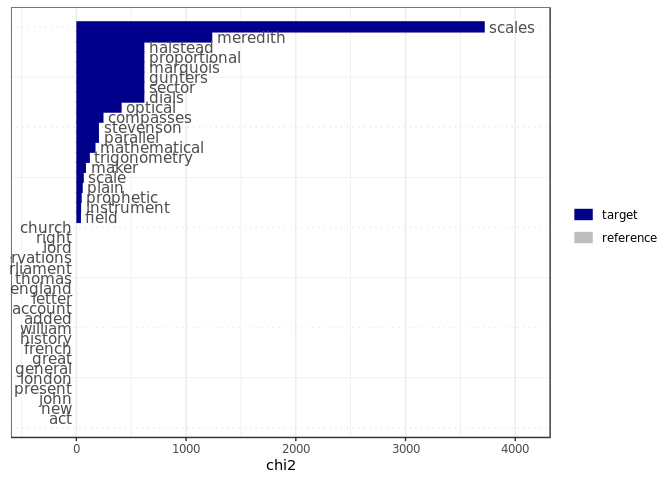

    ## 
    ## Community: 19


    ## 
    ## Community: 20


    ## 
    ## Community: 21


    ## 
    ## Community: 22


    ## 
    ## Community: 23

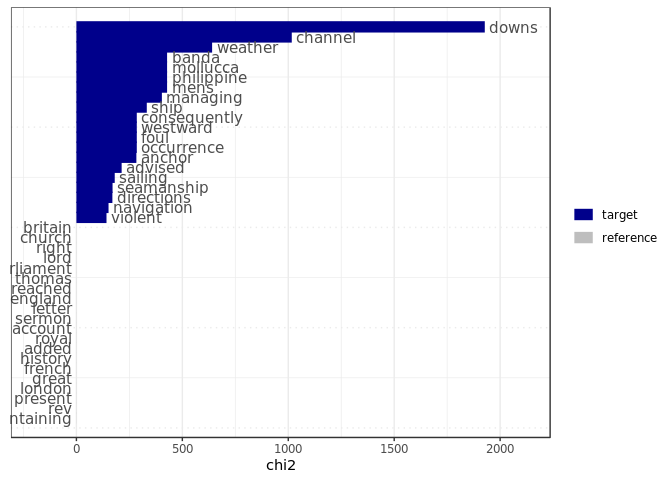

    ## 
    ## Community: 24


    ## 
    ## Community: 25

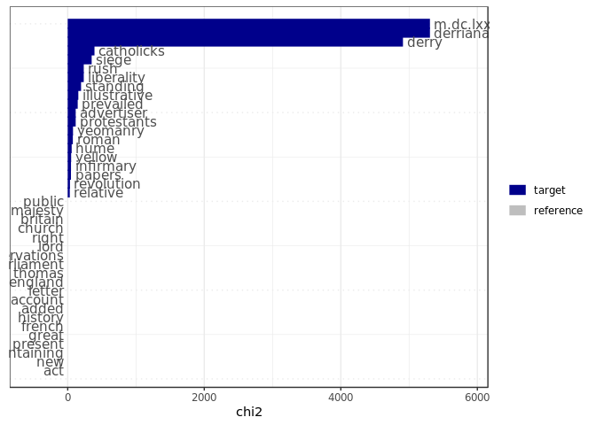

    ## 
    ## Community: 26

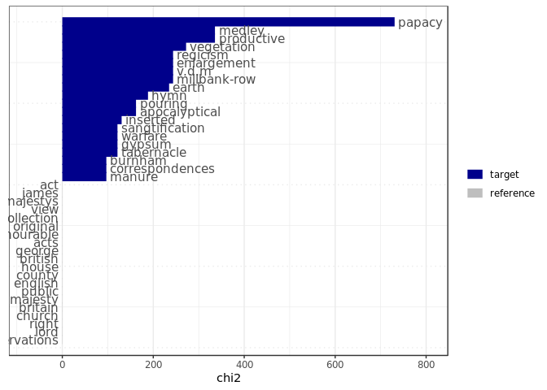

    ## 
    ## Community: 27


    ## 
    ## Community: 28

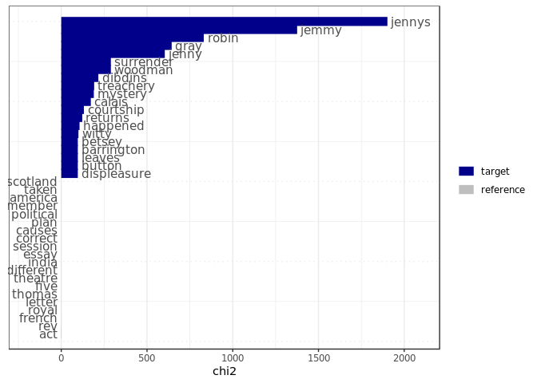

    ## 
    ## Community: 29

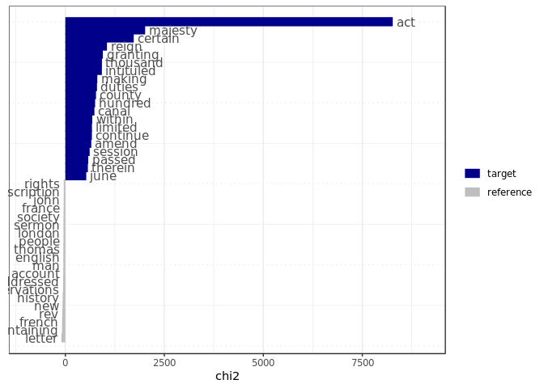

    ## 
    ## Community: 30


    ## 
    ## Community: 31

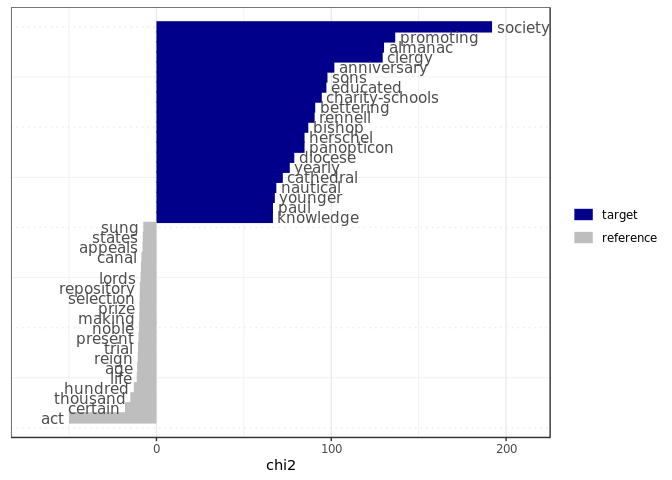

    ## 
    ## Community: 32

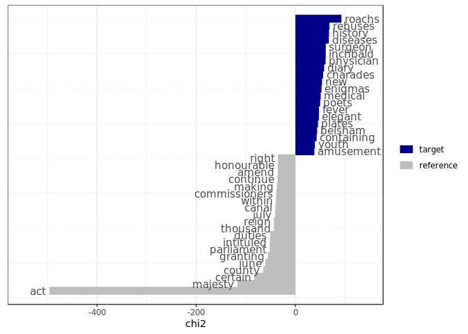

    ## 
    ## Community: 33

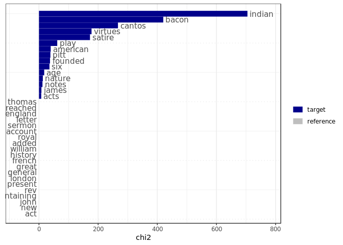

    ## 
    ## Community: 34


    ## 
    ##  1796-1805 
    ## 
    ## 25 top features/tokens
    ## $Community_1
    ##          new   containing      history         john       london       french 
    ##          308          269          231          229          184          182 
    ##        added        royal          rev      william      general observations 
    ##          173          162          159          158          154          152 
    ##      present      account      english      society         life        great 
    ##          143          139          136          130          125          125 
    ##       sermon       thomas       german        novel      england       public 
    ##          118          117          113          112          110          109 
    ##   collection 
    ##          109 
    ## 
    ## $Community_10
    ##       rev  catholic    church    letter     added     roman      pius      john 
    ##        28        22        17        15        13        13        13        12 
    ##    bishop   account      lord   sundays      holy   william      pope    sunday 
    ##        11         9         9         9         8         7         7         7 
    ##  holiness   letters  district     order  original directory      king   service 
    ##         7         6         6         5         5         5         5         5 
    ##    answer 
    ##         5 
    ## 
    ## $Community_11
    ##          rev       church       sermon         john     preached      society 
    ##          125          115          107          106          105           96 
    ##      account      general       french      william        added       london 
    ##           82           81           77           76           71           68 
    ##       letter          new      history      present        royal observations 
    ##           65           64           63           63           63           63 
    ##        great         lord        state        right      england       public 
    ##           62           59           59           58           58           55 
    ##   containing 
    ##           54 
    ## 
    ## $Community_12
    ##       musical        german   christopher     according      majestys 
    ##             2             1             1             1             1 
    ##        nature    principles      augustus       science         essay 
    ##             1             1             1             1             1 
    ##       authors      greatest        chapel      frederic       harmony 
    ##             1             1             1             1             1 
    ##        jamess      kollmann      organist  weinidogaeth   lwyddiannus 
    ##             1             1             1             0             0 
    ##           neu     ymddiddan      ynghylch effeithioldeb    llwyddiant 
    ##             0             0             0             0             0 
    ## 
    ## $Community_13
    ##      offices       public     complete      revenue          law      correct 
    ##           18           17           16           16           16           13 
    ##     baronets        state   parliament      england          rev       sermon 
    ##           13           12           12           11           10            9 
    ##      ireland         list     preached     scotland      america       london 
    ##            9            9            9            9            8            8 
    ##       houses universities          new        royal      william       church 
    ##            8            8            7            7            7            7 
    ##        peers 
    ##            7 
    ## 
    ## $Community_14
    ##       lauteur     opuscules     poëtiques       lépitre          pere 
    ##             1             1             1             1             1 
    ##  weinidogaeth   lwyddiannus           neu     ymddiddan      ynghylch 
    ##             0             0             0             0             0 
    ## effeithioldeb    llwyddiant      pregethu            ym        mhlith 
    ##             0             0             0             0             0 
    ##   cristnogion       wahanol        farnau         rhwng           dau 
    ##             0             0             0             0             0 
    ##      gymmydog           sef        calfin    anticalfin       defence 
    ##             0             0             0             0             0 
    ## 
    ## $Community_15
    ##        new      royal containing     french     german       acts       john 
    ##         98         96         94         89         88         86         83 
    ##      added    english    william       five    account    history        rev 
    ##         73         70         69         68         66         65         61 
    ##       life      great    theatre    general   original     london    present 
    ##         60         60         59         59         59         56         54 
    ##  performed   kotzebue      house       lord 
    ##         52         51         50         49 
    ## 
    ## $Community_16
    ##       kings   performed         new     theatre       music   haymarket 
    ##           4           3           3           3           3           3 
    ##        acts       opera       comic        arms        coal manufactory 
    ##           2           2           2           2           2           2 
    ##         due     gallery     hengler     present     musical       novel 
    ##           2           2           2           1           1           1 
    ##  mysterious     letters     various         act     general      models 
    ##           1           1           1           1           1           1 
    ## composition 
    ##           1 
    ## 
    ## $Community_17
    ##      france     conduct  revolution       order    contains      europe 
    ##           2           2           2           2           2           2 
    ##  sovereigns           ⁰      letter   political       parts     address 
    ##           2           2           1           1           1           1 
    ##      sketch  principles   different     annexed   beginning  remarkable 
    ##           1           1           1           1           1           1 
    ##    military legislative       since      social      crimes      bodies 
    ##           1           1           1           1           1           1 
    ##       table 
    ##           1 
    ## 
    ## $Community_18
    ##       general       chatham         court          held    lieutenant 
    ##             1             1             1             1             1 
    ##      regiment         march   proceedings       colonel    commandant 
    ##             1             1             1             1             1 
    ##       martial      barracks          ogle  weinidogaeth   lwyddiannus 
    ##             1             1             1             0             0 
    ##           neu     ymddiddan      ynghylch effeithioldeb    llwyddiant 
    ##             0             0             0             0             0 
    ##      pregethu            ym        mhlith   cristnogion       wahanol 
    ##             0             0             0             0             0 
    ## 
    ## $Community_19
    ##        rev       john     sermon    william     london        new containing 
    ##        131        113        108         94         88         80         73 
    ##   preached     church    present      added    society    general      great 
    ##         72         66         61         60         56         55         54 
    ##        age   minister    account     thomas    meeting     george     chapel 
    ##         53         51         50         50         48         47         47 
    ##     letter      every     people     french 
    ##         46         44         43         42 
    ## 
    ## $Community_2
    ##   containing          new      england observations       sketch         john 
    ##            7            6            6            5            5            4 
    ##       letter      account        right        state        parts        royal 
    ##            4            4            4            4            4            4 
    ##  description          act     critical        wales      measure       prints 
    ##            4            4            4            4            4            4 
    ##      curates       french      british  reflections      country    anecdotes 
    ##            4            3            3            3            3            3 
    ##         five 
    ##            3 
    ## 
    ## $Community_20
    ##    court      sir     bark   thomas  society  general   public     list 
    ##        6        4        4        3        3        3        3        3 
    ##   horses     duty    house    smith peruvian    bread    heath  travers 
    ##        3        3        3        3        3        3        3        3 
    ##  foreign  members   joseph november      act   proper deceased february 
    ##        2        2        2        2        2        2        2        2 
    ##  william 
    ##        2 
    ## 
    ## $Community_21
    ##        new     french      royal      great    history     german       john 
    ##         33         19         16         14         13         13         12 
    ##    english      music      cross      duets   designed      songs collection 
    ##         12         12         12         11         11         11         11 
    ##     monday  spectacle     circus    auction    account    present        rev 
    ##         11         11         11         11         10         10         10 
    ##  chorusses     called      added       time 
    ##         10         10         10         10 
    ## 
    ## $Community_22
    ##   preached        rev     sermon     church    william honourable       john 
    ##         18         16         16         13         10          8          7 
    ##       lord      right     thomas     sunday          `     bishop   chaplain 
    ##          7          7          7          7          6          6          6 
    ##     parish     french     letter       life     london  cathedral      bowen 
    ##          6          5          5          5          5          5          5 
    ##       city      great      added    general 
    ##          5          4          4          4 
    ## 
    ## $Community_23
    ##    medley      sung      hymn    people    france    letter anecdotes    friend 
    ##         2         2         2         1         1         1         1         1 
    ##       rev       new   germany     young     court   subject   remarks    result 
    ##         1         1         1         1         1         1         1         1 
    ## incidents       god    chapel   richard      foot     italy       law    joshua 
    ##         1         1         1         1         1         1         1         1 
    ##  farewell 
    ##         1 
    ## 
    ## $Community_24
    ##       death      sermon     william      gospel  occasioned       berks 
    ##           4           3           3           3           3           3 
    ##       bucks     wooburn   addressed        john reflections     english 
    ##           3           3           2           2           2           2 
    ##         rev    children    preached      christ      sunday     request 
    ##           2           2           2           2           2           2 
    ##       cooke  maidenhead        five        life      friend     letters 
    ##           2           2           1           1           1           1 
    ##     francis 
    ##           1 
    ## 
    ## $Community_25
    ##           act       majesty       present       certain    parliament 
    ##          1067           390           264           256           252 
    ##       hundred      thousand       session         reign        duties 
    ##           221           218           187           186           182 
    ##          july         great          june         right       britain 
    ##           176           165           158           148           144 
    ##        passed          john       several         court commissioners 
    ##           144           139           139           139           136 
    ##          time         march    honourable      granting      majestys 
    ##           135           134           133           128           127 
    ## 
    ## $Community_26
    ##         right    honourable        master         lords commissioners 
    ##            36            32            30            29            28 
    ##         prize         noble        causes       appeals        appeal 
    ##            27            27            26            25            24 
    ##          john         royal          case      original          list 
    ##            22            22            21            20            19 
    ##         ships    containing       correct          navy         added 
    ##            19            18            18            18            17 
    ##           pay           new       william       revenue      pensions 
    ##            16            15            15            14            14 
    ## 
    ## $Community_27
    ##      william      account observations     intended        court      friends 
    ##            6            5            5            5            5            5 
    ##         john      english       thomas         life      letters        added 
    ##            4            4            4            4            4            4 
    ##       london        young      remarks         city philadelphia     progress 
    ##            4            4            4            4            4            3 
    ##     selected        piety       christ        light   physicians       report 
    ##            3            3            3            3            3            3 
    ##      barclay 
    ##            3 
    ## 
    ## $Community_28
    ##      chemical       variety           use     astronomy    containing 
    ##             3             2             2             2             1 
    ##         means        george        thomas        essays           new 
    ##             1             1             1             1             1 
    ## entertainment    performing          full   description      improved 
    ##             1             1             1             1             1 
    ##       general         young          view   instruction          miss 
    ##             1             1             1             1             1 
    ##     practical       majesty    principles     chemistry      intended 
    ##             1             1             1             1             1 
    ## 
    ## $Community_29
    ##       lord        age       work     letter      right      years    william 
    ##          8          6          5          4          4          4          4 
    ##     french honourable        man      every        law     number     pounds 
    ##          3          3          3          3          3          3          3 
    ##    russell   agrarian     people       john    edition       acts   progress 
    ##          3          3          2          2          2          2          2 
    ##    english     thomas       four        new 
    ##          2          2          2          2 
    ## 
    ## $Community_3
    ##       france        royal        louis      navarre    françoise          roi 
    ##            2            2            2            2            2            2 
    ##        salut    monarchie    addressed       german      members          new 
    ##            2            2            1            1            1            1 
    ##        seven        great      william      britain   collection      meeting 
    ##            1            1            1            1            1            1 
    ##   parliament particularly         duke     military       manual      apology 
    ##            1            1            1            1            1            1 
    ##       little 
    ##            1 
    ## 
    ## $Community_30
    ##           new          cape         north       drawing   perspective 
    ##            19             7             6             6             6 
    ##      painting       sailing        charts       edition       variety 
    ##             6             6             6             5             5 
    ##    directions         coast         pilot       surveys       florida 
    ##             5             5             5             5             5 
    ##    particular       general      original    collection          work 
    ##             4             4             4             4             4 
    ## copper-plates    navigation       artists     including       several 
    ##             4             4             4             3             3 
    ## 
    ## $Community_31
    ##     coaches      london       goods    carriers      places       rates 
    ##          16          13          12          12           9           9 
    ##     general         lie     correct        list         put   assistant 
    ##           8           8           8           8           8           8 
    ##     vessels shopkeepers     charges        inns        days          go 
    ##           8           8           8           8           7           7 
    ##      others  containing     foreign     country    together     account 
    ##           5           4           4           4           4           4 
    ##        lord 
    ##           4 
    ## 
    ## $Community_32
    ##         preached              new           temple           london 
    ##               16               14               14               14 
    ##           sermon             near        jerusalem            sibly 
    ##               14               14               14               14 
    ## red-cross-street      cripplegate           manoah                = 
    ##               14               14               14               12 
    ##             lord           nature          standen            lords 
    ##                7                6                5                4 
    ##           elijah             life              rev         original 
    ##                4                3                3                3 
    ##        elizabeth        contained            april             true 
    ##                3                3                3                3 
    ##              jan 
    ##                3 
    ## 
    ## $Community_4
    ##     sunday    reading    account repository      cheap    history        new 
    ##         54         52         44         43         42         41         34 
    ##    library    infants       book       song    shewing       true       john 
    ##         34         25         24         23         23         22         21 
    ##      story      added        man      young     sailor      taken       poor 
    ##         21         18         18         16         16         15         15 
    ##   children     french     tracts shopkeeper 
    ##         14         13         13         13 
    ## 
    ## $Community_5
    ##           new         songs     performed         royal          acts 
    ##            59            41            40            37            32 
    ## theatre-royal    containing       theatre covent-garden         added 
    ##            30            29            27            26            26 
    ##    collection    drury-lane     chorusses       william       present 
    ##            26            26            22            21            20 
    ##        george        called       general         music          john 
    ##            20            20            20            19            18 
    ##             `       account         duets         whole         court 
    ##            18            17            17            17            17 
    ## 
    ## $Community_6
    ##       rights          man       spence constitution       french   strictures 
    ##            3            2            2            2            1            1 
    ##        right         real     appendix     children        whole        added 
    ##            1            1            1            1            1            1 
    ##        young      preface     elements     dialogue   oppression        reign 
    ##            1            1            1            1            1            1 
    ##     rendered      mothers       mother          end      justice     entirely 
    ##            1            1            1            1            1            1 
    ##       enable 
    ##            1 
    ## 
    ## $Community_7
    ##      davis       john    account      death    english        rev celebrated 
    ##          2          1          1          1          1          1          1 
    ## discovered     sermon   original   climates     august      brief   prepared 
    ##          1          1          1          1          1          1          1 
    ##       diet   preached     sunday       bull    webster     surrey occasioned 
    ##          1          1          1          1          1          1          1 
    ##      fever    borough       true       wife 
    ##          1          1          1          1 
    ## 
    ## $Community_8
    ##       french   containing        great      present        right         john 
    ##          169          146          146          135          133          131 
    ##          new      ireland      britain      general        state         lord 
    ##          124          123          119          117          113          112 
    ##       public   honourable        house   parliament       letter      william 
    ##          112          109          104          102           99           99 
    ##      account        royal      history observations       london          rev 
    ##           98           98           94           90           89           88 
    ##      england 
    ##           88 
    ## 
    ## $Community_9
    ##                secrets                  louis              lhistoire 
    ##                      1                      1                      1 
    ##               mémoires                 servir               dernière 
    ##                      1                      1                      1 
    ##                  année                  règne bertrand-de-molleville 
    ##                      1                      1                      1 
    ##           weinidogaeth            lwyddiannus                    neu 
    ##                      0                      0                      0 
    ##              ymddiddan               ynghylch          effeithioldeb 
    ##                      0                      0                      0 
    ##             llwyddiant               pregethu                     ym 
    ##                      0                      0                      0 
    ##                 mhlith            cristnogion                wahanol 
    ##                      0                      0                      0 
    ##                 farnau                  rhwng                    dau 
    ##                      0                      0                      0 
    ##               gymmydog 
    ##                      0 
    ## 
    ## 
    ## Community: 1

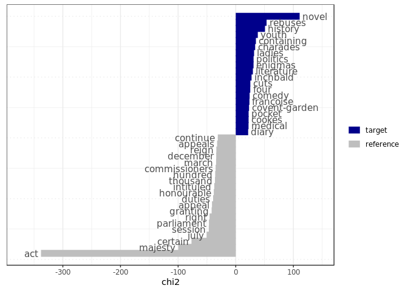

    ## 
    ## Community: 2

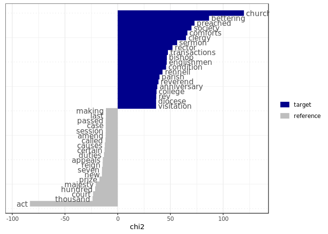

    ## 
    ## Community: 3


    ## 
    ## Community: 4

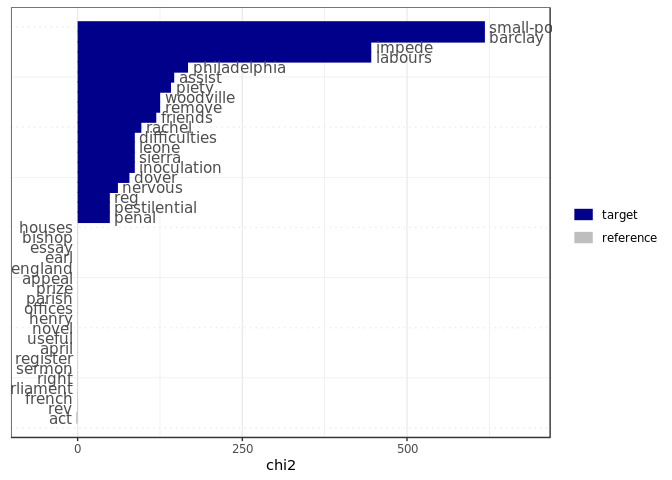

    ## 
    ## Community: 5

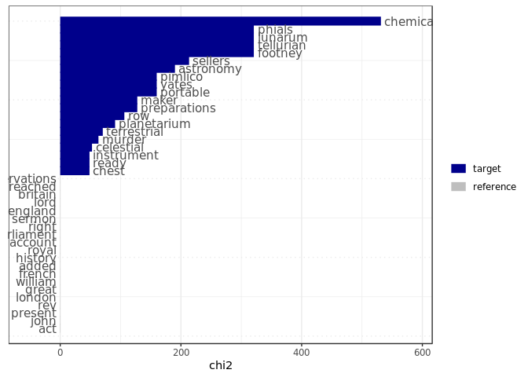

    ## 
    ## Community: 6

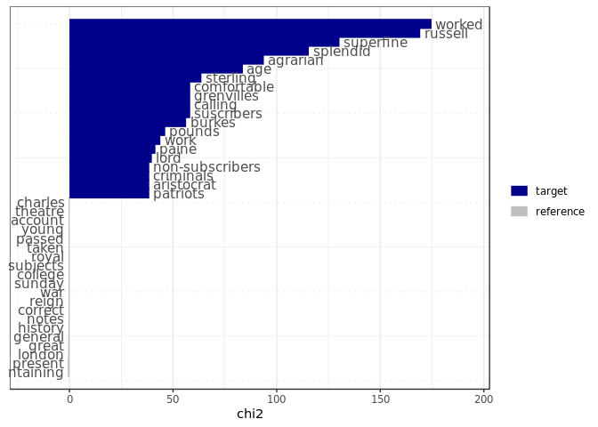

    ## 
    ## Community: 7


    ## 
    ## Community: 8

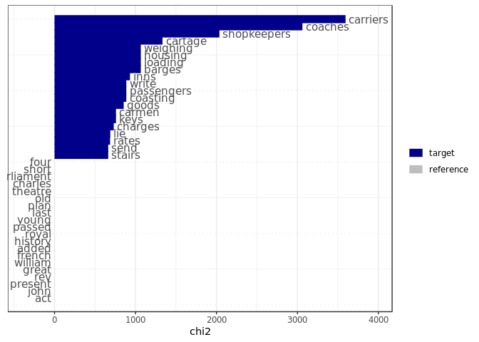

    ## 
    ## Community: 9

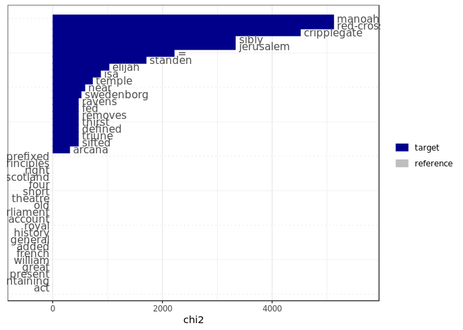

    ## 
    ## Community: 10


    ## 
    ## Community: 11


    ## 
    ## Community: 12


    ## 
    ## Community: 13


    ## 
    ## Community: 14

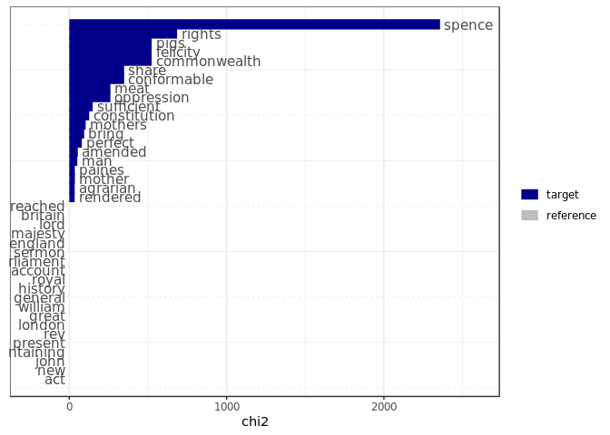

    ## 
    ## Community: 15


    ## 
    ## Community: 16


    ## 
    ## Community: 17

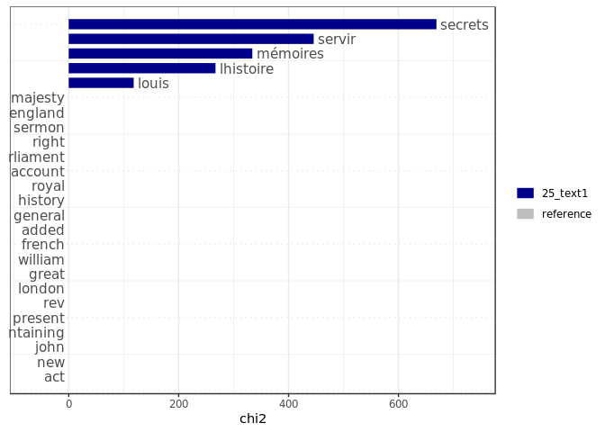

    ## 
    ## Community: 18

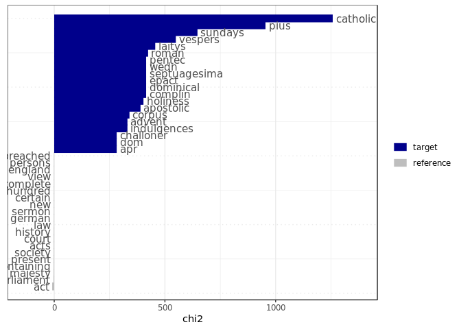

    ## 
    ## Community: 19

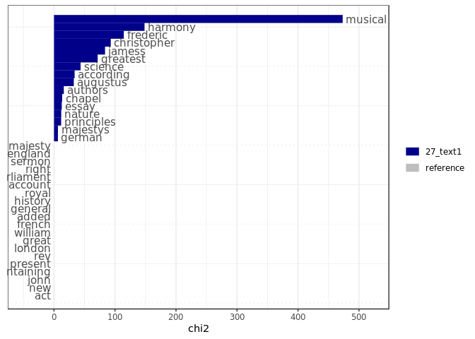

    ## 
    ## Community: 20


    ## 
    ## Community: 21


    ## 
    ## Community: 22

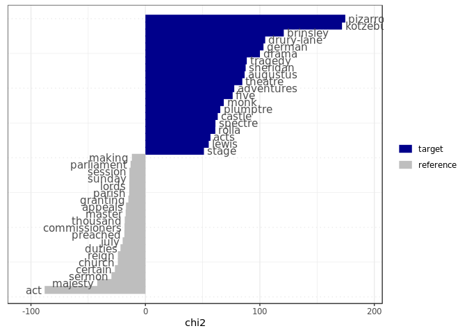

    ## 
    ## Community: 23

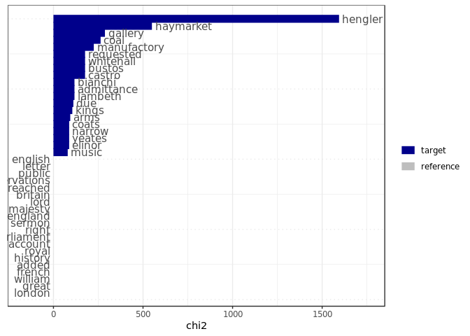

    ## 
    ## Community: 24


    ## 
    ## Community: 25

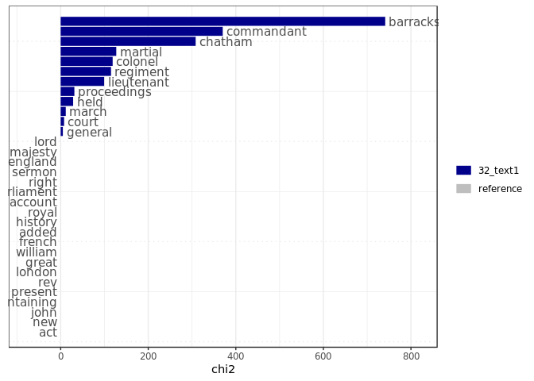

    ## 
    ## Community: 26


    ## 
    ## Community: 27

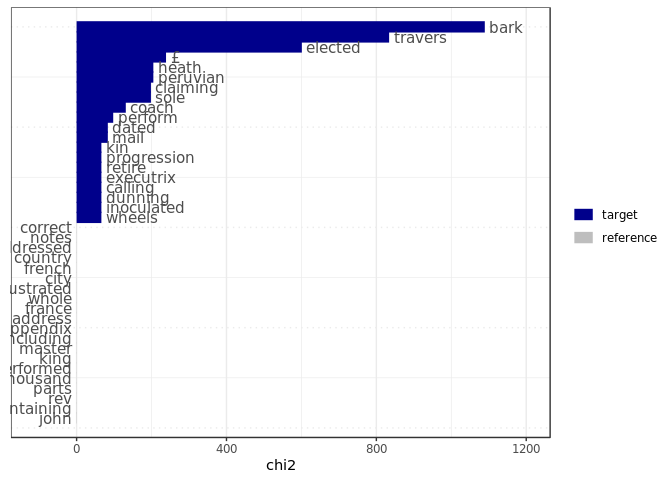

    ## 
    ## Community: 28

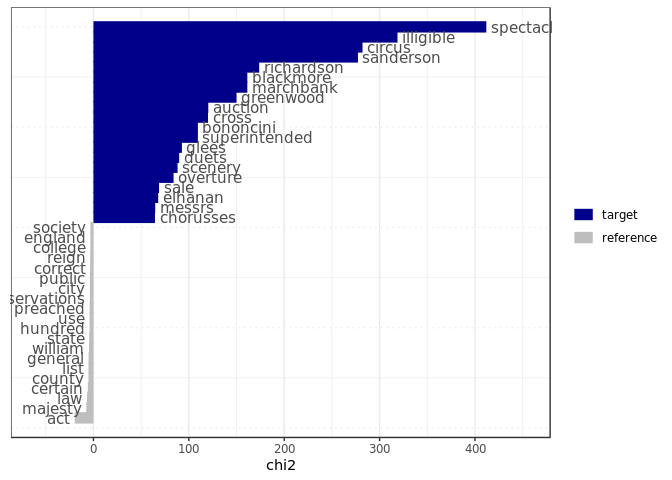

    ## 
    ## Community: 29

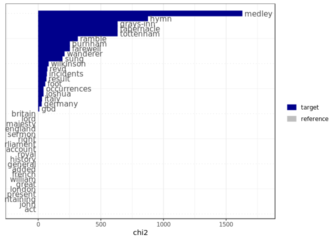

    ## 
    ## Community: 30

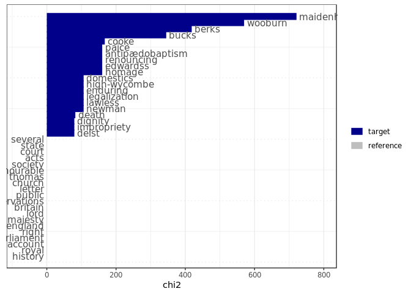

    ## 
    ## Community: 31


    ## 
    ## Community: 32

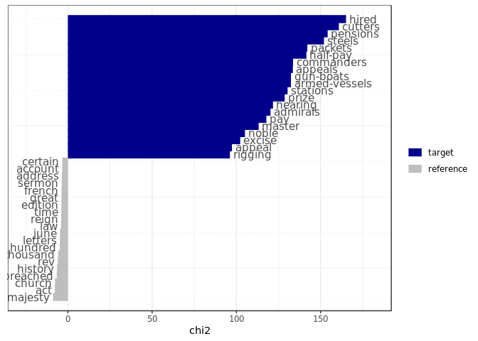
